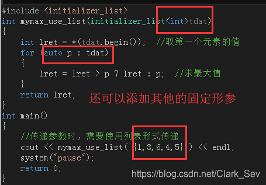
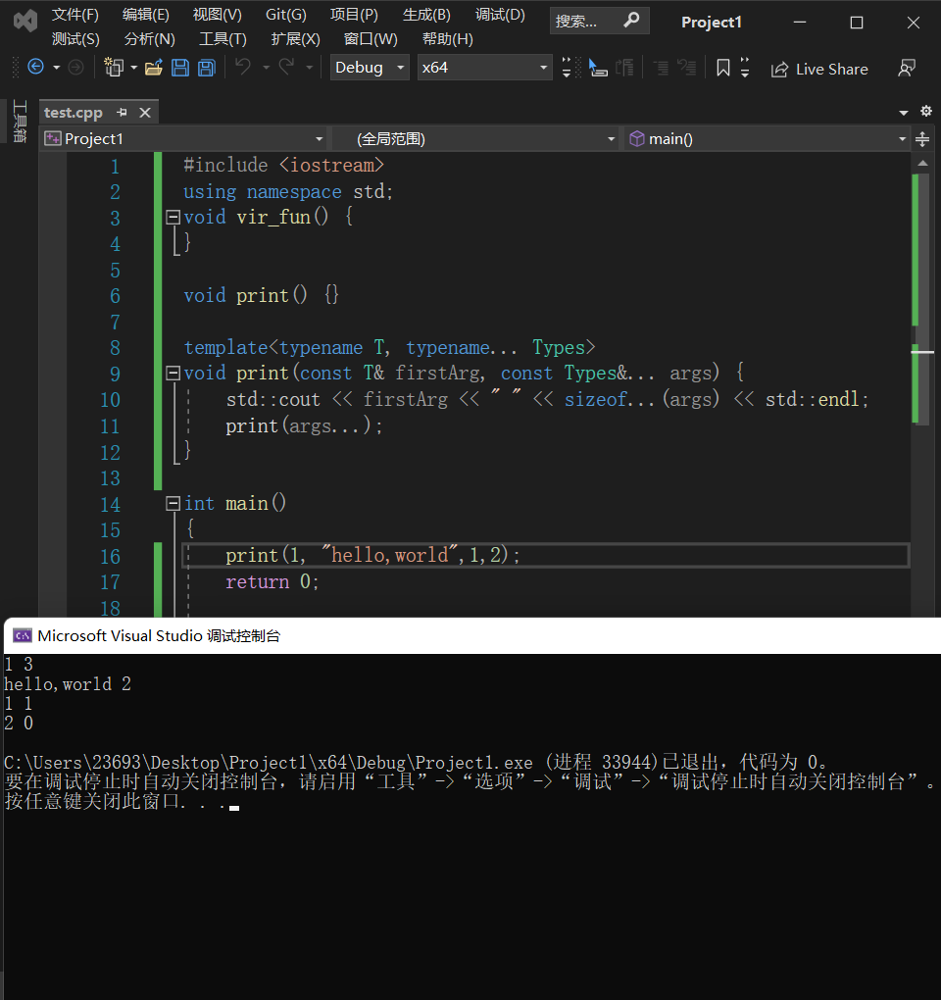

#  c++ 11

xghwN6kXqwu322lT

C++ 这门编程语言的历史可以追溯至 1979 年，当时的 Bjarne Stroustrup（C++ 之父，后续简称 Stroustrup）还在使用 Simula 语言进行开发工作。


图 1 C++之父，Bjarne Stroustrup


Simula 语言被认为是第一个面向对象的编程语言。Stroustrup 也非常赞赏 Simula 语言的这种特性，但由于实例开发中 Simula 语言的执行效率太低，所以此后不久，Stroustrup 开始从事“带类的C”编程语言的开发工作。

> 注意在开发初期，并没有 C++ 这个称谓。所谓“带类的C”，顾名思义就是在 C 语言的基础上，为其加入面向对象的思想（扩增一些写好的类和对象）。初期的 C++ 除了具备 C 语言的所有功能外，还具有类、基本继承、内联函数、默认函数参数以及强类型检查等简单功能。

不仅如此，Stroustrup 还在 CPre（C语言编译器）的基础上，专门为“带类的C”开发了一个编译器，称为 Cfront，它可以将带有类的 C 代码自动转换为普通 C 语言程序。值得一提的是在 1993 年，Cfront 因难以支持 C++ 异常机制被弃用。

1983 年，“带类的C”正式被称为“C++”，其中“++”就取自 C 语言中的“++”运算符，这也从侧面表明了 Stroustrup 对于 C++ 这门编程语言的定位。 与此同时，C++还增添了很多功能，比如==虚函数、函数重载、引用、const 关键字以及 // 注释符号等==。

> 在随后的几年时间里，C++ 得到了快速地发展。比如说， C++ 不断地被更新，类中增加了受保护成员（protected）和私有成员（private），并允许使用多继承等；Stroustrup 出版了 《带注释的C++参考手册》一书，其一度被当做 C++ 开发的重要参考；Borland 发布了 Turbo C ++编译器，该编译器包含有大量的第三方 C++ 库，极大便利了 C ++ 的开发，等等。

直到 1998 年，C++ 标准委员会发布了第一版 C++ 标准，并将其命名为 C++ 98 标准。据不知名人士透露，《带注释的C++参考手册》这本书对 C++ 98 标准的制定产生了很大的影响。

经过作者的不断迭代，一本书往往会先后发布很多个版本，其中每个新版本都是对前一个版本的修正和更新。C++ 编程语言的发展也是如此。截止到目前（2020 年），C++ 的发展历经了以下 3 个个标准：

- 2011 年，新的 C++ 11 标准诞生，用于取代 C++ 98 标准。此标准还有一个别名，为“C++ 0x”；
- 2014 年，C++ 14 标准发布，该标准库对 C++ 11 标准库做了更优的修改和更新；
- 2017 年底，C++ 17 标准正式颁布。

> 所谓标准，即明确 C++ 代码的编写规范，所有的 C++ 程序员都应遵守此标准。

值得一提的是在 C++ 11 标准之前，C++ 标准委员会还在 2003 年对 C++ 98 标准做了一次修改（称为 C++ 03 标准），但由于其仅仅修复了一些 C++ 98 标准中存在的漏洞，并未修改核心语法，因此人们习惯将这次修订和 C++ 98 合称为 C++98/03 标准。

以上 3 个标准中，相比对前一个版本的修改和更新程度，C++ 11 标准无疑是颠覆性的，该标准在 C++ 98 的基础上修正了约 600 个 C++ 语言中存在的缺陷，同时添加了约 140 个新特性，这些更新使得 C++ 语言焕然一新。读者可以这样理解 C++ 11 标准，它在 C++ 98/03 标准的基础上孕育出了全新的 C++ 编程语言，造就了 C++ 新的开始。

那么，C++ 11 标准到底包含哪些新特性呢？别急，接下来会分篇给大家做详细地讲解。

# auto:类型推导

在 [C++](http://c.biancheng.net/cplus/)11 之前的版本（C++98 和 C++ 03）中，定义变量或者声明变量之前都必须指明它的类型，比如 int、char 等；但是在一些比较灵活的语言中，比如 [C#](http://c.biancheng.net/csharp/)、[JavaScript](http://c.biancheng.net/js/)、[PHP](http://c.biancheng.net/php/)、[Python](http://c.biancheng.net/python/) 等，程序员在定义变量时可以不指明具体的类型，而是让编译器（或者解释器）自己去推导，这就让代码的编写更加方便。

==编译时期进行自动类型==

C++11 为了顺应这种趋势也开始支持自动类型推导了！C++11 使用 **auto** 关键字来支持自动类型推导。

## auto 类型推导的语法和规则

在之前的 C++ 版本中，auto 关键字用来指明变量的存储类型，它和 static 关键字是相对的。auto 表示变量是自动存储的，这也是编译器的默认规则，所以写不写都一样，一般我们也不写，这使得 auto 关键字的存在变得非常鸡肋。

C++11 赋予 auto 关键字新的含义，使用它来做自动类型推导。也就是说，使用了 auto 关键字以后，编译器会在编译期间自动推导出变量的类型，这样我们就不用手动指明变量的数据类型了。

auto 关键字基本的使用语法如下：

`auto name = value;`

name 是变量的名字，value 是变量的初始值。

> #### auto 仅仅是一个占位符，在编译器期间它会被真正的类型所替代。或者说，C++ 中的变量必须是有明确类型的，只是这个类型是由编译器自己推导出来的。

auto 类型推导的简单例子：

```
auto n = 10;
auto f = 12.8;
auto p = &n;
auto url = "http://c.biancheng.net/cplus/";
```

下面我们来解释一下：

- 第 1 行中，10 是一个整数，默认是 int 类型，所以推导出变量 n 的类型是 int。
- 第 2 行中，12.8 是一个小数，默认是 double 类型，所以推导出变量 f 的类型是 double。
- 第 3 行中，&n 的结果是一个 int* 类型的指针，所以推导出变量 p 的类型是 int*。
- 第 4 行中，由双引号`""`包围起来的字符串是 `const char*` 类型，所以推导出变量 url 的类型是 `const char*`，也即一个常量指针。


==我们也可以连续定义多个变量：==

```
int n = 20;
auto *p = &n, m = 99;
```

先看前面的第一个子表达式，&n 的类型是 int*，编译器会根据 auto *p 推导出 auto 为 int。后面的 m 变量自然也为 int 类型，所以把 99 赋值给它也是正确的。

> 这里我们要注意，推导的时候不能有二义性。在本例中，编译器根据第一个子表达式已经推导出 auto 为 int 类型，那么后面的 m 也只能是 int 类型，如果写作`m=12.5`就是错误的，因为 12.5 是double 类型，这和 int 是冲突的。

还有一个值得注意的地方是：使用 auto 类型推导的变量必须马上初始化，这个很容易理解，因为 auto 在 C++11 中只是“占位符”，并非如 int 一样的真正的类型声明。

## auto 与引用

auto 除了可以独立使用，还可以和某些具体类型混合使用，这样 auto 表示的就是“半个”类型，而不是完整的类型。请看下面的代码：

```c++
int  x = 0;
auto *p1 = &x;   //p1 为 int *，auto 推导为 int
auto  p2 = &x;   //p2 为 int*，auto 推导为 int*
auto &r1  = x;   //r1 为 int&，auto 推导为 int
auto r2 = r1;    //r2 为  int，auto 推导为 int
```

下面我们来解释一下：

- 第 2 行代码中，p1 为 int* 类型，也即 auto * 为 int *，所以 auto 被推导成了 int 类型。
- 第 3 行代码中，auto 被推导为 int* 类型，前边的例子也已经演示过了。
- 第 4 行代码中，r1 为 int & 类型，auto 被推导为 int 类型。
- ==第 5 行代码是需要重点说明的，r1 本来是 int& 类型，但是 auto 却被推导为 int 类型，这表明当`=`右边的表达式是一个引用类型时，auto 会把引用抛弃，直接推导出它的原始类型。==

## auto与const

接下来，我们再来看一下 auto 和 const 的结合：

```
int  x = 0;
const  auto n = x;  //n 为 const int ，auto 被推导为 int
auto f = n;      //f 为 const int，auto 被推导为 int（const 属性被抛弃）
const auto &r1 = x;  //r1 为 const int& 类型，auto 被推导为 int
auto &r2 = r1;  //r1 为 const int& 类型，auto 被推导为 const int 类型
```

下面我们来解释一下：

- 第 2 行代码中，n 为 const int，auto 被推导为 int。
- 第 3 行代码中，n 为 const int 类型，但是 auto 却被推导为 int 类型，这说明当`=`右边的表达式带有 const 属性时， auto 不会使用 const 属性，而是直接推导出 non-const 类型。
- 第 4 行代码中，auto 被推导为 int 类型，这个很容易理解，不再赘述。
- 第 5 行代码中，r1 是 const int & 类型，auto 也被推导为 const int 类型，这说明当 const 和引用结合时，auto 的推导将保留表达式的 const 类型。


最后我们来简单总结一下 auto 与 const 结合的用法：

- 当类型不为引用时，auto 的推导结果将不保留表达式的 const 属性；
- 当类型为引用时，auto 的推导结果将保留表达式的 const 属性。

## auto 的限制

前面介绍推导规则的时候我们说过，使用 auto 的时候必须对变量进行初始化，这是 auto 的限制之一。那么，除此以外，auto 还有哪些其它的限制呢？

==\1) auto 不能在函数的参数中使用。==

这个应该很容易理解，我们在定义函数的时候只是对参数进行了声明，指明了参数的类型，但并没有给它赋值，只有在实际调用函数的时候才会给参数赋值；而 auto 要求必须对变量进行初始化，所以这是矛盾的。

==\2) auto 不能作用于类的非静态成员变量（也就是没有 static 关键字修饰的成员变量）中。==

==\3) auto 关键字不能定义数组，比如下面的例子就是错误的：==

```
char url[] = "http://c.biancheng.net/";
auto str[] = url; //arr 为数组，所以不能使用 auto
```


==\4) auto 不能作用于模板参数，请看下面的例子：==

```
template <typename T>
class A{
    //TODO:
};
int  main(){
    A<int> C1;
    A<auto> C2 = C1;  //错误
    return 0;
}
```

## auto 的应用

说了那么多 auto 的推导规则和一些注意事项，那么 auto 在实际开发中到底有什么应用呢？下面我们列举两个典型的应用场景。

说了那么多 auto 的推导规则和一些注意事项，那么 auto 在实际开发中到底有什么应用呢？下面我们列举两个典型的应用场景。

### 使用 auto 定义迭代器

auto 的一个典型应用场景是用来定义 stl 的迭代器。

我们在使用 stl 容器的时候，需要使用迭代器来遍历容器里面的元素；不同容器的迭代器有不同的类型，在定义迭代器时必须指明。而迭代器的类型有时候比较复杂，书写起来很麻烦，请看下面的例子：

```
#include <vector>
using namespace std;

int main(){
    vector< vector<int> > v;
    vector< vector<int> >::iterator i = v.begin();
    return 0;
}
```

可以看出来，定义迭代器 i 的时候，类型书写比较冗长，容易出错。然而有了 auto 类型推导，我们大可不必这样，只写一个 auto 即可。

修改上面的代码，使之变得更加简洁：

```
#include <vector>
using namespace std;

int main(){
    vector< vector<int> > v;
    auto i = v.begin();  //使用 auto 代替具体的类型
    return 0;
}
```

auto 可以根据表达式 v.begin() 的类型（begin() 函数的返回值类型）来推导出变量 i 的类型。

### auto 用于泛型编程

auto 的另一个应用就是当我们不知道变量是什么类型，或者不希望指明具体类型的时候，比如泛型编程中。我们接着看例子：

```c++
#include <iostream>
using namespace std;

class A{
public:
    static int get(void){
        return 100;
    }
};

class B{
public:
    static const char* get(void){
        return "http://c.biancheng.net/cplus/";
    }
};

template <typename T>
void func(void){
    auto val = T::get();
    cout << val << endl;
}

int main(void){
    func<A>();
    func<B>();

    return 0;
}
```

运行结果：

```
100
http://c.biancheng.net/cplus/
```

本例中的模板函数 func() 会调用所有类的静态函数 get()，并对它的返回值做统一处理，但是 get() 的返回值类型并不一样，而且不能自动转换。这种要求在以前的 C++ 版本中实现起来非常的麻烦，需要额外增加一个模板参数，并在调用时手动给该模板参数赋值，用以指明变量 val 的类型。

但是有了 auto 类型自动推导，编译器就根据 get() 的返回值自己推导出 val 变量的类型，就不用再增加一个模板参数了。

下面的代码演示了不使用 auto 的解决办法：

```
#include <iostream>
using namespace std;

class A{
public:
    static int get(void){
        return 100;
    }
};

class B{
public:
    static const char* get(void){
        return "http://c.biancheng.net/cplus/";
    }
};

template <typename T1, typename T2>  //额外增加一个模板参数 T2
void func(void){
    T2 val = T1::get();
    cout << val << endl;
}

int main(void){
    //调用时也要手动给模板参数赋值
    func<A, int>();
    func<B, const char*>();

    return 0;
}
```

# 返回值类型后置

在泛型编程中，可能需要通过参数的运算来得到返回值的类型。考虑下面这个场景：

```
template <typename R, typename T, typename U>
R add(T t, U u)
{
    return t+u;
}
int a = 1; float b = 2.0;
auto c = add<decltype(a + b)>(a, b);
```

我们并不关心 a+b 的类型是什么，因此，只需要通过 decltype(a+b) 直接得到返回值类型即可。但是像上面这样使用十分不方便，因为外部其实并不知道参数之间应该如何运算，只有 add 函数才知道返回值应当如何推导。

那么，在 add 函数的定义上能不能直接通过 decltype 拿到返回值呢？

```
template <typename T, typename U>
decltype(t + u) add(T t, U u)  // error: t、u尚未定义
{
    return t + u;
}
```

当然，直接像上面这样写是编译不过的。因为 t、u 在参数列表中，而 [C++](http://c.biancheng.net/cplus/) 的返回值是前置语法，在返回值定义的时候参数变量还不存在。

可行的写法如下：

```
template <typename T, typename U>
decltype(T() + U()) add(T t, U u)
{
    return t + u;
}
```

考虑到 T、U 可能是没有无参构造函数的类，正确的写法应该是这样：

```
template <typename T, typename U>
decltype((*(T*)0) + (*(U*)0)) add(T t, U u)
{
    return t + u;
}
```

虽然成功地使用 decltype 完成了返回值的推导，但写法过于晦涩，会大大增加 decltype 在返回值类型推导上的使用难度并降低代码的可读性。

因此，在 C++11 中增加了**返回类型后置（trailing-return-type，又称跟踪返回类型）**语法，将 decltype 和 auto 结合起来完成返回值类型的推导。

返回类型后置语法是通过 auto 和 decltype 结合起来使用的。上面的 add 函数，使用新的语法可以写成：

```
template <typename T, typename U>
auto add(T t, U u) -> decltype(t + u)
{
    return t + u;
}
```

为了进一步说明这个语法，再看另一个例子：

```
int& foo(int& i);
float foo(float& f);

template <typename T>
auto func(T& val) -> decltype(foo(val))
{
    return foo(val);
}
```

如果说前一个例子中的 add 使用 C++98/03 的返回值写法还勉强可以完成，那么这个例子对于 C++ 而言就是不可能完成的任务了。

在这个例子中，使用 decltype 结合返回值后置语法很容易推导出了 foo(val) 可能出现的返回值类型，并将其用到了 func 上。

返回值类型后置语法，是为了解决函数返回值类型依赖于参数而导致难以确定返回值类型的问题。有了这种语法以后，对返回值类型的推导就可以用清晰的方式（直接通过参数做运算）描述出来，而不需要像 C++98/03 那样使用晦涩难懂的写法。

# 可变参数函数模板

## 可变参函数

### **省略符形参**

此用法只适合C语言支持的类型,下面实现了一个计算若干参数合的函数

1. `va_list`类型是在`cstdarg`头文件里面定义的，该指针用来依次指向各个参数
2. `va_start`是一个宏，用来初始化`arg_ptr`，使其指向列表的第一个参数，这个宏的第二个参数是sum函数参数列表省略号前得固定参   数的名称，用来确定第一个参数的位置    
3. `va_arg`是一个宏，返回`arg_ptr`指向的参数位置，并使`arg_ptr`递增来指向下一个参数值. `va_arg`宏的第二个参数是需要统计的第一个参数的类型，如果类型不正确，程序也可能会执行，但得到的是无用的数据，arg_ptr将被错误地递增

```c++
//省略符形参应该仅仅用于C和C++通用的类型。特别应该注意的是，
//大多数类类型的对象在传递给省略符形参时都无法正确拷贝。
int sum(int count, ...)
{
	if (count <= 0)
	{
		return 0;
	}
	//为了实现可变参数列表，首先需要声明一个va_list类型的指针
	//va_list类型是在cstdarg头文件里面定义的，该指针用来依次
	//指向各个参数
	//va_start是一个宏，用来初始化arg_ptr，使其指向列表的第一个
	//参数，这个宏的第二个参数是sum函数参数列表省略号前得固定参    
	//数的名称，用来确定第一个参数的位置    
	va_list arg_ptr;
	va_start(arg_ptr, count);

	int CountSum = 0;
	//va_arg是一个宏，返回arg_ptr指向的
	//参数位置，并使arg_ptr递增来指向下
	//一个参数值
	//va_arg宏的第二个参数是需要统计的第
	//一个参数的类型，如果类型不正确，
	//程序也可能会执行，但得到的是无用的
	//数据，arg_ptr将被错误地递增
	for (int i = 0; i < count; ++i)
	{
		CountSum += va_arg(arg_ptr, int);
	}
	//将va_list类型的指针复位成空值
	//就是清空可变参数列表
	va_end(arg_ptr);

	return CountSum;
}

sum(5,1,2,3,4,5);//return 15
```

所谓可变参数，指的是参数的个数和类型都可以是任意的。提到参数，大家会第一时间想到函数参数，除此之外 C++ 的模板（包括函数模板和类模板）也会用到参数。

对于函数参数而言，C++ 一直都支持为函数设置可变参数，最典型的代表就是 printf() 函数，它的语法格式为：

```
int printf ( const char * format, ... );
```

`...`就表示的是可变参数，即 printf() 函数可以接收任意个参数，且各个参数的类型可以不同，例如：

```
printf("%d", 10);
printf("%d %c",10, 'A');
printf("%d %c %f",10, 'A', 1.23);
```

我们通常将容纳多个参数的可变参数称为==参数包==。借助 format 字符串，printf() 函数可以轻松判断出参数包中的参数个数和类型。

下面的程序中，自定义了一个简单的可变参数函数：

```
#include <iostream>
#include <cstdarg>
//可变参数的函数
void vair_fun(int count, ...)
{
    va_list args;
    va_start(args, count);
    for (int i = 0; i < count; ++i)
    {
        int arg = va_arg(args, int);
        std::cout << arg << " ";
    }
    va_end(args);
}
int main()
{
    //可变参数有 4 个，分别为 10、20、30、40
    vair_fun(4, 10, 20, 30,40);
    return 0;
}
```

程序中的 vair_fun() 函数有 2 个参数，一个是 count，另一个就是 ... 可变参数。我们可以很容易在函数内部使用 count 参数，但要想使用参数包中的参数，需要借助`<cstdarg>`头文件中的 va_start、va_arg 以及 va_end 这 3 个带参数的宏：

- va_start(args, count)：args 是 va_list 类型的变量，我们可以简单的将其视为 char * 类型。借助 count 参数，找到可变参数的起始位置并赋值给 args；
- va_arg(args, int)：调用 va_start 找到可变参数起始位置的前提下，通过指明参数类型为 int，va_arg 就可以将可变参数中的第一个参数返回；
- va_end(args)：不再使用 args 变量后，应及时调用 va_end 宏清理 args 变量。

> 注意，借助 va_arg 获取参数包中的参数时，va_arg 不具备自行终止的能力，所以程序中借助 count 参数控制 va_arg 的执行次数，继而将所有的参数读取出来。控制 va_arg 执行次数还有其他方法，比如读取到指定数据时终止。

使用 ... 可变参数的过程中，需注意以下几点：

1. ... 可变参数必须作为函数的最后一个参数，且一个函数最多只能拥有 1 个可变参数。
2. 可变参数的前面至少要有 1 个有名参数（例如上面例子中的 count 参数）；
3. 当可变参数中包含 char 类型的参数时，va_arg 宏要以 int 类型的方式读取；当可变参数中包含 short 类型的参数时，va_arg 宏要以 double 类型的方式读取。


需要注意的是，... 可变参数的方法仅适用于函数参数，并不适用于模板参数。C++11 标准中，提供了一种实现可变模板参数的方法。

### initializer_list容器

**• 使用C++ 11标准中的initializer_list 包含在头文件<initializer_list>中**
实际上就是一种容器，和vector差不多，这个使用就不要求变参列表的位置，使用方法，在这里传递的参数至少一个。



[(41条消息) C++11中的std::function__大猪的博客-CSDN博客](https://blog.csdn.net/u013654125/article/details/100140547)

[(41条消息) C++11中的std::bind__大猪的博客-CSDN博客_stdbind](https://blog.csdn.net/u013654125/article/details/100140328)

## 可变参函数模板

C++ 11 标准发布之前，函数模板和类模板只能设定固定数量的模板参数。C++11 标准对模板的功能进行了扩展，允许模板中包含任意数量的模板参数，这样的模板又称可变参数模板。

### 可变参数模板语法

可变参数模板和普通模板的语义是一样的，只是写法上稍有区别，声明可变参数模板时需要在typename或class后面带上省略号`...`：

```
template<typename... Types>
```


其中，`...`可接纳的模板参数个数是0个及以上的任意数量，需要注意包括0个。

若不希望产生模板参数个数为0的变长参数模板，则可以采用以下的定义：

```
template<typename Head, typename... Tail>
```


本质上，...可接纳的模板参数个数仍然是0个及以上的任意数量，但由于多了一个Head类型，由此该模板可以接纳1个及其以上的模板参数。

### 可变参函数模板使用

在函数模板中，可变参数模板最常见的使用场景是以递归的方法取出可用参数：

```
void print() {}

template<typename T, typename... Types>
void print(const T& firstArg, const Types&... args) {
	std::cout << firstArg << " " << sizeof...(args) << std::endl;
	print(args...);
}
```

通过设置...，可以向`print`函数传递任意个数的参数，并且各个参数的类型也是任意。也就是说，可以允许模板参数接受任意多个不同类型的不同参数。这就是不定参数的模板，格外需要关注的是，`...`三次出现的位置。

如果如下调用print函数：

```
print(2, "hello", 1);
```


如此调用会递归将3个参数全部打印。细心的话会发现定义了一个空的print函数，这是因为当使用可变参数的模板，需要定义一个处理最后情况的函数，如果不写，会编译错误。这种递归的方式，是不是觉得很惊艳！

在不定参数的模板函数中，还可以通过如下方式获得args的参数个数：

```
sizeof...(args)
```





假设，在上面代码的基础上再加上一个模板函数如下，那么运行的结果是什么呢？

```c++
#include <iostream>

void print() {}

template<typename T, typename... Types>
void print(const T& firstArg, const Types&... args) {
	std::cout << firstArg << " " << sizeof...(args) << std::endl;
	print(args...);
}

template <typename... Types>
void print(const Types&... args) {
  std::cout << "print(...)" << std::endl;
}

int main(int argc, char *argv[]) {
	print(2, "hello", 1);

	return 0;
}

```

现在有一个模板函数接纳一个参数加上可变参数，还有一个模板函数直接接纳可变参数，如果调用print(2, “hello”, 1)，会发现这两个模板函数的参数格式都符合。是否会出现冲突、不冲突的话会执行哪一个呢？

运行代码后的结果为：

```
2 2
hello 1
1 
```

从结果上可以看出，程序最终选择了一个参数加上不定参数的模板函数。也就是说，当较泛化和较特化的模板函数同时存在的时候，最终程序会执行较特化的那一个。

```
#include <iostream>

template <typename T>
T my_max(T value) {
  return value;
}

template <typename T, typename... Types>
T my_max(T value, Types... args) {
  return std::max(value, my_max(args...));
}

int main(int argc, char *argv[]) {
  std::cout << my_max(1, 5, 8, 4, 6) << std::endl;

	return 0;
}

```

### 类模板的使用

除了函数模板的使用外，类模板也可以使用不定参数的模板参数，最典型的就是`tuple`类了。其大致代码如下：

# 右值引用

# 使用using
