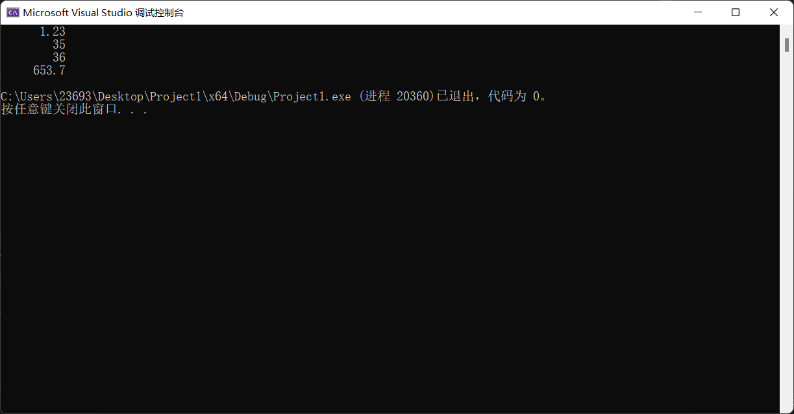

# c++语言概述

## c++语言的产生

C++语言是从C语言发展演变而来的,因此介绍C++语言就不能不首先回顾一下C语言。C语言最初是贝尔实验室的Dennis Ritchie在B语言基础上开发出来的,1972年在一台 DEC PDP-11计算机上实现了最初的C语言,以后经过了多次改进。

C语言具有许多优点,例如:语言简洁灵活、运算符和数据结构丰富、具有结构化控制语句,程序执行效率高,而且同时具有高级语言与汇编语言的优点。与其他高级语言相比，C语言具有可以直接访问物理地址的优点﹐与汇编语言相比又具有良好的可读性和可移植性。因此C语言得到了极为广泛的应用,有大量的程序员在使用C语言,并且,C语言有许多的库代码和开发环境。

尽管如此,由于C语言毕竟是一个面向过程的编程语言,因此与其他面向过程的编程语言一样,已经不能满足运用面向对象方法开发软件的需要。C++语言便是在C语言基础上为支持面向对象的程序设计而研制的、一个通用目的的程序设计语言,它是在1980年由AT&.T贝尔实验室的 Bjarne Stroustrup博士创建的。

C++语言解决了C语言中存在的一些问题,并增加了对面向对象程序设计方法的支持。在C++语言中引入了类的机制。最初的C++语言被称为“带类的C”,1983年正式取名为C++语言。C++语言的标准化工作从1989年开始,于1994年制定了ANSIC++语言标准草案。以后又经过不断完善,于1998年11月被国际标准化组织(ISO)批准为国际标准,2003年 10月ISO又发布了第二版的C++语言标准。2011年8月12日ISO公布了C++11标准,并于2011年9月出版。C++11标准包含核心语言的新机能,而且扩展C++语言标准程序库。2014年8月18日ISO公布了C++ 14,其正式名称为“International StandardISO/IEC 14882;2014(E) Programming Language C++”。C++14旨在作为C+11的一个小扩展,主要提供漏洞修复和小的改进。

## c++语言的特点

最初的C++语言的主要特点表现在两个方面:一是尽量兼容C语言;二是支持面向对象的方法。

在C+语言诞生之初,它首先是一个更好的C语言。它保持了C语言的简洁、高效和接近汇编语言等特点,对C语言的类型系统进行了改革和扩充,因此C++语言比C语言更安全,C+语言的编译系统能检查出更多的类型错误。

由于C+语言与C语言保持兼容,这就使许多C语言代码不经修改就可以为C++语言所用,用C语言编写的众多的库函数和实用软件可以用于C+语言中。另外,由于C语言已被广泛使用,因而极大地促进了C++语言的普及和面向对象技术的广泛应用。

然而,也正是由于对C语言的兼容,使得C++语言不是一个纯正的面向对象的语言。C++语言既支持面向过程的程序设计,又支持面向对象的程序设计。

C++语言最有意义的方面是支持面向对象的特征。虽然与C语言的兼容使得C++语言具有双重特点,但它在概念上是和C语言完全不同的语言,我们应该注意按照面向对象的思维方式去编写程序

。
如果读者已经有其他面向过程高级语言的编程经验,那么学习C++语言时应该着重学习它的面向对象的特征,对于与C语言兼容的部分只要了解一下就可以了。因为C语言与其他面向过程的高级语言在程序设计方法上是类似的。

如果读者是初学编程,那么,虽然与C语言兼容的部分不是C++语言的主要成分,但依然不能越过它。像数据类型、算法的控制结构,函数等,不仅是面向过程程序设计的基本成分,也是面向对象编程的基础。因为,对象是程序的基本单位,然而对象的属性往往需要用某种类型的数据来表示,对象的功能和行为要由成员函数来实现,而函数的实现归根到底还是算法的设计。

# 数据类型

## 字面常量

常量是指在程序运行的整个过程中其值始终不可改变的量,也就是直接使用符号(文字)表示的值。例如:`12、3.5、'A'`都是常量。

### 整型常量

整型常量即以文字形式出现的整数,包括正整数﹑负整数和零。整型常量的表示形式有**十进制、八进制和十六进制**。

十进制整型常量的一般形式与数学中我们所熟悉的表示形式是一样的:若干个0~9的数字,但不能以О开头

八进制整常量的数字部分要以数字0开头，一般形式为:`0若干个0~7的数字`

十六进制整常量的数字部分要以ox开头，一般形式为:`0x若干个0~9的数字及A~F的字母(大小写均可)`

默认情况下﹐十进制整型常量是带符号数,八进制和十六进制的整型常量既可能是带符号的也可能是无符号的。十进制整型常量的类型是`int , long ,long long`中能容纳其数值的尺寸最小的一个,八进制和十六进制整型常量的类型则是能容纳其数值的`int 、 unsigned,int,long.unsigned long, long long 和 unsigned long long` 中的尺寸最小者。如果整型常量的数值超过了该类型可表示的数据范围,将会产生错误。

整型常量可以用后缀指定它是否带符号以及占用多少空间:后缀L(或I)表示类型至少是 `long`,后缀LL(或Ⅱ)表示类型是long long,后缀U(或u)表示unsigned类型。
例如:`123.0123、0x5af`都是合法的常量形式。

### 实型常量

实型常量即以文字形式出现的实数﹐实数有两种表示形式:**一般形式和指数形式**。一般形式:例如,`12.5、—12.5`等。
指数形式:例如,`0.345E十2`表示0.345×10^2，一34.4E一3表示一34.4×10^-3,其中,字母E可以大写或小写。当以指数形式表示一个实数时,整数部分和小数部分可以省略其一,但不能都省略。例如:.`123E-1`、`12.E 2`、`1.E-3`都是正确的,但不能写成E一3这种形式。

实型常量默认为`double`型,如果后缀F(或f)可以使其成为float型,例如:`12.3f`。

### 字符常量

字符常量是单引号括起来的一个字符,如: `'a''D'?''$'`等。
另外,还有一些字符是不可显示字符,也无法通过键盘输人,例如响铃、换行、制表符、回车等。这样的字符常量该如何写到程序中呢?C++语言提供一种称为**转义序列**的表示方法来表示这些字符,**表2-2**列出了C++语言预定义的转义序列。


无论是不可显示字符还是一般字符,都可以用十六进制或八进制ASCII码来表
示,表示形式是:
nnn八进制形式xnnn十六进制形式
其中nnn表示3位八进制或十六进制数。
例如, 'a'的十六进制ASCII码是61,于是'a'也可以表示为'x61'。
由于单引号是字符的界限符,所以单引号本身就要用转移序列表示为八'。
问号在单独使用时可以不使用转义,在没有歧义的情况下直接使用?'就能表示问号,转义主要是为了与三字符序列区分开。
字符数据在内存中以ASCII码的形式存储,每个字符占1字节,使用7个二进制位。

### 字符串常量

字符串常量简称字符串,是用一对双引号括起来的字符序列,例如: `" abcd" "China"``"This is a string."`都是字符串常量。由于双引号是字符串的界限符,所以字符串中间的双引号就要用转义序列来表示。例如:

```c++
"Please enter\ "Yes\" or \"No\""
```

表示的是下列文字:**Please enter"Yes" or "No"**
字符串与字符是不同的,它在内存中的存放形式是:按串中字符的排列次序顺序存放,每个字符占一字节,并在末尾添加'o'作为结尾标记。图2-1是字符数据及其存储形式举例。从图中可以看出,字符串"a"与字符a'是不同的。


通过添加前缀可以改变字符常量或者字符串常量的类型,前缀及其含义如表2-3所示。

## const和constexpr

[C++ 小知识：const 和 constexpr - 知乎 (zhihu.com)](https://zhuanlan.zhihu.com/p/161988165)

## 类型别名typedef

## [*C++ typedef*的详细用法](https://zhuanlan.zhihu.com/p/413574268)

[](https://www.zhihu.com/people/mu-guang-40)

[Randon](https://www.zhihu.com/people/mu-guang-40)[](https://www.zhihu.com/question/48510028)

小米科技 软件工程师

目录**一、typedef的四种用法****1、定义类型别名**`char *pa, *pb; //char* pa,pb;  typedef char* pCHAR; pCHAR pa,pb; `上面是声明两个指向字符变量的指针的两种方法，普通的写法显然没有使用typedef的形式更方便和直观，而且同时声明多个指针变量容易漏写星号。**2、typedef struct**在c语言中typedef struct定义结构名，在声明时可以省略struct关键字。声明struct新对象时，必须带上struct，即：struct [结构名] [对象名]`struct A {    int x;    int y; } struct A a; `而使用typedef之后可以直接写为：[结构名] [对象名]。`typedef struct B {    int x;    int y; }pB; pB b; `而在C++中定义结构体无需typedef，如下`struct A{    int m; } A a; `而C++中无typedef时，在末尾定义的是变量，可以直接使用它对结构中的成员变量进行赋值；而有typedef 时，在末尾定义的是结构类型，相当于为struct定义的结构类型换了一个新的名字，使用时，需要先定义变量，然后对结构中的成员变量进行赋值。`struct Teacher {       int age; }Tea;  //Tea是一个变量    typedef struct Student {       int age; }Stu;  //Stu是一个结构体类型 = struct Student  void main() {    Tea.age = 30;  //为结构成员赋值    Stu Zhang;   //先声明结构类型变量    Zhang.age = 15;   //访问结构成员并赋值 } `**3、定义与平台无关的数据类型**比如定义一个叫 REAL 的[浮点类型](https://www.zhihu.com/search?q=浮点类型&search_source=Entity&hybrid_search_source=Entity&hybrid_search_extra={"sourceType"%3A"article"%2C"sourceId"%3A"413574268"})，在目标平台一上，让它表示最高精度的类型为：`typedef long double REAL;  //在不支持 long double 的平台二上，改为： typedef double REAL;  //在连 double 都不支持的平台三上，改为： typedef float REAL;  `也就是说，当跨平台时，只要改下 typedef 本身就行，不用对其他源码做任何修改。 标准库就广泛使用了这个技巧，比如size_t。 另外，因为typedef是定义了一种类型的新别名，不是简单的字符串替换，所以它比宏来得稳健（虽然用宏有时也可以完成以上的用途）。**4、为复杂的声明定义一个简单别名**`int *(*a[5])(int, char*); //原声明  typedef int *(*pFun)(int, char*); pFun a[5]; `在原来的声明里逐步用别名替换一部分复杂声明，如此循环，把带变量名的部分留到最后替换，得到的就是原声明的最简化版。`void (*b[10])(void(*)()); //原声明  //先替换右边括号，pFunParam为别名1 typedef void (*pFunParam); //再替换左边括号，pFun2为别名2 typedef void (*pFun2)(pFunParam);  //原声明简化版 pFun2 b[10]; `**二、如何理解复杂声明和定义**c++创始人写的<the design and evolution of cpp>中的下面这个例子:`typedef int P(); // declares a function type P as returning an int and taking no arguments. typedef int Q();  class X {    static P(Q); // 等价于`static int Q()`, Q在此作用域中不再是一个类型    static Q(P); // 等价于`static int Q(int ())`, 定义了一个名为Q的function }; `**任何声明变量的语句前面加上typedef之后，原来是变量的都变成一种类型**。**不管这个声明中的标识符号出现在中间还是最后**。`typedef int P(); static P(Q);  `P是一个新定义的function类型, 它返回值为int, 无参数。P(Q); 实际上等价于P Q, 声明Q是一个**返回值为int, 无参数的函数**. 理解复杂的定义和声明：在阅读Linux的[内核代码](https://www.zhihu.com/search?q=内核代码&search_source=Entity&hybrid_search_source=Entity&hybrid_search_extra={"sourceType"%3A"article"%2C"sourceId"%3A"413574268"})是经常会遇到一些复杂的声明和定义，例如：`void * (* (*fp1) (int)) [10];  float (* (*fp2) (int, int, float)) (int);  typedef double (* (* (*fp3) ()) [10]) (); fp3 a;  int (* (*fp4()) [10]) (); `刚看到这些声明或者定义时，一些初学者甚至有一定经验的工程师都有可能费解。要理解这些复杂的声明和定义，应该由浅而深，逐步突破。下面先看一些简单的定义：`int a; //定义一个整型数 int *p; //定义一个指向整型数的指针 int **pp; //定义一个指向指针的指针，它指向的指针指向一个整型数  p = &a;   // p指向整数a所在的地址 pp = &p;  // pp指向指针p `如下所示，定义整数型数组的指针指向整数型数组。`int arr[10]; //定义一个包含10个整型数的数组 int (*pArr) [10]; //定义一个指向包含10个整型数数组的指针  pArr = &arr; `如下所示，包含指向函数的指针的数组，这些函数有整型参数和整型返回值。`int (*pfunc) (int); //定义一个指向函数的指针，被指向的函数有一个整型参数并返回整型值 int (*arr[10]) (int); //定义一个包含10个指针的数组，其中包含的指针指向函数，这些函数有一个整型参数并返回整型值  arr[0] = pfunc; `**三、[右左法则](https://www.zhihu.com/search?q=右左法则&search_source=Entity&hybrid_search_source=Entity&hybrid_search_extra={"sourceType"%3A"article"%2C"sourceId"%3A"413574268"})**当声明和定义逐渐复杂时，需要使用用于理解复杂定义的“ **右左法则** ”：从变量名看起，先往右，再往左，碰到圆括号就调转阅读的方向；括号内分析完就跳出括号，还是先右后左的顺序。如此循环，直到分析完整个定义。然后再来分析int (*pfunc) (int);找到变量名pfunc，先往右是圆括号，调转方向，左边是一个*号，这说明pfunc是一个指针；然后跳出这个圆括号，先看右边，又遇到圆括号，这说明(*pfunc)是一个函数，所以pfunc是一个指向这类函数的指针，即函数指针，这类函数具有一个int类型的参数，返回值类型是int。同样的，对于int (*arr[10]) (int);找到变量名arr，先往右是[]运算符，说明arr是一个数组；再往左是一个*号，说明arr数组的元素是指针（**注意**：这里的*修饰的不是arr，而是arr[10]。原因是[]运算符的优先级比*要高，arr先与[]结合。）；跳出圆括号，先往右又遇到圆括号，说明arr数组的元素是指向函数的指针，它指向的函数有一个int类型的参数，返回值类型是int。那么，怎么判断定义的是函数指针，还是数组指针，或是数组呢？可以抽象出几个模式：`typedef (*var)(...); // 变量名var与*结合，被圆括号括起来，右边是参数列表。表明这是函数指针 typedef (*var)[];  //变量名var与*结合，被圆括号括起来，右边是[]运算符。表示这是数组指针 typedef (*var[])...;// 变量名var先与[]结合，说明这是一个数组（至于数组包含的是什么，由旁边的修饰决定）  `下面可以利用右左法则去分析复杂的声明和定义：`void * (* (*fp1) (int)) [10]; `找到变量名fp1，往右看是圆括号，调转方向往左看到*号，说明fp1是一个指针；跳出内层圆括号，往右看是参数列表，说明fp1是一个函数指针，接着往左看是*号，说明指向的函数返回值是指针；再跳出外层圆括号，往右看是[]运算符，说明函数返回的是一个数组指针，往左看是void *，说明数组包含的类型是void *。 简言之 ，fp1是一个指向函数的指针，该函数接受一个整型参数并返回一个指向含有10个void指针数组的指针。`float (* (*fp2) (int, int, float)) (int); `找到变量名fp2，往右看是圆括号，调转方向往左看到*号，说明fp2是一个指针；跳出内层圆括号，往右看是参数列表，说明fp2是一个函数指针，接着往左看是*号，说明指向的函数返回值是指针；再跳出外层圆括号，往右看还是参数列表，说明返回的指针是一个函数指针，该函数有一个int类型的参数，返回值类型是float。简言之，fp2是一个指向函数的指针，该函数接受三个参数(int, int和float)，且返回一个指向函数的指针，该函数接受一个整型参数并返回一个float。`typedef double (* (* (*fp3) ()) [10]) (); fp3 a; `如果创建许多复杂的定义，可以使用typedef。这一条显示typedef是如何缩短复杂的定义的。跟前面一样，先找到变量名fp3（这里fp3其实是新类型名），往右看是圆括号，调转方向往左是*，说明fp3是一个指针；跳出圆括号，往右看是[空参数列表](https://www.zhihu.com/search?q=空参数列表&search_source=Entity&hybrid_search_source=Entity&hybrid_search_extra={"sourceType"%3A"article"%2C"sourceId"%3A"413574268"})，说明fp3是一个函数指针，接着往左是*号，说明该函数的返回值是一个指针；跳出第二层圆括号，往右是[]运算符，说明函数的返回值是一个数组指针，接着往左是*号，说明数组中包含的是指针；跳出第三层圆括号，往右是参数列表，说明数组中包含的是函数指针，这些函数没有参数，返回值类型是double。简言之，fp3是一个指向函数的指针，该函数无参数，且返回一个含有10个指向函数指针的数组的指针，这些函数不接受参数且返回double值。这二行接着说明：a是fp3类型中的一个。`int (* (*fp4()) [10]) (); `这里fp4不是变量定义，而是一个函数声明。找到变量名fp4，往右是一个[无参参数列表](https://www.zhihu.com/search?q=无参参数列表&search_source=Entity&hybrid_search_source=Entity&hybrid_search_extra={"sourceType"%3A"article"%2C"sourceId"%3A"413574268"})，说明fp4是一个函数，接着往左是*号，说明函数返回值是一个指针；跳出里层圆括号，往右是[]运算符，说明fp4的函数返回值是一个指向数组的指针，往左是*号，说明数组中包含的元素是指针；跳出外层圆括号，往右是一个无参参数列表，说明数组中包含的元素是函数指针，这些函数没有参数，返回值的类型是int。简言之，fp4是一个返回指针的函数，该指针指向含有10个函数指针的数组，这些函数不接受参数且返回整型值。**四、用typedef简化复杂的声明和定义**1、int *(*a[10]) (int, char*);用前面的“右左法则”，可以知道a是一个包含10个函数指针的数组，这些函数的参数列表是(int, char*)，返回值类型是int。如果要定义相同类型的变量b，都得重复书写：int *(*b[10]) (int, char*); 为了避免重复复杂的定义，用typedef来简化复杂的声明和定义。 typedef可以给现有的类型起个**别名**。这里用typedef给以上a、b的类型起个别名：`typedef int *(*A[10]) (int, char*); // 在之前定义的前面加入typedef，然后将变量名a替换成类型名A `现在要再定义相同类型的变量c，只需要： A c;2、void (*b[10]) (void (*)());先替换右边括号里面的参数，将void (*)()的类型起个别名pParam：`typedef void (*pParam) ();  `再替换左边的变量b，为b的类型起个别名B：`typedef void (*B)(pParam); `原声明的简化版：`B b[10]; `

[发布于 2021-09-24 16:36](https://zhuanlan.zhihu.com/p/413574268)


————————————————

## 类型推断

## 类型转换


# ==运算符与表达式==

到现在为止,我们了解了C+语言中各种类型数据的特点及其表示形式。那么如何对这些数据进行处理和计算呢?通常当要进行某种计算时,都要首先列出算式,然后求解其值。当利用C++语言编写程序求解问题时也是这样。

在程序中,表达式是计算求值的基本单位。可以简单地将表达式理解为用于计算的公式,它由运算符(例如:＋、一、* 、/)、运算量(也称操作数,可以是常量、变量等)和括号组成。执行表达式所规定的运算,所得到的结果值便是表达式的值。例如:`a+b`,`x/y`都是表达式。

下面再用较严格的语言给表达式下一个定义,读者如果不能够完全理解也不要紧,表达式在程序中无处不在,而且接下来还要详细讨论各种类型的表达式,用得多了自然也就理解了。
表达式可以被定义为:

1. **一个常量或标识对象的标识符**是一个最简单的表达式,其值是常量或对象的值。
2. 一个表达式的值可以用来参与其他操作,即用作其他运算符的操作数,这就形成了更复杂的表达式。
3. 包含在括号中的表达式仍是一个表达式,其类型和值与未加括号时的表达式相同。

C++语言中定义了丰富的运算符,如算术运算符、关系运算符、逻辑运算符等。有些运算符需要两个操作数,使用形式为:

```
操作数1 运算符 操作数2
```

这样的运算符称为二元运算符(或二目运算符)。另一些运算符只需要一个操作数,称为一元运算符(或单目运算符)。
运算符具有优先级与结合性。当一个表达式中包含多个运算符时,先进行优先级高的运算,再进行优先级低的运算。如果表达式中出现了多个相同优先级的运算﹐运算顺序就要看运算符的结合性了。所谓结合性是指当一个操作数左右两边的运算符优先级相同时,按什么样的顺序进行运算,是自左向右,还是自右向左。
下面详细介绍各种类型的运算符及表达式。

本章我们主要讲解以下几类运算符：

| **运算符类型** | **作用**                               |
| -------------- | -------------------------------------- |
| 算术运算符     | 用于处理四则运算                       |
| 赋值运算符     | 用于将表达式的值赋给变量               |
| 比较运算符     | 用于表达式的比较，并返回一个真值或假值 |
| 逻辑运算符     | 用于根据表达式的值返回真值或假值       |

## 算术运算符

**作用**：用于处理四则运算 

算术运算符包括以下符号：

| **运算符** | **术语**   | **示例**    | **结果**  |
| ---------- | ---------- | ----------- | --------- |
| +          | 正号       | +3          | 3         |
| -          | 负号       | -3          | -3        |
| +          | 加         | 10 + 5      | 15        |
| -          | 减         | 10 - 5      | 5         |
| *          | 乘         | 10 * 5      | 50        |
| /          | 除         | 10 / 5      | 2         |
| %          | 取模(取余) | 10 % 3      | 1         |
| ++         | 前置递增   | a=2; b=++a; | a=3; b=3; |
| ++         | 后置递增   | a=2; b=a++; | a=3; b=2; |
| --         | 前置递减   | a=2; b=--a; | a=1; b=1; |
| --         | 后置递减   | a=2; b=a--; | a=1; b=2; |

**示例1：**

```C++
//加减乘除
int main() {

	int a1 = 10;
	int b1 = 3;

	cout << a1 + b1 << endl;
	cout << a1 - b1 << endl;
	cout << a1 * b1 << endl;
	cout << a1 / b1 << endl;  //两个整数相除结果依然是整数

	int a2 = 10;
	int b2 = 20;
	cout << a2 / b2 << endl; 

	int a3 = 10;
	int b3 = 0;
	//cout << a3 / b3 << endl; //报错，除数不可以为0


	//两个小数可以相除
	double d1 = 0.5;
	double d2 = 0.25;
	cout << d1 / d2 << endl;

	system("pause");

	return 0;
}
```

> 总结：在除法运算中，除数不能为0


**示例2：**

```C++
//取模
int main() {

	int a1 = 10;
	int b1 = 3;

	cout << 10 % 3 << endl;

	int a2 = 10;
	int b2 = 20;

	cout << a2 % b2 << endl;

	int a3 = 10;
	int b3 = 0;

	//cout << a3 % b3 << endl; //取模运算时，除数也不能为0

	//两个小数不可以取模
	double d1 = 3.14;
	double d2 = 1.1;

	//cout << d1 % d2 << endl;

	system("pause");

	return 0;
}

```

> #### 总结：只有整型变量可以进行取模运算


**示例3：**

```C++
//递增
int main() {

	//后置递增
	int a = 10;
	a++; //等价于a = a + 1
	cout << a << endl; // 11

	//前置递增
	int b = 10;
	++b;
	cout << b << endl; // 11

	//区别
	//前置递增先对变量进行++，再计算表达式
	int a2 = 10;
	int b2 = ++a2 * 10;
	cout << b2 << endl;

	//后置递增先计算表达式，后对变量进行++
	int a3 = 10;
	int b3 = a3++ * 10;
	cout << b3 << endl;

	system("pause");

	return 0;
}

```


> #### 总结：前置递增先对变量进行++，再计算表达式，后置递增相反

```c++
int main{
	int a=10;
    cout<<a++<<endl;//输出为10，因为从左到右编译，这里相当于cout<<a，然后a+1
    return 0;

}
```


## 赋值运算符

**作用：**用于将表达式的值赋给变量

赋值运算符包括以下几个符号：

| **运算符** | **术语** | **示例**   | **结果**  |
| ---------- | -------- | ---------- | --------- |
| =          | 赋值     | a=2; b=3;  | a=2; b=3; |
| +=         | 加等于   | a=0; a+=2; | a=2;      |
| -=         | 减等于   | a=5; a-=3; | a=2;      |
| *=         | 乘等于   | a=2; a*=2; | a=4;      |
| /=         | 除等于   | a=4; a/=2; | a=2;      |
| %=         | 模等于   | a=3; a%2;  | a=1;      |


**示例：**

```C++
int main() {

	//赋值运算符

	// =
	int a = 10;
	a = 100;
	cout << "a = " << a << endl;

	// +=
	a = 10;
	a += 2; // a = a + 2;
	cout << "a = " << a << endl;

	// -=
	a = 10;
	a -= 2; // a = a - 2
	cout << "a = " << a << endl;

	// *=
	a = 10;
	a *= 2; // a = a * 2
	cout << "a = " << a << endl;

	// /=
	a = 10;
	a /= 2;  // a = a / 2;
	cout << "a = " << a << endl;

	// %=
	a = 10;
	a %= 2;  // a = a % 2;
	cout << "a = " << a << endl;

	system("pause");

	return 0;
}
```


## 比较运算符

**作用：**用于表达式的比较，并返回一个真值或假值

比较运算符有以下符号：

| **运算符** | **术语** | **示例** | **结果** |
| ---------- | -------- | -------- | -------- |
| ==         | 相等于   | 4 == 3   | 0        |
| !=         | 不等于   | 4 != 3   | 1        |
| <          | 小于     | 4 < 3    | 0        |
| \>         | 大于     | 4 > 3    | 1        |
| <=         | 小于等于 | 4 <= 3   | 0        |
| \>=        | 大于等于 | 4 >= 1   | 1        |

示例：

```C++
int main() {

	int a = 10;
	int b = 20;

	cout << (a == b) << endl; // 0 

	cout << (a != b) << endl; // 1

	cout << (a > b) << endl; // 0

	cout << (a < b) << endl; // 1

	cout << (a >= b) << endl; // 0

	cout << (a <= b) << endl; // 1
	
	system("pause");

	return 0;
}
```


> 注意：C和C++ 语言的比较运算中， ==“真”用数字“1”来表示， “假”用数字“0”来表示。== 


## 逻辑运算符

**作用：**用于根据表达式的值返回真值或假值

逻辑运算符有以下符号：

| **运算符** | **术语** | **示例** | **结果**                                                 |
| ---------- | -------- | -------- | -------------------------------------------------------- |
| !          | 非       | !a       | 如果a为假，则!a为真；  如果a为真，则!a为假。             |
| &&         | 与       | a && b   | 如果a和b都为真，则结果为真，否则为假。                   |
| \|\|       | 或       | a \|\| b | 如果a和b有一个为真，则结果为真，二者都为假时，结果为假。 |

**示例1：**逻辑非

```C++
//逻辑运算符  --- 非
int main() {

	int a = 10;

	cout << !a << endl; // 0

	cout << !!a << endl; // 1

	system("pause");

	return 0;
}
```

> 总结： 真变假，假变真


**示例2：**逻辑与

```C++
//逻辑运算符  --- 与
int main() {

	int a = 10;
	int b = 10;

	cout << (a && b) << endl;// 1

	a = 10;
	b = 0;

	cout << (a && b) << endl;// 0 

	a = 0;
	b = 0;

	cout << (a && b) << endl;// 0

	system("pause");

	return 0;
}

```

> 总结：逻辑==与==运算符总结： ==同真为真，其余为假==


**示例3：**逻辑或

```c++
//逻辑运算符  --- 或
int main() {

	int a = 10;
	int b = 10;

	cout << (a || b) << endl;// 1

	a = 10;
	b = 0;

	cout << (a || b) << endl;// 1 

	a = 0;
	b = 0;

	cout << (a || b) << endl;// 0

	system("pause");

	return 0;
}
```

> 逻辑==或==运算符总结： ==同假为假，其余为真==


## `sizeof` 运算符

`sizeof`运算符用于计算某种类型的对象在内存中所占的字节数。该操作符使用的语法形式为:

```c++
sizeof(类型名)
```

或

```c++
sizeof 表达式
```

> #### 运算结果值为“类型名”所指定的类型或“表达式”的结果类型所占的字节数。注意在这个计算过程中,并不对括号中的表达式本身求值。


## 位运算

在本章的开头我们曾提到,C语言同时具有高级语言与汇编语言的优点。具有位运算能力便是这种优点的一个体现。一般的高级语言处理数据的最小单位只能是**字节**,C语言却能对数据按**二进制位**进行操作。当然这一优点现在也被C+完全继承下来了。在C++语言中提供了6个位运算符,可以对整数进行位操作。


## 运算符的优先级与结合性

一个表达式可以包含多个运算符。在这种情况下，运算符的优先级决定表达式的哪部分被处理为每个运算符的操作数。例如，按照运算规则，表达式中 *、/、以及 % 的优先级比 + 和 - 高。如下列表达式：

```
a-b * c
```

相当于 `a-(b*c)`。如果想让操作数以不同的方式组合在一起，则必须使用括号：

```
(a-b) * c
```

如果一个表达式中的两个操作数具有相同的优先级，那么它们的结合律（associativity）决定它们的组合方式是从左到右或是从右到左。例如，算术运算符和操作数的组合方式是从左到右，赋值运算符则是从右到左，如表 1 所示。


表 2 列出优先级次序下，所有 C 语言运算符的优先级和结合律。


一些运算符记号在表 2 中出现了两次。例如，自增运算符` ++ `和自减运算符 `--`，在作后缀运算符（如表达式 `x++`）时，较其用作前缀运算符（如表达式 `++x`）时，具有较高的优先级。

`+`、`-`、`*` 和` &` 运算符记号不但可以当作一元运算符（unary operator，只需要一个操作数），也可以当作二元运算符（binary operator，需要两个操作数）。例如，`*` 只有一个操作数的时候，就是间接运算符（indirection operator），而有两个操作数的时候，就是乘号。

在这些例子中，一元运算符比二元运算符具有更高的优先级。例如，表达式 `*ptrl**ptr2 ` 等同于表达式`(*ptrl)*(*ptr2)`。

# 类型转换

有时，编程的过程中需要将值从一种数据类型转换为另一种数据类型。[C++](http://c.biancheng.net/cplus/) 提供了这样做的方法。

如果将一个浮点值分配给一个 int 整型变量，该变量会接收什么值？如果一个 int 整数乘以一个 float 浮点数，结果将会是什么数据类型？如果一个 double 浮点数除以一个 unsigned int 无符号整数会怎么样？是否有办法预测在这些情况下会发生什么？

答案是肯定的。当运算符的操作数具有不同的数据类型时，C++ 会自动将它们转换为相同的数据类型。当它这样做时，遵循一组规则。理解这些规则将有助于程序员防止一些细微的错误蔓延到自己的程序中。

就像军队的军官有军阶一样，数据类型也可以按等级排名。如果一个数字数据类型可以容纳的数字大于另一个数据类型，那么它的排名就高于后者。例如，float 类型就超越了 int 类型，而 double 类型又超越了 float 类型。表 1 列出了从高到低排列的数据类型。


表 1 中排名的一个例外是当 int 和 long int 的大小相同时。在这种情况下，unsigned int 将超越 long int，因为它可以保存更高的值。

## 隐式转换

当 C++ 使用运算符时，它会努力将操作数转换为相同的类型。这种隐式或自动的转换称为类型强制。当一个值被转换为更髙的数据类型时，称之为**升级**。反之，降级则意味着将其转换为更低的数据类型。

现在来看一看管理数学表达式评估的具体规则：

- ==规则 1==：char、short 和 unsigned short 值自动升级为 int 值。细心的读者可能已经注意到，char、short 和 unsigned short 都未出现在表 1 中，这是因为无论何时在数学表达式中使用这些数据类型的值，它们都将自动升级为 int 类型。
- ==规则 2==：当运算符使用不同数据类型的两个值时，较低排名的值将被升级为较高排名值的类型。在下面的表达式中，假设 years 是一个 int 变量，而 interestRate 是一个 double 变量：

```
int years;
double interstRate;
years * interestRate;
```

在乘法发生之前，years 中的值将升级为 double 类型。

- ==规则 3==：当表达式的最终值分配给变量时，它将被转换为该变量的数据类型。在下面的语句中，假设 area 是一个 long int 长整型变量，而 length 和 width 都是 int 整型变量：

```
long int area;
int length;
int width;
area = length * width;
```

因为存储在 length 和 width 中的值是相同的数据类型，所以它们都不会被转换为任何其他数据类型。但是，乘法的结果将被升级为 long int 类型，这样才可以存储到 area 中。

但是，如果接收值的变量的数据类型低于接收的值，那该怎么办呢？在这种情况下，值将被降级为变量的类型。如果变量的数据类型没有足够的存储空间来保存该值，则该值的一部分将丢失，并且该变量可能会收到不准确的结果。

我们知道，如果接收值的变量想要的是一个整数，而赋给它的值是一个浮点数，那么当转换为 int 并存储在变量中时，浮点值将被截断。这意味着小数点后的所有内容都将被丢弃。示例如下：

```
int x;
double y = 3.75;
x = y; // x被赋值为3，y仍然保留3.75
```

但是，重要的是要了解，当变量值的数据类型更改时，它不会影响变量本身。例如，来看下面的代码段。

```
int quantity1 = 6;
double quantity2 = 3.7;
double total;
total = quantity1 + quantity2;
```

在 C++ 执行上述加法之前，它会将一个 quantity1 值的副本移动到其工作空间中，并将其转换为 double 类型。然后把 6.0 和 3.7 相加，并且将结果值 9.7 存储到 total 中。但是，变量 quantity1 保持为 int，存储在存储器中的值保持不变，它仍然是整数 6。

## 强制转换

隐式类型转换是编译器自动隐式进行的，需要在代码中体现，而显示类型转换由程序员明确指定。

### c语言风格的强制转换

例如在标准C++之前,显式类型转换语法形式有两种:

```
类型说明符(表达式)
//C++风格的显式转换符号
```

或

```
(类型说明符)表达式
//c语言风格的显式转换符号
```

这两种写法只是形式上有所不同,功能完全相同。
显式类型转换的作用是将表达式的结果类型转换为类型说明符所指定的类型。例如:

```cpp
float z=7.56,fractionPart;
int wholePart;
wholePart=int(z);
//将float型转换为int型时，取整数部分，舍弃小数部分
fractionPart=z-(int)z;l/用z减去其整数部分，得到小数部分
```


C++支持C风格的强制转换，但是C风格的强制转换可能带来一些隐患，让一些问题难以发现。


所以C++提供了一组适用于不同场景的强制转换的函数：

- static_cast
- dynamic_cast
- const_cast
- reinterpret_cast

下面对这四种转换操作的适用场景分别进行说明。

### static_cast

> static_cast<type>(expression)

该运算符把 expression 转换为 type 类型，主要用于基本数据类型之间的转换，如把 uint 转换为 int，把 int 转换为 double 等。

```cpp
uint x = 1;
int y = static_cast<int>(x); // 转换正确

int x = 1;
double y = static_cast<double>(x); // 转换正确
```

需要注意的是：static_cast 没有运行时类型检查来保证转换的安全性，需要程序员来判断转换是否安全。

```cpp
int x = -1;
uint y = static_cast<uint>(x) // 转换错误

double x = 1.23;
int y = static_cast<int>(x) // 转换丢失精度
```

static_cast 还可用于类层次结构中，基类和派生类之间指针或引用的转换，但也要注意：

- static_cast 进行上行转换是安全的，即把派生类的指针转换为基类的；
- static_cast 进行下行转换是不安全的，即把基类的指针转换为派生类的。

```cpp
// 上行转换，派生类→基类
Derive* d = new Derive();
Base* b = static_cast<Base*>(d);

// 下行转换，基类→派生类
Base* b = new Base();
Derive* d = static_cast<Derive*>(b);
```

这是因为派生类包含基类信息，所以上行转换（只能调用基类的方法和成员变量），一般是安全的；

而基类没有派生类的任何信息，而下行转换后会用到派生类的方法和成员变量，这些基类都没有，很容易“指鹿为马”，或指向不存在的空间。

### dynamic_cast

> dynamic_cast<type>(expression)

dynamic_cast 主要用于类层次间的上行转换或下行转换。在进行上行转换时，dynamic_cast 和 static_cast 的效果是一样的，但在下行转换时，dynamic_cast 具有类型检查的功能，比 static_cast 更安全。

比如下面这段代码：

```cpp
#include <iostream>
using namespace std;

class Base {
public:
    virtual void Say() {
        cout << "I am Base." << endl;
    }
};

class Derive : public Base {
public:
    virtual void Say() {
        cout << "I am Derive." << endl;
    }
};

int main()
{
    // 上行转换
    Derive* d1 = new Derive();
    cout << "d1: " << d1 << endl;

    Base* b1 = dynamic_cast<Base*>(d1);
    cout << "b1: " << b1 << endl;

    // 下行转换
    Base* b2 = new Base();
    cout << "b2: " << b2 << endl;

    Derive* d2 = dynamic_cast<Derive*>(b2);
    cout << "d2: " << d2 << endl;

    return 0;
}
```

运行结果为：


在进行下行转换时，从基类 b2 到 d2 时，d2 会改为空指针（0x0），这正是 dynamic_cast 提升安全的功能。这个检查主要来自虚函数表。

> 在C++面向对象的思想中，虚函数是实现多态的关键机制。当一个类中有虚函数时，那么编译器就会构建出一个虚函数表来指示这些函数的地址。当用基类的指针指向派生类的对象，调用方法时就会根据虚函数表找到对应派生类的方法。

注意：B 要有虚函数，否则会编译出错；static_cast则没有这个限制。

这是由于运行时类型检查需要运行时类型信息，而这个信息存储在类的虚函数表，只有定义了虚函数的类才有虚函数表，没有定义虚函数的类是没有虚函数表的。

### const_cast

> const_cast<type>(expression)

该运算符用来修改 expression 的 const 或 volatile 属性。这里需要注意：expression 和 type 的类型一样的。

比如下面的代码，指针 px 由于有 const 修饰，无法直接通过其修改 x 的值，但又期望能修改 x 的值时，怎么办呢？这时就需要用到 const_cast。

```cpp
int main()
{
    int x = 1;
    cout << "before: " << x << endl;

    const int* px = &x;
    // *px = 2; // 编译错误
    int* py = const_cast<int*>(px);
    *py = 2;

    cout << "px: " << px << endl;
    cout << "py: " << py << endl;
    cout << "after : " << x << endl;

    return 0;
}
```

运行结果为：


可以看出，px 和 py 指向同一个地址，但通过 py 就可以修改 x 的值了。

这是因为通过const_cast，就把 const 类型的指针 px 转换成非 const 类型的指针 py 了。

### reinterpret_cast

> reinterpret_cast<type>(expression)

该运算符可以把一个指针转换成一个整数，也可以把一个整数转换成一个指针。

```cpp
int main()
{
    int* p = new int(5);
    uint64_t p_val = reinterpret_cast<uint64_t>(p);

    cout << "p    :" << p << endl;
    cout << "p_val:" << hex << p_val << endl;

    return 0;
}
```

上述代码把指针 p 的地址值转换成了 uint64_t 类型的整数值，运行结果为：


这个转换是“最不安全”的。不推荐使用。

综上，在使用强制类型转换时，需要首先考虑清楚使用目的，总结如下：

- static_cast：基本类型转换，低风险；
- dynamic_cast：类层次间的上行转换或下行转换，低风险；
- const_cast：去 const 属性，低风险；
- reinterpret_cast：转换不相关的类型，高风险。

# ==语句==

## 选择语句

### switch语句

**作用：**执行多条件分支语句

**语法：**

```C++
switch(表达式)

{

	case 结果1：执行语句;break;

	case 结果2：执行语句;break;

	...

	default:执行语句;break;

}

```


**示例：**

```C++
int main() {

	//请给电影评分 
	//10 ~ 9   经典   
	// 8 ~ 7   非常好
	// 6 ~ 5   一般
	// 5分以下 烂片

	int score = 0;
	cout << "请给电影打分" << endl;
	cin >> score;

	switch (score)
	{
	case 10:
	case 9:
		cout << "经典" << endl;
		break;
	case 8:
		cout << "非常好" << endl;
		break;
	case 7:
	case 6:
		cout << "一般" << endl;
		break;
	default:
		cout << "烂片" << endl;
		break;
	}

	system("pause");

	return 0;
}
```


> #### switch语句的执行顺序是:首先计算switch语句中表达式的值,然后在case语句中寻找值相等的常量表达式,并以此为入口标号,由此开始顺序执行。如果没有找到相等的常量表达式,则从“default:”开始执行。

**使用switch语句应注意下列问题。**

* switch语句后面的表达式可以是整型、字符型,枚举型

* 每个常量表达式的值不能相同,但次序不影响执行结果。·每个case分支可以有多条语句,但不必用{}。

* 每个case语句只是一个入口标号,并不能确定执行的终止点,因此每个case分支最后应该加break语句,用来结束整个switch结构,否则会从入口点开始一致执行到switch结构的结束点。

* 当若干分支需要执行相同操作时,可以使多个case分支共用一组语句。


## 循环语句

### for循环语句

for语句的使用最为灵活,**既可以用于循环次数确定的情况,也可以用于循环次数未知的情况**。

**语法：**` for(起始表达式;条件表达式;末尾循环体) { 循环语句; }`


**示例：**

```C++
int main() {

	for (int i = 0; i < 10; i++)
	{
		cout << i << endl;
	}
	
	system("pause");

	return 0;
}
```

### 范围for语句

**for语句**还有另一种更加简洁的写法称为范围for语句。在讨论范围for语句之前,我们需要先了解一个常用的标准库类型`string`,它是一种表示可变长字符序列(字符串)的数据类型,我们将在第6章对其做更详细的介绍。

`string` 拥有名为`begin`和` end `的成员函数，分别返回第一个元素的迭代器和尾元素下一位置的迭代器。关于迭代器,会在后续章节详细解释,这里读者只需要知道迭代器是一种通用的元素访问机制,可以用来访问某个元素，也可以从一个元素移动到另一个元素。
范围for语法形式为:

```c++
for (声明:表达式)
    语句
```


其中表达式表示的必须是一个序列,比如数组, `vector` , `string`等类型的对象,这些类型的共同点是拥有能返回迭代器的`begin`和 `end`成员。

声明定义了循环变量,序列中的每个元素都必须能转换成该变量的类型,确保类型相容最简单的办法是使用auto类型说明符，该关键字可以令编译器帮助我们指定合适的类型,如果需要对序列中的元素执行写操作,循环变量必须声明成引用类型。

每次迭代都会将循环变量初始化为序列中的下一个值,之后执行循环体中的语序,当序列中所有元素都处理完毕后循环中止。
下面的一个例子将把string对象中的每个元素数值都加1,它涵盖了范围for语句的几乎所有语法特征:

```
string s=“abcde";
for (auto &r: s)
	r+=l;
```

for语句头声明了循环控制变量`r`,并与`s`关联到了一起。使用`auto`关键字让编译器为`r`指定正确的类型,由于需要改变`s`中元素的值,`r`被声明为引用类型。循环体内我们给`r`赋值,即改变了`r`所绑定的变量的值。这段代码的结果是将`string` 类型的变量`s` 由`"abcde"`变为`"bsdef"`。
将上面的范围for语句改写为等价的传统 for语句:

```c++
#include<iostream>
using namespace std;
#include<string>
int main() {

	string  s= "abcde";
	for(auto beg=s.begin(),end=s.end();beg!=end;beg++)
	{
		auto r = beg;
		*beg += 1;
	}
	cout << s;
	system("pause");

	return 0;
}
```


可以看到使用范围for语句更为简洁,对于遍历序列的操作更推荐使用范围for语句。for语句是功能极强的循环语句,完全包含了while语句的功能,除了可以给出循环条件以外,还可以赋初值,使循环变量自动增值等。用for 语句可以解决编程中的所有循环问题。

## 控制语句


# ==数据的输入与输出==

## 缓冲区

缓冲区 (buffer) 是内存空间的一部分. 在内存中会为每一个数据流开辟一个内存缓冲区.

缓冲区是用来存放流中的数据, 缓冲区中的数据就是流. 在 C++ 中, 输入输出流被定义为类, C++ 的 I/O 库中的类称为流类 (stream class). `cout` 和` cin` 是 `iostream` 流类中的流对象.


### 为什么要引入缓冲区 

我们为什么要引入缓冲区呢？
比如我们从磁盘里取信息，我们先把读出的数据放在缓冲区，计算机再直接从缓冲区中取数据，等缓冲区的数据取完后再去磁盘中读取，这样就可以减少磁盘的读写次数，再加上计算机对缓冲区的操作大大快于对磁盘的操作，故应用缓冲区可大大提高计算机的运行速度。
又比如，我们使用打印机打印文档，由于打印机的打印速度相对较慢，我们先把文档输出到打印机相应的缓冲区，打印机再自行逐步打印，这时我们的CPU可以处理别的事情。
现在您基本明白了吧，缓冲区就是一块内存区，它用在输入输出设备和CPU之间，用来缓存数据。它使得低速的输入输出设备和高速的CPU能够协调工作，避免低速的输入输出设备占用CPU，解放出CPU，使其能够高效率工作

### 缓冲区的类型 

缓冲区 分为三种类型：全缓冲、行缓冲和不带缓冲。

1. 全缓冲
   在这种情况下，当填满标准I/O缓存后才进行实际I/O操作。全缓冲的典型代表是对磁盘文件的读写。
2. 行缓冲
   在这种情况下，当在输入和输出中遇到换行符时，执行真正的I/O操作。这时，我们输入的字符先存放在缓冲区，等按下回车键换行时才进行实际的I/O操作。典型代表是键盘输入数据。
3. 不带缓冲
   也就是不进行缓冲，标准出错情况stderr是典型代表，这使得出错信息可以直接尽快地显示出来。
   缓冲区的刷新

### 缓冲区刷新

下列情况会引发缓冲区的刷新:
1、缓冲区满时；
2、执行flush语句；
3、执行endl语句；
4、关闭文件。

## c++缓冲区机制

一次输入过程是这样的，当一次键盘输入结束时会将输入的数据存入输入缓冲区，而输入语句直接从输入缓冲区中取数据。正因为是直接从缓冲区取数据的，所以有时候当缓冲区中有残留数据时，输入函数会直接取得这些残留数据而不会请求键盘输入。例如当我们输入一些数据按下回车时，这些数据会被第一条输入语句读入，但有一些函数却不会把这个回车符读入并舍弃掉（比如gets),这时第二条输入语句便会直接读取到这个回车符从而认定已经完成了输入直接跳过了输入语句。

```c++
#include <iostream>
using namespace std;
int main()
{
    char str[8];
    cin.getline(str, 5);
    cout<<str<<endl;
    cin.getline(str, 5);
    cout<<str<<endl;
    return 0;
}
```

*测试：*

```
abcdefgh (回车)

abcd (输出)

(输出-换行)
```

【分析】之所以第一次输入完后直接程序就结束了，而不是进行第二次输入，是因为第一次多输入的数据还残留在缓存区中，第二次输入就直接从缓存区中提取而不会请求键盘输入，以下探讨几种常见的输入方式：

## cin>>

该操作符是根据后面变量的类型读取数据。

**输入结束条件** ：遇到Enter、Space、Tab键。

**对结束符的处理** ：丢弃缓冲区中使得输入结束的结束符(Enter、Space、Tab)


```c++
#include <iostream>
using namespace std;
int main()
{
   char str1[10], str2[10];
   cin>>str1;
   cin>>str2;
   cout<<str1<<endl;
   cout<<str2<<endl;
   return 0;
}
```


```
测试：*

abcd efgh

*输出：*

abcd

efgh
```

【分析】第一次读取字符串时遇到空格则停止了，将`abcd`读入`str1`，并舍弃了空格，将后面的字符串给了第二个字符串。这证明了cin读入数据遇到空格结束；并且丢弃空格符；缓冲区有残留数据，读入操作直接从缓冲区中取数据。

## cin.get

`cin.get(数组名，长度，结束符)`

其中结束符为可选参数，读入的字符个数最多为`长度-1`个，结束符规定结束字符串读取的字符，默认为`ENTER`

若要读取字符，直接`cin.get(char ch)`或`ch=cin.get()`即可

### **读取字符的情况：**

输入结束条件：`Enter键`

==对结束符处理：不丢弃缓冲区中的Enter==

cin.get() 与 cin.get(char ch)用于读取字符，他们的使用是相似的，

即：ch=cin.get() 与 cin.get(ch)是等价的。


```c++
#include <iostream>
using namespace std;
int main()
{
　　char c1, c2;
　  cin.get(c1);
 　 cin.get(c2);
    cout<<c1<<" "<<c2<<endl; // 打印两个字符
    cout<<(int)c1<<" "<<(int)c2<<endl; // 打印这两个字符的ASCII值
    return 0;
}
```


```
测试一输入：*

a[Enter]

*输出:*

a

97 10
```

【分析】会发现只执行了一次从键盘输入，显然第一个字符变量取的`'a'`, 第二个变量取的是`Enter`(ASCII值为10)，这是因为该函数不丢弃上次输入结束时的`Enter`字符，所以第一次输入结束时缓冲区中残留的是上次输入结束时的`Enter`字符！

```
*测试二输入：*

a b[Enter]

*输出：*

a

97 32
```

【分析】显然第一个字符变量取的’a', 第二个变量取的是Space(ASCII值为32)。原因同上，没有丢弃Space字符。

### **读取字符串的情况：**

输入结束条件：默认Enter键（因此可接受空格，Tab键），可在第三个参数上自定义结束符

对结束符处理：丢弃缓冲区中的`Enter`

```c++
#include <iostream>
using namespace std;
int main ()
{
　　char ch, a[20];
　　cin.get(a, 5 , 'd');
　　cin>>ch;
　　cout<<a<<endl;
　　cout<<(int)ch<<endl;
　　return 0;
}
```

*测试一输入：*

```
12345[Enter]

*输出：*

1234

53
```

【分析】第一次输入超长，字符串按长度取了"1234"，而’5′仍残留在缓冲区中，所以第二次输入字符没有从键盘读入，而是直接取了’5′，所以打印的ASCII值是53(’5′的ASCII值)。

*测试二输入：*

```
12d45[Enter]

*输出：*

12

d
```

==【分析】第二次输出为d，说明自定义结束符时不丢弃缓冲区中的结束符==

## cin.getline()

`cin.getline(数组名，长度，结束符) `大体与` cin.get(数组名，长度，结束符)`类似。

区别在于：

> #### cin.get()当输入的字符串超长时，不会引起cin函数的错误，后面的cin操作会继续执行，只是直接从缓冲区中取数据。但是cin.getline()当输入超长时，会引起cin函数的错误，后面的cin操作将不再执行。


```text
#include <iostream>
using namespace std;
int main ()
{
　　char ch, a[20];
　　cin.getline(a, 5);
　　cin>>ch;
　　cout<<a<<endl;
　　cout<<(int)ch<<endl;
　　return 0;
}
```

*测试输入：*

12345[Enter]

*输出：*

1234

-52

【分析】与cin.get()的例子比较会发现，这里的ch并没有读取缓冲区中的5，而是返回了-52，这里其实cin>>ch语句没有执行，是因为cin出错了！cin的错误处理下次介绍。


# 数组

```c++
#include <iostream>
#include <string>
#include <vector>
using namespace std;

int main()
{
	int a[] = { 1,2,3 };
	int* b = a;
	cout << b[1] << endl;
	return 0;
}

# 2
```

## 数组作为函数参数

### 传入指针和长度

```cpp
void f1(int arr[]) {}
void f2(int arr[8]) {}
void f3(int(arr)[]) {}
void f4(int(arr)[9]) {}
void f5(int* arr) {}
```

以上的定义是完全等价的, 特别是`void f2(int arr[8]) {}`这种写法，非常具有迷惑性，也是初学者容易犯错的地方。它会让人觉得，参数是个长度为8的int数组，然后在函数内部，完全把参数`arr`当做数组来访问。比如：

```cpp
void printArray(int arr[8]) {
    int length = sizeof(arr)/sizeof(arr[0]);
    for (int i = 0 ; i < length; ++i){
        std::cout << arr[i] << std::endl;
    }
}
```

而实际上，`sizeof(arr)`的值是`sizeof(int*)`，这样写出来的代码肯定有问题。

这种定义方法，在函数内部无法得到数组的真实长度，一般推荐的方法是增加一个参数表示长度，比如：

```cpp
void printArray(int arr[], int length) {
    for (int i = 0 ; i < length; ++i){
        std::cout << arr[i] << std::endl;
    }
}
```

记住`f1, f2, f3, f4`的定义完全等价于`f5`，使用上基本就不会犯错了。

准确地说，这种定义方法并不是把数组作为参数，只是定义了个指针类型的参数，写的形式像数组罢了。把数组传给如此定义的函数，数组就退化成一个指针，同时丢失了长度信息。

### 数组指针作为函数参数

```cpp
void printArray(int(*arr)[8]) {
    for (auto i : *arr){
        std::cout << i << std::endl;
    }
}
// 二维数组
void printArray(int(*arr)[2][3]) {
    for(auto& i : *arr) { // must be reference here
        for(auto j : i) {
            std::cout << j << std::endl;
        }
    }
}
int main(int argc, const char *argv[])
{
    int a[8] = {1,2,3,4,5,6,7,8};
    int b[2][3] = {{11,22,33}, {44,55,66}};
    printArray(&a);
    printArray(&b);
    return 0;
}
```

### 数组引用作为函数参数

```cpp
void printArray(int(&arr)[8]) {
    for (auto i : arr){
        std::cout << i << std::endl;
    }
}
// 二维数组
void printArray(int(&arr)[2][3]) {
    for(auto& i : arr) { // must be reference here
        for(auto j : i) {
            std::cout << j << std::endl;
        }
    }
}
int main(int argc, const char *argv[])
{
    int a[8] = {1,2,3,4,5,6,7,8};
    int b[2][3] = {{11,22,33}, {44,55,66}};
    printArray(a);
    printArray(b);
    return 0;
}
```


用数组指针或数组引用作为函数参数，有如下优点：

1. 参数仍然保留着数组的信息，包括长度，所以我们可以使用基于范围的for循环。
2. 防止参数误传。如果参数是长度为8的数组指针或引用，传递长度为10的数组作为参数，编译是无法通过的。
3. 方便。

------

### 二维数组作为函数参数

```cpp
#include <iostream>
using namespace std;

/*传二维数组*/

//第1种方式：传数组,第二维必须标明
/*void display(int arr[][4])*/
void display1(int arr[][4],const int irows)
{
    for (int i=0;i<irows;++i)
    {
        for(int j=0;j<4;++j)
        {
            cout<<arr[i][j]<<" ";     //可以采用parr[i][j]
        }
        cout<<endl;
    }
    cout<<endl;
}

//第2种方式：一重指针，传数组指针,第二维必须标明
/*void display(int (*parr)[4])*/
void display2(int (*parr)[4],const int irows)
{
    for (int i=0;i<irows;++i)
    {
        for(int j=0;j<4;++j)
        {
            cout<<parr[i][j]<<" ";    //可以采用parr[i][j]
        }
        cout<<endl;
    }
    cout<<endl;
}
//注意：parr[i]等价于*(parr+i)，一维数组和二维数组都适用

//第3种方式：传指针,不管是几维数组都把他看成是指针
/*void display3(int *arr)*/
void display3(int *arr,const int irows,const int icols)
{
    for(int i=0;i<irows;++i)
    {
        for(int j=0;j<icols;++j)
        {
            cout<<*(arr+i*icols+j)<<" ";   //注意:(arr+i*icols+j),不是(arr+i*irows+j)
        }
        cout<<endl;
    }
    cout<<endl;
}

/***************************************************************************/
/*
//第2种方式：一重指针，传数组指针void display(int (*parr)[4])
//缺陷：需要指出第二维大小
typedef int parr[4];
void display(parr *p)
{
    int *q=*p;        //q指向arr的首元素
    cout<<*q<<endl;   //输出0
}

typedef int (*parr1)[4];
void display1(parr1 p)
{
    cout<<(*p)[1]<<endl;  //输出1
    cout<<*p[1]<<endl;    //输出4,[]运算符优先级高
}
//第3种方式：
void display2(int **p)
{
    cout<<*p<<endl;           //输出0
    cout<<*((int*)p+1+1)<<endl; //输出2
}
*/

int main()
{
    int arr[][4]={0,1,2,3,4,5,6,7,8,9,10,11};
    int irows=3;
    int icols=4;
    display1(arr,irows);
    display2(arr,irows);

    //注意(int*)强制转换.个人理解：相当于将a拉成了一维数组处理。
    display3((int*)arr,irows,icols);
    return 0;
}
```


# 字符串

与C语言一样,在C++的基本数据类型变量中没有字符串变量。那么如何存储和处理字符串数据呢?在C语言中是使用字符型数组来存放字符串,C++程序中也仍然可以沿用这种办法。不仅如此,标准C++库中还预定义了string类。本节就来介绍这两种方法。

## 用char数组表示字符串

字符串常量是用一对双引号括起来的字符序列,例如, `" abcd"` `"China"` `"This is a string.”`都是字符串常量。

它在内存中的存放形式是,按串中字符的排列次序顺序存放,每个字符占1字节,并在末尾添加`'\0'`作为结尾标记。这实际上是一个隐含创建的类型为char的数组，一个字符串常量就表示这样一个数组的首地址。因此,可以把字符串常量赋给字符串指针,由于常量值是不能改的,应将字符串常量赋给指向常量的指针﹐例如:

```
const char * STRING1="This is a string. ";
```

这时,可以直接对` STRING1`进行输出,例如:

```
cout<<STRINGl;
```


字符串变量也可以用类似方式来表示。如果创建一个char数组,每个元素存放字符串的一个字符,在末尾放置一`\0`,便构成了C++字符串。它的存储方式与字符串常量无异,但由于它是程序员创建的数组,因此可以改写其内容,因而这就是字符串变量而非常量了。

> 这时要注意,用于存放字符串的数组其元素个数应该不小于字符串的长度(字符个数)加1。

对字符数组进行初始化赋值时,初值的形式可以是以逗号分隔的ASCII码或字符常量,也可以是整体的字符串常量(这时末尾的`\0`是隐含的)，下面列出的语句都可以创建一个初值为`" program"`的字符串变量,3种写法是等价的。

```
char str[8]= { 'p'，'r'，,'o','g','r ', 'a', 'm ','\0'};
char str[8]="program";
char str[]="program";
```

内存中数组str的内容如下:


尽管对用字符数组表示的字符串进行初始化还比较容易、直观,但进行许多其他字符串操作时却比较麻烦。执行很多字符串操作需要借助`cstring`头文件中的字符串处理函数,例如将一个字符串的内容复制到另一个字符串需要用`strcpy`函数,按辞典顺序比较两个的大小需要用`strcmp`函数,将两个字符串连接起来需要用`strcat`函数。另外,当字符串长度很不确定时,需要用new动态创建字符数组,最后还要用delete释放,这些都相当烦琐。

## `char s[]`和`char * s`

### 相同点

1. 首先 这两种类型都可以对应一个字符串，比如：

```
char * a="string1"; 
char b[]="string2"; 
printf("a=%s, b=%s", a, b); 
```

2. 其次 ，很多时候二者可以混用，像函数传参数的时候，实参可以是`char*`,形参可以是 `char[]`，比如：

```
void fun1(char b[])
{
    printf("%s", b);
}
int main()
{
    char *a = "HellowWorld";
    fun1(a);
}
```

反过来，实参可以是char[],形参可以是 char *也是可以的。
存在即合理，char *和char[]肯定是有本质的不同

### 不同点

1.  `char*`是变量，值可以改变， `char[]`是常量，值不能改变。

   比如：

```cpp
char * a="string1"; 
char b[]="string2"; 
a=b； //OK 
a="string3"; //OK 
b=a; //报错！左边操作数只读 
b="string3" //报错！左边操作数只读
```

**解释**： a是一个char型指针变量，其值（指向）可以改变；b是一个char型数组的名字，也是该数组首元素的地址，是常量，其值不可以改变 。

2. `char[]`对应的内存区域总是可写，`char*`指向的区域有时可写，有时只读

比如：


```cpp
char * a="string1"; 
char b[]="string2"; 
gets(a); //试图将读入的字符串保存到a指向的区域，运行崩溃！ 
gets(b) //OK 
```

**解释**： a指向的是一个字符串常量，即指向的内存区域只读； b始终指向他所代表的数组在内存中的位置，始终可写！ 注意，若改成这样gets(a)就合法了：

```cpp
char * a="string1"; //常量指针，不能修改
char b[]="string2"; //指针常量
a=b; //a,b指向同一个区域，注意这里改变了a的指向 
gets(a) //OK 
printf("%s",b) //会出现gets(a)时输入的结果 
```

**解释**：a的值变成了是字符数组首地址，即&b[0]，该地址指向的区域是char *或者说 char[8]，习惯上称该类型为字符数组，其实也可以称之为"字符串变量"，区域可读可写。

注意：char *本身是一个字符指针变量，但是它既可以指向字符串常量，又可以指向字符串变量，指向的类型决定了对应的字符串能不能改变。

3. ` char *` 和`char[]`的初始化操作有着根本区别：

测试代码：

```cpp
char *a="Hello World"; 
char b[]="Hello World"; 
printf("%s, %d\n","Hello World", "Hello World"); 
printf("%s, %d %d\n", a, a, &a); 
printf("%s, %d %d\n", b, b, &b); //b时char数组b[]的首地址
```

**结果**：


结果可见：尽管都对应了相同的字符串，但`"Hello World"`的地址 和 `a`对应的地址相同，与b指向的地址有较大差异；&a 、&b都是在同一内存区域，且`&b==b`

 根据c内存区域划分知识，我们知道，局部变量都创建在栈区，而常量都创建在文字常量区，显然，a、b都是栈区的变量，但是a指向了常量（字符串常量），b则指向了变量（字符数组），指向了自己(`&b==b==&b[0]`)。

说明以下问题：

`char * a="string1";`是实现了3个操作：

1. 声明一个`char*`变量(也就是声明了一个指向char的指针变量)。
2. 在内存中的文字常量区中开辟了一个空间存储字符串常量`"string1"`。
3. 返回这个区域的地址，作为值，赋给这个字符指针变量`a`

最终的结果：指针变量a指向了这一个字符串常量`"string1"`（注意，如果这时候我们再执行：char * c="string1"；则，c==a，实际上，只会执行上述步骤的1和3，因为这个常量已经在内存中创建）

`char b[]="string2";`则是实现了2个操作：

1. 声明一个char 的数组，
2. 为该数组"赋值"，即将`"string2"`的每一个字符分别赋值给数组的每一个元素，存储在栈上。


实际上， `char * a="string1"`; 的写法是不规范的！
 因为`a`指向了即字符常量，一旦strcpy(a,"string2")就糟糕了，试图向只读的内存区域写入，程序会崩溃的！尽管VS下的编译器不会警告，但如果你使用了语法严谨的Linux下的C编译器GCC，或者在windows下使用MinGW编译器就会得到警告。

所以，我们还是应当按照"类型相同赋值"的原则来写代码：

```
 const char * a="string1";
```

> 保证意外赋值语句不会通过编译。


## string类

使用数组来存放字符串,调用系统函数来处理字符串,毕竟显得不方便,而且数据与处理数据的函数分离也不符合面向对象方法的要求。为此,C++标准类库将面向对象的串的概念加入到C++语言中,预定义了字符串类(string 类) , string类提供了对字符串进行处理所需要的操作。使用string类需要包含头文件string。string类封装了串的属性并提供了一系列允许访问这些属性的函数。

**细节**︰严格地说, string并非一个独立的类,而是类模板basic_string 的一个特殊化实例。不过对于string的使用者来说,它的特点与一个类无异,因此可以把它当作一个类来看待。有关模板,将在第9章详细介绍。
下面简要介绍一下string类的构造函数、几个常用的成员函数和操作。为了简明起见，函数原型是经过简化的,与头文件中的形式不完全一样。读者如果需要详细了解,可以查看库参考手册

### string类构造函数

```cpp
string();//默认构造函数,建立一个长度为0的串
string(const string &rhs);//默认复制函数
string(const char *s);//用指针s指向的字符串常量初始化string类的对象
string(const string & rhs,unsigned int ps,unsigned int n);
//将对象rhs从位置pos开始取n个字符，用来初始化string类对象。
string(const char * s,unsigned int n);
string(unsigned n,char c);
```

==提示==﹐由于string类具有接收`const char *`类型的构造函数﹐因此字符串常量和用字符数组表示的字符串变量都可以隐含地转换为string 对象(请读者回顾4.7.2小节有关类类型转换的介绍)。例如,可以直接使用字符串常量对string对象初始化:

```
string str="Hello world! ";
```

### string 类的操作符

string类提供了丰富的操作符,可以方便地完成字符串赋值(内容复制)、字符串连接、字符串比较等功能。表6-1列出了string 类的操作符及其说明。


之所以能够通过上面的操作符来操作string对象,是因为string类对这些操作符进行了重载。操作符的重载将在第8章详细介绍。
这里所说的对两串大小的比较﹐是依据字典顺序的比较。设有两字符串`s1`与`s2`,二者大小的比较规则如下:

1. 如果s1 与s2长度相同,且所有字符完全相同,则`s1`=`s2`。
2. 如果s1与s2所有字符不完全相同,则比较第一对不相同字符的ASCII码,较小字符所在的串为较小的串。
3. 如果s1的长度n1小于s2的长度n2,且两字符串的前nl个字符完全相同,则s1<s2。

### 常用成员函数

string类的成员函数有很多,每个函数都有多种重载形式,这里只举例列出其中一小部分,对于其他函数和重载形式就不一一列出了,读者在使用时可以查看参考手册。在下面的函数说明中,将成员函数所属的对象称为“本对象”,其中存放的字符串称为“本字符串”。

#### 添加字符串`append`

```cpp
string append (const char * s)//添加在字符串尾部
```

#### 赋值`assign`

```
string assign(const char *s)
```

#### 比较字符串`compare`

```
int compare(const string &str) const;//本串<str，返回负数，否则返回正数，相等返回0
```

#### 插入字符串`insert`

```cpp
string &insert(unsigned int p0,const char *s);
//将s所指向的字符串插入在本串中位置po之前
```

#### 取子串`substr`

```
string substr(unsigned int pos,unsigned int n) const;
//取子串,取本串中位置pos开始的n个字符,构成新的string类对象作为返回值unsigned int 
```

#### 找字串位置`find`

```
find(const basic_string &str) const;
//查找并返回str在本串中第一次出现的位置
```

#### 字符串长度`length`

```
unsigned int length() const;
//返回串的长度(字符个数)
```

#### 两个字符串交换`swap`

```
void swap(string& str);
//将本串与str中的字符串进行交换
```


## 用char数组构造string

在 `C++` 中如何使用用 `char 数组` 构造 `string`，确实是一个老掉牙的话题，但是稍加不注意你就会出错。

最近在写一个可以跨平台打印的日志程序，遇到了这个问题，故记之，共勉!

**用 char 数组初始化 string 示例**

```c++
#include <string>

using std::string;
using std::cout;

int main(int argc, const char * argv[])
{
    char chArray[] = {'h', 'e', 'l', 'l'};
    cout << "array size = " << sizeof(chArray)/sizeof(char) << endl;
    cout << chArray << endl;
    string str(chArray);
    cout << "str = " << str << " and str's size = " << str.length() << endl;
}
```

针对上面的代码，不同的编译器输出结果不一致，具有一定的随机性。

在 macos 系统下，输出结果

```
array size = 4
hell\310\367\277_\377
str = hell\310\367\277_\377 and str's size = 10
```

得到这种结果，简直要法克…

但是有时候输出结果又是下面那样的

```
array size = 4
hell
str = hell and str's size = 5
```

很明显，`string` 的 `size` 不对.

思考一下，原来是少了 `\0`，修改上面代码，如下：

```
#include <string>

using std::string;
using std::cout;

int main(int argc, const char * argv[])
{
    char chArray[] = {'h', 'e', 'l', 'l', '\0'};
    cout << "array size = " << sizeof(chArray)/sizeof(char) << endl;
    cout << chArray << endl;
    string str(chArray);
    cout << "str = " << str << " and str's size = " << str.length() << endl;
}
```

修改之后，代码的结果输出正常了。

```c++
array size = 5
hell
str = hell and str's size = 4
```

也就是说，`char` 数组初始化 `string` 对象，数组的结束符 ‘\0’ 不要忘记了。

另外，要注意 `string` 的 `size` 要比 `char 数组` 的 `size` 小。

不知道上面的东西，你有没有看明白?

那么下面的代码输出，你觉得会达到自己的预期吗?

```
const char * cp = str.c_str();
unsigned long size = str.length();
char chArray2[size];
for (int i=0; i<size; i++) {
    chArray2[i] = cp[i];
    cout << chArray2[i] << endl;
}

string str2(chArray2);
cout << "str2 = " << str2 << " and str2's size = " << str2.length() << endl;
```

这里很显然是错误的，至少两处是不对的。

1、`chArray2` 的大小；

2、`chArray2` 的结束符没有添加 ‘\0’；

修改一下，给出完整示例

```
#include <string>

using std::string;
using std::cout;

int main(int argc, const char * argv[])
{
    // char[] ---> string
    char chArray[] = {'h', 'e', 'l', 'l', '\0'};
    cout << "array size = " << sizeof(chArray)/sizeof(char) << endl;
    cout << chArray << endl;
    string str(chArray);
    cout << "str = " << str << " and str's size = " << str.length() << endl;
    
    // string --> char[]
    const char * cp = str.c_str();
    unsigned long size = str.length();
    char chArray2[size + 1];
    for (int i=0; i<size; i++) {
        chArray2[i] = cp[i];
        cout << chArray2[i] << endl;
    }
    chArray2[size] = '\0';
    
    string str2(chArray2);
    cout << "str2 = " << str2 << " and str2's size = " << str2.length() << endl;
}
```

也许有人会说，为什么要用 `char 数组` 去构造 `string` 对象，用 `char *`(指针)不是更好吗?

的确是这样，但是有时候需要 `char` 数组来操作，我也是把自己遇到的问题,加以总结跟大家分享一下。

把示例代码中的

```
char chArray[] = {'h', 'e', 'l', 'l', '\0'};
```

修改为

```
char chArray[] = "hell";
```

或者

```
const char *chArray = "hell";
```

代码也可以正常正确的输出。

如果你有兴趣，可以看我之前总结的一篇文章 [不见得你会计算C字符串长度](http://www.veryitman.com/2019/03/07/不见得你会计算C字符串长度/), 🙇‍！

## `char[]` ` *` `string`

[C++ | char*,char[\], string的相互转换 (qq.com)](https://mp.weixin.qq.com/s?__biz=MzU4MDc5NTA0Mw==&mid=2247486474&idx=1&sn=16a18eb3b5ab62f37117df397c5e13ec&chksm=fd5023c6ca27aad05d0a3536e773b75ff2d8d2c742feeb0b8a0cbf57368b295f799b87ae9d2a&mpshare=1&scene=23&srcid=1116SEDFm7QTL5EkyZOTaIRb&sharer_sharetime=1668587421722&sharer_shareid=ac51b1b90ed1f67781bd161bf8be6cc2#rd)

### `char[]`转`char *`

```

char ch[]="abcdef";
char *s = ch;
cout << s << endl; // 这不是打印地址，而是打印s的内容
```

### char *转char[]

#### **借助`strncpy()`（比strcpy()更安全）**


```
char* s=(char *)"abcdef";
// char指针不能直接赋字符串，因为字符串是const char *的char ch[100];strncpy(ch,s,7);
```

  这里有一个小问题，char*需要加const修饰，否则存在间接地址修改常量的风险。所以下面这么写是有问题的，编译器会报错。

- 

```
char* s = "abcdef"
```

  要么用上面的方式，要么用下面这种：

- 

```
const char * s= "abcdef";
```

## **（2）循环按位赋值**

  注意给最后补上'\0'结束符：

- 
- 
- 
- 
- 
- 
- 
- 
- 

```
char ch[100];char* s = (char *)"abcdef";int i = 0;while (*s != '\0'){  ch[i++] = *s++;}ch[i] = '\0';cout << ch << endl;
```

------

# **3.string转char[]**

  string的单独字符s[i]取出来就是char类型的，可以直接赋值。此外，还要注意最后给char数组附上'\0'结束符。

- 
- 
- 
- 
- 
- 
- 
- 

```
string s = "abcdef";char ch[10];int i = 0;for (i; i < s.size(); i++){ch[i] = s[i];}ch[i] = '0';
```

------

# **4. char[] 转 string**

  直接赋值

- 
- 
- 

```
string s;char ch[10] = "abcdef";s = ch;
```

------

# **5. string 转 char\***

## **（1）c_str()**

  c_str()函数返回一个以’\0’结尾的字符数组。

  注意c_str()返回的是一个const char *类型的数组。

- 
- 
- 

```
string s = "abcdef";char* ch;ch = (char *)s.c_str();
```

## **（2）data()**

  data()仅返回字符串内容，而不含有结束符'\0'.

- 
- 
- 
- 

```
string s = "abcdef";char* ch;s += '\0';ch = (char *)s.data();
```

## **（3）copy()**

  函数原型：

- 

```
str1.copy(str2,len,pos);
```

  函数作用：str1 和 str2 是两个字符串对象，len 是子字符串的长度。Copy()函数就是将字符串 str1 复制到字符串对象 str2，pos表示确定要包含的第一个字符的位置，默认为0.

而这个str2就可以是char*的类型，所以用法如下。注意提前给char *变量初始化内存空间：

- 
- 
- 
- 
- 

```
string s = "abcdef";s += '\0';char* ch = new char[s.length()];s.copy(ch, s.length());cout << ch << endl;
```

------

# **6.char\*转string**

## **（1）直接赋值**

- 
- 
- 

```
string s;char* ch = (char *)"abcdef";s = ch;
```

## **（2）assign()**

  函数原型：

- 

```
str1.assign ( const string& str2, size_t pos, size_t n );
```

  函数作用：将str2的内容从位置pos起的n个字符作为原字串的新内容赋给原字串str1，pos默认为0，n默认为新内容str的长度。

- 
- 
- 
- 

```
string s;char* ch = (char *)"abcdef";s = ch;s.assign(ch);
```


# ==函数==

## 函数指针

如果在程序中定义了一个函数，那么在编译时系统就会为这个函数代码分配一段存储空间，这段存储空间的首地址称为这个函数的地址。而且函数名表示的就是这个地址。既然是地址我们就可以定义一个指针变量来存放，这个指针变量就叫作函数指针变量，简称函数指针。

那么这个指针变量怎么定义呢？虽然同样是指向一个地址，但指向函数的指针变量同我们之前讲的指向变量的指针变量的定义方式是不同的。例如：

```
int(*p)(int, int);
```

这个语句就定义了一个指向函数的指针变量 p。首先它是一个指针变量，所以要有一个`*`，即`（*p）`；其次前面的 int 表示这个指针变量可以指向返回值类型为 int 型的函数；后面括号中的两个 int 表示这个指针变量可以指向有两个参数且都是 int 型的函数。所以合起来这个语句的意思就是：定义了一个指针变量 p，该指针变量可以指向返回值类型为 int 型，且有两个整型参数的函数。p 的类型为·`int(*)(int，int)`。

所以函数指针的定义方式为：

```
函数返回值类型 (* 指针变量名) (函数参数列表);
```

“函数返回值类型”表示该指针变量可以指向具有什么返回值类型的函数；“函数参数列表”表示该指针变量可以指向具有什么参数列表的函数。这个参数列表中只需要写函数的参数类型即可。

我们看到，函数指针的定义就是将“函数声明”中的“函数名”改成“（*指针变量名）”。但是这里需要注意的是：“（*指针变量名）”两端的括号不能省略，括号改变了运算符的优先级。如果省略了括号，就不是定义函数指针而是一个函数声明了，即声明了一个返回值类型为指针型的函数。

那么怎么判断一个指针变量是指向变量的指针变量还是指向函数的指针变量呢？首先看变量名前面有没有“*”，如果有“*”说明是指针变量；其次看变量名的后面有没有带有形参类型的圆括号，如果有就是指向函数的指针变量，即函数指针，如果没有就是指向变量的指针变量。

最后需要注意的是，指向函数的指针变量没有 ++ 和 -- 运算。

==如何用函数指针调用函数==

给大家举一个例子：

```
int Func(int x);   /*声明一个函数*/
int (*p) (int x);  /*定义一个函数指针*/
p = Func;          /*将Func函数的首地址赋给指针变量p*/
```

赋值时函数 Func 不带括号，也不带参数。由于函数名 Func 代表函数的首地址，因此经过赋值以后，指针变量 p 就指向函数 Func() 代码的首地址了。

下面来写一个程序，看了这个程序你们就明白函数指针怎么使用了：

```
# include <stdio.h>
int Max(int, int);  //函数声明
int main(void)
{
    int(*p)(int, int);  //定义一个函数指针
    int a, b, c;
    p = Max;  //把函数Max赋给指针变量p, 使p指向Max函数
    printf("please enter a and b:");
    scanf("%d%d", &a, &b);
    c = (*p)(a, b);  //通过函数指针调用Max函数
    printf("a = %d\nb = %d\nmax = %d\n", a, b, c);
    return 0;
}
int Max(int x, int y)  //定义Max函数
{
    int z;
    if (x > y)
    {
        z = x;
    }
    else
    {
        z = y;
    }
    return z;
}
```

输出结果是：

```
please enter a and b:3 4
a = 3
b = 4
max = 4


```


# ==指针==

## 指针常量和常量指针

> `*`前面的是对被指向对象的修饰，*后面的是对指针本身的修饰。

1. `const int p`
2. `const int* p; `读作：**p is a point to int const**. p是一个指向整型常量的指针(常量指针)
3. `int const* p; `
4. `int * const p;`读作：**p is a const point to int**. p是一个指针常量，指向整型。（p不能能被再次赋值）
5. `const int * const p;`
6. `int const * const p;`


第一种是[常量整数](https://www.zhihu.com/search?q=常量整数&search_source=Entity&hybrid_search_source=Entity&hybrid_search_extra={"sourceType"%3A"answer"%2C"sourceId"%3A44950608})，没什么好说的。

后面五种是指针，有一个简便的办法记忆。

> 从右往左读，遇到p就替换成“p is a ”遇到*就替换成“point to”。

③读作：p is a point to const int.

意思跟②相同。

⑤读作：p is a const point to int const.

⑥读作：p is a const point to const int.

⑤和⑥的意思相同，p都是常量指针，指向整型常量。

作者：李鹏
链接：https://www.zhihu.com/question/19829354/answer/44950608
来源：知乎
著作权归作者所有。商业转载请联系作者获得授权，非商业转载请注明出处。


## `void *`指针

一般情况下，指针的值只能赋值给相同类型的指针。但是有一种特殊的void类中指针，可以存储任何类型的对象地址，也就是说任何类型的指针都可以复制给void类型的指针。经过使用类型显示转换，通过void类型的指针便可以访问任何类型的数据

```c++
#include<iostream>
using namespace std;
class A{
public:
	int val_1;
	int val_2;
public:
	A(int v1 = 0, int v2 = 0) :val_1(v1), val_2(v2) {
		
	}
};


int main() {
	void* pv;
	int i = 5;
	pv = &i;
	int* pint = static_cast<int*>(pv);
	cout << "*pint=" << *pint << endl;
	return 0;
}
```

注意，不能对 void* 型的指针变量进行运算操作，如指针的运算、指针的移动等。原因很简单，前面讲int*型的指针变量加 1 就是移动 4 个单元，因为 int* 型的指针变量指向的是 int 型数据；但是 void* 型可以指向任何类型的数据，所以无法知道“1”所表示的是几个内存单元。

> #### "hello"字符串是有地址的

## 数组指针


## 左值和右值

移动构造就是右值运算符重载

[C++11右值引用（一看即懂） (biancheng.net)](http://c.biancheng.net/view/7829.html)

[C++右值引用 - 知乎 (zhihu.com)](https://zhuanlan.zhihu.com/p/54050093)

[C++11右值引用和移动构造函数详解 - 知乎 (zhihu.com)](https://zhuanlan.zhihu.com/p/365412262)

[C++移动构造知识点讲透彻 - 知乎 (zhihu.com)](https://zhuanlan.zhihu.com/p/374945668)

# 引用

## 常量引用

“常量引用”其实是“对 const 的引用”的简称。
顾名思义，它把它所指向的对象看作是常量（不一定是常量），因此不可以通过该引用来修改它所指向的对象的值。

严格来说，并不存在常量引用，因为引用不是一个对象，所以我们没法让引用本身恒定不变。事实上，由于 C++ 语言并不允许随意改变引用所绑定的对象，所以从这层意思上理解所有的引用又都算是常量。
与普通引用不同的是，“常量引用”（即对 const 的引用）不能被用作修改它所绑定的对象。

1. ==指向常量对象时，一定要使用“常量引用”，而不能是一般的引用==。

```
const int ci = 1024;
const int &r1 = ci;         // 正确：引用及其对应的对象都是常量
r1 = 42;                    // 错误：r1是对常量的引用，不能被用作修改它所绑定的对象
int &r2 = ci;               // 错误：试图让一个非常量引用指向一个常量对象

```

2. ==“常量引用”可以指向一个非常量对象，但不允许用过该引用修改非常量对象的值==。

必须认识到，“常量引用”仅对引用可参与的操作做出了限定，对于引用的对象本身是不是一个常量未作限定。因为对象也可能是个非常量，所以允许通过其他途径改变它的值：

```
int i = 42;
int &r1 = i;                // 普通引用指向非常量对象 i
const int &r2 = i;          // 常量引用也绑定非常量对象 i
r1 = 0;                     // 正确，r1并非常量引用
r2 = 0;                     // 错误：r2是一个常量引用
```


r2 绑定非常量整数 i 是合法的行为。然而不允许通过 r2 修改 i 的值。尽管如此，i 的值仍然允许通过其他途径修改，既可以直接给 i 赋值，也可以通过像 r1 一样绑定到 i 的其他引用来修改。

3. ==引用的类型必须和所引用的类型严格匹配，且不能与字面值或者某个表达式的计算结果绑定在一起==，但是 “常量引用” 是例外（只要被引用的类型能够转换为常量引用的类型）。尤其，允许为一个常量引用绑定非常量的对象、字面值，甚至是一个一般表达式：

```
int i = 42;
const int &r1 = i;          // 正确：指向非常量对象
const int &r2 = 42;         // 正确：r2 是一个常量引用
const int &r3 = r1 * 2;     // 正确：r3 是一个常量引用
int &r4 = r1 * 2;           // 错误：r4 是一个普通的非常量引用
```


下面的操作也是允许的：

```
double dval = 3.14;
const int &r1 = dval;
```


此处 `const int &r1 = dval` 编译器实际上相当于执行了下列语句：引用和原` dval` 已经不是同一个地址了:

`const int temp = dval;`      // 生成一个临时的整型常量
`const int &r1 = temp;`       // 让 r1 绑定这个临时量

在这些情况下，“常量引用”实际上是绑定了一个临时量（temporary）对象。也就是说，允许“常量引用”指向一个临时量对象。

```
#include<iostream>
using namespace std;
int main() {
	double dval = 3.14;
	const int& r1 = dval;
	dval = 5.7;
	cout << dval << '\n' << r1 << endl;
	return 0;

}
```


当 `r1` 不是“常量引用”时，如果执行了类似于上面的初始化操作会带来什么样的后果？
如果 `r1` 不是常量，就允许对 `r1` 赋值，这样就会改变 `r1` 所引用的对象的值。注意，此时绑定的对象是一个临时量而非 `dval`。程序员既然想让 `r1` 引用 `dval`，就肯定想通过 `r1` 改变 dval 的值，否则干什么要给 r1 赋值呢？如此看来，既然大家基本上不会想着把引用绑定到临时量上，C++ 语言也就把这种行为归为非法。

也就是说，不允许一个普通引用与字面值或者某个表达式的计算结果，或类型不匹配的对象绑定在一起，其实就是不允许一个普通引用指向一个临时变量，只允许将“常量引用”指向临时对象。

4. 在函数参数中，使用常量引用非常重要。==因为函数有可能接受临时对象，而且同时需要禁止对所引用对象的一切修改。==

下面程序执行发生错误，因为不可以将一个字面值常量赋值给普通引用；函数的返回值如果是非引用类型时，实际上是作为一个临时变量返回的，经过上面的讨论，不允许一个普通引用指向临时对象。

```
int test() {
	return 1;
}

void fun(int &x) {
    cout << x << endl;
}
 
int main()
{
	int m = 1;
	fun(m);         // ok
	fun(1);         // error
    fun(test());    // error
 
	return 0;
}

```


按下面修改后，fun()函数无论是接受字面值常量作为参数，还是将函数的返回值作为参数均可：

```
void fun(const int &x) {
    cout << x << endl;
}
```


# c++内存管理

[深度阅读：深入 C++ 内存管理（万字长文） - 知乎 (zhihu.com)](https://zhuanlan.zhihu.com/p/344377490)

## 内存布局


内存分布（可执行映像）

如图，描述了C++程序的内存分布。

**Code Segment（代码区）**

也称Text Segment，存放可执行程序的机器码。

**Data Segment (数据区）**

存放已初始化的全局和静态变量， 常量数据（如字符串常量）。

**BSS（Block started by symbol)**

存放未初始化的==全局和静态变量。==（默认设为0）

**Heap（堆）**

从低地址向高地址增长。容量大于栈，程序中动态分配的内存在此区域。

**Stack（栈）**

从高地址向低地址增长。由编译器自动管理分配。程序中的局部变量、函数参数值、返回变量等存在此区域。

## **函数栈**

如上图所示，可执行程序的文件包含BSS，Data Segment和Code Segment，当可执行程序载入内存后，系统会保留一些空间，即堆区和栈区。堆区主要是动态分配的内存（默认情况下），而栈区主要是函数以及局部变量等（包括main函数）。一般而言，栈的空间小于堆的空间。

当调用函数时，一块连续内存(堆栈帧）压入栈；函数返回时，堆栈帧弹出。

堆栈帧包含如下数据:

① 函数返回地址

② 局部变量/CPU寄存器数据备份


函数压栈

## 全局变量

当全局/静态变量（如下代码中的x和y变量）未初始化的时候，它们记录在BSS段。

```text
int x;
int z = 5;
void func()
{
     static int y;
}
int main()
{
    return 0;
}
```

处于BSS段的变量的值默认为0，考虑到这一点，BSS段内部无需存储大量的零值，而只需记录字节个数即可。

系统载入可执行程序后，将BSS段的数据载入数据段(Data Segment） ，并将内存初始化为0，再调用程序入口（main函数）。

而对于已经初始化了的全局/静态变量而言，如以上代码中的z变量，则一直存储于数据段(Data Segment)。

## **内存对齐**

对于基础类型，如float, double, int, char等，它们的大小和内存占用是一致的。而对于结构体而言，如果我们取得其sizeof的结果，会发现这个值有可能会大于结构体内所有成员大小的总和，这是由于结构体内部成员进行了内存对齐。

**为什么要进行内存对齐**

① 内存对齐使数据读取更高效

在硬件设计上，数据读取的处理器只能从地址为k的倍数的内存处开始读取数据。这种读取方式相当于将内存分为了多个"块“，假设内存可以从任意位置开始存放的话，数据很可能会被分散到多个“块”中，处理分散在多个块中的数据需要移除首尾不需要的字节，再进行合并，非常耗时。

为了提高数据读取的效率，程序分配的内存并不是连续存储的，而是按首地址为k的倍数的方式存储；这样就可以一次性读取数据，而不需要额外的操作。


读取非对齐内存的过程示例

② 在某些平台下，不进行内存对齐会崩溃

## 内存对齐规则

定义有效对齐值（alignment）为结构体中 最宽成员 和 编译器/用户指定对齐值 中较小的那个。

(1) 结构体起始地址为有效对齐值的整数倍

(2) 结构体总大小为有效对齐值的整数倍

(3) 结构体第一个成员偏移值为0，之后成员的偏移值为 min(有效对齐值, 自身大小) 的整数倍

相当于每个成员要进行对齐，并且整个结构体也需要进行对齐。

**示例**

```cpp
struct A
{
    int i;
    char c1;
    char c2;
};

int main()
{
    cout << sizeof(A) << endl; // 有效对齐值为4, output : 8
    return 0;
}
```


内存排布示例


## 作用域

## 动态内存分配

（可以自由释放

虽然通过数组,可以对大量的数据和对象进行有效的管理,但是很多情况下,在程序运行之前,并不能够确切地知道数组中会有多少个元素。就拿线性回归的例子来讲,如果每次实验得到的数据对个数并不相同而且差别很大,Point类的对象数组到底声明多大一个很头疼的问题。如果数组声明得很大,比如有200个元素,而我们只处理10个点,就造成很大的浪费;如果数组比较小,又影响对大量数据的处理。

**在C++中,动态内存分配技术可以保证程序在运行过程中按照实际需要申请适量的内存,使用结束后还可以释放,这种在程序运行过程中申请和释放的存储单元也称为堆对象,申请和释放过程一般称为建立和删除。**

动态内存是相对静态内存而言的。所谓动态和静态就是指内存的分配方式。动态内存是指在堆上分配的内存，而静态内存是指在栈上分配的内存。

前面所写的程序大多数都是在栈上分配的，比如局部变量、形参、函数调用等。栈上分配的内存是由系统分配和释放的，空间有限，在复合语句或函数运行结束后就会被系统自动释放。而堆上分配的内存是由程序员通过编程自己手动分配和释放的，空间很大，存储自由。堆和栈后面还会专门讲，这里先了解一下。


### 传统数组的缺点

“传统数组”就是前面所使用的数组，与动态内存分配相比，传统数组主要有以下几个缺点：

\1) 数组的长度必须事先指定，而且只能是常量，不能是变量。比如像下面这么写就是对的：

```
int a[5];而像下面这么写就是错的：int length = 5;int a[length];  //错误
```

\2) 因为数组长度只能是常量，所以它的长度不能在函数运行的过程当中动态地扩充和缩小。

\3) 对于数组所占内存空间程序员无法手动编程释放，只能在函数运行结束后由系统自动释放，所以在一个函数中定义的数组只能在该函数运行期间被其他函数使用。

而动态内存就不存在这个问题，因为动态内存是由程序员手动编程释的，所以想什么时候释放就什么时候释放。只要程序员不手动编程释放，就算函数运行结束，动态分配的内存空间也不会被释放，其他函数仍可继续使用它。除非是整个程序运行结束，这时系统为该程序分配的所有内存空间都会被释放。

那么动态内存是怎么造出来的？在讲如何动态地把一个数组造出来之前，我们必须要先介绍 malloc 函数的使用。

------


### malloc和free函数

#### malloc函数

`malloc` 是一个系统函数，它是 memory allocate 的缩写。其中memory是“内存”的意思，allocate是“分配”的意思。顾名思义` malloc` 函数的功能就是“分配内存”。要调用它必须要包含头文件`<stdlib.h>`。它的原型为：

```
# include <stdlib.h>
void *malloc(unsigned long size);
```

`malloc` 函数只有一个形参，并且是整型。该函数的功能是在内存的动态存储空间即堆中分配一个长度为size的连续空间。函数的返回值是一个指向所分配内存空间起始地址的指针，类型为 `void*`型。

简单的理解，malloc 函数的返回值是一个地址，这个地址就是动态分配的内存空间的起始地址。如果此函数未能成功地执行，如内存空间不足，则返回空指针 NULL。

“int i=5；”表示分配了 4 字节的“静态内存”。这里需要强调的是：“静态内存”和“静态变量”虽然都有“静态”两个字，但是它们没有任何关系。不要以为“静态”变量的内存就是“静态内存”。静态变量的关键字是 static，它与全局变量一样，都是在“静态存储区”中分配的。这块内存在程序编译的时候就已经分配好了，而且在程序的整个运行期间都存在；而静态内存是在栈中分配的，比如局部变量。

那么，如何判断一个内存是静态内存还是动态内存呢？凡是动态分配的内存都有一个标志：都是用一个系统的动态分配函数来实现的，如 `malloc` 或 `calloc`。

如何用 malloc 动态分配内存呢？比如：

```
int *p = (int *)malloc(4);
```

它的意思是：请求系统分配 4 字节的内存空间，并返回第一字节的地址，然后赋给指针变量 p。当用 malloc 分配动态内存之后，上面这个指针变量 p 就被初始化了。

下面使用 malloc 函数写一个程序，程序的功能是：调用被调函数，将主调函数中动态分配的内存中的数据放大 10 倍。

```
# include <stdio.h>
# include <stdlib.h>
void Decuple(int *i);  //函数声明, decuple是10倍的意思
int main(void)
{
    int *p = malloc(4);
    *p = 10;
    Decuple(p);
    printf("*p = %d\n", *p);
    return 0;
}
void Decuple(int *i)
{
    *i = (*i) * 10;
    return;
}
```

输出结果是：

```
*p = 100
```

当调用 Decuple 函数时，是把指针变量 p 中的地址传递给指针变量 i，此时 i 和 p 指向的是同一个内存单元。所以操作 i 所指向的内存空间就是操作 p 所指向的内存空间。

程序中，int*p=malloc(4); 中的 4 表示分配了 4 字节的动态内存。因为在前面用 sizeof 试过本人的计算机，其给 int 型变量分配的是 4 字节，所以这么写没有问题。但如果把这个程序移植到其他计算机中呢？系统给 int 型变量分配的就不一定是 4 字节（有可能是 8 字节），因此直接写“4”的可移植性很差。最好的方式为 sizeof（int），即：

```
int *p = malloc(sizeof(int));
```

sizeof（int）的值是 int 型变量所占的字节数，这样就能很好地表示当前计算机中 int 型变量占几字节。这样写程序的可移植性就增强了。所以动态内存最好是需要多少就构建多少。多了虽然不会有问题，但是会浪费内存，而少了就可能出就可能出问题。

如果还想简单一点的话，也可以像下面这样写：

```
int *p = malloc(sizeof*p);
```

前面讲过，`sizeof` 的后面可以紧跟类型，也可以直接跟变量名。如果是变量名，那么就表示该变量在内存中所占的字节数。所以 `*p` 是 int 型的，那么` sizeof*p` 就表示 int 型变量在内存中所占的字节数。

#### free函数

前面定义了一个指向动态内存的指针变量 p：

```
int *p = malloc(sizeof*p);
```

前面讲过，动态分配的内存空间是由程序员手动编程释放的。那么怎么释放呢？用 free 函数。

free 函数的原型是：

```
# include <stdlib.h>
void free(void *p);
```

free 函数无返回值，它的功能是释放指针变量 p 所指向的内存单元。此时 p 所指向的那块内存单元将会被释放并还给操作系统，不再归它使用。操作系统可以重新将它分配给其他变量使用。

需要注意的是，释放并不是指清空内存空间，而是指将该内存空间标记为“可用”状态，使操作系统在分配内存时可以将它重新分配给其他变量使用。

指针变量 p 被释放之后，它仍然是指向那块内存空间的，只是那块内存空间已经不再属于它了而已。下面写一个程序看一下：

```
# include <stdio.h>
# include <stdlib.h>
int main(void)
{
    int *p = malloc(sizeof*p);
    *p = 10;
    printf("p = %p\n", p);
    free(p);
    printf("p = %p\n", p);
    return 0;
}
```

输出结果是：

```
p = 002C2ED0
p = 002C2ED0
```

由该程序可见，释放前后，p 所指向的内存空间是一样的。所以释放后 p 所指向的仍然是那块内存空间。既然指向的仍然是那块内存空间，那么就仍然可以往里面写数据。可是释放后该内存空间已经不属于它了，该内存空间可能会被分配给其他变量使用。如果其他变量在里面存放了值，而你现在用 p 往里面写入数据就会把那个值给覆盖，这样就会造成其他程序错误。所以当指针变量被释放后，要立刻把它的指向改为 NULL。

那么，当指针变量被释放后，它所指向的内存空间中的数据会怎样呢？free 的标准行为只是表示这块内存可以被再分配，至于它里面的数据是否被清空并没有强制要求。不同的编译器处理的方式可能不一样


------

### new和delete

在C+程序中建立和删除堆对象使用两个运算符:new和 delete
运算符new 的功能是动态分配内存,或者称为动态创建堆对象,语法形式为:

```
new 数据类型(初始化参数列表);
```

该语句在程序运行过程中申请分配用于存放指定类型数据的内存空间,并根据初始化参数列表中给出的值进行初始化。如果内存申请成功, new运算便返回一个指向新分配内存首地址的类型的指针,可以通过这个指针对堆对象进行访问;如果申请失败会抛出异常(有关异常,将在第12章介绍)。

==如果建立的对象是一个基本类型变量,初始化过程就是赋值==,例如:

```
int * point;
point=new int (2);
```

动态分配了用于存放int类型数据的内存空间,并将初值2存入该空间中,然后将首地址赋给指针 `point`。
对于基本数据类型,如果不希望在分配内存后设定初值,可以把括号省去,例如:

```
int * point=new int;
```

如果保留括号,但括号中不写任何数值,则表示用О对该对象初始化,例如:

```
int * point=new int () ;
```

==如果建立的对象是某一个类的实例对象,就是要根据初始化参数列表的参数类型和个数调用该类的构造函数==。

在用new建立一个类的对象时,如果该类存在用户定义的默认构造函数，则`new T`和`new T()`这两种写法的效果是相同的,都会调用这个默认构造函数。

但若用户未定义默认构造函数：

* 使用`new T`创建对象时,会调用系统生成的隐含的默认构造函数;
* 使用`new T()`创建对象时,系统除了执行默认构造函数会执行的那些操作外,还会为基本数据类型和指针类型的成员用0赋初值,而且这一过程是递归的,也就是说,如果该对象的某个成员对象也没有用户定义的默认构造函数﹐那么对该成员对象的基本数据类型和指针类型的成员,同样会被以О赋初值。

运算符`delete`用来删除由`new`建立的对象,释放指针所指向的内存空间。格式为:`

```
delete 指针名;
```

如果被删除的是对象,该对象的析构函数将被调用。对于用new建立的对象﹐只能使用delete进行一次删除操作,如果对同一内存空间多次使用delete进行删除将会导致运行错误。

注意︰用new分配的内存,必须用delete 加以释放﹐否则会导致动态分配的内存无法回收,使得程序占据的内存越来越大,这称为“内存泄露”。

### new创建数组类型的对象

使用运算符new也可以创建数组类型的对象,这时,需要给出数组的结构说明,用new运算符动态创建一维数组的语法形式为:

```
new 类型名 [数组长度];
```

其中数组长度指出了数组元素个数,它可以是任何能够得到正整数值的表达式。
用new动态创建一维数组时,在方括号后仍然可以加小括号“()”,但括号内不能带任何参数。是否加“()”的区别在于,不加“()”,则对数组每个元素的初始化,与执行“new T”时所进行初始化的方式相同;加“()”,则与执行“new T()"所进行初始化的方式相同。例如,如果这样动态生成一个整型数组:

```
int * p=new int[10] () ;
```

则可以方便地为动态创建的数组用0值初始化。
如果是用new建立的数组﹐用delete删除时在指针名前面要加“[]”,格式如下:

```
delete[]指针名;
```


## const

[C++ 小知识：const 和 constexpr - 知乎 (zhihu.com)](https://zhuanlan.zhihu.com/p/161988165)

# ==IO库==

就像C语言一样,C+语言中也没有输入输出语句。但C++标准库中有一个面向对象的输入输出软件包,它就是I/О流类库。流是1/О流类的中心概念。本章首先介绍流的概念,然后介绍流类库的结构和使用。对于流类库中类的详细说明及类成员的描述,请读者查阅C++标准库的参考手册。

## I/O流的概念及流类库结构

I/O流类库是C语言中I/O函数在面向对象的程序设计方法中的一个替换产品。在第⒉章中曾简单介绍过,在C++中,将数据从一个对象到另一个对象的流动抽象为“流”。

从流中获取数据的操作称为提取操作,向流中添加数据的操作称为插入操作,数据的输人与输出就是通过I/О流来实现的。下面将进一步介绍流的概念。

当程序与外界环境进行信息交换时,存在着两个对象，一个是程序中的对象,另一个是文件对象。流是一种抽象﹐它负责在数据的生产者和数据的消费者之间建立联系,并管理数据的流动。程序建立一个流对象,并指定这个流对象与某个文件对象建立连接,程序操作流对象,流对象通过文件系统对所连接的文件对象产生作用。由于流对象是程序中的对象与文件对象进行交换的界面,对程序对象而言,文件对象有的特性,流对象也有,==所以程序将流对象看作是文件对象的化身==。

操作系统是将键盘、屏幕、打印机和通信端口作为扩充文件来处理的,而这种处理是通过操作系统的设备驱动程序来实现的。因此,从C+程序员的角度来看,这些设备与磁盘文件是等同的,与这些设备的交互也是通过I/O流类来实现的。

流所涉及的范围还远不止于此,凡是数据从一个地方传输到另一个地方的操作都是流的操作。像网络数据交换、进程数据交换等都是流操作,流操作也可以针对一个字符串进行。因此,一般意义下的读操作在流数据抽象中被称为(从流中)提取,写操作被称为(向流中)插入。

I/О流类库的基础是一组类模板,类模板提供了库中的大多数功能,而且可以作用于不同类型的元素。流的基本单位除了普通字符(char类型)外,还可以是其他类型(例如 `wchar_t`,这将在深度探索中介绍),流的基本单位的数据类型就是模板的参数。使用I/О流时一般无须直接引用这些模板﹐因为C+的标准头文件中已经用typedef为这些模板面向`char`类型的实例定义了别名。由于模板的实例和类具有相同的性质,可以直接把这些别名看作流类的类名,为简便起见,本章把这些别名所表示的模板实例称作类。本章主要对这些类进行介绍, `wchar_t`和面向`wchar_t`的I/O流将在深度探索中介绍。

在I/O流类库中,头文件iostream声明了4个预定义的流对象用来完成在标准设备上的输入输出操作:`cin` ,` cout,` `cerr` 、`clog`。
图11-1给出了I/O流类库中面向char类型的各个类之间的关系,表11-1是这些类的简要说明和使用它们时所需要包含的头文件名称。


> #### 细节表11-1列出的头文件 ios, istream , ostream, streambuf有时不必显式地被包含在源程序中,因为其中描述的都是类层次结构中的基类,这些头文件已经被包含在其派生类所在的头文件中了。在一个文件中如果只需要这些类的前向声明,而不需要它们的定义﹐可以只包含头文件iosfwd。

## 文本文件和二进制文件

前面章节中，已经给大家介绍了文件流对象如何调用 open() 方法打开文件，并且在读写（又称 I/O ）文件操作结束后，应调用 close() 方法关闭先前打开的文件。那么，如何实现对文件内容的读写呢？接下来就对此问题做详细的讲解。

在讲解具体读写文件的方法之前，读者首先要搞清楚的是，对文件的读/写操作又可以细分为 2 类，分别是以文本形式读写文件和以二进制形式读写文件。

\1) 我们知道，文件中存储的数据并没有类型上的分别，统统都是字符。所谓以文本形式读/写文件，就是直白地将文件中存储的字符（或字符串）读取出来，以及将目标字符（或字符串）存储在文件中。

\2) 而以二进制形式读/写文件，操作的对象不再是打开文件就能看到的字符，而是文件底层存储的二进制数据。更详细地讲，当以该形式读取文件时，读取的是该文件底层存储的二进制数据；同样，当将某数据以二进制形式写入到文件中时，写入的也是其对应的二进制数据。

举个例子，假设我们以文本形式将浮点数 19.625 写入文件，则该文件会直接将 "19.625" 这个字符串存储起来。当我们双击打开此文件，也可以看到 19.625。值得一提的是，由非字符串数据（比如这里的浮点数 19.625）转换为对应字符串（转化为 "19.625"）的过程，C++ 标准库已经实现好了，不需要我们操心。

但如果以二进制形式将浮点数 19.625 写入文件，则该文件存储的不再是 "19.625" 这个字符串，而是 19.625 浮点数对应的二进制数据。以 float 类型的 19.625 来说，文件最终存储的数据如下所示：

```
0100 0001 1001 1101 0000 0000 0000 0000
```


> 至于如何得出 float 类型的 19.625 对应的二进制，感兴趣的读者可阅读《[小数在内存中是如何存储的](http://c.biancheng.net/view/vip_1764.html)》一节。

显然，如果直接将以上二进制数据转换为 float 类型，仍可以得到浮点数 19.625。但对于文件来说，它只会将存储的二进制数据根据既定的编码格式（如 utf-8、gbk 等）转换为一个个字符。这也就意味着，如果我们直接打开此文件，看到的并不会是 19.625，往往是一堆乱码。

C++ 标准库中，提供了 2 套读写文件的方法组合，分别是：

1. 使用 >> 和 << 读写文件：适用于以文本形式读写文件；
2. 使用 read() 和 write() 成员方法读写文件：适用于以二进制形式读写文件。


本节先讲解如何用 >> 和 << 实现以文本形式读写文件，至于如何实现以二进制形式读写文件，下一节会做详细介绍。

### 读写文本文件

通过《[C++文件流类](http://c.biancheng.net/view/7591.html)》一节的学习我们知道，fstream 或者 ifstream 类负责实现对文件的读取，它们内部都对 >> 输出流运算符做了重载；同样，fstream 和 ofstream 类负责实现对文件的写入，它们的内部也都对 << 输出流运算符做了重载。

所以，当 fstream 或者 ifstream 类对象打开文件（通常以 ios::in 作为打开模式）之后，就可以直接借助 >> 输入流运算符，读取文件中存储的字符（或字符串）；当 fstream 或者 ofstream 类对象打开文件（通常以 ios::out 作为打开模式）后，可以直接借助 << 输出流运算符向文件中写入字符（或字符串）。

举个例子：

```c++
#include <iostream>
#include <fstream>
using namespace std;

int main()
{
    int x,sum=0;
    ifstream srcFile("in.txt", ios::in); //以文本模式打开in.txt备读
    if (!srcFile) { //打开失败
        cout << "error opening source file." << endl;
        return 0;
    }
    ofstream destFile("out.txt", ios::out); //以文本模式打开out.txt备写
    if (!destFile) {
        srcFile.close(); //程序结束前不能忘记关闭以前打开过的文件
        cout << "error opening destination file." << endl;
        return 0;
    }
    //可以像用cin那样用ifstream对象
    while (srcFile >> x) {
        sum += x;
        //可以像 cout 那样使用 ofstream 对象
        destFile << x << " ";
    }
    cout << "sum：" << sum << endl;
    destFile.close();
    srcFile.close();
    return 0;
}
```

> #### 注意，此程序中分别采用 ios::in 和 ios::out 打开文件，即以文本模式而非二进制模式打开文件。感兴趣的读者可在其基础上添加 ios::binary，即以二进制模式打开文件，程序依旧会正常执行。这是因为，以文本模式打开文件和以二进制模式打开文件，并没有很大的区别（后续章节会做详细讲解）。

执行此程序之前，必须在和该程序源文件同目录中手动创建一个 `in.txt` 文件，假设其内部存储的字符串为：

`10 20 30 40 50`

建立之后，执行程序，其执行结果为：

`sum：150`

同时在 in.txt 文件同目录下，会生成一个 out.txt 文件，其内部存储的字符和 in.txt 文件完全一样，读者可自行打开文件查看。

通过分析程序的执行结果不难理解，对于 in.txt 文件中的 "10 20 30 40 50" 字符串，srcFile 对象会依次将 "10"、"20"、"30"、"40"、"50" 读取出来，将它们解析成 int 类型的整数 10、20、30、40、50 并赋值给 x，同时完成和 sum 的加和操作。

同样，对于每次从 in.txt 文件读取并解析出的整形 x，destFile 对象都会原封不动地将其再解析成对应的字符串（如整数 10 解析成字符串 "10"），然后和 " " 空格符一起写入 out.txt 文件。

关注公众号「站长严长生」，在手机上阅读所有教程，随时随地都能学习。本公众号由[站长](http://c.biancheng.net/view/8092.html)亲自运营，长期更新，坚持原创，专注于分享创业故事+学习历程+工作记录+生活日常+编程资料。

### 读写二进制文件

通过《[C++文本文件读写操作](http://c.biancheng.net/view/7596.html)》一节的学习，读者了解了以文本形式读写文件和以二进制形式读写文件的区别，并掌握了用重载的 >> 和 << 运算符实现以文本形式读写文件。在此基础上，本节继续讲解如何以二进制形式读写文件。

不过介绍具体的实现方法前，先给读者介绍一下相比以文本形式读写文件，以二进制形式读写文件有哪些好处？

举个例子，现在要做一个学籍管理程序，其中一个重要的工作就是记录学生的学号、姓名、年龄等信息。这意味着，我们需要用一个类来表示学生，如下所示：

```
class CStudent{    char szName[20];  //假设学生姓名不超过19个字符，以 '\0' 结尾    char szId[l0];  //假设学号为9位，以 '\0' 结尾    int age;  //年龄};
```

前面章节中，我们学会了如何以文本形式读写文件，如果使用此方式存储学生的信息，则最终的文件中存储的学生信息可能是这个样子：

Micheal Jackson 110923412 17
Tom Hanks 110923413 18
......

要知道，这种存储学生信息的方式不但浪费空间，而且后期不利于查找指定学生的信息（查找效率低下），因为每个学生的信息所占用的字节数不同。

这种情况下，以二进制形式将学生信息存储到文件中，是非常不错的选择，因为以此形式存储学生信息，可以直接把 CStudent 对象写入文件中，这意味着每个学生的信息都只占用 sizeof(CStudent) 个字节。

值得一提的是，要实现以二进制形式读写文件，<< 和 >> 将不再适用，需要使用 C++ 标准库专门提供的 read() 和 write() 成员方法。其中，read() 方法用于以二进制形式从文件中读取数据；write() 方法用于以二进制形式将数据写入文件。

==C++ ostream::write()方法写文件==

ofstream 和 fstream 的 write() 成员方法实际上继承自 ostream 类，其功能是将内存中 buffer 指向的 count 个字节的内容写入文件，基本格式如下：

`ostream & write(char* buffer, int count);`

其中，buffer 用于指定要写入文件的二进制数据的起始位置；count 用于指定写入字节的个数。

> #### 也就是说，该方法可以被 ostream 类的 cout 对象调用，常用于向屏幕上输出字符串。同时，它还可以被 ofstream 或者 fstream 对象调用，用于将指定个数的二进制数据写入文件。

同时，该方法会返回一个作用于该函数的引用形式的对象。举个例子，obj.write() 方法的返回值就是对 obj 对象的引用。

需要注意的一点是，write() 成员方法向文件中写入若干字节，可是调用 write() 函数时并没有指定这些字节写入文件中的具体位置。事实上，write() 方法会从文件写指针指向的位置将二进制数据写入。所谓文件写指针，是是 ofstream 或 fstream 对象内部维护的一个变量，文件刚打开时，文件写指针指向的是文件的开头（如果以 ios::app 方式打开，则指向文件末尾），用 write() 方法写入 n 个字节，写指针指向的位置就向后移动 n 个字节。

```c++
#include <iostream>
#include <fstream>
using namespace std;
class CStudent
{
public:
    char szName[20];
    int age;
};
int main()
{
    CStudent s;
    ofstream outFile("students.dat", ios::out | ios::binary);
    while (cin >> s.szName >> s.age)
        outFile.write((char*)&s, sizeof(s));
    outFile.close();
    return 0;
}
```

```
输入：

Tom 60↙
Jack 80↙
Jane 40↙
^Z↙
```

其中，`↙`表示输出换行符，^Z 表示输入`Ctrl+Z`组合键结束输入。

执行程序后，会自动生成一个 students.dat 文件，其内部存有 72 字节的数据，如果用“记事本”打开此文件，可能看到如下乱码：

```
Tom 烫烫烫烫烫烫烫烫<  Jack 烫烫烫烫烫烫烫蘌  Jane 烫烫烫烫烫烫烫?
```

值得一提的是，程序中第 13 行指定文件的打开模式为 ios::out | ios::binary，即以二进制写模式打开。在 Windows平台中，以二进制模式打开文件是非常有必要的，否则可能出错，原因会在《[文件的文本打开方式和二进制打开方式的区别](http://c.biancheng.net/view/311.html)》一节中介绍。

另外，第 15 行将 s 对象写入文件。s 的地址就是要写入文件的内存缓冲区的地址，但是 &s 不是 char * 类型，因此要进行强制类型转换；第 16 行，文件使用完毕一定要关闭，否则程序结束后文件的内容可能不完整。

 ==istream::read()方法读文件==

ifstream 和 fstream 的 read() 方法实际上继承自 istream 类，其功能正好和 write() 方法相反，即从文件中读取 count 个字节的数据。该方法的语法格式如下：

```
istream & read(char* buffer, int count);
```

其中，`buffer` 用于指定读取字节的起始位置，count 指定读取字节的个数。同样，该方法也会返回一个调用该方法的对象的引用。

和 write() 方法类似，read() 方法从文件读指针指向的位置开始读取若干字节。所谓文件读指针，可以理解为是 ifstream 或 fstream 对象内部维护的一个变量。文件刚打开时，文件读指针指向文件的开头（如果以 ios::app 方式打开，则指向文件末尾），用 read() 方法读取 n 个字节，读指针指向的位置就向后移动 n 个字节。因此，打开一个文件后连续调用 read() 方法，就能将整个文件的内容读取出来。

通过执行 write() 方法的示例程序，我们将 3 个学生的信息存储到了 students.dat 文件中，下面程序演示了如何使用 read() 方法将它们读取出来：

```c++
#include <iostream>
#include <fstream>
using namespace std;
class CStudent
{
public:
    char szName[20];
    int age;
};
int main()
{
    CStudent s;       
    ifstream inFile("students.dat",ios::in|ios::binary); //二进制读方式打开
    if(!inFile) {
        cout << "error" <<endl;
        return 0;
    }
    while(inFile.read((char *)&s, sizeof(s))) { //一直读到文件结束
        cout << s.szName << " " << s.age << endl;   
    }
    inFile.close();
    return 0;
}
```

程序的输出结果是：

Tom 60
Jack 80
Jane 40

注意，程序中第 18 行直接将 read() 方法作为 while 循环的判断条件，这意味着，read() 方法会一直读取到文件的末尾，将所有字节全部读取完毕，while 循环才会终止。

> 另外，在使用 read() 方法的同时，如果想知道一共成功读取了多少个字节（读到文件尾时，未必能读取 count 个字节），可以在 read() 方法执行后立即调用文件流对象的 gcount() 成员方法，其返回值就是最近一次 read() 方法成功读取的字节数。感兴趣的读者可自行尝试，这里不再做具体演示。

## 输出流

一个输出流对象是信息流动的目标,最重要的3个输出流是`ostream`,` ofstream`和`ostringstream`。
预先定义的`ostream`类对象用来完成向标准设备的输出:

* cout是标准输出流。
* cerr是标准错误输出流,没有缓冲,发送给它的内容立即被输出。 
* clog类似于cerr,但是有缓冲,缓冲区满时被输出。

> #### 通过cout ,cerr ,clog 输出的内容,在默认情况下都会输出到屏幕,标准输出和标准错误输出的区别在发生输出重定向时会显露出来。执行程序时可以在命令行使用“>”对标准输出进行重定向,这会使得通过cout输出的内容写到重定向的文件中,而通过cerr 输出的内容仍然输出到屏幕;使用“2>”可以对标准错误输出重定向,而不会影响标准输出。

ofstream类支持磁盘文件输出。如果你需要一个只输出的磁盘文件,可以构造一个ofstream类的对象。在打开文件之前或之后可以指定ofstream对象接受二进制或文本模式数据。很多格式化选项和成员函数可以应用于ofstream对象,包括基类ios和 ostream的所有功能。

如果在构造函数中指定一个文件名,当构造这个文件时该文件是自动打开的。否则﹐你可以在调用默认构造函数之后使用open成员函数打开文件,或者在一个由文件指示符标识的打开文件基础上构造一个ofstream对象。

### 构造输出流对象

如果你仅使用预先定义的cout ,cerr或clog对象,就不需要构造一个输出流。例如,在本章之前的例题中,都是将信息输出到标准输出设备,使用的是cout。如果要使用文件流将信息输出到文件,便需要使用构造函数来建立流对象。
构造文件输出流的常用方法如下:
(1)使用默认构造函数,然后调用open成员函数,例如:

```c++
ofstream myFile;
//定义一个静态文件输出流对象
myFile.open( "filename");
//打开文件,使流对象与文件建立联系
```

(2）在调用构造函数时指定文件名:

```
ofstream myFile("filename");
```

(3）也可以使用同一个流先后打开不同的文件(在同一时刻只有一个是打开的):

```
ofstream file;
file.open ( "FILE1");
//打开文件"FILEl"
//……向文件"F工LEl"输出
file.close();//关闭FILE1
file.open ("F工LE2");
//打开文件"F工LE2"
//……向文件"F工LE2"输出ofstream myFile;file.close();
//关闭FILE2
//当对象file离开它的作用域时便消亡
```

C++11标准以前只支持C风格字符数组作为文件名,C++11标准引人string作为文件名,具体示例如下:

```c++
string filename="file.txt";ofstream myFile(filename);
//通过open函数调用同样适用本章稍后会详细介绍成员函数 open(),close()。
```

### 控制输出格式

本小节介绍如何控制输出格式。插入`<<`运算符是所有标准C++数据类型预先设计的,用于传送字节到一个输出流对象。

==插入运算符与预先定义的操纵符(manipulator)一起工作,可以控制输出格式。==

很多操纵符都定义在`ios_base`类中(如`hex()`和 `iomanip`头文件中(如`setprecision()`)。1.输出宽度
为了调整输出,可以通过在流中放入`setw`操纵符或调用`width`成员函数为每个项指定输出宽度。

#### 调节输出宽度(`width`)

```
cout.width(10);
```

下面的例子在一列中以至少10个字符宽按右对齐方式输出数值。

**例11-1使用width函数控制输出宽度。**

```
# include <iostream>
using namespace std;
int main() {
	double values[] = { 1.23,35,36,653.7,4358.24 };
	for (int i = 0; i < 4; i++) {
		cout.width(10);
		cout << values[i] << endl;
		
	}
	return 0;
}

```

其输出结果是:



从程序的输出结果可以看到,在少于10个字符宽的数值前加入了引导空格。
空格是默认的填充符,当输出的数据不能充满指定的宽度时,系统会自动以空格填充，读者也可以指定用别的字符来填充。使用fill 成员函数可以为已经指定宽度的域设置填充字符的值。


#### 填充符号

为了用星号填充数值列,可以在例11-1中的for循环前加入以下函数调用:
`cout.fill('* ')`;

```
cout.fill('*');
```


#### 调节输出宽度setw()

C++ setw() 函数用于设置字段的宽度，语法格式如下：

```c++
setw(n);
```

n 表示宽度，用数字表示。

==setw() 函数只对紧接着的输出产生作用。==

**当后面紧跟着的输出字段长度小于 n 的时候，在该字段前面用空格补齐，当输出字段长度大于 n 时，全部整体输出。**

以下实例演示了 `setw()` 函数的使用：

```c++
#include <iostream>
#include <iomanip>

using namespace std;

int main()
{
    // 开头设置宽度为 4，后面的 runoob 字符长度大于 4，所以不起作用
    cout << setw(4) << "runoob" << endl;
    // 中间位置设置宽度为 4，后面的 runoob 字符长度大于 4，所以不起作用
    cout << "runoob" << setw(4) << "runoob" << endl;
    // 开头设置间距为 14，后面 runoob 字符数为6，前面补充 8 个空格
    cout << setw(14) << "runoob" << endl;
    // 中间位置设置间距为 14 ，后面 runoob 字符数为6，前面补充 8 个空格
    cout << "runoob" << setw(14) << "runoob" << endl;
    return 0;
}
```

输出：

```
runoob
runoobrunoob
        runoob
runoob        runoob
```

用`cout.fill(*)`填充


`setw()` 默认填充的内容为空格，可以 **setfill()** 配合使用设置其他字符填充。

#### 对齐方式

输出流默认为右对齐文本,为了在例11-2中实现左对齐姓名和右对齐数值,可将程序修改如下。
例11-3设置对齐方式。


```c++
//左对齐
#include <iostream>
#include <iomanip>
#include<string>

using namespace std;

int main() {
	double values[] = { 1.23,35.36,653.7,4358.24 };
	string names[] = { "Zoot","Jimmy","Al","stan" };
	for (int i = 0; i < 4; i++) {
		cout << setiosflags(ios_base::left)
			 << names[i]<< setw(10) << values[i] << endl;


	}
	return 0;
}
  

```


```
#include <iostream>
#include <iomanip>
#include<string>

using namespace std;

int main() {
	double values[] = { 1.23,35.36,653.7,4358.24 };
	string names[] = { "Zoot","Jimmy","Al","stan" };
	for (int i = 0; i < 4; i++) {
		cout << setiosflags(ios_base::left)
			<< setw(6) << names[i]<< setw(10) << values[i] << endl;


	}
	return 0;
}
  
```


```
#include <iostream>
#include <iomanip>
#include<string>

using namespace std;

int main() {
	double values[] = { 1.23,35.36,653.7,4358.24 };
	string names[] = { "Zoot","Jimmy","Al","stan" };
	for (int i = 0; i < 4; i++) {
		cout << setiosflags(ios_base::left)
			<< setw(6) << resetiosflags(ios_base::left) << names[i] << setw(10) << values[i] << endl;


	}
	return 0;
}
  
```


#### `setiosflags`

这个程序中,通过使用带参数的`setiosflags`操纵符来设置左对齐, `setiosflags`定义在头文件`iomanip`中。参数 `ios_base:: left`是 `ios_base` 的静态常量,因此引用时必须包括`ios_base`前缀。这里需要用`resetiosflags` 操纵符关闭左对齐标志。`setiosflags` 不同于`width`和 `setw`,它的影响是持久的,直到用`resetiosflags`重新恢复默认值时为止。
`setiosflags`的参数是该流的格式标志值,这个值由如下位掩码指定﹐并可用位或(│)运算符进行组合。

* ios_basei: skipws在输入中跳过空白。
* ios_base::left左对齐值,用填充字符填充右边。
* ios_base:right右对齐值,用填充字符填充左边(默认对齐方式)。
* ios_base.internal在规定的宽度内,指定前缀符号之后﹐数值之前,插入指定的填充字符。
* ios_base::dec 以十进制形式格式化数值(默认进制)。● ios_base::oct以八进制形式格式化数值。
* ios_base::hex 以十六进制形式格式化数值。
* ios_base:ishowbase插入前缀符号以表明整数的数制。ios_base:showpoint对浮点数值显示小数点和尾部的0。
* ios_base. uppercase对于十六进制数值显示大写字母A到F,对于科学格式显示大写字母E。
* ios_baseiishowpos对于非负数显示正号(“十”)。ios_base:i scientific 以科学格式显示浮点数值。
* ios_base::fixed 以定点格式显示浮点数值(没有指数部分)。ios_base:: unitbuf在每次插人之后转储并清除缓冲区内容。

#### 精度

`setprecision(n)`

要包含 `iomanip`

浮点值可以四舍五入到若干位有效数或精度，这是出现在小数点前后的总位数。可以通过使用 `setprecision` 操作符来控制显示浮点数值的有效数的数量。

设置输出浮点数的精度为 n。

在使用非 fixed 且非 scientific 方式输出的情况下，n 即为有效数字最多的位数，如果有效数字位数超过 n，则小数部分四舍五人，或自动变为科学计 数法输出并保留一共 n 位有效数字。

在使用 fixed 方式和 scientific 方式输出的情况下，n 是小数点后面应保留的位数。

```
// This program demonstrates how the setprecision manipulator
// affects the way a floating-point value is displayed.
#include <iostream>
#include <iomanip> // Header file needed to use setprecision
using namespace std;
int main()
{
    double number1 = 132.364, number2 = 26.91;
    double quotient = number1 / number2;
    cout << quotient << endl;
    cout << setprecision(5) << quotient << endl;
    cout << setprecision(4) << quotient << endl;
    cout << setprecision(3) << quotient << endl;
    cout << setprecision(2) << quotient << endl;
    cout << setprecision(1) << quotient << endl;
    return 0;
}
```

```
4.91877
4.9188
4.919
4.92
4.9
5
```

注意，使用预标准编译器输出的结果可能与此结果不同。

程序中的第一个值显示在第 11 行，没有设置 setprecision 操作符（默认情况下，系统使用 6 个有效数显示浮点值）。后续的 cout 语句打印相同的值，但四舍五入为 5、4、3、2 和 1 个有效数。

请注意，与 setw 不同的是，setprecision 不计算小数点。例如，当使用 setprecision(5) 时，输出包含 5 位有效数，但是需要 6 个位置来显示 4.9188。

如果一个数字的值可以由少于 setprecision 指定的精度位数来表示，则操作符将不起作用。在以下语句中，dollars 的值只有 4 位数字，所以 2 个 cout 语句显示的数字都是 24.51：

double dollars = 24.51;
cout << dollars << endl; // 显示 24.51
cout << setprecision (5) << dollars << endl; // 显示 24.51

表 1 显示了 setprecision 如何影响各种值的显示方式。请注意，如果有效数少于要显示的数字，则 setprecision 将舍入，而不是截断数字。另外还需要注意的是，末尾的零将被省略。因此，尽管指定了 setprecision(5)，但是 21.40 仍显示为 21.4。


| 数 字    | 操作符          | 显示的值 |
| -------- | --------------- | -------- |
| 28.92786 | setprecision(3) | 28.9     |
| 21.40    | setprecision(5) | 21.4     |
| 109.50   | setprecision(4) | 109.5    |
| 34.78596 | setprecision(2) | 35       |

与 setw 字段宽度不同的是，setprecision 的精度设置将保持有效，直到更改为其他值为止。与所有格式化操作符一样，必须包含头文件 iomanip 才能使用 setprecision。

### 文件输出流成员函数

输出流成员函数有如下3种类型;

(1）与操纵符等价的成员函数。
(2〉执行非格式化写操作的成员函数。
(3）其他修改流状态且不同于操纵符或插入运算符的成员函数。

对于顺序的格式化输出,可以仅使用插人运算符和操纵符。对于随机访问二进制磁盘输出,使用其他成员函数,可以使用或不使用插人运算符。

#### 输出流的open函数

要使用一个文件输出流(ofstream),必须在构造函数或open 函数中把该流与一个特定的磁盘文件关联起来。在这两种情况下,描述文件的参数是相同的。
打开一个与输出流关联的文件时,可以指定一个open_mode标志,如表11-2所示。可以用按位或(“|”)运算符组合这些标志,它们作为枚举常量定义在ios_base类中。例如:

```
ofstream file ( "filename", ios_base: :out / ios_base:: binary) ;
```

或

```
ofstream file;
file.open("filename", ios _base: :out | ios_base: :binary);
```

其中第二个表示打开模式的参数具有默认值 ios_base:out,可以省略。

ios::binary 可以和其他模式标记组合使用，例如：

- `ios::in | ios::binary`表示用二进制模式，以读取的方式打开文件。
- `ios::out | ios::binary`表示用二进制模式，以写入的方式打开文件。


###  输出流的close函数

close成员函数关闭与一个文件输出流关联的磁盘文件。文件使用完毕后必须将其关闭以完成所有磁盘输出。虽然ofstream析构函数会自动完成关闭,但如果需要在同一流对象上打开另外的文件,就需要使用close 函数。

如果构造函数或open成员函数打开了该文件,并且在输出流对象析构前未调用close函数关闭,则输出流析构函数自动关闭这个流的文件

### put函数

put函数把一个字符写到输出流中，下面两个语句默认是相同的,但第二个受该流的格式化参量的影响:

```c++
cout.put ( 'A');
//精确地输出一个字符
cout<<'A';
//输出一个字符，但此前设置的宽度和填充方式在此起作用
```

### write 函数

write函数把一个内存中的一块内容写到一个文件输出流中,长度参数指出写的字节数。下面的例子建立一个文件输出流并将Date结构的二进制值写入文件。


例11-5向文件输出。

```
//11_5.cpp

# include <fstream>using namespace std;struct Date {
int monday, day,year;} ;
int main () {
Date dt= {6,10，92};
ofstream file ("date.dat", ios_base: : binary) ;
file.write(reinterpret_cast<char * > ( &dt), sizeof(dt) );file.close( ) ;
return 0;

```

细节由于C++标准没有限定用reinterpret_cast 转换指针时的行为,因此标准不保证以上代码总能将dt的全部内容输出到date.dat文件中。但由于用reinterpret_cast转换指针，一般都会被实现为对原先的地址原样复制,所以上面的代码几乎总能达到目的。关于reinterpret_cast 的性质﹐可以回顾6.8.2节的内容。
write 函数当遇到空字符时并不停止,因此能够写入完整的类结构,该函数带两个参数:一个char 指针(指向内存数据的起始地址)和一个所写的字节数。注意需要用reinterpret_cast将该对象的地址显式转换为char *类型。

## 输入流
