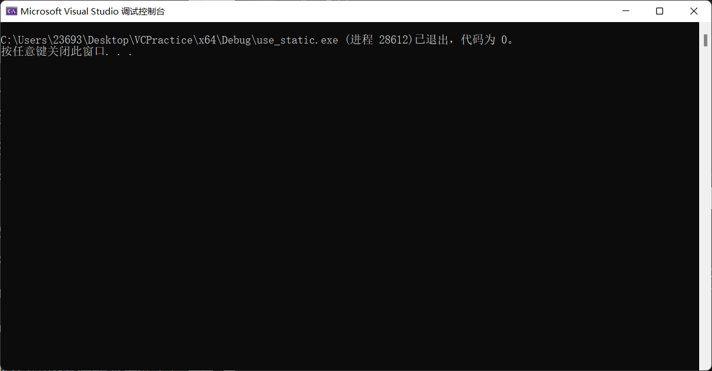

作为一个希望向高阶迈进的C++程序员，多线程概念和开发知识的学习是必须得掌握的，这不是一个选择题，而是一个必做题。本章所讲述的内容，不仅仅覆盖C++11新标准中多线程程序开发的绝大部分常用知识，同时涉及非常广泛的多线程程序开发理念和具体实现细节，许多知识点在所有多线程程序开发中都通用。因而也可以说，多线程程序开发的大部分核心思想、理念都包含在本章中。学习好本章定会让读者受益匪浅。

# 基本概念和实现　

并发、进程、线程的基本概念和综述1.并发并发表示两个或者更多任务（独立的活动）同时发生（进行）。例如，一面唱歌一面弹琴，一面走路一面说话，画画的时候听小说等。回归到计算机领域，所谓并发，就是一个程序同时执行多个独立的任务。以往计算机只有单核CPU（中央处理器）的时候，这种单核CPU某一个时刻只能执行一个任务，它实现多任务的方式就是由操作系统调度，每秒钟进行多次所谓的“任务切换”，也就是这个任务做一小会如做10ms，再切换到下个任务再做10ms等，诸如此类。因为任务切换的速度很快，所以在人类的感觉中，好像是多个任务在同时进行中（并行执行），其实这是一种并发的假象（不是真正的并

[(41条消息) c++中c_str()的用法详解_hold_on2014的博客-CSDN博客_c_str()](https://blog.csdn.net/u013682388/article/details/39547773)

关于main函数与进程、线程退出的关系
在学习嵌入式系统的进程和线程时，有以下的疑问：
讲师说进程退出时，进程中的所有线程都会退出；但是主线程退出时，子线程是不会退出的。当时觉得主线程=主进程main函数，那主线程退出了，子线程还会继续执行呢？

在网上查阅资料之后，弄明白了三者的关系就理解了开头的两句话，下面写一下总结，方便以后复习。

理解进程与线程
进程 是系统分配资源的最小单位。
线程 是系统调度的最小单位。

线程是程序最基本的运行单位，而进程是不能运行的，运行的是进程中的线程。创建进程时，系统会自动创建一个主线程来运行进程中的数据信息。

我们运行main函数的时候，就会创建一个主进程和一个主线程，当我们在主线程中创建更多的子线程后：
调用exit()函数：主进程和主线程都退出，子线程自然也要退出。
调用pthread_exit()函数：主线程退出，但是主进程依旧存在，所以进程中的子线程可以继续运行。

在程序中使用多进程多线程时，曾经出现ctrl c强制退出程序后，仍然有线程在后台执行，要手动kill掉。是因为父进程死亡后，主进程中的线程跟随主进程一起退出了，而子进程由系统1号进程进行管理，所以子进程中的线程还可以继续运行。这就导致我在调试运行程序的时候经常会出现报错，原因是因为后台中的子进程还在运行导致的。所以在处理进程和线程时，要几时对线程和进程资源进行回收，避免出错。
————————————————
版权声明：本文为CSDN博主「jarvis_zz」的原创文章，遵循CC 4.0 BY-SA版权协议，转载请附上原文出处链接及本声明。
原文链接：https://blog.csdn.net/weixin_43352468/article/details/107127444