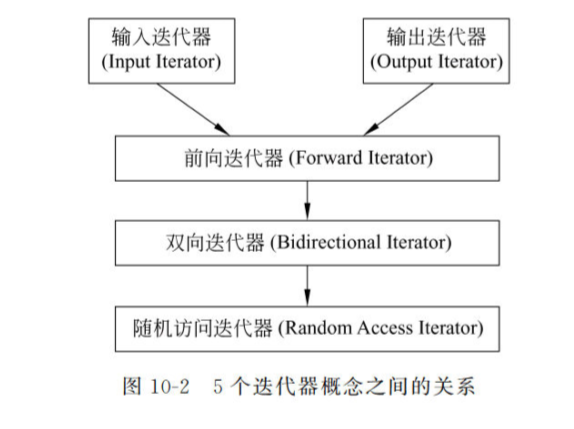
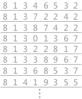
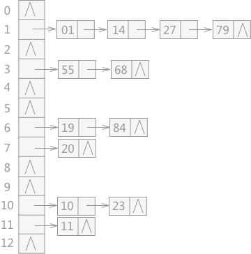

# ==模板和群体数据==

​	在第6章中介绍了数组﹐数组就是一种存放**群体数据**的存储结构。对于群体数据,仅有系统预定义的操作是不够的,在很多情况下,还需要设计与某些具体问题相关的特殊操作，并按照面向对象的方法将数据与操作封装起来,这就是群体类。

群体可分为两种:**线性群体和非线性群体。**线性群体中的元素按位置排列有序,可以区分为第一个元素、第二个元素等。一维数组用下标映射元素的顺序,是线性群体的典型例子(如图9-1所示)。非线性群体不用位置顺序来标识元素。例如,企业中职员的上下级关系,以及家族谱信息等都是非线性群体(如图9-2所示)。本章将介绍由一些常用的数据群体及其相关的操作构成的群体类。


关于群体数据的组织是属于数据结构范畴的内容,本章不一一详细介绍。这里只介绍两类常用的算法:排序和查找方法。
排序(sorting)又称分类或整理,是将一个无序序列调整为有序的过程。在排序过程中需要完成两种基本操作:一是比较两个元素的大小;二是调整元素在序列中的位置。排序方法有很多,在本章只介绍几种简单的排序方法:直接插入排序、直接选择排序和起泡排序方法。
查找(searching)是在一个序列中按照某种方式找出需要的特定数据元素的过程。查字典就是一个查找的例子。在本章只介绍最简单的顺序查找和折半查找方法。
由于在后续章节中介绍线性群体类和群体数据的组织中,采用的均是模板形式,因此，本章首先介绍函数模板和类模板的概念。

# ==函数模板与类模板==

[函数模板与类模板 - 知乎 (zhihu.com)](https://zhuanlan.zhihu.com/p/381299879)

C++最重要的特性之一就是代码重用,为了实现代码重用,代码必须具有通用性。通用代码需要不受数据类型的影响,并且可以自动适应数据类型的变化。这种程序设计类型称为参数化程序设计。模板是C++支持参数化程序设计的工具,通过它可以实现参数化多态性。所谓参数化多态性﹐就是将程序所处理的对象的类型参数化,使得一段程序可以用于处理多种不同类型的对象。

## 函数模板

第3章介绍了函数重载,可以看出重载函数通常是对于不同的数据类型完成类似的操作。很多情况下，一个算法是可以处理多种数据类型的。

但是用函数实现算法时,即使设计为重载函数也只是使用相同的函数名,函数体仍然要分别定义。请看下面两个求绝对值的函数:
i

```c++
nt abs (int x)
{
return x<0 ?-x: x;
}
double abs (double x)
{
return x<0 ?-X : X;}
```

这两个函数只有参数类型不同,功能完全一样。类似这样的情况﹐如果能写一段通用代码适用于多种不同数据类型,便会使代码的可重用性大大提高,从而提高软件的开发效率。使用函数模板就是为了这一目的。程序员只需对函数模板编写一次,然后基于调用函数时提供的参数类型,C+编译器将自动产生相应的函数来正确的处理该类型的数据。
函数模板的定义形式是:

```c++
template<模板参数表>
类型名函数名(参数表)
{
函数体的定义
}
```

所有函数模板的定义都是用关键字template开始的,该关键字之后是使用尖括号`<>`括起来的“模板参数表”。模板参数表由用逗号分隔的模板参数构成,可以包括以下内容:

1. `class`(或`typename`)标识符,指明可以接受一个类型参数。这些类型参数代表的是类型,可以是预定义类型或自定义类型。
2. `类型说明符 标识符`,指明可以接受一个由“类型说明符”所规定类型的常量作为参数;
3. `template<参数表>class`标识符,指明可以接收一个类模板名作为参数。

类型参数可以用来指定函数模板本身的形参类型、返回值类型,以及声明函数中的局部变量。函数模板中函数体的定义方式与定义普通函数类似。下面的程序是求绝对值的函数模板及其应用:

```c++
#include <iostream>
#include <string>
#include <vector>
template<typename T>
T abs(T x) {
	return x < 0 ? -x : x;
}
using namespace std;

int main()
{
	int  n = -5;
	double d = -5.5;
	cout << abs(n) << '\n' << abs(d) << endl;
	return 0;
}  
```

在上述主函数中调用abs()时,编译器从实参的类型推导出函数模板的类型参数。例如,对于调用表达式`abs(n)`,由于实参`n`为`int`类型,所以推导出模板中类型参数`T`为`int`。
当类型参数的含义确定后,编译器将以函数模板为样板﹐生成一个函数﹐这一过程称为函数模板的实例化,该函数称为函数模板abs 的一个实例:

```c++
int abs ( int x)
{
return x <0 ?-x:x;}
```

同样,对于调用表达式abs(d) ,由于实参d为double类型,所以推导出模板中类型参数T为double。接着,编译器将以函数模板为样板,生成如下函数:

```c++
double abs (double x){
return x <0 ? -X : X;}
```

因此,当主函数第一次调用abs时,执行的实际上是由函数模板生成的如下原型的函数:

```
int abs (int x);
```

第二次调用abs 时,执行的实际上是由函数模板生成的如下原型的函数:

```
double abs (double x);
```

```c++
#include<iostream>
using namespace std;
/*函数模板 类型参数化（作用）
* C++的另一种编程思想称为 泛型编程 主要利用技术就是模板
* C++提供两种机制：函数模板 和 类模板
* 函数模板作用：通过建立一个通用函数，其 返回值类型 和 形参类型 可以不具体制定 用一个虚拟的类型来代表
* 语法：
* template<typename T>
* 函数声明或定义
* template -- 声明创建模板
* typename -- 表面其后面的符号是一种数据类型，可以用class代替
* T -- 通用的数据类型，名称可以替换，通常为大写字母
*/

//两个整型交换
void swapInt(int& a, int& b)
{
	int temp = a;
	a = b;
	b = temp;
}

//交换两个浮点数据
void swapDouble(double& a, double& b)
{
	double temp = a;
	a = b;
	b = temp;
}

//利用模板实现交换函数
template<typename T>//声明一个模板 告诉编译器后面代码中紧跟着的T不要报错，T是一个通用数据类型
void mySwap(T& a, T& b)
{
	T temp = a;
	a = b;
	b = temp;
}

void test01()
{
	int a = 10;
	int b = 20;
	//swapInt(a, b);
	/*利用模板交换
	* 两种方式使用函数模板
	* 1、自动类型推导
	*/
	//mySwap(a, b);
	cout << "a = " << a << endl;//20
	cout << "b = " << b << endl;//10
	//2、显示指定类型
	mySwap<int>(a, b);
	cout << "a = " << a << endl;
	cout << "b = " << b << endl;

	double c = 1.1;
	double d = 2.2;
	//swapDouble(c, d);
	mySwap<double>(c, d);
	cout << "c = " << c << endl;//2.2
	cout << "d = " << d << endl;//1.1
}

int main()
{
	test01();
	system("pause");
	return 0;
}
```

### 函数模板注意事项

* 1、自动类型推导，必须推导出一致的数据类型 T，才可以使用
* 2、模板必须要确定出  T 的数据类型，才可以使用

```c++
#include<iostream>
using namespace std;
/*函数模板注意事项
* 1、自动类型推导，必须推导出一致的数据类型 T，才可以使用
* 2、模板必须要确定出 T 的数据类型，才可以使用
*/
//利用模板实现通用的交换函数
template<typename T>
void mySwap(T& a, T& b)
{
	T temp = a;
	a = b;
	b = temp;
}
//1、自动类型推导，必须推导出一致的数据类型 T，才可以使用
void test01()
{
	int a = 10;
	int b = 20;
	char c = 'c';
	
	mySwap(a, b);//正确，可以推导出一致的 T
	//mySwap(a, c);错误，没有与参数类型一致的 函数类型 T(推导不出一致的T类型)
}

//2、模板必须要确定出 T 的数据类型，才可以使用
template<class T>
void func()
{
	cout << "func 调用" << endl;
}
void test02()
{
	//func();错误，模板不能独立使用，必须确定出T的类型
	func<int>();//利用显示指定类型的方式 给T一个类型 才可以使用该模板
}

int main()
{
	test01();
	test02();
	system("pause");
	return 0;
}
```

### 函数模板案列

```c++
#include<iostream>
using namespace std;
/*案例描述：
利用函数模板封装一个排序的函数，可以对 不同数据类型数组 进行排序
排序规则 从大到小，排序算法为 选择排序
分别利用 char数组 和 int数组 进行测试

模板可以提高代码复用性，需要熟练掌握
*/
template<typename T>
//交换函数模板
void mySwap(T& a, T& b)
{
	T temp = a;
	a = b;
	b = temp;
}

//选择排序
template<typename T>
void mySort(T arr[], int len)
{
	for (int i = 0; i < len; i++)
	{
		int max = i;//认定最大值的下标
		for (int j = i + 1; j < len; j++)
		{
			//认定的最大值 比 遍历出的数值 要小，说明 j 下标的元素才是真正的最大值
			if (arr[max] < arr[j])
			{
				max = j;//更新最大值下标
			}
		}
		if (max != i)
		{
			//如果最大数下标不是 i ，交换max和i元素
			mySwap(arr[max], arr[i]);
		}
	}
}

//打印数组模板
template<class T>
void printArray(T arr[], int len)
{
	for (int i = 0; i < len; i++)
	{
		cout << arr[i] << "  ";
	}
	cout << endl;
}

void test01()
{
	//测试char数组
	char charArr[] = "bafsrd";
	int len = sizeof(charArr) / sizeof(char);
	mySort(charArr, len);
	printArray(charArr, len);

	//测试int数组
	int intArr[] = { 7,5,1,3,9,2,4,6,8 };
	int lens = sizeof(intArr) / sizeof(int);
	mySort(intArr, lens);
	printArray(intArr, lens);

}

int main()
{
	test01();
	system("pause");
	return 0;
}

```

### 与普通函数区别

```c++
#include<iostream>
using namespace std;
/*普通函数与函数模板的区别
* 1、普通函数调用时可以发生自动类型转换（隐式类型转换）
* 2、函数模板调用时，如果利用自动类型推导，不会发生隐式类型转换
* 3、如果利用显示指定类型的方式，可以发生隐式类型转换
*/
//普通函数
int myAdd01(int a, int b)
{
	return a + b;
}

//函数模板
template<class T>
int myAdd02(T a, T b)
{
	return a + b;
}

void test01()
{
	int a = 10;
	int b = 20;
	char c = 'c';

	cout << myAdd01(a, b) << endl;//30
	cout << myAdd01(a, c) << endl;//109=10+99  a - 97  c - 99 自动类型转换

	//自动类型推导
	myAdd02(a, b);
	cout << myAdd02(a, b) << endl;//30
	//myAdd02(a, c);报错，自动类型推倒时，不会发生隐式类型转换
	myAdd02<int>(a, c);//正确，显示指定类型，可以发生隐式类型转换
}

int main()
{
	test01();
	system("pause");
	return 0;
	//总结：建议使用显示指定类型的方式，调用函数模板，因为可以自己确定通用类型 T
}

```

### **调用规则**

```c++
#include<iostream>
using namespace std;
/*普通函数与函数模板的调用规则
* 1、如果函数模板和普通函数都可以实现，优先调用 普通函数（编译器有关）
* 2、可以通过 空模板参数列表 来强制调用函数模板
* 3、函数模板也可以发生 函数重载
* 4、如果函数模板可以产生更好的匹配 优先调用 函数模板
*/

void myprint(int a, int b)
{
	cout << "调用的是普通函数！" << endl;
}

template<class T>
void myPrint(T a, T b)
{
	cout << "调用函数模板！" << endl;
}  

template<class T>
void myPrint(T a, T b, T c)
{
	cout << "函数模板重载！" << endl;
}

void test01()
{
	int a = 10;
	int b = 20;
	//myPrint(a, b);//1、优先调用函数模板

	//2、通过空模板参数列表 强制调用函数模板
	myPrint<>(a, b);//函数模板

	//3、函数模板 重载
	int c = 30;
	myPrint<>(a, b, c);//函数模板重载
	myPrint(a, b, c);//函数模板重载

	//4、如果函数模板可以产生更好的匹配 优先调用 函数模板
	char c1 = 'a';
	char c2 = 'b';
	myPrint(c1, c2);//调用函数模板
}
int main()
{
	test01();
	system("pause");
	return 0;
	//总结：既然提供了函数模板，最好不要提供普通函数，否则容易出现二义性
}
```

### **函数模板的局限性**

```c++
#include<iostream>
using namespace std;
/*模板的局限性 模板的通用性不是万能的 有些特定数据类型 需要用具体化方式做特殊实现
* 
*/

class Person
{
public:

	Person(string name, int age)
	{
		this->m_Name = name;
		this->m_Age = age;
	}

	string m_Name;//姓名
	int m_Age;//年龄
};

//对比两个数据是否相等函数
template<class T>
bool myCompare(T& a, T& b)
{
	if (a == b)
	{
		return true;
	}
	else
	{
		return false;
	}
}

//利用具体化的Person版本实现代码，具体化会优先调用
template<> bool myCompare(Person& p1, Person& p2)
{
	if (p1.m_Name == p2.m_Name && p1.m_Age == p2.m_Age)
	{
		return true;
	}
	else
	{
		return false;
	}
}

void test01()
{
	int a = 10;
	int b = 20;
	bool ret = myCompare(a, b);
	if (ret)
	{
		cout << "a == b" << endl;
	}
	else
	{
		cout << "a != b" << endl;
	}
}

void test02()
{
	Person p1("Tom", 10);
	Person p2("Tom", 12);

	bool ret = myCompare(p1, p2);
	if (ret)
	{
		cout << "p1 == p2" << endl;//p1==p2
	}
	else
	{
		cout << "p1 != p2" << endl;
	}
}
int main()
{
	//test01();
	test02();
	system("pause");
	return 0;
	/*总结：
	1、利用具体化的模板，可以解决自定义类型的通用化
	2、学习模板不是为了写模板，而是在STL中能够运用系统提供的模板*/
}
```

## 类模板

#### 类模板语法

```cpp
#include<iostream>
using namespace std;
/*类模板语法
	template<typename T>
	类
* 作用：建立一个通用类，类中的成员 数据类型 可以不具体指定，用一个 虚拟的类型 来代表 
*/
//类模板
template<class NameType,class AgeType>
class Person
{
public:
	Person(NameType name, AgeType age)
	{
		this->m_Name = name;
		this->m_Age = age;
	}

	void showPerson()
	{
		cout << "name = " << this->m_Name << endl;
		cout << "age = " << this->m_Age << endl;
	}

public:
	NameType m_Name;
	AgeType m_Age;
};

void test01()
{
	//指定NameType 为 string 类型，AgeType 为 int 类型
	Person<string, int> p1("孙悟空", 99);
	p1.showPerson();
}

int main()
{
	test01();
	system("pause");
	return 0;
	//总结：类模板和函数模板语法相似，在声明模板template后面加类，此类称为类模板
}
```


#### **类模板与函数模板的区别**

类模板与函数模板的区别 主要两点：

* 类模板没有自动类型推导的使用方式
* 类模板在模板参数列表中可以有默认参数

```cpp
#include<iostream>
using namespace std;
/*类模板与函数模板的区别 主要两点：
* 1、类模板没有自动类型推导的使用方式
* 2、类模板在模板参数列表中可以有默认参数
*/
template<class NameType,class AgeType>//模板参数列表
//template<class NameType, class AgeType = int> //模板参数列表中可以有默认参数
class Person
{
public:
	Person(NameType name, AgeType age)
	{
		this->m_Name = name;
		this->m_Age = age;
	}

	void showPerson()
	{
		cout << "name = " << this->m_Name << endl;
		cout << "age = " << this->m_Age << endl;
	}

public:
	NameType m_Name;
	AgeType m_Age;
};

//1、类模板没有自动类型推导的使用方式
void test01()
{
	//Person p("孙悟空", 999);自动类型推导失败，类模板中，无法使用自动类型推导
	Person<string, int>p("孙悟空", 999);//类模板中只能显示指定类型
	p.showPerson();
}

//2、类模板在模板参数列表中可以有默认参数
void test02()
{
	//Person<string>p1("猪八戒", 888);参数列表中可以有默认参数 class AgeType = int
	//p1.showPerson();
}
int main()
{
	test01();
	test02();
	system("pause");
	return 0;
}
```


#### 类模板中成员函数创建时机

```cpp
#include<iostream>
using namespace std;
/*类模板中成员函数创建的时机
* 类模板中成员函数 和 普通类中成员函数 创建时机有区别
* 1、普通类中的成员函数 一开始就可以创建
* 2、类模板中的成员函数 在调用时才创建 因为一开始的时候不知道数据类型
*/
class Person1
{
public:
	void showPerson1()
	{
		cout << "Person1 show!" << endl;
	}
};

class Person2
{
public:
	void showPerson2()
	{
		cout << "Person2 show!" << endl;
	}
};

template<class T>
class MyClass 
{
public:
	T obj;//编译成功 类模板中的成员函数 在调用时才创建
	//类模板中的成员函数
	void func1()
	{
		obj.showPerson1();
	}

	void func2()
	{
		obj.showPerson2();
	}
};

void test01()
{
	MyClass<Person1>m;
	m.func1();//Person1 show!
	//m.func2();//showPerson2不是Person1的成员函数，编译出错
}

int main()
{
	test01();
	system("pause");
	return 0;
	//总结：类模板中的成员函数 不是 一开始就可以创建 而是在调用时才创建
}
```


#### 类模板对象做函数参数

```cpp
#include<iostream>
using namespace std;
/*类模板对象做函数参数  类模板实例化出的对象，向函数传参的方式
* 三种传入方式
* 1、指定传入的类型：直接显示对象的数据类型
* 2、参数模板化：将对象中的参数变为模板进行传递
* 3、整个类模板化：将这个对象类型 模板化进行传递
*/
template<class T1,class T2>
class Person
{
public:

	Person(T1 name,T2 age)
	{
		this->m_Name = name;
		this->m_Age = age;
	}

	void showPerson()
	{
		cout << "姓名：" << this->m_Name << "\t年龄：" << this->m_Age << endl;
	}

	T1 m_Name;
	T2 m_Age;
};
//1、指定传入类型
void printPerson1(Person<string, int>& p)
{
	p.showPerson();
}
void test01()
{
	Person<string, int>p1("孙悟空", 100);
	printPerson1(p1);
}

//2、参数模板化
template<class T1,class T2>
void printPerson2(Person<T1, T2>& p)
{
	p.showPerson();
	cout << "T1 的类型：" << typeid(T1).name() << endl;//string
	cout << "T2 的类型：" << typeid(T2).name() << endl;//int
}
void test02()
{
	Person<string, int>p1("猪八戒", 99);
	printPerson2(p1);
}

//将整个类模板化
template<class T>
void printPerson3(T& p)
{
	p.showPerson();
	cout << "T 的类型：" << typeid(T).name() << endl;//Person
}
void test03()
{
	Person<string,int>p("唐僧", 30);
	printPerson3(p);
}

int main()
{
	test01();
	test02();
	test03();
	system("pause");
	return 0;
	/*总结：
	* 1、通过类模板创建的对象，可以有参展方式向函数中进行传参
	* 2、使用广泛的是第一种：指定传入类型 void printPerson1(Person<string, int>& p)
	*/
}
```


#### 类模板与继承

```cpp
#include<iostream>
using namespace std;
/*类模板与继承
* 当子类继承的父类是一个类模板时，子类在声明的时候，要指定出父类T的类型
* 如果不指定，编译器无法给子类分配内存
* 如果想灵活指定出父类中 T 的类型，子类也需要变为类模板
*/
template<class T>
class Base
{
public:
	T m;
};

//class Son :public Base//缺少类模板Base的参数列表,必须知道父类中 T的数据类型，才能继承给子类再分配内存空间
class Son:public Base<int>//必须指定一个类型
{};
void test01()
{
	Son s1;
}

//如果想灵活指定出父类中 T 的类型，子类也需要变为类模板
template<class T1,class T2>
class Son2 :public Base<T1>
{
public:
	Son2()
	{
		cout << "T1 的数据类型：" << typeid(T1).name() << endl;//int
		cout << "T2 的数据类型：" << typeid(T2).name() << endl;//char
	}
	T1 obj;
};
void test02()
{
	Son2<int,char> s2;//子类创建时，指定类型传递给父类
}

int main()
{
	test01();
	test02();
	system("pause");
	return 0;
	//总结：如果父类是类模板，子类需要指定出父类中 T 的数据类型
}
```

#### 类模板成员函数的类外实现

```cpp
#include<iostream>
using namespace std;
/*类模板成员函数的类外实现
*/
template<class T1,class T2>
class Person
{
public:
	Person(T1 name, T2 age);//构造函数 类内声明

	void showPerson();//成员函数 类内声明

	T1 m_Name;
	T2 m_Age;
};
//构造函数 类外实现
template<class T1,class T2>
Person<T1, T2>::Person(T1 name, T2 age)
{
		this->m_Name = name;
		this->m_Age = age;
}
//成员函数 类外实现
template<class T1, class T2>
void Person<T1,T2>::showPerson()//<T1,T2>写在 :: 前面
{
		cout << "姓名：" << this->m_Name << "\t年龄：" << this->m_Age << endl;
}
void test01()
{
	Person<string,int> p("Tom", 18);
	p.showPerson();
}

int main()
{
	test01();
	system("pause");
	return 0;
	//总结：类模板中的成员函数类外实现，需要加上模板参数列表
}
```

#### 类模板的分文件编写

类模板的分文件编写

> #### 类模板中成员函数创建时机是在调用阶段，导致分文件编写时链接不到

**解决办法：1、直接包含.cpp源文件**

**Person.h**

```cpp
#pragma once
#include<iostream>
using namespace std;

template<class T1, class T2>
class Person
{
public:
	Person(T1 name, T2 age);

	void showPerson();

	T1 m_Name;
	T2 m_Age;
};
```

**Person.cpp**

```cpp
#include<iostream>
#include"Person.h"
using namespace std;

template<class T1, class T2>
Person<T1, T2>::Person(T1 name, T2 age)
{
	this->m_Name = name;
	this->m_Age = age;
}

template<class T1, class T2>
void Person<T1, T2>::showPerson()
{
	cout << "姓名：" << this->m_Name << "\t年龄：" << this->m_Age << endl;
}
```

**解决办法：2、将声明.h和实现.cpp写到同一个文件中，并更改后缀名为.hpp，.hpp是约定的名称，并非强制**

**Person.hpp**

```cpp
#pragma once
#include<iostream>
using namespace std;

template<class T1, class T2>
class Person
{
public:
	Person(T1 name, T2 age);

	void showPerson();

	T1 m_Name;
	T2 m_Age;
};

template<class T1, class T2>
Person<T1, T2>::Person(T1 name, T2 age)
{
	this->m_Name = name;
	this->m_Age = age;
}

template<class T1, class T2>
void Person<T1, T2>::showPerson()
{
	cout << "姓名：" << this->m_Name << "\t年龄：" << this->m_Age << endl;
}
```

**类模板分文件编程.cpp**

```cpp
void test01()
{
	Person<string, int>p("Jerry", 21);
	p.showPerson();
}

int main()
{
	test01();
	system("pause");
	return 0;
	//总结：主流方法第二种，将类模板成员函数写到一起，并将后缀名改为.hpp
}
```


#### 类模板与友元

```cpp
#include<iostream>
using namespace std;
/*类模板与友元 掌握类模板配合友元函数的类内和类外实现
* 全局函数类内实现 - 直接在类内声明友元即可
* 全局函数类外实现 - 需要提前让编译器知道全局函数的存在
*/
//提前让编译器知道Person类存在
template<class T1,class T2> class Person;

//2、全局函数类内声明 类外实现
template<class T1, class T2>
void printPerson1(Person<T1, T2> p)
{
	cout << "姓名：" << p.m_Name << "\t年龄" << p.m_Age << endl;
}

//通过全局函数，打印Person信息
template<class T1,class T2>
class Person
{
	//全局函数配合友元 类内实现
	friend void printPerson(Person<T1,T2> p)
	{
		cout << "姓名：" << p.m_Name << "\t年龄" << p.m_Age << endl;
	}

	//全局函数配合友元类内声明 类外实现
	//加 空模板 参数列表
	//如果是全局函数 类外实现 需要让编译器提前知道这个函数的存在
	friend void printPerson1<>(Person<T1, T2> p);

public:
	Person(T1 name, T2 age)
	{
		this->m_Name = name;
		this->m_Age = age;
	}

private:
	T1 m_Name;
	T2 m_Age;
};

//1、全局函数在类内实现
void test01()
{
	Person<string, int>p("Jerry", 22);
	printPerson(p);
}
//2、全局函数在类外实现
void test02()
{
	Person<string, int>p("Jerry", 23);
	printPerson1(p);
}

int main()
{
	test01();
	test02();
	system("pause");
	return 0;
	//总结：建议全局函数做类内实现，用法简单，编译器可以直接识别
}
```


#### 类模板案例

类模板案例：

案例描述: 实现一个通用的数组类，要求如下：

\* 可以对内置数据类型以及自定义数据类型的数据进行存储

\* 将数组中的数据存储到堆区

\* 构造函数中可以传入数组的容量

\* 提供对应的拷贝构造函数以及operator=防止浅拷贝问题

\* 提供尾插法和尾删法对数组中的数据进行增加和删除

\* 可以通过下标的方式访问数组中的元素

\* 可以获取数组中当前元素个数和数组的容量

**MyArray.hpp**

```cpp
//通用数组类
#pragma once
#include<iostream>
using namespace std;

template<class T>
class MyArray
{
public:
	//有参构造
	MyArray(int capacity)
	{
		cout << "MyArray 有参构造调用！" << endl;
		this->m_Capactity = capacity;
		this->m_Size = 0;
		pAddress = new T[capacity];
	}

	//拷贝构造函数
	MyArray(const MyArray& arr)
	{
		cout << "MyArray 拷贝构造调用！" << endl;
		this->m_Capactity = arr.m_Capactity;
		this->m_Size = arr.m_Size;
		//this->pAddress = arr.pAddress;浅拷贝问题，会造成堆区数据重复释放

		//深拷贝
		//this->pAddress = new T[this->m_Capacity];

		//将arr中的数据都拷贝过来
		for (int i = 0; i < this->m_Size; i++)
		{
			this->pAddress[i] = arr.pAddress[i];
		}
	}

	//operator= 防止浅拷贝问题
	MyArray& operator=(const MyArray& arr)
	{
		cout << "MyArray operator= 调用！" << endl;
		//先判断原来堆区是否有数据，如果有先释放
		if (this->pAddress != NULL)
		{
			delete[] this->pAddress;
			this->pAddress = NULL;
			this->m_Size = 0;
			this->m_Capactity = 0;
		}

		//深拷贝
		this->m_Capactity = arr.m_Capactity;
		this->m_Size = arr.m_Size;
		this->pAddress = new T[this->m_Capacity];
		for (int i = 0; i < this->m_Size; i++)
		{
			this->pAddress[i] = arr.pAddress[i];
		}
		return *this;
	}

	//尾插法
	void Push_Back(const T& val)
	{
		//判断容量是否等于大小
		if (this->m_Capactity == this->m_Size)
		{
			return;
		}
		this->pAddress[this->m_Size] = val;//数组末尾插入数据
		this->m_Size++;//更新数组大小
	}

	//尾删法
	void Pop_Back()
	{
		if (this->m_Size == 0)
		{
			return;
		}
		this->m_Size--;
	}

	//通过下标方式访问数组中的元素 arr[0]=100
	T& operator[](int index)
	{
		return this->pAddress[index];
	}

	//返回数组容量
	int getCapacity()
	{
		return this->m_Capactity;
	}

	//返回数组大小
	int getSize()
	{
		return this->m_Size;
	}

	//析构函数
	~MyArray()
	{
		cout << "MyArray 析构调用！" << endl;
		if (this->pAddress != NULL)
		{
			delete[] this->pAddress;
			this->pAddress = NULL;
		}
	}
private:
	T* pAddress;//指针指向堆区开辟的真实数组

	int m_Capactity;//数组容量

	int m_Size;//数组大小
};
```

**类模板案例.cpp**

```cpp
#include<iostream>
#include"MyArray.hpp"
using namespace std;

void printIntArray(MyArray<int>& arr)
{
	for (int i = 0; i < arr.getSize(); i++)
	{
		cout << arr[i] << endl;
	}
}

void test01()
{
	MyArray<int>arr(5);
	for (int i = 0; i < 5; i++)
	{
		//利用尾插法向数组中插入数据
		arr.Push_Back(i);
	}
	cout << "arr的打印输出为：" << endl;
	printIntArray(arr);
	cout << "arr的容量：" << arr.getCapacity() << endl;
	cout << "arr的大小：" << arr.getSize() << endl;

	MyArray<int>arr1(arr);
	cout << "arr1的打印输出为：" << endl;
	printIntArray(arr1);
	arr1.Pop_Back();
	cout << "arr1尾删后：" << endl;
	cout << "arr1的容量为：" << arr1.getCapacity() << endl;
	cout << "arr1的大小为：" << arr1.getSize() << endl;
	/*MyArray<int>arr2(100);
	arr2 = arr1;*/
}

//测试自定义数据类型
class Person
{
public:

	Person() {};
	Person(string name, int age)
	{
		this->m_Name = name;
		this->m_Age = age;
	}

	string m_Name;
	int m_Age;
};

void printPersonArray(MyArray<Person>& arr)
{
	for (int i = 0; i < arr.getSize(); i++)
	{
		cout << "姓名：" << arr[i].m_Name << "\t年龄：" << arr[i].m_Age << endl;
	}
}

void test02()
{
	MyArray<Person>arr(10);
	Person p1("孙悟空", 99);
	Person p2("韩信", 88);
	Person p3("妲己", 77);
	Person p4("赵云", 66);
	Person p5("安其拉", 55);

	//将数据插入到数组
	arr.Push_Back(p1);
	arr.Push_Back(p2);
	arr.Push_Back(p3);
	arr.Push_Back(p4);
	arr.Push_Back(p5);

	//打印数组
	printPersonArray(arr);

	//输出容量
	cout << "arr容量为：" << arr.getCapacity() << endl;
	//输出大小
	cout << "arr大小为：" << arr.getSi容器ze() << endl;
}

int main()
{
	test01();
	test02();
	system("pause");
	return 0;
}
```


容器


# ==stl简介==


## 迭代器


作者：Khellendros
链接：https://www.zhihu.com/question/54047747/answer/137783330
来源：知乎
著作权归作者所有。商业转载请联系作者获得授权，非商业转载请注明出处。

迭代器实际上是对“[遍历容器](https://www.zhihu.com/search?q=遍历容器&search_source=Entity&hybrid_search_source=Entity&hybrid_search_extra={"sourceType"%3A"answer"%2C"sourceId"%3A"137783330"})”这一操作进行了封装。

在编程中我们往往会用到各种各样的容器，但由于这些容器的底层实现各不相同，所以对他们进行遍历的方法也是不同的。例如，数组使用[指针算数](https://www.zhihu.com/search?q=指针算数&search_source=Entity&hybrid_search_source=Entity&hybrid_search_extra={"sourceType"%3A"answer"%2C"sourceId"%3A"137783330"})就可以遍历，但链表就要在不同节点直接进行跳转。

这是非常不利于代码重用的。例如你有一个简单的查找容器中最小值的函数findMin，如果没有迭代器，那么你就必须定义适用于数组版本的findMin和适用于链表版本的findMin，如果以后有更多容器需要使用findMin，那就只好继续添加重载……而如果每个容器又需要更多的函数例如findMax，sort，那简直就是重载地狱……

我们的救星就是[迭代器](https://www.zhihu.com/search?q=迭代器&search_source=Entity&hybrid_search_source=Entity&hybrid_search_extra={"sourceType"%3A"answer"%2C"sourceId"%3A"137783330"})啦！如果我们将这些遍历容器的操作都封装成迭代器，那么诸如findMin一类的算法就都可以针对迭代器编程而不是针对具体容器编程，工作量一下子就少了很多！

至于指针，由于指针也可以用来遍历容器(数组)，所以指针也可是算是迭代器的一种。但是指针还有其他功能，并不只局限于[遍历数组](https://www.zhihu.com/search?q=遍历数组&search_source=Entity&hybrid_search_source=Entity&hybrid_search_extra={"sourceType"%3A"answer"%2C"sourceId"%3A"137783330"})。因为使用指针变量数组的操作太深入人心，c++stl中的迭代器就是刻意仿照指针来设计接口的

如前所述，不同容器，比如向量和链表，其内部[数据结构](https://www.zhihu.com/search?q=数据结构&search_source=Entity&hybrid_search_source=Entity&hybrid_search_extra={"sourceType"%3A"article"%2C"sourceId"%3A"567908513"})差异很大。不同的内部数据结构导致了不同的容器特性：向量、模板数组、双端队列可以通过下标随机访问元素，而链表、单向链表则只能顺序访问。不同类型容器的接口差异，为**[代码复用](https://www.zhihu.com/search?q=代码复用&search_source=Entity&hybrid_search_source=Entity&hybrid_search_extra={"sourceType"%3A"article"%2C"sourceId"%3A"567908513"})（code reuse）**带来困难。**迭代器（iterator）**的设计目的之一，就是消除不同容器间的访问接口差异，从而使得**[泛型程序设计](https://www.zhihu.com/search?q=泛型程序设计&search_source=Entity&hybrid_search_source=Entity&hybrid_search_extra={"sourceType"%3A"article"%2C"sourceId"%3A"567908513"})（generic programming）**成为可能。广义地，迭代器属于**设计模式（design patterns）**的范畴。

使用独立于STL容器的迭代器,需要包含头文件`<iterator>`

## 容器

容器(container)是容纳,包含一组元素的对象。容器类库中包括13种基本容器:向量( vector),双端队列(deque),列表(list)、单向链表(forward_list) ,数组(array),集合(set)、多重集合( multiset)、映射( map)、多重映射( multimap),以及后面四种容器的无序形式unorder_map,unorder_set , unorder__ multimap , unorder_multiset等。这13种容器可以分为两种基本类型:顺序容器( sequence container)和关联容器(associative container)。顺序容器将一组具有相同类型的元素以严格的线性形式组织起来,向量、双端队列,列表、单向链表和数组容器就属于这一种。关联容器具有根据一组索引来快速提取元素的能力,集合和映射容器就属于这一种。根据元素的组织方式,关联容器可分为有序和无序,其中有序容器中键(key)按顺序存储,无序容器则使用哈希函数组织元素。
例10-1中的vector就是一个容器。
使用不同的容器,需要包含不同的头文件。

## 函数对象


函数对象(function object)是一个行为类似函数的对象,对它可以像调用函数一样调用。任何普通的函数和任何重载了“()”运算符的类的对象都可以作为函数对象使用,函数对象是泛化的函数。
例10-1中的 negate<int>()就是一个函数对象。negate是一个类模板﹐它重载了“()”运算符接受一个参数,该运算符返回的就是参数的相反数, negate的模板参数int表示的是negate 的“()”运算符接受和返回参数的类型。
使用STL的函数对象﹐需要包含头文件<functional>。

## 算法

STL包括70多个算法(algorithm),这些算法覆盖了相当大的应用领域,其中包括查找算法,排序算法,消除算法,计数算法,比较算法,变换算法,置换算法和容器管理等。这些算法的一个最重要的特性就是它们的统一性,并且可以广泛用于不同的对象和内置的数据类型。
例10-1中调用的transform就是一个算法﹐为了说明该算法的用途，下面给出该算法的一种实现:

```
template <class InputIt,class outputIt,class UnaryFunction>
outputIt transform(InputIt first,InputIt last,outputit result,Unary_Function op)
{
for (; first !=last; ++first,++result)
	*result=op ( * first) ;
	return result;
}

```

该算法顺序遍历first和 last两个迭代器所指向的元素,将每个元素的值作为函数对象op 的参数,将op的返回值通过迭代器result顺序输出。遍历完成后result迭代器指向的

# 函数对象

  在10.5节中,我们介绍了几种关联容器,在设计容器时,为了使容器能够通用,容器元素可以是任何类型,这样容器并不知道元素类型的任何信息。但是在判断键值是否相等时，除了的几种基本数据类型外,C++并未提供判断相等的方法;另一方面,为了在查询和更新时具有较高的时间效率,容器内部使用了平衡树的数据结构,这种数据结构依赖于对键值大小的比较。故需要一个比较函数,才能实现关联容器。
从以上分析可以看到,具体的容器类型被抽象成了通用的容器框架,框架会依赖于一些基本的函数,根据具体的问题替换这些函数,便能实现具体的容器。一般的函数调用只传值参和形参,要传递函数,只能借助于函数对象。这一节就介绍函数对象和函数对象适配器的概念,以及使用和设计的相关内容。

## 函数对象的概念

函数对象(function object or functor)是STL提供的一类主要组件,它使得STL的应用更加灵活方便﹐从而增强了算法的通用性。大多数STL算法可以用一个函数对象作为参数。所谓函数对象其实就是一个行为类似函数的对象,它可以不需参数,也可以带有若干参数,其功能是获取一个值,或者改变操作的状态。

在C++程序设计中,任何==普通的函数==﹑==函数指针==, ==lambda表达式==(本章后续将介绍)和==任何重载了调用运算符`operator()`的类的对象==都满足函数对象的特征,因此都可以作为函数对象传递给算法作为参数使用。
常用的函数对象可分为产生器(Generator)、一元函数（Unary Function)、二元函数(Binary Function)、一元谓词(Unary Predicate)和二元谓词(Binary Predicate)函数对象5大类。5种类别的关系如图10-9所示。


下面将以数值算法 accumulate()为例,介绍函数对象的设计及应用过程。accumulate的原型声明如下:

```c++
template<class InputIt, class T, class BinaryFunction>
Type accumulate(InputIt first,InputIt last,T val,BinaryFunction op) ;

```

它的功能是对数组元素进行累积运算,有两种重载形式:第一种形式是以`+`运算符作为运算规则,而第二种形式允许用户通过传递给算法相应的函数对象来指定计算规则。该声明是第二种形式,[first，last)为累加的区间, val为累加初始值,op为对应的累加函数。
一般来说,用户设计的普通函数就是一种最简单的函数对象，下面首先以一个普通函数作为算法accumulate()的输入参数来实现数值连乘的操作。

```
#include<numeric>
#include <iostream>
using namespace std;
template<class InputIt, class T, class BinaryFunction>
Type accumulate(InputIt first, InputIt last, T val, BinaryFunction op);
int mult(int x, int y) {
    return x*y
}

int main()
{
    int a[] = { 1,2,3,4,5 };
    const int N = sizeof(a) / sizeof(int);
    cout << "Hello World!\n";
    cout << "the result by multipling all elements in a is "
        << accumulate(a, a + N, 1, mult)<<endl;
    
```

运行结果:

```
The result by multipling all elements in A is 120
```

除了普通函数,另一类函数对象可以是类的对象,并且在定义中重载函数调用运算符。下面将例10-13中普通函数改写为类定义形式的函数对象。

```class
#include<numeric>
#include <iostream>
using namespace std;
class MultClass {
public:
    int operator()(int x, int y) { return x * y; }
};

int main()
{
    int a[] = { 1,2,3,4,5 };
    const int N = sizeof(a) / sizeof(int);
    cout << "Hello World!\n";
    cout << "the result by multipling all elements in a is "
        << accumulate(a, a + N, 1, Multclass())<<endl;
    return 0;
}
```

==分析:==通过在类MultClass中重载运算符operator(),就定义了一种可以作为函数参数的对象,同样可以像使用普通函数mult一样来使用该对象。但是这里传递给算法accumulate的对象是通过MultClass类的默认构造函数MultClass()获得的,它可以由编译器自动提供。使用类的形式定义的函数对象能够比普通函数携带更多的额外信息。

## 标准函数对象分类

另外,除了上面提到的通过自定义函数对象来实现算法的不同操作形式,STL中也定义了一些标准的函数对象。下面将按照函数对象的分类分别介绍这些标准函数对象。


==1.产生器(generator)、一元函数( unary function)和二元函数(binary function)==

在常用的STL算法中,对于函数对象的类型会有一定的要求。如例10-9 ， accumulate算法要求传入的函数对象必须具有2个参数,1个返回值,同时还要求参数类型和accumulate返回类型一致,我们称这样的函数对象为二元函数对象。

> #### 一般性地,具有0个、1个和2个传入参数的函数对象﹐称为产生器(generator)、一元函数(unary function)和二元函数(binary function)。


下面举一个例子来说明如何使用STL定义的函数对象。为了调用这些标准函数对象，需要包含头文件`<functional>`。标准函数对象是内联函数。

==2.一元谓词(unary predicate)和二元谓词(binary predicate)函数对象==

STL算法中,经常用到判断是否为真、比较大小这样的函数对象,这种函数对象要求返回值为bool型,并具有一个或两个参数,称为一元谓词或二元谓词函数对象。STL 中的谓词函数对象如表10-5所示。


==提示==﹐以上6个用于比较大小关系的函数对象皆依赖于T类型的关系运算符,因此当T是自定义类型时需要重载它的关系运算符,但无须将6种关系运算符全部重载。事实上，4种判断大小关系的函数对象只依赖于`<`,例如 ,` less_equa(x，y)`实际被转化为`!(y<x)`;2种判断两值是否相等的函数对象只依赖于`==`,例如, `not_equal_to(x，y)`实际被转换为`!(x==y)`。
下面举一个例子来说明谓词函数对象的使用。

## 内建函数对象

###  内建函数对象意义

**概念：**

* STL内建了一些函数对象


**分类:**

* 算术仿函数

* 关系仿函数

* 逻辑仿函数

**用法：**

* 这些仿函数所产生的对象，用法和一般函数完全相同
* 使用内建函数对象，需要引入头文件 `#include<functional>`


### 算术仿函数

**功能描述：**

* 实现四则运算
* 其中`negate`是一元运算，其他都是二元运算


**仿函数原型：**

* `template<class T> T plus<T>`                //加法仿函数
* `template<class T> T minus<T>`              //减法仿函数
* `template<class T> T multiplies<T>`    //乘法仿函数
* `template<class T> T divides<T>`         //除法仿函数
* `template<class T> T modulus<T>`         //取模仿函数
* `template<class T> T negate<T>`           //取反仿函数


**示例：**

```C++
#include <functional>
//negate
void test01()
{
	negate<int> n;
	cout << n(50) << endl;
}

//plus
void test02()
{
	plus<int> p;
	cout << p(10, 20) << endl;
}

int main() {

	test01();
	test02();

	system("pause");

	return 0;
}
```

总结：使用内建函数对象时，需要引入头文件 `#include <functional>`


###  关系仿函数

**功能描述：**

- 实现关系对比


**仿函数原型：**

* `template<class T> bool equal_to<T>`                    //等于
* `template<class T> bool not_equal_to<T>`            //不等于
* `template<class T> bool greater<T>`                      //大于
* `template<class T> bool greater_equal<T>`          //大于等于
* `template<class T> bool less<T>`                           //小于
* `template<class T> bool less_equal<T>`               //小于等于


**示例：**

```C++
#include <functional>
#include <vector>
#include <algorithm>

class MyCompare
{
public:
	bool operator()(int v1,int v2)
	{
		return v1 > v2;
	}
};
void test01()
{
	vector<int> v;

	v.push_back(10);
	v.push_back(30);
	v.push_back(50);
	v.push_back(40);
	v.push_back(20);

	for (vector<int>::iterator it = v.begin(); it != v.end(); it++) {
		cout << *it << " ";
	}
	cout << endl;

	//自己实现仿函数
	//sort(v.begin(), v.end(), MyCompare());
	//STL内建仿函数  大于仿函数
	sort(v.begin(), v.end(), greater<int>());

	for (vector<int>::iterator it = v.begin(); it != v.end(); it++) {
		cout << *it << " ";
	}
	cout << endl;
}

int main() {

	test01();

	system("pause");

	return 0;
}
```

总结：关系仿函数中最常用的就是greater<>大于


###  逻辑仿函数

**功能描述：**

- 实现逻辑运算


**函数原型：**

* `template<class T> bool logical_and<T>`              //逻辑与
* `template<class T> bool logical_or<T>`                //逻辑或
* `template<class T> bool logical_not<T>`              //逻辑非


**示例：**

```C++
#include <vector>
#include <functional>
#include <algorithm>
void test01()
{
	vector<bool> v;
	v.push_back(true);
	v.push_back(false);
	v.push_back(true);
	v.push_back(false);

	for (vector<bool>::iterator it = v.begin();it!= v.end();it++)
	{
		cout << *it << " ";
	}
	cout << endl;

	//逻辑非  将v容器搬运到v2中，并执行逻辑非运算
	vector<bool> v2;
	v2.resize(v.size());
	transform(v.begin(), v.end(),  v2.begin(), logical_not<bool>());
	for (vector<bool>::iterator it = v2.begin(); it != v2.end(); it++)
	{
		cout << *it << " ";
	}
	cout << endl;
}

int main() {

	test01();

	system("pause");

	return 0;
}
```

总结：逻辑仿函数实际应用较少，了解即可

## lambda表达式

[C++11 lambda表达式精讲 (biancheng.net)](http://c.biancheng.net/view/3741.html)

+++++++++++++++++++++++++++++++++++++++++++++++++++++++++++++++++++++++++++++++++++++++++++++++++++++++++++++++++++++++++++++++++++++++++++++++++++++++++++++++++++++++++++++++++++++++++++++++++++++++++++++++++++++++++++++++++++++++++++++++++++++++++++++++++++++++++++++++++++++++++++++++++++++++++++++++++++++++++++++++++++++++++++++++++++++++++++++++++++++++++++++++++++++++++++++++++++++++++++++++++++++++++++++++++++++++++++++++++++++++++++++++++++++++++++++++++++++++++++++++++++++++++++++++++++++++++++++++++++++++++++++++++++++++++++++++++++++++++++++++++++++++++++++++++++++++++++++++++++++++++++++++++++++++++++++++++++++++++++++++++++++++++++++++++++++++++++++++++++++++++++++++++++++++++++++++++++++++++++++++++++++++++++++++++++++++++++++++++++++++++++++++++++++++++++++++++++++++++++++++++++++++++++++++++++++++++++++++++++++++++++++++++++++++++++++++++++++++++++++++++++++++++++++++++++++++++++++++++++++++++++++++++++++++++++++++++++++++++++++++++++++++++++++++++++++++++++++++++++++++++++++++++++++++++++++++++++++++++++++++++++++++++++++++++++++++++++++++++++++++++++++++++++++++++++++++++++++++++++++++++++++++++++++++++++++++++++++++++++++++++++++++++++++++++++++++++++++++++++++++++++++++++++++++++++++++++++++++++++++++++++++++++++++++++++++++++++++++++++++++++++++++++++++++++++++++++++++++++++++++++++++++++++++++++++++++++++++++++++++++++++++++++++++++++++++++++++++++++++++++++++++++++++++++++++++++++++++++++++++++++++++++++++++++++++++++++++++++++++++++++++++++++++++++++++++++++++++++++++++++++++++++++++++++++++++++++++++++++++++++++++++++++++++++++++++++++++++++++++++++++++++++++++++++++++++++++++++++++++++++++++++++++++++++++++++++++++++++++++++++++++++++++++++++++++++++++++++++++++++++++++++++++++++++++++++++++++++++++++++++++++++++++++++++++++++++++++++++++++++++++++++++++++++++++++++++++++++++++++++++++++++++++++++++++++++++++++++++++++++++++++++++++++++++++++++++++++++++++++++++++++++++++++++++++++++++++++++++++++++++++++++++++++++++++++++++++++++++++++++++++++++++++++++++++++++++++++++++++++++++++++++++++++++++++++++++++++++++++++++++++++++++++++++++++++++++++++++++++++++++++++++++++++++++++++++++++++++++++++++++++++++++++++++++++++++++++++++++++++++++++++++++++++++++++++++++++++++++++++++++++++++++++++++++++++++++++++++++++++++++++++++++++++++++++++++++++++++++++++++++++++++++++++++++++++++++++++++++++++++++++++++++++++++++++++++++++++++++++++++++++++++++++++++++++++++++++++++++++++++++++++++++++++++++++++++++++++++++++++++++++++++++++++++++++++++++++++++++++++++++++++++++++++++++++++++++++++++++++++++++++++++++++++++++++++++++++++++++++++++++++++++++++++++++++++++++++++++++++++++++++++++++++++++++++++++++++++++++++++++++++++++++++++++++++++++++++++++++++++++++++++++++++++++++++++++++++++++++++++++++++++++++++++++++++++++++++++++++++++++++++++++++++++++++++++++++++++++++++++++++++++++++++++++++++++++++++++++++++++++++++++++++++++++++++++++++++++++++++++++++++++++++++++++++++++++++++++++++++++++++++++++++++++++++++++++++++++++++++++++++++++++++++++++++++++++++++++++++++++++++++++++++++++++++++++++++++++++++++++++++++++++++++++++++++++++++++++++++++++++++++++++++++++++++++++++++++++++++++++++++++++++++++++++++++++++++++++++++++++++++++++++++++++++++++++++++++++++++++++++++++++++++++++++++++++++++++++++++++++++++++++++++++++++++++++++++++++++++++++++++++++++++++++++++++++++++++++++++++++++++++++++++++++++++++++++++++++++++++++++++++++++++++++++++++++++++++++++++++++++++++++++++++++++++++++++++++++++++++++++++++++++++++++++++++++++++++++++++++++++++++++++++++++++++++++++++++++++++++++++++++++++++++++++++++++++++++++++++++++++++++++++++++++++++++++++++++++++++++++++++++++++++++++++++++++++++++++++++++++++++++++++++++++++++++++++++++++++++++++++++++++++++++++++++++++++++++++++++++++++++++++++++++++++++++++++++++++++++++++++++++++++++++++++++++++++++++++++++++++++++++++++++++++++++++++++++++++++++++++++++++++++++++++++++++++++++++++++++++++++++++++++++++++++++++++++++++++++++++++++++++++++++++++++++++++++++++++++++++++++++++++++++++++++++++++++++++++++++++++++++++++++++++++++++++++++++++++++++++++++++++++++++++++++++++++++++++++++++++++++++++++++++++++++++++++++++++++++++++++++++++++++++++++++++++++++++++++++++++++++++++++++++++++++++++++++++++++++++++++++++++++++++++++++++++++++++++++++++++++++++++++++++++++++++++++++++++++++++++++++++++++++++++++++++++++++++++++++++++++++++++++++++++++++++++++++++++++++++++++++++++++++++++++++++++++++++++++++++++++++++++++++++++++++++++++++++++++++++++++++++++++++++++++++++++++++++++++++++++++++++++++++++++++++++++++++++++++++++++++++++++++++++++++++++++++++++++++++++++++++++++++++++++++++++++++++++++++++++++++++++++++++++++++++++++++++++++++++++++++++++++++++++++++++++++++++++++++++++++++++++++++++++++++++++++++++++++++++++++++++++++++++++++++++++++++++++++++++++++++++++++++++++++++++++++++++++++++++++++++++++++++++++++++++++++++++++++++++++++++++++++++++++++++++++++++++++++++++++++++++++++++++++++++++++++++++++++++++++++++++++++++++++++++++++++++++++++++++++++++++++++++++++++++++++++++++++++++++++++++++++++++++++++++++++++++++++++++++++++++++++++++++++++++++++++++++++++++++++++++++++++++++++++++++++++++++++++++++++++++++++++++++++++++++++++++++++++++++++++++++++++++++++++++++++++++++++++++++++++++++++++++++++++++++++++++++++++++++++++++++++++++++++++++++++++++++++++++++++++++++++++++++++++++++++++++++++++++++++++++++++++++++++++++++++++++++++++++++++++++++++++++++++++++++++++++++++++++++++++++++++++++++++++++++++++++++++++++++++++++++++++++++++++++++++++++++++++++++++++++++++++++++++++++++++++++++++++++++++++++++++++++++++++++++++++++++++++++++++++++++++++++++++++++++++++++++++++++++++++++++++++++++++++++++++++++++++++++++++++++++++++++++++++++++++++++++++++++++++++++++++++++++++++++++++++++++++++++++++++++++++++++++++++++++++++++++++++++++++++++++++++++++++++++++++++++++++++++++++++++++++++++++++++++++++++++++++++++++++++++++++++++++++++++++++++++++++++++++++++++++++++++++++++++++++++++++++++++++++++++++++++++++++++++++++++++++++++++++++++++++++++++++++++++++++++++++++++++++++++++++++++++++++++++++++++++++++++++++++++++++++++++++++++++++++++++++++++++++++++++++++++++++++++++++++++++++++++++++++++++++++++++++++++++++++++++++++++++++++++++++++++++++++++++++++++++++++++++++++++++++++++++++++++++++++++++++++++++++++++++++++++++++++++++++++++++++++++++++++++++++++++++++++++++++++++++++++++++++++++++++++++++++++++++++++++++++++++++++++++++++++++++++++++++++++++++++++++++++++++++++++++++++++++++++++++++++++++++++++++++++++++++++++++++++++++++++++++++++++++++++++++++++++++++++++++++++++++++++++++++++++++++++++++++++++++++++++++++++++++++++++++++++++++++++++++++++++++++++++++++++++++++++++++++++++++++++++++++++++++++++++++++++++++++++++++++++++++++++++++++++++++++++++++++++++++++++++++++++++++++++++++++++++++++++++++++++++++++++++++++++++++++++++++++++++++++++++++++++++++++++++++++++++++++++++++++++++++++++++++++++++++++++++++++++++++++++++++++++++++++++++++++++++++++++++++++++++++++++++++++++++++++++++++++++++++++++++++++++++++++++++++++++++++++++++++++++++++++++++++++++++++++++++++++++++++++++++++++++++++++++++++++++++++++++++++++++++++++++++++++++++++++++++++++++++++++++++++++++++++++++++++++++++++++++++++++++++++++++++++++++++++++++++++++++++++++++++++++++++++++++++++++++++++++++++++++++++++++++++++++++++++++++++++++++++++++++++++++++++++++++++++++++++++++++++++++++++++++++++++++++++++++++++++++++++++++++++++++++++++++++++++++++++++++++++++++++++++++++++++++++++++++++++++++++++++++++++++++++++++++++++++++++++++++++++++++++++++++++++++++++++++++++++++++++++++++++++++++++++++++++++++++++++++++++++++++++++++++++++++++++++++++++++++++++++++++++++++++++++++++++++++++++++++++++++++++++++++++++++++++++++++++++++++++++++++++++++++++++++++++++++++++++++++++++++++++++++++++++++++++++++++++++++++++++++++++++++++++++++++++++++++++++++++++++++++++++++++++++++++++++++++++++++++++++++++++++++++++++++++++++++++++++++++++++++++++++++++++++++++++++++++++++++++++++++++++++++++++++++++++++++++++++++++++++++++++++++++++++++++++++++++++++++++++++++++++++++++++++++++++++++++++++++++++++++++++++++++++++++++++++++++++++++++++++++++++++++++++++++++++++++++++++++++++++++++++++++++++++++++++++++++++++++++++++++++++++++++++++++++++++++++++++++++++++++++++++++++++++++++++++++++++++++++++++++++++++++++++++++++++++++++++++++++++++++++++++++++++++++++++++++++++++++++++++++++++++++++++++++++++++++++++++++++++++++++++++++++++++++++++++++++++++++++++++++++++++++++++++++++++++++++++++++++++++++++++++++++++++++++++++++++++++++++++++++++++++++++++++++++++++++++++++++++++++++++++++++++++++++++++++++++++++++++++++++++++++++++++++++++++++++++++++++++++++++++++++++++++++++++++++++++++++++++++++++++++++++++++++++++++++++++++++++++++++++++++++++++++++++++++++++++++++++++++++++++++++++++++++++++++++++++++++++++++++++++++++++++++++++++++++++++++++++++++++++++++++++++++++++++++++++++++++++++++++++++++++++++++++++++++++++++++++++++++++++++++++++++++++++++++++++++++++++++++++++++++++++++++++++++++++++++++++++++++++++++++++++++++++++++++++++++++++++++++++++++++++++++++++++++++++++++++++++++++++++++++++++++++++++++++++++++++++++++++++++++++++++++++++++++++++++++++++++++++++++++++++++++++++++++++++++++++++++++++++++++++++++++++++++++++++++++++++++++++++++++++++++++++++++++++++++++++++++++++++++++++++++++++++++++++++++++++++++++++++++++++++++++++++++++++++++++++++++++++++++++++++++++++++++++++++++++++++++++++++++++++++++++++++++++++++++++++++++++++++++++++++++++++++++++++++++++++++++++++++++++++++++++++++++++++++++++++++++++++++++++++++++++++++++++++++++++++++++++++++++++++++++++++++++++++++++++++++++++++++++++++++++++++++++++++++++++++++++++++++++++++++++++++++++++++++++++++++++++++++++++++++++++++++++++++++++++++++++++++++++++++++++++++++++++++++++++++++++++++++++++++++++++++++++++++++++++++++++++++++++++++++++++++++++++++++++++++++++++++++++++++++++++++++++++++++++++++++++++++++++++++++++++++++++++++++++++++++++++++++++++++++++++++++++++++++++++++++++++++++++++++++++++++++++++++++++++++++++++++++++++++++++++++++++++++++++++++++++++++++++++++++++++++++++++++++++++++++++++++++++++++++++++++++++++++++++++++++++++++++++++++++++++++++++++++++++++++++++++++++++++++++++++++++++++++++++++++++++++++++++++++++++++++++++++++++++++++++++++++++++++++++++++++++++++++++++++++++++++++++++++++++++++++++++++++++++++++++++++++++++++++++++++++++++++++++++++++++++++++++++++++++++++++++++++++++++++++++++++++++++++++++++++++++++++++++++++++++++++++++++++++++++++++++++++++++++++++++++++++++++++++++++++++++++++++++++++++++++++++++++++++++++++++++++++++++++++++++++++++++++++++++++++++++++++++++++++++++++++++++++++++++++++++++++++++++++++++++++++++++++++++++++++++++++++++++++++++++++++++++++++++++++++++++++++++++++++++++++++++++++++++++++++++++++++++++++++++++++++++++++++++++++++++++++++++++++++++++++++++++++++++++++++++++++++++++++++++++++++++++++++++++++++++++++++++++++++++++++++++++++++++++++++++++++++++++++++++++++++++++++++++++++++++++++++++++++++++++++++++++++++++++++++++++++++++++++++++++++++++++++++++++++++++++++++++++++++++++++++++++++++++++++++++++++++++++++++++++++++++++++++++++++++++++++++++++++++++++++++++++++++++++++++++++++++++++++++++++++++++++++++++++++++++++++++++++++++++++++++++++++++++++++++++++++++++++++++++++++++++++++++++++++++++++++++++++++++++++++++++++++++++++++++++++++++++++++++++++++++++++++++++++++++++++++++++++++++++++++++++++++++++++++++++++++++++++++++++++++++++++++++++++++++++++++++++++++++++++++++++++++++++++++++++++++++++++++++++++++++++++++++++++++++++++++++++++++++++++++++++++++++++++++++++++++++++++++++++++++++++++++++++++++++++++++++++++++++++++++++++++++++++++++++++++++++++++++++++++++++++++++++++++++++++++++++++++++++++++++++++++++++++++++++++++++++++++++++++++++++++++++++++++++++++++++++++++++++++++++++++++++++++++++++++++++++++++++++++++++++++++++++++++++++++++++++++++++++++++++++++++++++++++++++++++++++++++++++++++++++++++++++++++++++++++++++++++++++++++++++++++++++++++++++++++++++++++++++++++++++++++++++++++++++++++++++++++++++++++++++++++++++++++++++++++++++++++++++++++++++++++++++++++++++++++++++++++++++++++++++++++++++++++++++++++++++++++++++++++++++++++++++++++++++++++++++++++++++++++++++++++++++++++++++++++++++++++++++++++++++++++++++++++++++++++++++++++++++++++++++++++++++++++++++++++++++++++++++++++++++++++++++++++++++++++++++++++++++++++++++++++++++++++++++++++++++++++++++++++++++++++++++++++++++++++++++++++++++++++++++++++++++++++++++++++++++++++++++++++++++++++++++++++++++++++++++++++++++++++++++++++++++++++++++++++++++++++++++++++++++++++++++++++++++++++++++++++++++++++++++++++++++++++++++++++++++++++++++++++++++++++++++++++++++++++++++++++++++++++++++++++++++++++++++++++++++++++++++++++++++++++++++++++++++++++++++++++++++++++++++++++++++++++++++++++++++++++++++++++++++++++++++++++++++++++++++++++++++++++++++++++++++++++++++++++++++++++++++++++++++++++++++++++++++++++++++++++++++++++++++++++++++++++++++++++++++++++++++++++++++++++++++++++++++++++++++++++++++++++++++++++++++++++++++++++++++++++++++++++++++++++++++++++++++++++++++++++++++++++++++++++++++++++++++++++++++++++++++++++++++++++++++++++++++++++++++++++++++++++++++++++++++++++++++++++++++++++++++++++++++++++++++++++++++++++++++++++++++++++++++++++++++++++++++++++++++++++++++++++++++++++++++++++++++++++++++++++++++++++++++++++++++++++++++++++++++++++++++++++++++++++++++++++++++++++++++++++++++++++++++++++++++++++++++++++++++++++++++++++++++++++++++++++++++++++++++++++++++++++++++++++++++++++++++++++++++++++++++++++++++++++++++++++++++++++++++++++++++++++++++++++++++++++++++++++++++++++++++++++++++++++++++++++++++++++++++++++++++++++++++++++++++++++++++++++++++++++++++++++++++++++++++++++++++++++++++++++++++++++++++++++++++++++++++++++++++++++++++++++++++++++++++++++++++++++++++++++++++++++++++++++++++++++++++++++++++++++++++++++++++++++++++++++++++++++++++++++++++++++++++++++++++++++++++++++++++++++++++++++++++++++++++++++++++++++++++++++++++++++++++++++++++++++++++++++++++++++++++++++++++++++++++++++++++++++++++++++++++++++++++++++++++++++++++++++++++++++++++++++++++++++++++++++++++++++++++++++++++++++++++++++++++++++++++++++++++++++++++++++++++++++++++++++++++++++++++++++++++++++++++++++++++++++++++++++++++++++++++++++++++++++++++++++++++++++++++++++++++++++++++++++++++++++++++++++++++++++++++++++++++++++++++++++++++++++++++++++++++++++++++++++++++++++++++++++++++++++++++++++++++++++++++++++++++++++++++++++++++++++++++++++++++++++++++++++++++++++++++++++++++++++++++++++++++++++++++++++++++++++++++++++++++++++++++++++++++++++++++++++++++++++++++++++++++++++++++++++++++++++++++++++++++++++++++++++++++++++++++++++++++++++++++++++++++++++++++++++++++++++++++++++++++++++++++++++++++++++++++++++++++++++++++++++++++++++++++++++++++++++++++++++++++++++++++++++++++++++++++++++++++++++++++++++++++++++++++++++++++++++++++++++++++++++++++++++++++++++++++++++++++++++++++++++++++++++++++++++++++++++++++++++++++++++++++++++++++++++++++++++++++++++++++++++++++++++++++++++++++++++++++++++++++++++++++++++++++++++++++++++++++++++++++++++++++++++++++++++++++++++++++++++++++++++++++++++++++++++++++++++++++++++++++++++++++++++++++++++++++++++++++++++++++++++++++++++++++++++++++++++++++++++++++++++++++++++++++++++++++++++++++++++++++++++++++++++++++++++++++++++++++++++++++++++++++++++++++++++++++++++++++++++++++++++++++++++++++++++++++++++++++++++++++++++++++++++++++++++++++++++++++++++++++++++++++++++++++++++++++++++++++++++++++++++++++++++++++++++++++++++++++++++++++++++++++++++++++++++++++++++++++++++++++++++++++++++++++++++++++++++++++++++++++++++++++++++++++++++++++++++++++++++++++++++++++++++++++++++++++++++++++++++++++++++++++++++++++++++++++++++++++++++++++++++++++++++++++++++++++++++++++++++++++++++++++++++++++++++++++++++++++++++++++++++++++++++++++++++++++++++++++++++++++++++++++++++++++++++++++++++++++++++++++++++++++++++++++++++++++++++++++++++++++++++++++++++++++++++++++++++++++++++++++++++++++++++++++++++++++++++++++++++++++++++++++++++++++++++++++++++++++++++++++++++++++++++++++++++++++++++++++++++++++++++++++++++++++++++++++++++++++++++++++++++++++++++++++++++++++++++++++++++++++++++++++++++++++++++++++++++++++++++++++++++++++++++++++++++++++++++++++++++++++++++++++++++++++++++++++++++++++++++++++++++++++++++++++++++++++++++++++++++++++++++++++++++++++++++++++++++++++++++++++++++++++++++++++++++++++++++++++++++++++++++++++++++++++++++++++++++++++++++++++++++++++++++++++++++++++++++++++++++++++++++++++++++++++++++++++++++++++++++++++++++++++++++++++++++++++++++++++++++++++++++++++++++++++++++++++++++++++++++++++++++++++++++++++++++++++++++++++++++++++++++++++++++++++++++++++++++++++++++++++++++++++++++++++++++++++++++++++++++++++++++++++++++++++++++++++++++++++++++++++++++++++++++++++++++++++++++++++++++++++++++++++++++++++++++++++++++++++++++++++++++++++++++++++++++++++++++++++++++++++++++++++++++++++++++++++++++++++++++++++++++++++++++++++++++++++++++++++++++++++++++++++++++++++++++++++++++++++++++++++++++++++++++++++++++++++++++++++++++++++++++++++++++++++++++++++++++++++++++++++++++++++++++++++++++++++++++++++++++++++++++++++++++++++++++++++++++++++++++++++++++++++++++++++++++++++++++++++++++++++++++++++++++++++++++++++++++++++++++++++++++++++++++++++++++++++++++++++++++++++++++++++++++++++++++++++++++++++++++++++++++++++++++++++++++++++++++++++++++++++++++++++++++++++++++++++++++++++++++++++++++++++++++++++++++++++++++++++++++++++++++++++++++++++++++++++++++++++++++++++++++++++++++++++++++++++++++++++++++++++++++++++++++++++++++++++++++++++++++++++++++++++++++++++++++++++++++++++++++++++++++++++++++++++++++++++++++++++++++++++++++++++++++++++++++++++++++++++++++++++++++++++++++++++++++++++++++++++++++++++++++++++++++++++++

# 迭代器

理解迭代器对于理解STL框架并掌握STL的使用至关重要。迭代器是泛化的指针STL算法利用迭代器对存储在容器中的元素序列进行遍历,迭代器提供了访问容器中每个元素的方法。虽然指针也是一种迭代器,但迭代器却不仅仅是指针。指针可以指向内存中的一个地址,通过这个地址就可以访问相应的内存单元;而迭代器更为抽象,它可以指向容器中的一个位置,我们也许不必关心这个位置的真正物理地址,只需要通过迭代器访问这个位置的元素。
在STL中迭代器是算法和容器的“中间人”。回忆一下第9章介绍的知识:遍历链表需要使用指针,对数组元素进行排序时也需要通过指针访问数组元素(数组名本身就是一个指针),指针便充当了算法和数据结构的“中间人”。在STL中,容器是封装起来的类模板
反，
其内部结构无从知晓,而只能通过容器接口来使用容器。但是STL中的算法是通用的函数模板,并不专门针对某一个容器类型。算法要适用于多种容器,而每种容器中存放的元素又可以是任何类型,如何用普通的指针来充当中介呢?这时就必须使用更为抽象的“指针”,这就是迭代器。就像我们声明指针时要说明其指向的元素一样,STL的每个容器类模板中，都定义了一组对应的迭代器类。使用迭代器,算法函数可以访问容器中指定位置的元素,而无须关心元素的具体类型。

本节先详细介绍两种最基本的迭代器—输入流迭代器和输出流迭代器，再一般性地介绍迭代器的分类,最后介绍几个迭代器的辅助函数。由于STL中的很多迭代器都是随容器定义的,读者在后面介绍容器的各节中将会接触到更多的迭代器。

## 输入和输出流迭代器

### 输入流迭代器

输入流[迭代器](https://so.csdn.net/so/search?q=迭代器&spm=1001.2101.3001.7020)是一个可以在文本模式下从流中提取数据的输入迭代器，这意味着不能用它处理二进制流。

输入流迭代器用来从一个输入流中连续地输入某种类型的数据,它是一个类模板，例如:

```c++
template <class T>
istream_iterator<T>;
```

其中,T是使用该迭代器从输入流中输入数据的类型,类型T要满足两个条件:

* 有默认构造函数;
* 对该类型的数据可以使用“>>”从输入流输入。

一个输入流迭代器的实例需要由下面的构造函数来构造:

`istream_iterator(istream& in);`

在该构造函数中,需要提供用来输入数据的输入流(例如`cin`)作为参数。一个输入流迭代器实例支持`* ` `->` `++`等几种运算符。用`*`以访问刚刚读取的元素;用`++`可以从输入流中读取下一个元素;

若类型T是类类型或结构类型,用“一>”可以直接访问刚刚读取元素的成员。那么,如何判断一个输入流是否已经结束呢?istream_iterator类模板有一个默认构造函数,用该函数构造出的迭代器指向的就是输入流的结束位置,将一个输入流与这个迭代器进行比较就可以判断输入流是否结束。

### 输出流迭代器


输出流迭代器在例10-1中已经出现,用来向一个输出流中连续输出某种类型的数据，它也是一个类模板﹐例如:

```
template <class T>
ostream_iterator<T>;
```

其中的T表示向输出流中输出数据的类型,类型T需要具有一个功能:对该类型的数据可以使用“<<”向输出流输出。一个输出流迭代器可以用下面两个构造函数来构造:

```
ostream_iterator(ostream& out);

ostream_iterator(ostream& out, const char * delimiter);
```


构造函数的参数`out`表示将数据输出到的输出流。参数 delimiter是可选的,表示两个输出数据之间的分隔符。

输出流迭代器也支持`*`运算符,但对于一个输出迭代器iter，`* iter`只能作为赋值运算符的左值。例如`*iter=x`,这相当于执行了`out<<x`或`out <<x<<delimiter` 。
输出流迭代器也支持`＋＋`运算符,但该运算符实际上并不会使该迭代器的状态发生任何改变,支持“十＋”运算仅仅是为了让它和其他迭代器有统一的接口。


注意由于该程序会从标准输入流中读取数据直到输入流结束,运行该程序时,输入完数据后,在Windows 下需要按`“Ctrl＋Z”`组合键和回车键,在Linux下需要按“Ctrl十D”组合键,表示标准输入结束。后面凡是通过一对儿istream_iterator读入数据的程序皆如此。

该程序利用输入流迭代器从标准输入流cin中读取 double类型的数据,将每个数据使用square函数求平方后﹐用输出流迭代器将其输出到标准输出流cout。

> #### 虽然输入流迭代器和输出流迭代器本身并不能比输入流和输出流提供更强大的功能，但由于它们采用迭代器的接口,在这两种迭代器的帮助下,输入流和输出流可以直接参与STL 的算法,这就是引入这两种迭代器的意义。输入流迭代器和输出流迭代器可以被看作一种适配器。适配器(adapter)是指用于为已有对象提供新的接口的对象﹐适配器本身一般并不提供新的功能,只为了改变对象的接口而存在。输入流迭代器和输出流迭代器将输人流和输出流的接口变更为迭代器的接口,因此它们属于适配器。

## 迭代器的分类


到目前为止, 书中共出现了 4 种不同的迭代器一输人流迭代器、输出流迭代器、通过 向量容器 vector 的 begin 和 end 两个成员函数获得的迭代器以及指针。它们虽然都是迭代 器, 但具有不同的功能, 例如输人迭代器只用于读取数据, 输出迭代器只用于写数据, 而通过 其他两种迭代器既可读数据又可写数据。STL 根据迭代器的功能, 将它们分为 5 类, 这 5 类迭代器对应于 5 个概念, 这 5 个概念之间的关系如图 10-2 所示。图中的箭头表示概念与 子概念的关系, 例如前向迭代器这一概念是输人迭代器和输出迭代器这两个概念的子概念, 也就是说一个前向迭代器肯定是输人迭代器, 也肯定是输出迭代器。



为了将这些概念介绍清楚,就需要给出符合这些概念的迭代器类型所需具备的功能。

在下面都用`p`表示一种迭代器数据类型,`p1,` `p2`表示Р类型的迭代器对象.T表示Р类型迭代器指向元素的数据类型,t表示T类型的一个对象,m表示当T是类或结构体时T的任意一个可访问到的成员,n表示一个整数

下面是所有迭代器所具备的功能。
注意︰本章所介绍的所有概念都是10.1节所述的Assignable概念的子概念,也就是说都有公有的复制构造函数和赋值运算符,因此在介绍具体概念时不再重复这两个性质

1. `++p1` 对迭代器实例可以使用前置“++”使迭代器指向下一个元素,且该表达式的
   ==返回值为pl自身的引用==。
2. `p1++`对迭代器实例可以使用前置“++”使迭代器指向下一个元素,该表达式的==返==
   ==回类型是不确定的。==

提示 “返回类型是不确定的”中的“不确定”, 并不是说对于每个迭代器实例 $\mathrm{p} 1++$ 的 返回类型都是不确定的, 而是说对于迭代器这一概念而言 $\mathrm{p} 1++$ 的返回类型没有一个一致 的定义。对前向迭代器来说, p1 $1+$ 的返回类型不再不确定, 是因为 $\mathrm{p} 1++$ 的返回类型的 定义在前向迭代器这一外延更小的概念范围内是一致的。

### 输入迭代器

输入迭代器可以用来从序列中读取数据﹐但是不一定能够向其中写入数据。输人迭代器支持对序列进行不可重复的单向遍历。前面介绍的输入流迭代器就是一种典型的输入迭代器。
下面是在迭代器的通用功能之外,输入迭代器所具备的功能。

函数对象

# 容器

## 容器的基本功能和分类

STL有13种容器,每种都具有不尽相同的功能和用法,学习起来头绪繁多。本节首先从它们的共性入手,介绍一切STL容器都具备的基本功能和STL容器的分类。
设S表示一种容器类型(例如vector<int>),s1和 s2都是S类型的实例,容器支持的基本功能如下:

1. `S s1`: 容器都有一个默认构造函数﹐用于构造一个没有任何元素的空容器。
2. `s1 op s2`: 这里op可以是==、!=、<,<=、>、>=之一,它会对两个容器之间的元素按字典序进行比较。
3. `s1.begin()`返回指向s1第一个元素的迭代器。
4. `s1.end()`: 返回指向sl最后一个元素的下一个位置的迭代器。
5. `s1.clear()`: 将容器s1的内容清空。
6. `s1.empty()`返回一个布尔值,表示 s1容器是否为空。
7. `s1.size()`: 返回s1的元素个数。
8. `sl.swap(s2)`: 将s1容器和s2容器的内容交换。

> 上面一些操作当中,有些操作之间彼此可以转换,但未必具有相同的效率。例如:` sl.empty()`可以转换为`s1.size()!=0`,但后者有时比前者低效,因为在某些STI实现中,某些容器的size()函数需要通过遍历整个容器来获得元素个数; `sl.swap(s2)`等价于`{S tmp(sl);sl=s2; s2= tmp; }`,但前者往往比后者高效得多﹐具体原因将在10.9.1节探讨。

在前面的示例程序中,由于我们都是直接把一个容器的 begin()和end()函数的返回值提供给了一个算法,算法的参数类型由编译器自动解析,因此无须显式写出迭代器类型。但有时显式写出一个容器的迭代器类型还是有必要的。与类型为S的容器相关的迭代器类型可以用下面的方式表示(T表示容器的元素类型)。
`s: :iterator`
表示与S相关的普通迭代器类型,迭代器指向元素的类型为T。
`S::const_iterator`
表示与S相关的常迭代器类型,迭代器指向元素的类型为const T,因此只能通过迭代器读取元素,不能通过迭代器改写元素。

当`s1`是常量时,使用s1.begin()或sl.end ()返回的迭代器的类型就是S: : const_iterator,否则是S:: iterator。

为支持auto用法,C++11标准提供了s1.cbegin()和 s1.cend()方式用以明确返回容器的常迭代器,当使用迭代器不需要写访问时,建议使用c开头的常迭代器以保证容器元素不被改变。
容器作为一种STL的概念,有许多子概念。10.1.2小节已经提到过,容器分为顺序容器和关联容器,这就是容器的两个子概念,这种划分是基于容器中元素的组织方式的。另一方面,按照与容器所关联的迭代器类型划分,容器又具有“可逆容器”这一子概念,可逆容器又具有“随机访问容器”这一子概念(如图10-3所示)。

==基于容器中元素的组织方式的划分==


==基于内置迭代器类型的划分==


使用一般容器的 begin()或end()成员函数所得到的迭代器都是前向迭代器,也就是说可以对容器的元素进行单向的遍历。而可逆容器所提供的迭代器是双向迭代器,可以对容器的元素进行双向的遍历。

### 关于可逆容器

提示事实上,STL提供的标准容器都至少是可逆容器,但有些非标准的模板库提供诸如slist(单向链表)这样的仅提供前向迭代器的容器。
对一个可逆容器进行逆向遍历时,可以通过对其迭代器使用“—―”运算来进行,但有时这样做不够方便,因为STL算法的输入都是用正向区间来表示的。为此,STL为每个可逆容器都提供了逆向迭代器,逆向迭代器可以通过下面的成员函数得到。

1. `sl.rbegin()`得到指向容器的最后一个元素的逆向迭代器。
2. `sl.rend()`得到指向容器的第一个元素的前一个位置的逆向迭代器。

逆向迭代器的类型名的表示方式如下。
`s: reverse_iterator`
表示与S相关的普通迭代器类型,迭代器指向元素的类型为T。
`S::const_reverse_iterator`表示与S相关的常迭代器类型,迭代器指向元素的类型为 const T,因此只能通过迭代器读取元素,不能通过迭代器改写元素。
逆向迭代器实际上是普通迭代器的适配器,逆向迭代器的“＋＋”运算被映射为普通迭代器的“—―”,逆向迭代器的“—―”被映射为普通迭代器的“十＋”。例如,如果希望把一个整型向量容器sl 的内容逆向输出到标准输出,可以用下面的语句:

```
copy(s1.rbegin() ，sl.rend(), ostream_iterator<int> (cout," ")) ;
```

随机访问容器所提供的迭代器是随机访问迭代器,支持对容器的元素进行随机访问。使用随机访问容器,可以直接通过一个整数来访问容器中的指定元素:
`s1[n]`获得容器的第n个元素,等价于`s1.begin([n])`


## 顺序容器

添加元素

## 关联式容器

通过学习所有的序列式容器不难发现，无论是哪种序列式容器，其存储的都是 C++ 基本数据类型（诸如 int、double、float、string 等）或使用结构体自定义类型的元素。例如，如下是一个存储 int 类型元素的 vector 容器：

```
std::vector<int> primes {2, 3, 5, 7, 11, 13, 17, 19};
```


关联式容器则大不一样，此类容器在存储元素值的同时，还会为各元素额外再配备一个值（又称为“键”，其本质也是一个 C++ 基础数据类型或自定义类型的元素），它的功能是在使用关联式容器的过程中，如果已知目标元素的键的值，则直接通过该键就可以找到目标元素，而无需再通过遍历整个容器的方式。

> #### 弃用序列式容器，转而选用关联式容器存储元素，往往就是看中了关联式容器可以快速查找、读取或者删除所存储的元素，同时该类型容器插入元素的效率也比序列式容器高。

也就是说，使用关联式容器存储的元素，都是一个一个的“键值对”（ <key,value> ），这是和序列式容器最大的不同。除此之外，序列式容器中存储的元素默认都是未经过排序的，而使用关联式容器存储的元素，默认会根据各元素的键值的大小做升序排序。

顺序容器其元素顺序都是由程序员决定的,程序员可以随意指定新元素插入的位置。而对于关联容器而言,它的每个元素都有一个键(key),容器中元素的顺序并不能由程序员随意决定,而是按照键的取值升序排列的。也就是说,对于一个关联容器s,使用迭代器在`[s.begin()，s.end())`区间内遍历,访问到的序列总是升序的,即`s.begin()`(所指向的元素总是最的,`s.end()-1`所指向的元素总是最大的,对于指向中间位置的迭代器`iter`，`* iter ≤= * (iter+1)`总是成立的。关联容器的最大优势在于,可以高效地根据键来查找容器中的一个元素。

注意，关联式容器所具备的这些特性，归咎于 STL 标准库在实现该类型容器时，底层选用了 「红黑树」这种[数据结构](http://c.biancheng.net/data_structure/)来组织和存储各个键值对。有关红黑树组织和存储数据的方式，我们已经在数据结构中做了详细的介绍，读者可猛击《[红黑树](http://c.biancheng.net/view/vip_3433.html)》一文做详细了解。

在顺序容器中,查找一个元素需要对元素进行逐一访问,对于一个有`n`个元素的容器,最坏情况下需要进行n次比较;而关联容器会将元素根据键的大小组织在一棵“平衡二叉树”中,最坏情况下只需要大约`log_2(n)`次比较就可根据键来查找一个元素。“平衡二叉树”是一种高级的数据结构,感兴趣的读者可以参考数据结构相关书籍。

###  关联容器分类

关联容器这一概念又可以划分为多个子概念(如图10-8所示)。

==按照容器中是否允许出现重复键值,关联容器可分为单重关联容器和多重关联容器==。单重关联容器中的键值是唯一的,不允许重复,集合和映射属于这一类;多重关联容器中,相同的键值允许重复出现，多重集合和多重映射属于这一类。


==按照键和元素的关系可以分为简单关联容器和二元关联容器。==简单关联容器以元素本身作为键,集合和多重集合属于这一类;二元关联容器的元素是由键和某种类型的附加数据共同构成的,键只是元素的一部分,映射和多重映射属于这一类。


C++ STL 标准库提供了 4 种关联式容器，分别为 map、set、multimap、multiset，其各自的特点如表 1 所示。


| 关联式容器名称 | 特点                                                         |
| -------------- | ------------------------------------------------------------ |
| map            | 定义在 <map> 头文件中，使用该容器存储的数据，其各个元素的键必须是唯一的（即不能重复），该容器会根据各元素键的大小，默认进行升序排序（调用 `std::less<T>`）。 |
| set            | 定义在 <set> 头文件中，使用该容器存储的数据，各个元素键和值完全相同，且各个元素的值不能重复（保证了各元素键的唯一性）。该容器会自动根据各个元素的键（其实也就是元素值）的大小进行升序排序（调用 `std::less<T>`）。 |
| multimap       | 定义在 <map> 头文件中，和 map 容器唯一的不同在于，multimap 容器中存储元素的键可以重复。 |
| multiset       | 定义在 <set> 头文件中，和 set 容器唯一的不同在于，multiset 容器中存储元素的值可以重复（一旦值重复，则意味着键也是重复的）。 |

> #### 除此之外，C++ 11 还新增了 4 种哈希容器，即 unordered_map、unordered_multimap 以及 unordered_set、unordered_multiset。严格来说，它们也属于关联式容器，但由于哈希容器底层采用的是哈希表，而不是红黑树，因此本教程将它们分开进行讲解（有关哈希容器，将放在后续章节做详细讲解）。


为了让读者直观地认识到关联式容器的特性，这里为 map 容器为例，编写了一个样例（如下所示）。对于该程序，读者只需体会关联式容器的特性即可，无需纠结 map 容器的具体用法。


```c++
#include <iostream>
#include <map> //使用 map 容器，必须引入该头文件
#include <string>
using namespace std;
int main()
{
    //创建一个空的 map 关联式容器，该容器中存储的键值对，其中键为 string 字符串，值也为 string 字符串类型
    map<string, string> mymap;
    //向 mymap 容器中添加数据
    mymap["http://c.biancheng.net/c/"] = "C语言教程";
    mymap["http://c.biancheng.net/python/"] = "Python教程";
    mymap["http://c.biancheng.net/java/"] = "Java教程";

    //使用 map 容器的迭代器，遍历 mymap 容器，并输出其中存储的各个键值对
    for (map<string, string>::iterator it = mymap.begin(); it ! = mymap.end(); ++it) {
        //输出各个元素中的键和值
        cout << it->first << " => " << it->second << '\n';
    }
    return 0;
}
```

程序输出结果为：

```
http://c.biancheng.net/c/ => C语言教程
http://c.biancheng.net/java/ => Java教程
http://c.biancheng.net/python/ => Python教程
```


通过分析该程序的执行过程不难看出，mymap 关联式容器中的存储了以下 3 个键值对：

```
<"http://c.biancheng.net/c/", "C语言教程">
<"http://c.biancheng.net/python/", "Python教程">
<"http://c.biancheng.net/java/", "Java教程">
```

但需要注意的一点是，由于 map 容器在存储元素时，会根据各个元素键的大小自动调整元素的顺序（默认按照升序排序），因此该容器最终存储的元素顺序为：

```
<"http://c.biancheng.net/c/", "C语言教程">
<"http://c.biancheng.net/java/", "Java教程">
<"http://c.biancheng.net/python/", "Python教程">
```


> 有关 map 容器以及表 1 中其它关联式容器的具体用法，后续章节会做详细介绍。


### pair类

我们知道，关联式容器存储的是“键值对”形式的数据，比如：

```
<"C语言教程", "http://c.biancheng.net/c/">
<"[Python](http://c.biancheng.net/python/)教程", "http://c.biancheng.net/python/">
<"[Java](http://c.biancheng.net/java/)教程", "http://c.biancheng.net/java/">
```

如上所示，每行都表示一个键值对，其中第一个元素作为键（key），第二个元素作为值（value）。

> 注意，基于各个关联式容器存储数据的特点，只有各个键值对中的键和值全部对应相等时，才能使用 set 和 multiset 关联式容器存储，否则就要选用 map 或者 multimap 关联式容器。

考虑到“键值对”并不是普通类型数据，[C++](http://c.biancheng.net/cplus/) [STL](http://c.biancheng.net/stl/) 标准库提供了 pair 类模板，其专门用来将 2 个普通元素 first 和 second（可以是 C++ 基本数据类型、结构体、类自定的类型）创建成一个新元素`<first, second>`。通过其构成的元素格式不难看出，使用 pair 类模板来创建“键值对”形式的元素，再合适不过。

注意，pair 类模板定义在`<utility>`头文件中，所以在使用该类模板之前，需引入此头文件。另外值得一提的是，在 C++ 11 标准之前，pair 类模板中提供了以下 3 种构造函数：

```
#1) 默认构造函数，即创建空的 pair 对象
pair();
#2) 直接使用 2 个元素初始化成 pair 对象
pair (const first_type& a, const second_type& b);
#3) 拷贝（复制）构造函数，即借助另一个 pair 对象，创建新的 pair 对象
template<class U, class V> pair (const pair<U,V>& pr);
```

在 C++ 11 标准中，在引入[右值引用](http://c.biancheng.net/view/439.html)的基础上，pair 类模板中又增添了如下 2 个构造函数：

```c++

#4) 移动构造函数template<class U, class V> 
pair (pair<U,V>&& pr);
#5) 使用右值引用参数，创建 pair 对象
template<class U, class V> 
pair (U&& a, V&& b);
```

> 除此之外，C++ 11 标准中 pair 类模板还新增加了如下一种构造函数：

```c++
#include <iostream>
#include <utility>      // pair
#include <string>       // string
using namespace std;
int main() {
    // 调用构造函数 1，也就是默认构造函数
    pair <string, double> pair1;
    // 调用第 2 种构造函数
    pair <string, string> pair2("STL教程","http://c.biancheng.net/stl/");  
    // 调用拷贝构造函数
    pair <string, string> pair3(pair2);
    //调用移动构造函数
    pair <string, string> pair4(make_pair("C++教程", "http://c.biancheng.net/cplus/"));
    // 调用第 5 种构造函数
    pair <string, string> pair5(string("Python教程"), string("http://c.biancheng.net/python/"));  
   
    cout << "pair1: " << pair1.first << " " << pair1.second << endl;
    cout << "pair2: "<< pair2.first << " " << pair2.second << endl;
    cout << "pair3: " << pair3.first << " " << pair3.second << endl;
    cout << "pair4: " << pair4.first << " " << pair4.second << endl;
    cout << "pair5: " << pair5.first << " " << pair5.second << endl;
    return 0;
}
```

程序输出结果为：

```
pair1:  0
pair2: STL教程 http://c.biancheng.net/stl/
pair3: STL教程 http://c.biancheng.net/stl/
pair4: C++教程 http://c.biancheng.net/cplus/
pair5: Python教程 http://c.biancheng.net/python/
```

上面程序在创建 pair4 对象时，调用了 make_pair() 函数，它也是 <utility> 头文件提供的，其功能是生成一个 pair 对象。因此，当我们将 make_pair() 函数的返回值（是一个临时对象）作为参数传递给 pair() 构造函数时，其调用的是移动构造函数，而不是拷贝构造函数。

在上面程序的基础上，C++ 11 还允许我们手动为 pair1 对象赋值，比如：

```
pair1.first = "Java教程";
pair1.second = "http://c.biancheng.net/java/";
cout << "new pair1: " << pair1.first << " " << pair1.second << endl;
```


执行结果为：

```
new pair1: Java教程 http://c.biancheng.net/java/
```

同时，上面程序中 `pair4` 对象的创建过程，还可以写入如下形式，它们是完全等价的：

```
pair <string, string> pair4 = make_pair("C++教程", "http://c.biancheng.net/cplus/");
cout << "pair4: " << pair4.first << " " << pair4.second << endl;
```

`<utility>`头文件中除了提供创建 pair 对象的方法之外，还为 pair 对象重载了 <、<=、>、>=、==、!= 这 6 的运算符，其运算规则是： 

对于进行比较的 2 个 pair 对象，先比较 pair.first 元素的大小，如果相等则继续比较 pair.second 元素的大小。

> 注意，对于进行比较的 2 个 pair 对象，其对应的键和值的类型比较相同，否则将没有可比性，同时编译器提示没有相匹配的运算符，即找不到合适的重载运算符。

举个例子：

最后需要指出的是，pair类模板还提供有一个 swap() 成员函数，能够互换 2 个 pair 对象的键值对，其操作成功的前提是这 2 个 pair 对象的键和值的类型要相同。例如：

```c++
#include <iostream>
#include <utility>      // pair
#include <string>       // string
using namespace std;
int main() {
    pair <string, int> pair1("pair", 10);                   
    pair <string, int> pair2("pair2", 20);
    //交换 pair1 和 pair2 的键值对
    pair1.swap(pair2);
    cout << "pair1: " << pair1.first << " " << pair1.second << endl;
    cout << "pair2: " << pair2.first << " " << pair2.second << endl;
    return 0;
}
```

程序执行结果为：

```
pair1: pair2 20
pair2: pair 10
```


### map容器


作为关联式容器的一种，map 容器存储的都是 pair 对象，也就是用 pair 类模板创建的键值对。其中，各个键值对的键和值可以是任意数据类型，包括 [C++](http://c.biancheng.net/cplus/) 基本数据类型（int、double 等）、使用结构体或类自定义的类型。

> 通常情况下，map 容器中存储的各个键值对都选用 string 字符串作为键的类型。

与此同时，在使用 map 容器存储多个键值对时，该容器会自动根据各键值对的键的大小，按照既定的规则进行排序。默认情况下，map 容器选用`std::less<T>`排序规则（其中 T 表示键的数据类型），其会根据键的大小对所有键值对做升序排序。当然，根据实际情况的需要，我们可以手动指定 map 容器的排序规则，既可以选用 [STL](http://c.biancheng.net/stl/) 标准库中提供的其它排序规则（比如`std::greater<T>`），也可以自定义排序规则。

> 关于如何自定义 map 容器的排序规则，后续章节会做详细讲解。

另外需要注意的是，使用 map 容器存储的各个键值对，键的值既不能重复也不能被修改。换句话说，map 容器中存储的各个键值对不仅键的值独一无二，键的类型也会用 const 修饰，这意味着只要键值对被存储到 map 容器中，其键的值将不能再做任何修改。

> 前面提到，map 容器存储的都是 pair 类型的键值对元素，更确切的说，该容器存储的都是 pair<const K, T> 类型（其中 K 和 T 分别表示键和值的数据类型）的键值对元素。

map 容器定义在 <map> 头文件中，并位于 std 命名空间中。因此，如果想使用 map 容器，代码中应包含如下语句：

```
#include <map>using namespace std;
```

> 注意，第二行代码不是必需的，如果不用，则后续程序中在使用 map 容器时，需手动注明 std 命名空间（强烈建议初学者使用）。

map 容器的模板定义如下：

```
template < class Key,                                     // 指定键（key）的类型
           class T,                                       // 指定值（value）的类型
           class Compare = less<Key>,                     // 指定排序规则
           class Alloc = allocator<pair<const Key,T> >    // 指定分配器对象的类型
           > class map;
```


可以看到，map 容器模板有 4 个参数，其中后 2 个参数都设有默认值。大多数场景中，我们只需要设定前 2 个参数的值，有些场景可能会用到第 3 个参数，但最后一个参数几乎不会用到。

#### 创建C++ map容器

map 容器的模板类中包含多种构造函数，因此创建 map 容器的方式也有多种，下面就几种常用的创建 map 容器的方法，做一一讲解。

==\1)== 通过调用 map 容器类的==默认构造函数==，可以创建出一个空的 map 容器，比如：

```
std::map<std::string, int>myMap;
```

> 如果程序中已经默认指定了 std 命令空间，这里可以省略 `std::`。

通过此方式创建出的 myMap 容器，初始状态下是空的，即没有存储任何键值对。鉴于空 map 容器可以根据需要随时添加新的键值对，因此创建空 map 容器是比较常用的。

==\2)== 当然在创建 map 容器的同时，也可以进行==初始化==，比如：

```
std::map<std::string, int>myMap{ {"C语言教程",10},{"STL教程",20} };
```

由此，myMap 容器在初始状态下，就包含有 2 个键值对。

再次强调，map 容器中存储的键值对，其本质都是 pair 类模板创建的 pair 对象。因此，下面程序也可以创建出一模一样的 myMap 容器：

```
std::map<std::string, int>myMap{std::make_pair("C语言教程",10),std::make_pair("STL教程",20)};
```


==\3)== 除此之外，在某些场景中，可以利用先前已创建好的 map 容器，再创建一个新的 map 容器。例如：

```
std::map<std::string, int>newMap(myMap);
```

由此，通过调用 map 容器的拷贝（复制）构造函数，即可成功创建一个和 myMap 完全一样的 newMap 容器。

C++ 11 标准中，还为 map 容器增添了移动构造函数。当有临时的 map 对象作为参数，传递给要初始化的 map 容器时，此时就会调用移动构造函数。举个例子：

```c++
#创建一个会返回临时 map 对象的函数
std::map<std::string,int> disMap() {
    std::map<std::string, int>tempMap{ {"C语言教程",10},{"STL教程",20} };
    return tempMap;
}
//调用 map 类模板的移动构造函数创建 newMap 容器
std::map<std::string, int>newMap(disMap());
```

> 注意，无论是调用复制构造函数还是调用拷贝构造函数，都必须保证这 2 个容器的类型完全一致。

==\4)== map 类模板还支持取已建 map 容器中指定区域内的键值对，创建并初始化新的 map 容器。例如：

```
std::map<std::string, int>myMap{ {"C语言教程",10},{"STL教程",20} };
std::map<std::string, int>newMap(++myMap.begin(), myMap.end());
```

这里，通过调用 map 容器的双向迭代器，实现了在创建` newMap` 容器的同时，将其初始化为包含一个 {"STL教程",20} 键值对的容器。

> 有关 map 容器迭代器，后续章节会做详细讲解。


\5) 当然，在以上几种创建 map 容器的基础上，我们都可以手动修改 map 容器的排序规则。默认情况下，map 容器调用 `std::less<T>` 规则，根据容器内各键值对的键的大小，对所有键值对做升序排序。

因此，如下 2 行创建 map 容器的方式，其实是等价的：

```c++
std::map<std::string, int>myMap{ {"C语言教程",10},{"STL教程",20} };
std::map<std::string, int, std::less<std::string> >myMap{ {"C语言教程",10},{"STL教程",20} };
```

以上 2 中创建方式生成的 myMap 容器，其内部键值对排列的顺序为：

```
<"C语言教程", 10>
<"STL教程", 20>
```


下面程序手动修改了 myMap 容器的排序规则，令其作降序排序：

```
std::map<std::string, int, std::greater<std::string> >myMap{ {"C语言教程",10},{"STL教程",20} };
```

此时，myMap 容器内部键值对排列的顺序为：

```
<"STL教程", 20>
<"C语言教程", 10>
```


> 在某些特定场景中，我们还需要为 map 容器自定义排序规则，此部分知识后续将利用整整一节做重点讲解。

#### map容器的成员方法


```c++
#include <iostream>
#include <map>      // map
#include <string>       // string
using namespace std;
int main() {
    //创建空 map 容器，默认根据个键值对中键的值，对键值对做降序排序
    std::map<std::string, std::string, std::greater<std::string>>myMap;
    //调用 emplace() 方法，直接向 myMap 容器中指定位置构造新键值对
    myMap.emplace("C语言教程","http://c.biancheng.net/c/");
    myMap.emplace("Python教程", "http://c.biancheng.net/python/");
    myMap.emplace("STL教程", "http://c.biancheng.net/stl/");
    //输出当前 myMap 容器存储键值对的个数
    cout << "myMap size==" << myMap.size() << endl;
    //判断当前 myMap 容器是否为空
    if (!myMap.empty()) {
        //借助 myMap 容器迭代器，将该容器的键值对逐个输出
        for (auto i = myMap.begin(); i != myMap.end(); ++i) {
            cout << i->first << " " << i->second << endl;
        }
    }  
    return 0;
}
```

```
程序执行结果为：
myMap size==3
STL教程 http://c.biancheng.net/stl/
Python教程 http://c.biancheng.net/python/
C语言教程 http://c.biancheng.net/c/
```

#### map容器的迭代器

无论是前面学习的序列式容器，还是关联式容器，要想实现遍历操作，就必须要用到该类型容器的迭代器。当然，map 容器也不例外。

[C++](http://c.biancheng.net/cplus/) [STL](http://c.biancheng.net/stl/) 标准库为 map 容器配备的是双向迭代器（bidirectional iterator）。这意味着，map 容器迭代器只能进行 ++p、p++、--p、p--、*p 操作，并且迭代器之间只能使用 == 或者 != 运算符进行比较。

值得一提的是，相比序列式容器，map 容器提供了更多的成员方法（如表 1 所示），通过调用它们，我们可以轻松获取具有指定含义的迭代器。

表 1 中多数的成员方法，诸如 begin()、end() 等，在学习序列式容器时已经多次使用过，它们的功能如图 2 所示。


> 注意，图中 Ei 表示的是 pair 类对象，即键值对。对于 map 容器来说，每个键值对的键的值都必须保证是唯一的。

下面程序以 begin()/end() 组合为例，演示了如何遍历 map 容器：

```
#include <iostream>
#include <map>      // pair
#include <string>       // string
using namespace std;
int main() {
    //创建并初始化 map 容器
    std::map<std::string, std::string>myMap{ {"STL教程","http://c.biancheng.net/stl/"},{"C语言教程","http://c.biancheng.net/c/"} };
    //调用 begin()/end() 组合，遍历 map 容器
    for (auto iter = myMap.begin(); iter != myMap.end(); ++iter) {
        cout << iter->first << " " << iter->second << endl;
    }
    return 0;
}
```

```
C语言教程 http://c.biancheng.net/c/
STL教程 http://c.biancheng.net/stl/
```


#### 获取map键对应值

我们知道，map 容器中存储的都是 pair 类型的键值对，但几乎在所有使用 map 容器的场景中，经常要做的不是找到指定的 pair 对象（键值对），而是从该容器中找到某个键对应的值。

> #### 注意，使用 map 容器存储的各个键值对，其键的值都是唯一的，因此指定键对应的值最多有 1 个。

庆幸的是，map 容器的类模板中提供了以下 2 种方法，可直接获取 map 容器指定键对应的值。

==方法一：==map 类模板中对`[ ]`运算符进行了重载，这意味着，类似于借助数组下标可以直接访问数组中元素，通过指定的键，我们可以轻松获取 map 容器中该键对应的值。

```c++
#include <iostream>
#include <map>      // map
#include <string>   // string
using namespace std;
int main() {
    //创建并初始化 map 容器
    std::map<std::string, std::string>myMap{ {"STL教程","http://c.biancheng.net/stl/"},
                                             {"C语言教程","http://c.biancheng.net/c/"},
                                             {"Java教程","http://c.biancheng.net/java/"} };
    string cValue = myMap["C语言教程"];
    cout << cValue << endl;
    return 0;
}
```

程序执行结果为：

```
http://c.biancheng.net/c/
```

可以看到，在第 11 行代码中，通过指定键的值为 "C语言教程"，借助重载的 [ ] 运算符，就可以在 myMap 容器中直接找到该键对应的值。

> ####  只有当 map 容器中确实存有包含该指定键的键值对，借助重载的 [ ] 运算符才能成功获取该键对应的值；反之，若当前 map 容器中没有包含该指定键的键值对，则此时使用 [ ] 运算符将不再是访问容器中的元素，而变成了向该 map 容器中增添一个键值对。其中，该键值对的键用 [ ] 运算符中指定的键，其对应的值取决于 map 容器规定键值对中值的数据类型，如果是基本数据类型，则值为 `0`；如果是 `string` 类型，其值为 `""`，即空字符串（即使用该类型的默认值作为键值对的值）。

举个例子：

```c++
#include <iostream>
#include <map>      // map
#include <string>   // string
using namespace std;

int main() {
    //创建空 map 容器
    std::map<std::string, int>myMap;
    int cValue = myMap["C语言教程"];
    for (auto i = myMap.begin(); i != myMap.end(); ++i) {
        cout << i->first << " "<< i->second << endl;
    }
    return 0;
}
```

程序执行结果为：

```
C语言教程 0
```

显然，对于空的 myMap 容器来说，其内部没有以 "C语言教程" 为键的键值对，这种情况下如果使用 [ ] 运算符获取该键对应的值，其功能就转变成了向该 myMap 容器中添加一个`<"C语言教程",0>`键值对（由于 myMap 容器规定各个键值对的值的类型为 int，该类型的默认值为 0）

实际上，[ ] 运算符确实有“为 map 容器添加新键值对”的功能，但前提是要保证新添加键值对的键和当前 map 容器中已存储的键值对的键都不一样。例如：

```
#include <iostream>
#include <map>      // map
#include <string>   // string
using namespace std;

int main() {
    //创建空 map 容器
    std::map<string, string>myMap;
    myMap["STL教程"]="http://c.biancheng.net/java/";
    myMap["Python教程"] = "http://c.biancheng.net/python/";
    myMap["STL教程"] = "http://c.biancheng.net/stl/";
    for (auto i = myMap.begin(); i != myMap.end(); ++i) {
        cout << i->first << " " << i->second << endl;
    }
    return 0;
}
```

程序执行结果为：

```
Python教程 http://c.biancheng.net/python/
STL教程 http://c.biancheng.net/stl/
```

注意，程序中第 9 行代码已经为 map 容器添加了一个以 "STL教程" 作为键的键值对，则第 11 行代码的作用就变成了修改该键对应的值，而不再是为 map 容器添加新键值对。

==方法2：== 除了借助 [ ] 运算符获取 map 容器中指定键对应的值，还可以使用 at() 成员方法。和前一种方法相比，at() 成员方法也需要根据指定的键，才能从容器中找到该键对应的值；不同之处在于，如果在当前容器中查找失败，该方法不会向容器中添加新的键值对，而是直接抛出 out_of_range 异常。

举个例子：

```
#include <iostream>
#include <map>      // map
#include <string>   // string
using namespace std;

int main() {
    //创建并初始化 map 容器
    std::map<std::string, std::string>myMap{ {"STL教程","http://c.biancheng.net/stl/"},
                                             {"C语言教程","http://c.biancheng.net/c/"},
                                             {"Java教程","http://c.biancheng.net/java/"} };

    cout << myMap.at("C语言教程") << endl;
    //下面一行代码会引发 out_of_range 异常
    //cout << myMap.at("Python教程") << endl;
    return 0;
}
```

程序执行结果为：

```
http://c.biancheng.net/c/
```

程序第 12 行代码处，通过 myMap 容器调用 at() 成员方法，可以成功找到键为 "C语言教程" 的键值对，并返回该键对应的值；而第 14 行代码，由于当前 myMap 容器中没有以 "Python教程" 为键的键值对，会导致 at() 成员方法查找失败，并抛出 out_of_range 异常。

==方法3==：除了可以直接获取指定键对应的值之外，还可以借助 find() 成员方法间接实现此目的。和以上 2 种方式不同的是，该方法返回的是一个迭代器，即如果查找成功，该迭代器指向查找到的键值对；反之，则指向 map 容器最后一个键值对之后的位置（和 end() 成功方法返回的迭代器一样）。

举个例子：

```
#include <iostream>
#include <map>      // map
#include <string>   // string
using namespace std;

int main() {
    //创建并初始化 map 容器
    std::map<std::string, std::string>myMap{ {"STL教程","http://c.biancheng.net/stl/"},
                                             {"C语言教程","http://c.biancheng.net/c/"},
                                             {"Java教程","http://c.biancheng.net/java/"} };

    map< std::string, std::string >::iterator myIter = myMap.find("C语言教程");
    cout << myIter->first << " " << myIter->second << endl;
    return 0;
}
```

程序执行结果为：

```
C语言教程 http://c.biancheng.net/c/
```


> 注意，此程序中如果 find() 查找失败，会导致第 13 行代码运行出错。因为当 find() 方法查找失败时，其返回的迭代器指向的是容器中最后一个键值对之后的位置，即不指向任何有意义的键值对，也就没有所谓的 first 和 second 成员了。


如果以上方法都不适用，我们还可以遍历整个 map 容器，找到包含指定键的键值对，进而获取该键对应的值。比如：

```
#include <iostream>
#include <map>      // map
#include <string>   // string
using namespace std;

int main() {
    //创建并初始化 map 容器
    std::map<std::string, std::string>myMap{ {"STL教程","http://c.biancheng.net/stl/"},
                                             {"C语言教程","http://c.biancheng.net/c/"},
                                             {"Java教程","http://c.biancheng.net/java/"} };

    for (auto iter = myMap.begin(); iter != myMap.end(); ++iter) {
        //调用 string 类的 compare() 方法，找到一个键和指定字符串相同的键值对
        if (!iter->first.compare("C语言教程")) {
            cout << iter->first << " " << iter->second << endl;
        }
    }
    return 0;
}
```

程序执行结果为：

```
C语言教程 http://c.biancheng.net/c/
```


> #### 本节所介绍的几种方法中，仅从“在 map 容器存储的键值对中，获取指定键对应的值”的角度出发，更推荐使用 at() 成员方法，因为该方法既简单又安全。


#### insert()

前面讲过，[C++](http://c.biancheng.net/cplus/) [STL](http://c.biancheng.net/stl/) map 类模板中对`[ ]`运算符进行了重载，即根据使用场景的不同，借助`[ ]`运算符可以实现不同的操作。举个例子：

```c++
#include <iostream>
#include <map>  //map
#include <string> //string
using namespace std;
int main()
{
    std::map<string, string> mymap{ {"STL教程","http://c.biancheng.net/java/"} };
    //获取已存储键值对中，指定键对应的值
    cout << mymap["STL教程"] << endl;

    //向 map 容器添加新键值对
    mymap["Python教程"] = "http://c.biancheng.net/python/";

    //修改 map 容器已存储键值对中，指定键对应的值
    mymap["STL教程"] = "http://c.biancheng.net/stl/";

    for (auto iter = mymap.begin(); iter != mymap.end(); ++iter) {
        cout << iter->first << " " << iter->second << endl;
    }
   
    return 0;
}
```

程序执行结果为：

```
http://c.biancheng.net/java/
Python教程 http://c.biancheng.net/python/
STL教程 http://c.biancheng.net/stl/
```

可以看到，当操作对象为 map 容器中已存储的键值对时，则借助 [ ] 运算符，既可以获取指定键对应的值，还能对指定键对应的值进行修改；反之，若 map 容器内部没有存储以 [ ] 运算符内指定数据为键的键值对，则使用 [ ] 运算符会向当前 map 容器中添加一个新的键值对。

实际上，除了使用 [ ] 运算符实现向 map 容器中添加新键值对外，map 类模板中还提供有 insert() 成员方法，该方法专门用来向 map 容器中插入新的键值对。

注意，这里所谓的“插入”，指的是 insert() 方法可以将新的键值对插入到 map 容器中的指定位置，但这与 map 容器会自动对存储的键值对进行排序并不冲突。当使用 insert() 方法向 map 容器的指定位置插入新键值对时，其底层会先将新键值对插入到容器的指定位置，如果其破坏了 map 容器的有序性，该容器会对新键值对的位置进行调整。

自 C++ 11 标准后，insert() 成员方法的用法大致有以下 4 种。

==\1) 无需指定插入位置，直接将键值对添加到 map 容器中。insert() 方法的语法格式有以下 2 种：==

```
//1、引用传递一个键值对
pair<iterator,bool> insert (const value_type& val);
//2、以右值引用的方式传递键值对
template <class P>
  pair<iterator,bool> insert (P&& val);
```

其中，val 参数表示键值对变量，同时该方法会返回一个 pair 对象，其中 pair.first 表示一个迭代器，pair.second 为一个 bool 类型变量：

- 如果成功插入 val，则该迭代器指向新插入的 val，bool 值为 true；
- 如果插入 val 失败，则表明当前 map 容器中存有和 val 的键相同的键值对（用 p 表示），此时返回的迭代器指向 p，bool 值为 false。

以上 2 种语法格式的区别在于传递参数的方式不同，即无论是局部定义的键值对变量还是全局定义的键值对变量，都采用普通引用传递的方式；而对于临时的键值对变量，则以右值引用的方式传参。有关右值引用，可阅读《[C++右值引用](http://c.biancheng.net/view/439.html)》一文做详细了解。

举个例子：

```
#include <iostream>
#include <map>  //map
#include <string> //string
using namespace std;
int main()
{
    //创建一个空 map 容器
    std::map<string, string> mymap;
   
    //创建一个真实存在的键值对变量
    std::pair<string, string> STL = { "STL教程","http://c.biancheng.net/stl/" };
   
    //创建一个接收 insert() 方法返回值的 pair 对象
    std::pair<std::map<string, string>::iterator, bool> ret;
   
    //插入 STL，由于 STL 并不是临时变量，因此会以第一种方式传参
    ret = mymap.insert(STL);
    cout << "ret.iter = <{" << ret.first->first << ", " << ret.first->second << "}, " << ret.second << ">" << endl;

    //以右值引用的方式传递临时的键值对变量
    ret = mymap.insert({ "C语言教程","http://c.biancheng.net/c/" });
    cout << "ret.iter = <{" << ret.first->first << ", " << ret.first->second << "}, " << ret.second << ">" << endl;

    //插入失败样例
    ret = mymap.insert({ "STL教程","http://c.biancheng.net/java/" });
    cout << "ret.iter = <{" << ret.first->first << ", " << ret.first->second << "}, " << ret.second << ">" << endl;
    return 0;
}
```

程序执行结果为：

```
ret.iter = <{STL教程, http://c.biancheng.net/stl/}, 1>
ret.iter = <{C语言教程, http://c.biancheng.net/c/}, 1>
ret.iter = <{STL教程, http://c.biancheng.net/stl/}, 0>
```

从执行结果中不难看出，程序中共执行了 3 次插入操作，其中成功了 2 次，失败了 1 次：

- 对于插入成功的 insert() 方法，其返回的 pair 对象中包含一个指向新插入键值对的迭代器和值为 1 的 bool 变量
- 对于插入失败的 insert() 方法，同样会返回一个 pair 对象，其中包含一个指向 map 容器中键为 "STL教程" 的键值对和值为 0 的 bool 变量。


另外，在程序中的第 21 行代码，还可以使用如下 2 种方式创建临时的键值对变量，它们是等价的：

```
//调用 pair 类模板的构造函数
ret = mymap.insert(pair<string,string>{ "C语言教程","http://c.biancheng.net/c/" });
//调用 make_pair() 函数
ret = mymap.insert(make_pair("C语言教程", "http://c.biancheng.net/c/"));
```

==\2) 除此之外，insert() 方法还支持向 map 容器的指定位置插入新键值对，该方法的语法格式如下：==

```
//以普通引用的方式传递 val 参数
iterator insert (const_iterator position, const value_type& val);
//以右值引用的方式传递 val 键值对参数
template <class P>
  iterator insert (const_iterator position, P&& val);
```

其中 val 为要插入的键值对变量。注意，和第 1 种方式的语法格式不同，这里 insert() 方法返回的是迭代器，而不再是 pair 对象：

- 如果插入成功，insert() 方法会返回一个指向 map 容器中已插入键值对的迭代器；
- 如果插入失败，insert() 方法同样会返回一个迭代器，该迭代器指向 map 容器中和 val 具有相同键的那个键值对。


举个例子：


```
#include <iostream>
#include <map>  //map
#include <string> //string
using namespace std;
int main()
{
    //创建一个空 map 容器
    std::map<string, string> mymap;
   
    //创建一个真实存在的键值对变量
    std::pair<string, string> STL = { "STL教程","http://c.biancheng.net/stl/" };
    //指定要插入的位置
    std::map<string, string>::iterator it = mymap.begin();
    //向 it 位置以普通引用的方式插入 STL
    auto iter1 = mymap.insert(it, STL);
    cout << iter1->first << " " << iter1->second << endl;

    //向 it 位置以右值引用的方式插入临时键值对
    auto iter2 = mymap.insert(it, std::pair<string, string>("C语言教程", "http://c.biancheng.net/c/"));
    cout << iter2->first << " " << iter2->second << endl;

    //插入失败样例
    auto iter3 = mymap.insert(it, std::pair<string, string>("STL教程", "http://c.biancheng.net/java/"));
    cout << iter3->first << " " << iter3->second << endl;
    return 0;
}
```

程序执行结果为：

```
STL教程 http://c.biancheng.net/stl/
C语言教程 http://c.biancheng.net/c/
STL教程 http://c.biancheng.net/stl/
```

再次强调，即便指定了新键值对的插入位置，map 容器仍会对存储的键值对进行排序。也可以说，决定新插入键值对位于 map 容器中位置的，不是 insert() 方法中传入的迭代器，而是新键值对中键的值。


==\3) insert() 方法还支持向当前 map 容器中插入其它 map 容器指定区域内的所有键值对，该方法的语法格式如下：==

```
template <class InputIterator>
 void insert (InputIterator first, InputIterator last);
```

其中 first 和 last 都是迭代器，它们的组合`<first,last>`可以表示某 map 容器中的指定区域。

举个例子：

```
#include <iostream>
#include <map>  //map
#include <string> //string
using namespace std;
int main()
{
    //创建并初始化 map 容器
    std::map<std::string, std::string>mymap{ {"STL教程","http://c.biancheng.net/stl/"},
                                                {"C语言教程","http://c.biancheng.net/c/"},
                                                {"Java教程","http://c.biancheng.net/java/"} };
    //创建一个空 map 容器
    std::map<std::string, std::string>copymap;
    //指定插入区域
    std::map<string, string>::iterator first = ++mymap.begin();
    std::map<string, string>::iterator last = mymap.end();
    //将<first,last>区域内的键值对插入到 copymap 中
    copymap.insert(first, last);
    //遍历输出 copymap 容器中的键值对
    for (auto iter = copymap.begin(); iter != copymap.end(); ++iter) {
        cout << iter->first << " " << iter->second << endl;
    }
    return 0;
}
```

程序执行结果为：

```
Java教程 http://c.biancheng.net/java/
STL教程 http://c.biancheng.net/stl/
```

此程序中，<first,last> 指定的区域是从 mumap 容器第 2 个键值对开始，之后所有的键值对，所以 copymap 容器中包含有 2 个键值对。

==\4) 除了以上一种格式外，insert() 方法还允许一次向 map 容器中插入多个键值对，其语法格式为：==

```
void insert ({val1, val2, ...});
```

其中，vali 都表示的是键值对变量。

举个例子：

```
#include <iostream>
#include <map>  //map
#include <string> //string
using namespace std;
int main()
{
    //创建空的 map 容器
    std::map<std::string, std::string>mymap;
    //向 mymap 容器中添加 3 个键值对
    mymap.insert({ {"STL教程", "http://c.biancheng.net/stl/"},
                   { "C语言教程","http://c.biancheng.net/c/" },
                   { "Java教程","http://c.biancheng.net/java/" } });

    for (auto iter = mymap.begin(); iter != mymap.end(); ++iter) {
        cout << iter->first << " " << iter->second << endl;
    }
    return 0;
}
```

程序执行结果为：

```
C语言教程 http://c.biancheng.net/c/
Java教程 http://c.biancheng.net/java/
STL教程 http://c.biancheng.net/stl/
```

值得一提的是，除了 insert() 方法，map 类模板还提供 emplace() 和 emplace_hint() 方法，它们也可以完成向 map 容器中插入键值对的操作，且效率还会 insert() 方法高。关于这 2 个方法，会在下一节做详细介绍。

### multimap容器

在掌握 [C++](http://c.biancheng.net/cplus/) [STL](http://c.biancheng.net/stl/) map 容器的基础上，本节再讲一个和 map 相似的关联式容器，即 multimap 容器。

所谓“相似”，指的是 multimap 容器具有和 map 相同的特性，即 multimap 容器也用于存储 pair<const K, T> 类型的键值对（其中 K 表示键的类型，T 表示值的类型），其中各个键值对的键的值不能做修改；并且，该容器也会自行根据键的大小对存储的所有键值对做排序操作。和 map 容器的区别在于，multimap 容器中可以同时存储多（≥2）个键相同的键值对。

和 map 容器一样，实现 multimap 容器的类模板也定义在`<map>`头文件，并位于 std 命名空间中。因此，在使用 multimap 容器前，程序应包含如下代码：

```c++
#include <map>
using namespace std;
```

multimap 容器类模板的定义如下：

```c++
template < class Key,                                   // 指定键（key）的类型
           class T,                                     // 指定值（value）的类型
           class Compare = less<Key>,                   // 指定排序规则
           class Alloc = allocator<pair<const Key,T> >  // 指定分配器对象的类型
           > class multimap;
```

可以看到，multimap 容器模板有 4 个参数，其中后 2 个参数都设有默认值。

> 大多数场景中，我们只需要设定前 2 个参数的值，有些场景可能会用到第 3 个参数，但最后一个参数几乎不会用到。

#### 创建方法

multimap 类模板内部提供有多个构造函数，总的来说，创建 multimap 容器的方式可归为以下 5 种。

==\1) 通过调用 multimap 类模板的默认构造函数，可以创建一个空的 multimap 容器：==

```
std::multimap<std::string, std::string>mymultimap;
```


> 如果程序中已经默认指定了 std 命令空间，这里可以省略 std::。


==\2) 当然，在创建 multimap 容器的同时，还可以进行初始化操作。比如：==

```
//创建并初始化 multimap 容器
multimap<string, string>mymultimap{ {"C语言教程", "http://c.biancheng.net/c/"},
                                    {"Python教程", "http://c.biancheng.net/python/"},
                                    {"STL教程", "http://c.biancheng.net/stl/"} };
```

注意，使用此方式初始化 multimap 容器时，其底层会先将每一个`{key, value}`创建成 pair 类型的键值对，然后再用已建好的各个键值对初始化 multimap 容器。

实际上，我们完全可以先手动创建好键值对，然后再用其初始化 multimap 容器。下面程序使用了 2 种方式创建 pair 类型键值对，再用其初始化 multimap 容器，它们是完全等价的：

```c++
//借助 pair 类模板的构造函数来生成各个pair类型的键值对
multimap<string, string>mymultimap{
    pair<string,string>{"C语言教程", "http://c.biancheng.net/c/"},
    pair<string,string>{ "Python教程", "http://c.biancheng.net/python/"},
    pair<string,string>{ "STL教程", "http://c.biancheng.net/stl/"}
};
//调用 make_pair() 函数，生成键值对元素
//创建并初始化 multimap 容器
multimap<string, string>mymultimap{
    make_pair("C语言教程", "http://c.biancheng.net/c/"),
    make_pair("Python教程", "http://c.biancheng.net/python/"),
    make_pair("STL教程", "http://c.biancheng.net/stl/")
};
```


==\3) 除此之外，通过调用 multimap 类模板的拷贝（复制）构造函数，也可以初始化新的 multimap 容器。例如：==

```
multimap<string, string>newmultimap(mymultimap);
```

由此，就成功创建一个和 mymultimap 完全一样的 newmultimap 容器。

在 C++ 11 标准中，还为 multimap 类增添了移动构造函数。即当有临时的 multimap 容器作为参数初始化新 multimap 容器时，其底层就会调用移动构造函数来实现初始化操作。举个例子：

```
//创建一个会返回临时 multimap 对象的函数
multimap<string, string> dismultimap() {
    multimap<string, string>tempmultimap{ {"C语言教程", "http://c.biancheng.net/c/"},{"Python教程", "http://c.biancheng.net/python/"} };
    return tempmultimap;
}  
//调用 multimap 类模板的移动构造函数创建 newMultimap 容器
multimap<string, string>newmultimap(dismultimap());
```

上面程序中，由于 dismultimap() 函数返回的 tempmultimap 容器是一个临时对象，因此在实现初始化 newmultimap 容器时，底层调用的是 multimap 容器的移动构造函数，而不再是拷贝构造函数。

> 注意，无论是调用复制构造函数还是调用拷贝构造函数，都必须保证这 2 个容器的类型完全一致。


==\4) multimap 类模板还支持从已有 multimap 容器中，选定某块区域内的所有键值对，用作初始化新 multimap 容器时使用。例如==：

```
//创建并初始化 multimap 容器
multimap<string, string>mymultimap{ {"C语言教程", "http://c.biancheng.net/c/"},
                                    {"Python教程", "http://c.biancheng.net/python/"},
                                    {"STL教程", "http://c.biancheng.net/stl/"} };
multimap<string, string>newmultimap(++mymultimap.begin(), mymultimap.end());
```

这里使用了 multimap 容器的迭代器，选取了 mymultimap 容器中的最后 2 个键值对，用于初始化 newmultimap 容器。

> multimap 容器迭代器，和 map 容器迭代器的用法完全相同，这里不再赘述。


\5) 前面讲到，multimap 类模板共可以接收 4 个参数，其中第 3 个参数可用来修改 multimap 容器内部的排序规则。默认情况下，此参数的值为`std::less<T>`，这意味着以下 2 种创建 multimap 容器的方式是等价的：

```
multimap<char, int>mymultimap{ {'a',1},{'b',2} };
multimap<char, int, std::less<char>>mymultimap{ {'a',1},{'b',2} };
```

mymultimap 容器中键值对的存储顺序为：

```
<a,1>
<b,2>
```


下面程序利用了 STL 模板库提供的`std::greater<T>`排序函数，实现令 multimap 容器对存储的键值对做降序排序：

```
multimap<char, int, std::greater<char>>mymultimap{ {'a',1},{'b',2} };
```

其内部键值对的存储顺序为：

```
<b,2>
<a,1>
```


> 在某些特定场景中，我们还可以为 multimap 容器自定义排序规则，此部分知识后续将利用整整一节做重点讲解。

#### 成员方法

表 1 列出了 multimap 类模板提供的常用成员方法及各自的功能。


| 成员方法         | 功能                                                         |
| ---------------- | ------------------------------------------------------------ |
| begin()          | 返回指向容器中第一个（注意，是已排好序的第一个）键值对的双向迭代器。如果 multimap 容器用 const 限定，则该方法返回的是 const 类型的双向迭代器。 |
| end()            | 返回指向容器最后一个元素（注意，是已排好序的最后一个）所在位置后一个位置的双向迭代器，通常和 begin() 结合使用。如果 multimap 容器用 const 限定，则该方法返回的是 const 类型的双向迭代器。 |
| rbegin()         | 返回指向最后一个（注意，是已排好序的最后一个）元素的反向双向迭代器。如果 multimap 容器用 const 限定，则该方法返回的是 const 类型的反向双向迭代器。 |
| rend()           | 返回指向第一个（注意，是已排好序的第一个）元素所在位置前一个位置的反向双向迭代器。如果 multimap 容器用 const 限定，则该方法返回的是 const 类型的反向双向迭代器。 |
| cbegin()         | 和 begin() 功能相同，只不过在其基础上，增加了 const 属性，不能用于修改容器内存储的键值对。 |
| cend()           | 和 end() 功能相同，只不过在其基础上，增加了 const 属性，不能用于修改容器内存储的键值对。 |
| crbegin()        | 和 rbegin() 功能相同，只不过在其基础上，增加了 const 属性，不能用于修改容器内存储的键值对。 |
| crend()          | 和 rend() 功能相同，只不过在其基础上，增加了 const 属性，不能用于修改容器内存储的键值对。 |
| find(key)        | 在 multimap 容器中查找首个键为 key 的键值对，如果成功找到，则返回指向该键值对的双向迭代器；反之，则返回和 end() 方法一样的迭代器。另外，如果 multimap 容器用 const 限定，则该方法返回的是 const 类型的双向迭代器。 |
| lower_bound(key) | 返回一个指向当前 multimap 容器中第一个大于或等于 key 的键值对的双向迭代器。如果 multimap 容器用 const 限定，则该方法返回的是 const 类型的双向迭代器。 |
| upper_bound(key) | 返回一个指向当前 multimap 容器中第一个大于 key 的键值对的迭代器。如果 multimap 容器用 const 限定，则该方法返回的是 const 类型的双向迭代器。 |
| equal_range(key) | 该方法返回一个 pair 对象（包含 2 个双向迭代器），其中 pair.first 和 lower_bound() 方法的返回值等价，pair.second 和 upper_bound() 方法的返回值等价。也就是说，该方法将返回一个范围，该范围中包含的键为 key 的键值对。 |
| empty()          | 若容器为空，则返回 true；否则 false。                        |
| size()           | 返回当前 multimap 容器中存有键值对的个数。                   |
| max_size()       | 返回 multimap 容器所能容纳键值对的最大个数，不同的操作系统，其返回值亦不相同。 |
| insert()         | 向 multimap 容器中插入键值对。                               |
| erase()          | 删除 multimap 容器指定位置、指定键（key）值或者指定区域内的键值对。 |
| swap()           | 交换 2 个 multimap 容器中存储的键值对，这意味着，操作的 2 个键值对的类型必须相同。 |
| clear()          | 清空 multimap 容器中所有的键值对，使 multimap 容器的 size() 为 0。 |
| emplace()        | 在当前 multimap 容器中的指定位置处构造新键值对。其效果和插入键值对一样，但效率更高。 |
| emplace_hint()   | 在本质上和 emplace() 在 multimap 容器中构造新键值对的方式是一样的，不同之处在于，使用者必须为该方法提供一个指示键值对生成位置的迭代器，并作为该方法的第一个参数。 |
| count(key)       | 在当前 multimap 容器中，查找键为 key 的键值对的个数并返回。  |


和 map 容器相比，multimap 未提供 at() 成员方法，也没有重载 [] 运算符。这意味着，map 容器中通过指定键获取指定指定键值对的方式，将不再适用于 multimap 容器。其实这很好理解，因为 multimap 容器中指定的键可能对应多个键值对，而不再是 1 个。

> 另外值的一提的是，由于 multimap 容器可存储多个具有相同键的键值对，因此表 1 中的 lower_bound()、upper_bound()、equal_range() 以及 count() 成员方法会经常用到。

下面例子演示了表 1 中部分成员方法的用法：

```
#include <iostream>
#include <map>  //map
using namespace std;   

int main()
{
    //创建并初始化 multimap 容器
    multimap<char, int>mymultimap{ {'a',10},{'b',20},{'b',15}, {'c',30} };
    //输出 mymultimap 容器存储键值对的数量
    cout << mymultimap.size() << endl;
    //输出 mymultimap 容器中存储键为 'b' 的键值对的数量
    cout << mymultimap.count('b') << endl;

    for (auto iter = mymultimap.begin(); iter != mymultimap.end(); ++iter) {
        cout << iter->first << " " << iter->second << endl;
    }
    return 0;
}
```

程序执行结果为：

4
2
a 10
b 20
b 15
c 30

> 注意，只要是 multimap 容器提供的成员方法，map 容器都提供，并且它们的用法是相同的。前面章节中已经对 map 容器提供的成员方法做了详细的讲解，因此这里不再对表 1 中其它的成员方法做详细的介绍。

关注公众号「站长严长生」，在手机上阅读所有教程，随时随地都能学习。本公众号由[站长](http://c.biancheng.net/view/8092.html)亲自运营，长期更新，坚持原创，专注于分享创业故事+学习历程+工作记录+生活日常+编程资料。

### set容器

前面章节讲解了 map 容器和 multimap 容器的用法，类似地，[C++](http://c.biancheng.net/cplus/) [STL](http://c.biancheng.net/stl/) 标准库中还提供有 set 和 multiset 这 2 个容器，它们也属于关联式容器。不过，本节先讲解 set 容器，后续章节再讲解 multiset 容器。

和 map、multimap 容器不同，使用 set 容器存储的各个键值对，要求键 key 和值 value 必须相等。

举个例子，如下有 2 组键值对数据：

```c++
{<'a', 1>, <'b', 2>, <'c', 3>}
{<'a', 'a'>, <'b', 'b'>, <'c', 'c'>}
```

显然，第一组数据中各键值对的键和值不相等，而第二组中各键值对的键和值对应相等。对于 set 容器来说，只能存储第 2 组键值对，而无法存储第一组键值对。

基于 set 容器的这种特性，当使用 set 容器存储键值对时，只需要为其提供各键值对中的 value 值（也就是 key 的值）即可。仍以存储上面第 2 组键值对为例，只需要为 set 容器提供 {'a','b','c'} ，该容器即可成功将它们存储起来。

通过前面的学习我们知道，map、multimap 容器都会自行根据键的大小对存储的键值对进行排序，set 容器也会如此，只不过 set 容器中各键值对的键 key 和值 value 是相等的，根据 key 排序，也就等价为根据 value 排序。

另外，使用 set 容器存储的各个元素的值必须各不相同。更重要的是，从语法上讲 set 容器并没有强制对存储元素的类型做 const 修饰，即 set 容器中存储的元素的值是可以修改的。但是，C++ 标准为了防止用户修改容器中元素的值，对所有可能会实现此操作的行为做了限制，==使得在正常情况下，用户是无法做到修改 set 容器中元素的值的==。

> #### 对于初学者来说，切勿尝试直接修改 set 容器中已存储元素的值，这很有可能破坏 set 容器中元素的有序性，最正确的修改 set 容器中元素值的做法是：先删除该元素，然后再添加一个修改后的元素。

值得一提的是，set 容器定义于`<set>`头文件，并位于 std 命名空间中。因此如果想在程序中使用 set 容器，该程序代码应先包含如下语句：

```
#include <set>
using namespace std;
```

注意，第二行代码不是必需的，如果不用，则后续程序中在使用 set 容器时，需手动注明 std 命名空间（强烈建议初学者使用）。

set 容器的类模板定义如下：

```
template < class T,                        // 键 key 和值 value 的类型
           class Compare = less<T>,        // 指定 set 容器内部的排序规则
           class Alloc = allocator<T>      // 指定分配器对象的类型
           > class set;
```

注意，由于 set 容器存储的各个键值对，其键和值完全相同，也就意味着它们的类型相同，因此 set 容器类模板的定义中，仅有第 1 个参数用于设定存储数据的类型。

> 对于 set 类模板中的 3 个参数，后 2 个参数自带默认值，且几乎所有场景中只需使用前 2 个参数，第 3 个参数不会用到。

#### 创建set方法

常见的创建 set 容器的方法，大致有以下 5 种。

\1) 调用默认构造函数，创建空的 set 容器。比如：

```
std::set<std::string> myset;
```

> 如果程序中已经默认指定了 std 命令空间，这里可以省略 std::。

由此就创建好了一个 set 容器，该容器采用默认的`std::less<T>`规则，会对存储的 string 类型元素做升序排序。注意，由于 set 容器支持随时向内部添加新的元素，因此创建空 set 容器的方法是经常使用的。

\2) 除此之外，set 类模板还支持在创建 set 容器的同时，对其进行初始化。例如：

```
std::set<std::string> myset{"http://c.biancheng.net/java/",
                            "http://c.biancheng.net/stl/",
                            "http://c.biancheng.net/python/"};
```

由此即创建好了包含 3 个 string 元素的 myset 容器。由于其采用默认的 std::less<T> 规则，因此其内部存储 string 元素的顺序如下所示：

"http://c.biancheng.net/java/"
"http://c.biancheng.net/python/"
"http://c.biancheng.net/stl/"


\3) set 类模板中还提供了拷贝（复制）构造函数，可以实现在创建新 set 容器的同时，将已有 set 容器中存储的所有元素全部复制到新 set 容器中。

例如，在第 2 种方式创建的 myset 容器的基础上，执行如下代码：

```
std::set<std::string> copyset(myset);
//等同于
//std::set<std::string> copyset = myset
```

该行代码在创建 copyset 容器的基础上，还会将 myset 容器中存储的所有元素，全部复制给 copyset 容器一份。

另外，C++ 11 标准还为 set 类模板新增了移动构造函数，其功能是实现创建新 set 容器的同时，利用临时的 set 容器为其初始化。比如：

```
set<string> retSet() {
    std::set<std::string> myset{ "http://c.biancheng.net/java/",
                            "http://c.biancheng.net/stl/",
                            "http://c.biancheng.net/python/" };
    return myset;
}
std::set<std::string> copyset(retSet());
//或者
//std::set<std::string> copyset = retSet();
```

注意，由于 retSet() 函数的返回值是一个临时 set 容器，因此在初始化 copyset 容器时，其内部调用的是 set 类模板中的移动构造函数，而非拷贝构造函数。

> 显然，无论是调用复制构造函数还是调用拷贝构造函数，都必须保证这 2 个容器的类型完全一致。


\4) 在第 3 种方式的基础上，set 类模板还支持取已有 set 容器中的部分元素，来初始化新 set 容器。例如：

```
std::set<std::string> myset{ "http://c.biancheng.net/java/",
                    "http://c.biancheng.net/stl/",
                    "http://c.biancheng.net/python/" };
std::set<std::string> copyset(++myset.begin(), myset.end());
```

由此初始化的 copyset 容器，其内部仅存有如下 2 个 string 字符串：

"http://c.biancheng.net/python/"
"http://c.biancheng.net/stl/"


\5) 以上几种方式创建的 set 容器，都采用了默认的`std::less<T>`规则。其实，借助 set 类模板定义中第 2 个参数，我们完全可以手动修改 set 容器中的排序规则。比如：

```
std::set<std::string,std::greater<string> > myset{
    "http://c.biancheng.net/java/",
    "http://c.biancheng.net/stl/",
    "http://c.biancheng.net/python/"};
```

通过选用 std::greater<string> 降序规则，myset 容器中元素的存储顺序为:

"http://c.biancheng.net/stl/"
"http://c.biancheng.net/python/"
"http://c.biancheng.net/java/"

####  set容器成员方法

表 1 列出了 set 容器提供的常用成员方法以及各自的功能。


| 成员方法         | 功能                                                         |
| ---------------- | ------------------------------------------------------------ |
| begin()          | 返回指向容器中第一个（注意，是已排好序的第一个）元素的双向迭代器。如果 set 容器用 const 限定，则该方法返回的是 const 类型的双向迭代器。 |
| end()            | 返回指向容器最后一个元素（注意，是已排好序的最后一个）所在位置后一个位置的双向迭代器，通常和 begin() 结合使用。如果 set 容器用 const 限定，则该方法返回的是 const 类型的双向迭代器。 |
| rbegin()         | 返回指向最后一个（注意，是已排好序的最后一个）元素的反向双向迭代器。如果 set 容器用 const 限定，则该方法返回的是 const 类型的反向双向迭代器。 |
| rend()           | 返回指向第一个（注意，是已排好序的第一个）元素所在位置前一个位置的反向双向迭代器。如果 set 容器用 const 限定，则该方法返回的是 const 类型的反向双向迭代器。 |
| cbegin()         | 和 begin() 功能相同，只不过在其基础上，增加了 const 属性，不能用于修改容器内存储的元素值。 |
| cend()           | 和 end() 功能相同，只不过在其基础上，增加了 const 属性，不能用于修改容器内存储的元素值。 |
| crbegin()        | 和 rbegin() 功能相同，只不过在其基础上，增加了 const 属性，不能用于修改容器内存储的元素值。 |
| crend()          | 和 rend() 功能相同，只不过在其基础上，增加了 const 属性，不能用于修改容器内存储的元素值。 |
| find(val)        | 在 set 容器中查找值为 val 的元素，如果成功找到，则返回指向该元素的双向迭代器；反之，则返回和 end() 方法一样的迭代器。另外，如果 set 容器用 const 限定，则该方法返回的是 const 类型的双向迭代器。 |
| lower_bound(val) | 返回一个指向当前 set 容器中第一个大于或等于 val 的元素的双向迭代器。如果 set 容器用 const 限定，则该方法返回的是 const 类型的双向迭代器。 |
| upper_bound(val) | 返回一个指向当前 set 容器中第一个大于 val 的元素的迭代器。如果 set 容器用 const 限定，则该方法返回的是 const 类型的双向迭代器。 |
| equal_range(val) | 该方法返回一个 pair 对象（包含 2 个双向迭代器），其中 pair.first 和 lower_bound() 方法的返回值等价，pair.second 和 upper_bound() 方法的返回值等价。也就是说，该方法将返回一个范围，该范围中包含的值为 val 的元素（set 容器中各个元素是唯一的，因此该范围最多包含一个元素）。 |
| empty()          | 若容器为空，则返回 true；否则 false。                        |
| size()           | 返回当前 set 容器中存有元素的个数。                          |
| max_size()       | 返回 set 容器所能容纳元素的最大个数，不同的操作系统，其返回值亦不相同。 |
| insert()         | 向 set 容器中插入元素。                                      |
| erase()          | 删除 set 容器中存储的元素。                                  |
| swap()           | 交换 2 个 set 容器中存储的所有元素。这意味着，操作的 2 个 set 容器的类型必须相同。 |
| clear()          | 清空 set 容器中所有的元素，即令 set 容器的 size() 为 0。     |
| emplace()        | 在当前 set 容器中的指定位置直接构造新元素。其效果和 insert() 一样，但效率更高。 |
| emplace_hint()   | 在本质上和 emplace() 在 set 容器中构造新元素的方式是一样的，不同之处在于，使用者必须为该方法提供一个指示新元素生成位置的迭代器，并作为该方法的第一个参数。 |
| count(val)       | 在当前 set 容器中，查找值为 val 的元素的个数，并返回。注意，由于 set 容器中各元素的值是唯一的，因此该函数的返回值最大为 1。 |


下面程序演示了表 1 中部分成员函数的用法：

```
#include <iostream>
#include <set>
#include <string>
using namespace std;

int main()
{
    //创建空set容器
    std::set<std::string> myset;
    //空set容器不存储任何元素
    cout << "1、myset size = " << myset.size() << endl;
    //向myset容器中插入新元素
    myset.insert("http://c.biancheng.net/java/");
    myset.insert("http://c.biancheng.net/stl/");
    myset.insert("http://c.biancheng.net/python/");
    cout << "2、myset size = " << myset.size() << endl;
    //利用双向迭代器，遍历myset
    for (auto iter = myset.begin(); iter != myset.end(); ++iter) {
        cout << *iter << endl;
    }
    return 0;
}
```

程序执行结果为：

```
1、myset size = 0
2、myset size = 3
http://c.biancheng.net/java/
http://c.biancheng.net/python/
http://c.biancheng.net/stl/
```

#### set迭代器

和 map 容器不同，[C++](http://c.biancheng.net/cplus/) [STL](http://c.biancheng.net/stl/) 中的 set 容器类模板中未提供 at() 成员函数，也未对 [] 运算符进行重载。因此，要想访问 set 容器中存储的元素，只能借助 set 容器的迭代器。

值得一提的是，C++ STL 标准库为 set 容器配置的迭代器类型为双向迭代器。这意味着，假设 p 为此类型的迭代器，则其只能进行 ++p、p++、--p、p--、*p 操作，并且 2 个双向迭代器之间做比较，也只能使用 == 或者 != 运算符。

在 set 容器类模板提供的所有成员函数中，返回迭代器的成员函数如表 1 所示。


| 成员方法         | 功能                                                         |
| ---------------- | ------------------------------------------------------------ |
| begin()          | 返回指向容器中第一个（注意，是已排好序的第一个）元素的双向迭代器。如果 set 容器用 const 限定，则该方法返回的是 const 类型的双向迭代器。 |
| end()            | 返回指向容器最后一个元素（注意，是已排好序的最后一个）所在位置后一个位置的双向迭代器，通常和 begin() 结合使用。如果 set 容器用 const 限定，则该方法返回的是 const 类型的双向迭代器。 |
| rbegin()         | 返回指向最后一个（注意，是已排好序的最后一个）元素的反向双向迭代器。如果 set 容器用 const 限定，则该方法返回的是 const 类型的反向双向迭代器。 |
| rend()           | 返回指向第一个（注意，是已排好序的第一个）元素所在位置前一个位置的反向双向迭代器。通常和 rbegin() 结合使用。如果 set 容器用 const 限定，则该方法返回的是 const 类型的反向双向迭代器。 |
| cbegin()         | 和 begin() 功能相同，只不过在其基础上，增加了 const 属性，不能用于修改容器内存储的元素值。 |
| cend()           | 和 end() 功能相同，只不过在其基础上，增加了 const 属性，不能用于修改容器内存储的元素值。 |
| crbegin()        | 和 rbegin() 功能相同，只不过在其基础上，增加了 const 属性，不能用于修改容器内存储的元素值。 |
| crend()          | 和 rend() 功能相同，只不过在其基础上，增加了 const 属性，不能用于修改容器内存储的元素值。 |
| find(val)        | 在 set 容器中查找值为 val 的元素，如果成功找到，则返回指向该元素的双向迭代器；反之，则返回和 end() 方法一样的迭代器。另外，如果 set 容器用 const 限定，则该方法返回的是 const 类型的双向迭代器。 |
| lower_bound(val) | 返回一个指向当前 set 容器中第一个大于或等于 val 的元素的双向迭代器。如果 set 容器用 const 限定，则该方法返回的是 const 类型的双向迭代器。 |
| upper_bound(val) | 返回一个指向当前 set 容器中第一个大于 val 的元素的迭代器。如果 set 容器用 const 限定，则该方法返回的是 const 类型的双向迭代器。 |
| equal_range(val) | 该方法返回一个 pair 对象（包含 2 个双向迭代器），其中 pair.first 和 lower_bound() 方法的返回值等价，pair.second 和 upper_bound() 方法的返回值等价。也就是说，该方法将返回一个范围，该范围中包含的值为 val 的元素（set 容器中各个元素是唯一的，因此该范围最多包含一个元素）。 |

> 注意，以上成员函数返回的迭代器，指向的只是 set 容器中存储的元素，而不再是键值对。另外，以上成员方法返回的迭代器，无论是 const 类型还是非 const 类型，都不能用于修改 set 容器中的值。

图 2 演示了表 1 中除最后 4 个成员函数外，其它几个成员函数的具体功能。


图 2 set容器迭代器功能示意图

> 其中，Ei 表示 set 容器中存储的各个元素，它们的值各不相同。

下面程序以 begin()/end() 为例，演示了如何使用图 2 中相关迭代器遍历 set 容器：

```
#include <iostream>
#include <set>
#include <string>
using namespace std;

int main()
{
    //创建并初始化set容器
    std::set<std::string> myset{ "http://c.biancheng.net/java/",
                                 "http://c.biancheng.net/stl/",
                                 "http://c.biancheng.net/python/"
    };
    //利用双向迭代器，遍历myset
    for (auto iter = myset.begin(); iter != myset.end(); ++iter) {
        cout << *iter << endl;
    }
    return 0;
}
```

程序执行结果为：

```
http://c.biancheng.net/java/
http://c.biancheng.net/python/
http://c.biancheng.net/stl/
```


> 再次强调，正如程序第 15 行代码所示的那样，因为 iter 迭代器指向的是 set 容器存储的某个元素，而不是键值对，因此通过 *iter 可以直接获取该迭代器指向的元素的值。


除此之外，如果只想遍历 set 容器中指定区域内的部分数据，则可以借助 find()、lower_bound() 以及 upper_bound() 实现。通过调用它们，可以获取一个指向指定元素的迭代器。

需要特别指出的是，equal_range(val) 函数的返回值是一个 pair 类型数据，其包含 2 个迭代器，表示 set 容器中和指定参数 val 相等的元素所在的区域，但由于 set 容器中存储的元素各不相等，因此该函数返回的这 2 个迭代器所表示的范围中，最多只会包含 1 个元素。

举个例子：

```
#include <iostream>
#include <set>
#include <string>
using namespace std;

int main()
{
    //创建并初始化set容器
    std::set<std::string> myset{ "http://c.biancheng.net/java/",
                                 "http://c.biancheng.net/stl/",
                                 "http://c.biancheng.net/python/"
    };
   
    set<string>::iterator iter = myset.find("http://c.biancheng.net/python/");
    for (;iter != myset.end();++iter)
    {
        cout << *iter << endl;
    }
    return 0;
}
```

程序执行结果为：

```
http://c.biancheng.net/python/
http://c.biancheng.net/stl/
```


> #### 值得一提的是，虽然 C++ STL 标准中，set 类模板中包含 lower_bound()、upper_bound()、equal_range() 这 3 个成员函数，但它们更适用于 multiset 容器，几乎不会用于操作 set 容器。


#### set插入元素

通过前面的学习，我们已经学会如何创建一个 set 容器。在此基础上，如果想向 set 容器中继续添加元素，可以借助 set 类模板提供的 insert() 方法。

为满足不同场景的需要，[C++](http://c.biancheng.net/cplus/) 11 标准的 set 类模板中提供了多种不同语法格式的 insert() 成员方法，它们各自的功能和用法如下所示。

==\1) 只要给定目标元素的值，insert() 方法即可将该元素添加到 set 容器中，其语法格式如下：==

```
//普通引用方式传参
pair<iterator,bool> insert (const value_type& val);
//右值引用方式传参
pair<iterator,bool> insert (value_type&& val);
```

其中，val 表示要添加的新元素，该方法的返回值为 pair 类型。

> 以上 2 种格式的区别仅在于传递参数的方式不同，即第一种采用普通引用的方式传参，而第二种采用右值引用的方式传参。右值引用为 C++ 11 新添加的一种引用方式，可阅读《[C++ 右值引用](http://c.biancheng.net/view/439.html)》一文做详细了解。

可以看到，以上 2 种语法格式的 insert() 方法，返回的都是 pair 类型的值，其包含 2 个数据，一个迭代器和一个 bool 值：

- 当向 set 容器添加元素成功时，该迭代器指向 set 容器新添加的元素，bool 类型的值为 true；
- 如果添加失败，即证明原 set 容器中已存有相同的元素，此时返回的迭代器就指向容器中相同的此元素，同时 bool 类型的值为 false。


举个例子：

```
#include <iostream>
#include <set>
#include <string>
using namespace std;

int main()
{
    //创建并初始化set容器
    std::set<std::string> myset;
    //准备接受 insert() 的返回值
    pair<set<string>::iterator, bool> retpair;
    //采用普通引用传值方式
    string str = "http://c.biancheng.net/stl/";
    retpair = myset.insert(str);
    cout << "iter->" << *(retpair.first) << " " << "bool = " << retpair.second << endl;
    //采用右值引用传值方式
    retpair = myset.insert("http://c.biancheng.net/python/");
    cout << "iter->" << *(retpair.first) << " " << "bool = " << retpair.second << endl;
    return 0;
}
```

程序执行结果为：

```
iter->http://c.biancheng.net/stl/ bool = 1
iter->http://c.biancheng.net/python/ bool = 1
```

通过观察输出结果不难看出，程序中两次借助 insert() 方法向 set 容器中添加元素，都成功了。

==\2) insert() 还可以指定将新元素插入到 set 容器中的具体位置，其语法格式如下==：

```
//以普通引用的方式传递 val 值
iterator insert (const_iterator position, const value_type& val);
//以右值引用的方式传递 val 值
iterator insert (const_iterator position, value_type&& val);
```

以上 2 种语法格式中，insert() 函数的返回值为迭代器：

- 当向 set 容器添加元素成功时，该迭代器指向容器中新添加的元素；
- 当添加失败时，证明原 set 容器中已有相同的元素，该迭代器就指向 set 容器中相同的这个元素。


举个例子：

```
#include <iostream>
#include <set>
#include <string>
using namespace std;

int main()
{
    //创建并初始化set容器
    std::set<std::string> myset;
    //准备接受 insert() 的返回值
    set<string>::iterator iter;

    //采用普通引用传值方式
    string str = "http://c.biancheng.net/stl/";
    iter = myset.insert(myset.begin(),str);
    cout << "myset size =" << myset.size() << endl;

    //采用右值引用传值方式
    iter = myset.insert(myset.end(),"http://c.biancheng.net/python/");
    cout << "myset size =" << myset.size() << endl;
    return 0;
}
```

程序执行结果为：

```
myset size =1
myset size =2
```


> 注意，使用 insert() 方法将目标元素插入到 set 容器指定位置后，如果该元素破坏了容器内部的有序状态，set 容器还会自行对新元素的位置做进一步调整。也就是说，insert() 方法中指定新元素插入的位置，并不一定就是该元素最终所处的位置。


==\3) insert() 方法支持向当前 set 容器中插入其它 set 容器指定区域内的所有元素，只要这 2 个 set 容器存储的元素类型相同即可。==

insert() 方法的语法格式如下：

```
template <class InputIterator>
 void insert (InputIterator first, InputIterator last);
```

其中 first 和 last 都是迭代器，它们的组合 [first,last) 可以表示另一 set 容器中的一块区域，该区域包括 first 迭代器指向的元素，但不包含 last 迭代器指向的元素。

举个例子：

```
#include <iostream>
#include <set>
#include <string>
using namespace std;

int main()
{
    //创建并初始化set容器
    std::set<std::string> myset{ "http://c.biancheng.net/stl/",
                                "http://c.biancheng.net/python/",
                                "http://c.biancheng.net/java/" };
    //创建一个同类型的空 set 容器
    std::set<std::string> otherset;
    //利用 myset 初始化 otherset
    otherset.insert(++myset.begin(), myset.end());
    //输出 otherset 容器中的元素
    for (auto iter = otherset.begin(); iter != otherset.end(); ++iter) {
        cout << *iter << endl;
    }
    return 0;
}
```

程序执行结果为：

```
http://c.biancheng.net/python/
http://c.biancheng.net/stl/
```

注意，程序第 15 行在初始化 otherset 容器时，选取的是 myset 容器中从第 2 个元素开始（包括此元素）直到容器末尾范围内的所有元素，所以程序输出结果中只有 2 个字符串。

==\4) 采用如下格式的 insert() 方法，可实现一次向 set 容器中添加多个元素：==

```
void insert ( {E1, E2,...,En} );

//其中，Ei 表示新添加的元素。
```

举个例子：

```
#include <iostream>
#include <set>
#include <string>
using namespace std;

int main()
{
    //创建并初始化set容器
    std::set<std::string> myset;
    //向 myset 中添加多个元素
    myset.insert({ "http://c.biancheng.net/stl/",
        "http://c.biancheng.net/python/",
        "http://c.biancheng.net/java/" });

    for (auto iter = myset.begin(); iter != myset.end(); ++iter) {
        cout << *iter << endl;
    }
    return 0;
}
```

程序执行结果为：

```
http://c.biancheng.net/java/
http://c.biancheng.net/python/
http://c.biancheng.net/stl/
```

以上的讲解，即为 set 类模板中 insert() 成员方法的全部用法。指的一提的是，C++ 11 标准的 set 类模板中，还提供有另外 2 个成员方法，分别为 emplace() 和 emplace_hint() 方法，借助它们不但能实现向 set 容器添加新元素的功能，其实现效率也比 insert() 成员方法更高。

#### empalce()

要知道，set 类模板提供的所有成员方法中，能实现向指定 set 容器中添加新元素的，只有 3 个成员方法，分别为 insert()、emplace() 和 emplace_hint()。其中 insert() 成员方法的用法已在前面章节做了详细的讲解，本节重点介绍剩下的这 2 个成员方法。

emplace() 和 emplace_hint() 是 [C++](http://c.biancheng.net/cplus/) 11 标准加入到 set 类模板中的，相比具有同样功能的 insert() 方法，完成同样的任务，emplace() 和 emplace_hint() 的效率会更高。

emplace() 方法的语法格式如下：

```
template <class... Args>
 pair<iterator,bool> emplace (Args&&... args);
```

其中，参数 (Args&&... args) 指的是，只需要传入构建新元素所需的数据即可，该方法可以自行利用这些数据构建出要添加的元素。比如，若 set 容器中存储的元素类型为自定义的结构体或者类，则在使用 emplace() 方法向容器中添加新元素时，构造新结构体变量（或者类对象）需要多少个数据，就需要为该方法传入相应个数的数据。

另外，该方法的返回值类型为 pair 类型，其包含 2 个元素，一个迭代器和一个 bool 值：

- 当该方法将目标元素成功添加到 set 容器中时，其返回的迭代器指向新插入的元素，同时 bool 值为 true；
- 当添加失败时，则表明原 set 容器中已存在相同值的元素，此时返回的迭代器指向容器中具有相同键的这个元素，同时 bool 值为 false。


下面程序演示 emplace() 方法的具体用法：

```
#include <iostream>
#include <set>
#include <string>
using namespace std;
int main()
{
    //创建并初始化 set 容器
    std::set<string>myset;
    //向 myset 容器中添加元素
    pair<set<string, string>::iterator, bool> ret = myset.emplace("http://c.biancheng.net/stl/");
    cout << "myset size = " << myset.size() << endl;
    cout << "ret.iter = <" << *(ret.first) << ", " << ret.second << ">" << endl;
    return 0;
}
```

程序执行结果为：

```
myset size = 1
ret.iter = <http://c.biancheng.net/stl/, 1>
```

显然，从执行结果可以看出，通过调用 emplace() 方法，成功向空 myset 容器中添加了一个元素，并且该方法的返回值中就包含指向新添加元素的迭代器。

emplace_hint() 方法的功能和 emplace() 类似，其语法格式如下：

```
template <class... Args>
 iterator emplace_hint (const_iterator position, Args&&... args);
```

和 emplace() 方法相比，有以下 2 点不同：

- 该方法需要额外传入一个迭代器，用来指明新元素添加到 set 容器的具体位置（新元素会添加到该迭代器指向元素的前面）；
- 返回值是一个迭代器，而不再是 pair 对象。当成功添加元素时，返回的迭代器指向新添加的元素；反之，如果添加失败，则迭代器就指向 set 容器和要添加元素的值相同的元素。


下面程序演示 emplace_hint() 方法的用法：

```
#include <iostream>
#include <set>
#include <string>
using namespace std;
int main()
{
    //创建并初始化 set 容器
    std::set<string>myset;
    //在 set 容器的指定位置添加键值对
    set<string>::iterator iter = myset.emplace_hint(myset.begin(), "http://c.biancheng.net/stl/");
    cout << "myset size = " << myset.size() << endl;
    cout << *iter << endl;
    return 0;
}
```

程序执行结果为：

```
myset size = 1
http://c.biancheng.net/stl/
```

注意，和 insert() 方法一样，虽然 emplace_hint() 方法中指定了添加新元素的位置，但 set 容器为了保持数据的有序状态，可能会移动其位置。

> 以上内容讲解了 emplace() 和 emplace_hint() 的用法，至于比 insert() 执行效率高的原因，可参照 map 容器 emplace() 和 emplace_hint() 比 insert() 效率高的原因，它们是完全一样的，这里不再赘述。

#### 删除元素

如果想删除 set 容器存储的元素，可以选择用 erase() 或者 clear() 成员方法。

set 类模板中，erase() 方法有 3 种语法格式，分别如下：

```
//删除 set 容器中值为 val 的元素
size_type erase (const value_type& val);
//删除 position 迭代器指向的元素
iterator erase (const_iterator position);
//删除 [first,last) 区间内的所有元素
iterator erase (const_iterator first, const_iterator last);
```

其中，第 1 种格式的 erase() 方法，其返回值为一个整数，表示成功删除的元素个数；后 2 种格式的 erase() 方法，返回值都是迭代器，其指向的是 set 容器中删除元素之后的第一个元素。

> 注意，如果要删除的元素就是 set 容器最后一个元素，则 erase() 方法返回的迭代器就指向新 set 容器中最后一个元素之后的位置（等价于 end() 方法返回的迭代器）。

下面程序演示了以上 3 种 erase() 方法的用法：

```
#include <iostream>
#include <set>
#include <string>
using namespace std;
int main()
{
    //创建并初始化 set 容器
    std::set<int>myset{1,2,3,4,5};
    cout << "myset size = " << myset.size() << endl;
   
    //1) 调用第一种格式的 erase() 方法
    int num = myset.erase(2); //删除元素 2，myset={1,3,4,5}
    cout << "1、myset size = " << myset.size() << endl;
    cout << "num = " << num << endl;

    //2) 调用第二种格式的 erase() 方法
    set<int>::iterator iter = myset.erase(myset.begin()); //删除元素 1，myset={3,4,5}
    cout << "2、myset size = " << myset.size() << endl;
    cout << "iter->" << *iter << endl;

    //3) 调用第三种格式的 erase() 方法
    set<int>::iterator iter2 = myset.erase(myset.begin(), --myset.end());//删除元素 3,4，myset={5}
    cout << "3、myset size = " << myset.size() << endl;
    cout << "iter2->" << *iter2 << endl;
    return 0;
}
```

程序执行结果为：

```
myset size = 5
1、myset size = 4
num = 1
2、myset size = 3
iter->3
3、myset size = 1
iter2->5
```


如果需要删除 set 容器中存储的所有元素，可以使用 clear() 成员方法。该方法的语法格式如下：

```
void clear();
```

显然，该方法不需要传入任何参数，也没有任何返回值。

举个例子：

```
#include <iostream>
#include <set>
#include <string>
using namespace std;
int main()
{
    //创建并初始化 set 容器
    std::set<int>myset{1,2,3,4,5};
    cout << "1、myset size = " << myset.size() << endl;
    //清空 myset 容器
    myset.clear();
    cout << "2、myset size = " << myset.size() << endl;
    return 0;
}
```

程序执行结果为：

```
1、myset size = 5
2、myset size = 0
```

前面章节中，对 set 容器做了详细的讲解。回忆一下，set 容器具有以下几个特性：

- 不再以键值对的方式存储数据，因为 set 容器专门用于存储键和值相等的键值对，因此该容器中真正存储的是各个键值对的值（value）；
- set 容器在存储数据时，会根据各元素值的大小对存储的元素进行排序（默认做升序排序）；
- 存储到 set 容器中的元素，虽然其类型没有明确用 const 修饰，但正常情况下它们的值是无法被修改的；
- set 容器存储的元素必须互不相等。


在此基础上，[C++](http://c.biancheng.net/cplus/) [STL](http://c.biancheng.net/stl/) 标准库中还提供有一个和 set 容器相似的关联式容器，即 multiset 容器。所谓“相似”，是指 multiset 容器遵循 set 容器的前 3 个特性，仅在第 4 条特性上有差异。和 set 容器不同的是，multiset 容器可以存储多个值相同的元素。

> 也就是说，multiset 容器和 set 容器唯一的差别在于，multiset 容器允许存储多个值相同的元素，而 set 容器中只能存储互不相同的元素。

和 set 类模板一样，multiset 类模板也定义在`<set>`头文件，并位于 std 命名空间中。这意味着，如果想在程序中使用 multiset 容器，该程序代码应包含如下语句：

```
#include <set>
using namespace std;
```

> 注意，第二行代码不是必需的，如果不用，则后续程序中在使用 multiset容器时，需手动注明 std 命名空间（强烈建议初学者使用）。

multiset 容器类模板的定义如下所示：

```
template < class T,                        // 存储元素的类型
           class Compare = less<T>,        // 指定容器内部的排序规则
           class Alloc = allocator<T> >    // 指定分配器对象的类型
           > class multiset;
```

显然，multiset 类模板有 3 个参数，其中后 2 个参数自带有默认值。值得一提的是，在实际使用中，我们最多只需要使用前 2 个参数即可，第 3 个参数不会用到。

### multiset

#### 创建方法

创建 multiset 容器，无疑需要调用 multiset 类模板中的构造函数。值得一提的是，multiset 类模板提供的构造函数，和 set 类模板中提供创建 set 容器的构造函数，是完全相同的。这意味着，创建 set 容器的方式，也同样适用于创建 multiset 容器。

考虑到一些读者可能并未系统学习 set 容器，因此这里还是对 multiset 容器的创建做一下详细的介绍。

multiset 类模板中提供了 5 种构造函数，也就代表有 5 种创建 multiset 容器的方式，分别如下。

==\1) 调用默认构造函数，创建空的 multiset 容器。比如：==

```
std::multiset<std::string> mymultiset;
```

> 如果程序中已经默认指定了 std 命令空间，这里可以省略 std::。

由此就创建好了一个 mymultiset 容器，该容器采用默认的`std::less<T>`规则，会对存储的 string 类型元素做升序排序。

> 注意，由于 multiset 容器支持随时向内部添加新的元素，因此创建空 multiset 容器的方法比较常用。


2)除此之外，multiset 类模板还支持在创建 multiset 容器的同时，对其进行初始化。例如：

```
std::multiset<std::string> mymultiset{ "http://c.biancheng.net/java/",
                                       "http://c.biancheng.net/stl/",
                                       "http://c.biancheng.net/python/" };
```

由此即创建好了包含 3 个 string 元素的 mymultiset 容器。由于其采用默认的`std::less<T>`规则，因此其内部存储 string 元素的顺序如下所示：

"http://c.biancheng.net/java/"
"http://c.biancheng.net/python/"
"http://c.biancheng.net/stl/"


\3) multiset 类模板中还提供了拷贝（复制）构造函数，可以实现在创建新 multiset 容器的同时，将已有 multiset 容器中存储的所有元素全部复制到新 multiset 容器中。

例如，在第 2 种方式创建的 mymultiset 容器的基础上，执行如下代码：

```
std::multiset<std::string> copymultiset(mymultiset);
//等同于
//std::multiset<std::string> copymultiset = mymultiset;
```

该行代码在创建 copymultiset 容器的基础上，还会将 mymultiset 容器中存储的所有元素，全部复制给 copymultiset 容器一份。

另外，C++ 11 标准还为 multiset 类模板新增了移动构造函数，其功能是实现创建新 multiset 容器的同时，利用临时的 multiset 容器为其初始化。比如：

```
multiset<string> retMultiset() {
    std::multiset<std::string> tempmultiset{ "http://c.biancheng.net/java/",
                            "http://c.biancheng.net/stl/",
                            "http://c.biancheng.net/python/" };
    return tempmultiset;
}
std::multiset<std::string> copymultiset(retMultiset());
//等同于
//std::multiset<std::string> copymultiset = retMultiset();
```

注意，由于 retMultiset() 函数的返回值是一个临时 multiset 容器，因此在初始化 copymultiset 容器时，其内部调用的是 multiset 类模板中的移动构造函数，而非拷贝构造函数。

> 显然，无论是调用复制构造函数还是调用拷贝构造函数，都必须保证这 2 个容器的类型完全一致。


\4) 在第 3 种方式的基础上，multiset 类模板还支持取已有 multiset 容器中的部分元素，来初始化新 multiset 容器。例如：

```
std::multiset<std::string> mymultiset{ "http://c.biancheng.net/java/",
                                       "http://c.biancheng.net/stl/",
                                       "http://c.biancheng.net/python/" };
std::set<std::string> copymultiset(++mymultiset.begin(), mymultiset.end());
```

以上初始化的 copyset 容器，其内部仅存有如下 2 个 string 字符串：

"http://c.biancheng.net/python/"
"http://c.biancheng.net/stl/"


\5) 以上几种方式创建的 multiset 容器，都采用了默认的`std::less<T>`规则。其实，借助 multiset 类模板定义中的第 2 个参数，我们完全可以手动修改 multiset 容器中的排序规则。

下面样例中，使用了 STL 标准库提供的 std::greater<T> 排序方法，作为 multiset 容器内部的排序规则：

```
std::multiset<std::string, std::greater<string> > mymultiset{
    "http://c.biancheng.net/java/",
    "http://c.biancheng.net/stl/",
    "http://c.biancheng.net/python/" };
```

通过选用`std::greater<string>`降序规则，mymultiset 容器中元素的存储顺序为:

"http://c.biancheng.net/stl/"
"http://c.biancheng.net/python/"
"http://c.biancheng.net/java/"

#### 成员方法

multiset 容器提供的成员方法，和 set 容器提供的完全一样，如表 1 所示。


| 成员方法         | 功能                                                         |
| ---------------- | ------------------------------------------------------------ |
| begin()          | 返回指向容器中第一个（注意，是已排好序的第一个）元素的双向迭代器。如果 multiset 容器用 const 限定，则该方法返回的是 const 类型的双向迭代器。 |
| end()            | 返回指向容器最后一个元素（注意，是已排好序的最后一个）所在位置后一个位置的双向迭代器，通常和 begin() 结合使用。如果 multiset 容器用 const 限定，则该方法返回的是 const 类型的双向迭代器。 |
| rbegin()         | 返回指向最后一个（注意，是已排好序的最后一个）元素的反向双向迭代器。如果 multiset 容器用 const 限定，则该方法返回的是 const 类型的反向双向迭代器。 |
| rend()           | 返回指向第一个（注意，是已排好序的第一个）元素所在位置前一个位置的反向双向迭代器。如果 multiset 容器用 const 限定，则该方法返回的是 const 类型的反向双向迭代器。 |
| cbegin()         | 和 begin() 功能相同，只不过在其基础上，增加了 const 属性，不能用于修改容器内存储的元素值。 |
| cend()           | 和 end() 功能相同，只不过在其基础上，增加了 const 属性，不能用于修改容器内存储的元素值。 |
| crbegin()        | 和 rbegin() 功能相同，只不过在其基础上，增加了 const 属性，不能用于修改容器内存储的元素值。 |
| crend()          | 和 rend() 功能相同，只不过在其基础上，增加了 const 属性，不能用于修改容器内存储的元素值。 |
| find(val)        | 在 multiset 容器中查找值为 val 的元素，如果成功找到，则返回指向该元素的双向迭代器；反之，则返回和 end() 方法一样的迭代器。另外，如果 multiset 容器用 const 限定，则该方法返回的是 const 类型的双向迭代器。 |
| lower_bound(val) | 返回一个指向当前 multiset 容器中第一个大于或等于 val 的元素的双向迭代器。如果 multiset 容器用 const 限定，则该方法返回的是 const 类型的双向迭代器。 |
| upper_bound(val) | 返回一个指向当前 multiset 容器中第一个大于 val 的元素的迭代器。如果 multiset 容器用 const 限定，则该方法返回的是 const 类型的双向迭代器。 |
| equal_range(val) | 该方法返回一个 pair 对象（包含 2 个双向迭代器），其中 pair.first 和 lower_bound() 方法的返回值等价，pair.second 和 upper_bound() 方法的返回值等价。也就是说，该方法将返回一个范围，该范围中包含所有值为 val 的元素。 |
| empty()          | 若容器为空，则返回 true；否则 false。                        |
| size()           | 返回当前 multiset 容器中存有元素的个数。                     |
| max_size()       | 返回 multiset 容器所能容纳元素的最大个数，不同的操作系统，其返回值亦不相同。 |
| insert()         | 向 multiset 容器中插入元素。                                 |
| erase()          | 删除 multiset 容器中存储的指定元素。                         |
| swap()           | 交换 2 个 multiset 容器中存储的所有元素。这意味着，操作的 2 个 multiset 容器的类型必须相同。 |
| clear()          | 清空 multiset 容器中所有的元素，即令 multiset 容器的 size() 为 0。 |
| emplace()        | 在当前 multiset 容器中的指定位置直接构造新元素。其效果和 insert() 一样，但效率更高。 |
| emplace_hint()   | 本质上和 emplace() 在 multiset 容器中构造新元素的方式是一样的，不同之处在于，使用者必须为该方法提供一个指示新元素生成位置的迭代器，并作为该方法的第一个参数。 |
| count(val)       | 在当前 multiset 容器中，查找值为 val 的元素的个数，并返回。  |

> 注意，虽然 multiset 容器和 set 容器拥有的成员方法完全相同，但由于 multiset 容器允许存储多个值相同的元素，因此诸如 count()、find()、lower_bound()、upper_bound()、equal_range()等方法，更常用于 multiset 容器。


下面程序演示了表 1 中部分成员函数的用法：

```
#include <iostream>
#include <set>
#include <string>
using namespace std;

int main() {
    std::multiset<int> mymultiset{1,2,2,2,3,4,5};
    cout << "multiset size = " << mymultiset.size() << endl;
    cout << "multiset count(2) =" << mymultiset.count(2) << endl;
    //向容器中添加元素 8
    mymultiset.insert(8);
    //删除容器中所有值为 2 的元素
    int num = mymultiset.erase(2);
    cout << "删除了 " << num << " 个元素 2" << endl;
    //输出容器中存储的所有元素
    for (auto iter = mymultiset.begin(); iter != mymultiset.end(); ++iter) {
        cout << *iter << " ";
    }
    return 0;
}
```

程序执行结果为：

multiset size = 7
multiset count(2) =3
删除了 3 个元素 2
1 3 4 5 8

> 注意，表 1 中大多数成员方法的用法，和 set 容器中相应成员方法的用法是完全一样的，只是调用者不同。因此，如果读者想详细了解表 1 中某个成员方法的用法，可以阅读讲解 set 容器相同成员方法的文章。

## 无序关联容器

### 哈希表

 前面介绍了静态[查找表](http://c.biancheng.net/view/3426.html)以及动态查找表中的一些查找方法，其查找的过程都无法避免同查找表中的数据进行比较，查找算法的效率很大程度取决于同表中数据的查找次数。

而本节所介绍的哈希表可以通过关键字直接找到数据的存储位置，不需要进行任何的比较，其查找的效率相较于前面所介绍的查找算法是更高的。

#### 哈希表的构建

在初中的数学课本中学习过函数的相关知识，给定一个 x，通过一个数学公式，只需要将 x 的值带入公式就可以求出一个新的值 y。

哈希表的建立同函数类似，把函数中的 x 用查找记录时使用的关键字来代替，然后将关键字的值带入一个精心设计的公式中，就可以求出一个值，用这个值来表示记录存储的哈希地址。即：

```
数据的哈希地址=f（关键字的值）
```


> 哈希地址只是表示在查找表中的存储位置，而不是实际的物理存储位置。$f()$是一个函数，通过这个函数可以快速求出该关键字对应的的数据的哈希地址，称之为“哈希函数”。

例如，这里有一个电话簿（查找表），电话簿中有 4 个人的联系方式：

```
张三 13912345678
李四 15823457890
王五 13409872338
赵六 13805834722
```

假如想查找李四的电话号码，对于一般的查找方式最先想到的是从头遍历，一一比较。而如果将电话簿构建成一张哈希表，可以直接通过名字“李四”直接找到电话号码在表中的位置。

在构建哈希表时，最重要的是哈希函数的设计。例如设计电话簿案例中的哈希函数为：每个名字的姓的首字母的 ASCII 值即为对应的电话号码的存储位置。这时会发现，张三和赵六两个关键字的姓的首字母都是 Z ，最终求出的电话号码的存储位置相同，这种现象称为冲突。在设计哈希函数时，要尽量地避免冲突现象的发生。

> #### 对于哈希表而言，冲突只能尽可能地少，无法完全避免。

#### 哈希函数的构造

常用的哈希函数的构造方法有 6 种：直接定址法、数字分析法、平方取中法、折叠法、除留余数法和随机数法。

==直接定址法：==其哈希函数为一次函数，即以下两种形式：

```
H（key）= key 或者 H（key）=a * key + b
```

其中 H（key）表示关键字为 key 对应的哈希地址，a 和 b 都为常数。

例如有一个从 1 岁到 100 岁的人口数字统计表，如表 1 所示：


表 1 人口统计表


假设其哈希函数为第一种形式，其关键字的值表示最终的存储位置。若需要查找年龄为 25 岁的人口数量，将年龄 25 带入哈希函数中，直接求得其对应的哈希地址为 25（求得的哈希地址表示该记录的位置在查找表的第 25 位）。

==数字分析法:==如果关键字由多位字符或者数字组成，就可以考虑抽取其中的 2 位或者多位作为该关键字对应的哈希地址，在取法上尽量选择变化较多的位，避免冲突发生。

例如表 2 中列举的是一部分关键字，每个关键字都是有 8 位十进制数组成：





表 2


通过分析关键字的构成，很明显可以看到关键字的第 1 位和第 2 位都是固定不变的，而第 3 位不是数字 3 就是 4，最后一位只可能取 2、7 和 5，只有中间的 4 位其取值近似随机，所以为了避免冲突，可以从 4 位中任意选取 2 位作为其哈希地址。

==平方取中法==是对关键字做平方操作，取中间得几位作为哈希地址。此方法也是比较常用的构造哈希函数的方法。

例如关键字序列为`{421，423，436}`，对各个关键字进行平方后的结果为`{177241，178929，190096}`，则可以取中间的两位`{72，89，00}`作为其哈希地址。

==折叠法==是将关键字分割成位数相同的几部分（最后一部分的位数可以不同），然后取这几部分的叠加和（舍去进位）作为哈希地址。此方法适合关键字位数较多的情况。

例如，在图书馆中图书都是以一个 10 位的十进制数字为关键字进行编号的，若对其查找表建立哈希表时，就可以使用折叠法。

若某书的编号为：0-442-20586-4，分割方式如图 1 中所示，在对其进行折叠时有两种方式：一种是移位折叠，另一种是间界折叠：

- 移位折叠是将分割后的每一小部分，按照其最低位进行对齐，然后相加，如图 1（a）；
- 间界折叠是从一端向另一端沿分割线来回折叠，如图 1（b）。


图 1 移位折叠和间界折叠

 

除留余数法：若已知整个哈希表的最大长度 m，可以取一个不大于 m 的数 p，然后对该关键字 key 做取余运算，即：`H（key）= key % p`。

> 在此方法中，对于 p 的取值非常重要，由经验得知 p 可以为不大于 m 的质数或者不包含小于 20 的质因数的合数。

随机数法：是取关键字的一个随机函数值作为它的哈希地址，即：`H（key）=random（key）`，此方法适用于关键字长度不等的情况。

注意：这里的随机函数其实是伪随机函数，随机函数是即使每次给定的 key 相同，但是 H（key）都是不同；而伪随机函数正好相反，每个 key 都对应的是固定的 H（key）。

如此多的构建哈希函数的方法，在选择的时候，需要根据实际的查找表的情况采取适当的方法。通常考虑的因素有以下几方面：

- 关键字的长度。如果长度不等，就选用随机数法。如果关键字位数较多，就选用折叠法或者数字分析法；反之如果位数较短，可以考虑平方取中法；
- 哈希表的大小。如果大小已知，可以选用除留余数法；
- 关键字的分布情况；
- 查找表的查找频率；
- 计算哈希函数所需的时间（包括硬件指令的因素）

#### 处理冲突的方法

对于哈希表的建立，需要选取合适的哈希函数，但是对于无法避免的冲突，需要采取适当的措施去处理。

通常用的处理冲突的方法有以下几种：

- 开放定址法 H（key）=（H（key）+ d）MOD m（其中 m 为哈希表的表长，d 为一个增量） 当得出的哈希地址产生冲突时，选取以下 3 种方法中的一种获取 d 的值，然后继续计算，直到计算出的哈希地址不在冲突为止，这 3 种方法为：

  - 线性探测法：d=1，2，3，…，m-1
  - 二次探测法：d=12，-12，22，-22，32，…
  - 伪随机数探测法：d=伪随机数

  例如，在长度为 11 的哈希表中已填写好 17、60 和 29 这 3 个数据（如图 2（a） 所示），其中采用的哈希函数为：H（key）=key MOD 11，现有第 4 个数据 38 ，当通过哈希函数求得的哈希地址为 5，与 60 冲突，则分别采用以上 3 种方式求得插入位置如图 2（b）所示：

  
  

  图 2 开放定址法

  注释：在线性探测法中，当遇到冲突时，从发生冲突位置起，每次 +1，向右探测，直到有空闲的位置为止；二次探测法中，从发生冲突的位置起，按照 +12，-12，+22，…如此探测，直到有空闲的位置；伪随机探测，每次加上一个随机数，直到探测到空闲位置结束。

- 再哈希法
  当通过哈希函数求得的哈希地址同其他关键字产生冲突时，使用另一个哈希函数计算，直到冲突不再发生。

- 链地址法

  将所有产生冲突的关键字所对应的数据全部存储在同一个线性

  链表中

  例如有一组关键字为

  ```
  {19,14,23,01,68,20,84,27,55,11,10,79}
  ```

  ，其哈希函数为：

  ```
  H(key)=key MOD 13
  ```

  ，使用链地址法所构建的哈希表如图 3 所示：


  

  图 3 链地址法构建的哈希表

- 建立一个公共溢出区
  建立两张表，一张为基本表，另一张为溢出表。基本表存储没有发生冲突的数据，当关键字由哈希函数生成的哈希地址产生冲突时，就将数据填入溢出表。


### 无序容器分类

继 map、multimap、set、multiset 关联式容器之后，从本节开始，再讲解一类“特殊”的关联式容器，它们常被称为“无序容器”、“哈希容器”或者“无序关联容器”。

> 注意，无序容器是 [C++](http://c.biancheng.net/cplus/) 11 标准才正式引入到 [STL](http://c.biancheng.net/stl/) 标准库中的，这意味着如果要使用该类容器，则必须选择支持 C++ 11 标准的编译器。

和关联式容器一样，无序容器也使用键值对（pair 类型）的方式存储数据。不过，本教程将二者分开进行讲解，因为它们有本质上的不同：

- 关联式容器的底层实现采用的树存储结构，更确切的说是红黑树结构；
- 无序容器的底层实现采用的是哈希表的存储结构。

> C++ STL 底层采用哈希表实现无序容器时，会将所有数据存储到一整块连续的内存空间中，并且当数据存储位置发生冲突时，解决方法选用的是“链地址法”（又称“开链法”）。有关哈希表存储结构，读者可阅读《[哈希表(散列表)详解](http://c.biancheng.net/view/3437.html)》一文做详细了解。

基于底层实现采用了不同的[数据结构](http://c.biancheng.net/data_structure/)，因此和关联式容器相比，无序容器具有以下 2 个特点：

1. 无序容器内部存储的键值对是无序的，各键值对的存储位置取决于该键值对中的键，
2. 和关联式容器相比，无序容器擅长通过指定键查找对应的值（平均时间复杂度为 O(1)）；但对于使用迭代器遍历容器中存储的元素，无序容器的执行效率则不如关联式容器。


和关联式容器一样，无序容器只是一类容器的统称，其包含有 4 个具体容器，分别为 unordered_map、unordered_multimap、unordered_set 以及 unordered_multiset。

表 1 对这 4 种无序容器的功能做了详细的介绍。


| 无序容器           | 功能                                                         |
| ------------------ | ------------------------------------------------------------ |
| unordered_map      | 存储键值对 <key, value> 类型的元素，其中各个键值对键的值不允许重复，且该容器中存储的键值对是无序的。 |
| unordered_multimap | 和 unordered_map 唯一的区别在于，该容器允许存储多个键相同的键值对。 |
| unordered_set      | 不再以键值对的形式存储数据，而是直接存储数据元素本身（当然也可以理解为，该容器存储的全部都是键 key 和值 value 相等的键值对，正因为它们相等，因此只存储 value 即可）。另外，该容器存储的元素不能重复，且容器内部存储的元素也是无序的。 |
| unordered_multiset | 和 unordered_set 唯一的区别在于，该容器允许存储值相同的元素。 |


可能读者已经发现，以上 4 种无序容器的名称，仅是在前面所学的 4 种关联式容器名称的基础上，添加了 "unordered_"。如果读者已经学完了 map、multimap、set 和 multiset 容器不难发现，以 map 和 unordered_map 为例，其实它们仅有一个区别，即 map 容器内存会对存储的键值对进行排序，而 unordered_map 不会。

> 也就是说，C++ 11 标准的 STL 中，在已提供有 4 种关联式容器的基础上，又新增了各自的“unordered”版本（无序版本、哈希版本），提高了查找指定元素的效率。


> #### 总的来说，实际场景中如果涉及大量遍历容器的操作，建议首选关联式容器；反之，如果更多的操作是通过键获取对应的值，则应首选无序容器。

为了加深读者对无序容器的认识，这里以 unordered_map 容器为例，举个例子（不必深究该容器的具体用法）：


## stl容器选择

到此为止，本教程已经讲解了 C++ STL 标准库中所有容器的特性、功能以及用法，但考虑到一些读者可能在纠结“什么场景中选用哪个容器”这个问题，本节将带领大家系统回顾一下所学的这些容器，并给出一个解决此问题的思路。

值得一提的是，虽然 STL 标准库还有迭代器、算法、函数对象等，但容器仍是大多数 C++ 程序员关注的焦点。首先，和普通数组相比，容器支持动态扩容和收缩，还可以自行管理存储的元素（例如排序），同时还提供有诸多成员方法，大大提高了开发效率等等。其次，每个容器的底层实现，都采用的是精心挑选的数据结构，这意味着在使用这些容器时，不用担心它们的执行效率。

总的来说，C++ STL 标准库（以 C++ 11 为准）提供了以下几种容器供我们选择：

1. 序列式容器：array、vector、deque、list 和 forward_list；
2. 关联式容器：map、multimap、set 和 multiset；
3. 无序关联式容器：unordered_map、unordered_multimap、unordered_set 和 unordered_multiset；
4. 容器适配器：stack、queue 和 priority_queue。

> 注意，容器适配器本质上也属于容器，关于以上各个容器适配器，后续章节会做详细讲解。

上面是依据容器类型进行分类的。实际上，每个容器所具有的特性都和其底层选用的存储结构息息相关。根据容器底层采用的是连续的存储空间，还是分散的存储空间（以链表或者树作为存储结构），还可以将上面容器分为如下两类：

1. 采用连续的存储空间：array、vector、deque；
2. 采用分散的存储空间：list、forward_list 以及所有的关联式容器和哈希容器。

> 注意，这里将 deque 容器归为使用连续存储空间的这一类，是存在争议的。因为 deque 容器底层采用一段一段的连续空间存储元素，但是各段存储空间之间并不一定是紧挨着的。关于 deque 容器的底层存储结构（可阅读《[C++ STL deque底层实现原理](http://c.biancheng.net/view/vip_7714.html)》一节详细了解），读者理解即可，这里不必深究。

既然 C++ STL 标准库提供了这么多种容器，在实际场景中我们应该如何选择呢？

要想选择出适用于该特定场景的最佳容器，需要综合考虑多种实际因素，例如：

- 是否需要在容器的指定位置插入新元素？如果需要，则只能选择序列式容器，而**关联式容器和哈希容器是不行的**；
- 是否对容器中各元素的存储位置有要求？如果没有，则可以考虑使用哈希容器，反之就要避免使用哈希容器；
- 是否需要使用指定类型的迭代器？举个例子，如果必须是随机访问迭代器，则只能选择 array、vector、deque；如果必须是双向迭代器，则可以考虑 list 序列式容器以及所有的关联式容器；如果必须是前向迭代器，则可以考虑 forward_list 序列式容器以及所有的哈希容器；
- 当发生新元素的插入或删除操作时，是否要避免移动容器中的其它元素？如果是，则要避开 array、vector、deque，选择其它容器；
- 容器中查找元素的效率是否为关键的考虑因素？如果是，则应优先考虑哈希容器。


当然，以上问题并没有涵盖所有的情形，只是起到一个抛砖引玉的作用。在实际场景中，我们需要考虑更多的因素（例如对比各个容器解决当前问题所需的时间复杂度），经过层层筛选，最终找到适合该场景的那个容器。


# 适配器

[C++（STL）容器适配器 (biancheng.net)](http://c.biancheng.net/stl/container_adapters/)

## 容器适配器

容器适配器是一个封装了序列容器的类模板，它在一般序列容器的基础上提供了一些不同的功能。之所以称作适配器类，是因为它可以通过适配容器现有的接口来提供不同的功能。

本章将介绍 3 种容器适配器，分别是 stack、queue、priority_queue：

1. `stack<T>`：是一个封装了 deque<T> 容器的适配器类模板，默认实现的是一个后入先出（Last-In-First-Out，LIFO）的压入栈。stack<T> 模板定义在头文件 stack 中。
2. `queue<T>`：是一个封装了 deque<T> 容器的适配器类模板，默认实现的是一个先入先出（First-In-First-Out，LIFO）的队列。可以为它指定一个符合确定条件的基础容器。queue<T> 模板定义在头文件 queue 中。
3. `priority_queue<T>`：是一个封装了 vector<T> 容器的适配器类模板，默认实现的是一个会对元素排序，从而保证最大元素总在队列最前面的队列。priority_queue<T> 模板定义在头文件 queue 中。


适配器类在基础序列容器的基础上实现了一些自己的操作，显然也可以添加一些自己的操作。它们提供的优势是简化了公共接口，而且提高了代码的可读性。本章我们会详细地探讨这些适配器的应用。

在详解什么是容器适配器之前，初学者首先要理解适配器的含义。

其实，容器适配器中的“适配器”，和生活中常见的电源适配器中“适配器”的含义非常接近。我们知道，无论是电脑、手机还是其它电器，充电时都无法直接使用 220V 的交流电，为了方便用户使用，各个电器厂商都会提供一个适用于自己产品的电源线，它可以将 220V 的交流电转换成适合电器使用的低压直流电。

从用户的角度看，电源线扮演的角色就是将原本不适用的交流电变得适用，因此其又被称为电源适配器。

再举一个例子，假设一个代码模块 A，它的构成如下所示：

```
class A{
public:
    void f1(){}
    void f2(){}
    void f3(){}
    void f4(){}
};
```

现在我们需要设计一个模板 B，但发现，其实只需要组合一下模块 A 中的 f1()、f2()、f3()，就可以实现模板 B 需要的功能。其中 f1() 单独使用即可，而 f2() 和 f3() 需要组合起来使用，如下所示：

```
class B{
private:
    A * a;
public:
    void g1(){
        a->f1();
    }
    void g2(){
        a->f2();
        a->f3();
    }
};
```

可以看到，就如同是电源适配器将不适用的交流电变得适用一样，模板 B 将不适合直接拿来用的模板 A 变得适用了，因此我们可以将模板 B 称为 B 适配器。

容器适配器也是同样的道理，简单的理解容器适配器，其就是将不适用的序列式容器（包括 vector、deque 和 list）变得适用。容器适配器的底层实现和模板 A、B 的关系是完全相同的，==即通过封装某个序列式容器，并重新组合该容器中包含的成员函数，使其满足某些特定场景的需要。==

> 容器适配器本质上还是容器，只不过此容器模板类的实现，利用了大量其它基础容器模板类中已经写好的成员函数。当然，如果必要的话，容器适配器中也可以自创新的成员函数。

需要注意的是，[STL](http://c.biancheng.net/stl/) 中的容器适配器，其内部使用的基础容器并不是固定的，用户可以在满足特定条件的多个基础容器中自由选择。

## STL容器适配器的种类

STL 提供了 3 种容器适配器，分别为 stack 栈适配器、queue 队列适配器以及 priority_queue 优先权队列适配器。其中，各适配器所使用的默认基础容器以及可供用户选择的基础容器，如表 1 所示。


| 容器适配器     | 基础容器筛选条件                                             | 默认使用的基础容器 |
| -------------- | ------------------------------------------------------------ | ------------------ |
| stack          | 基础容器需包含以下成员函数：`empty()` `size()` `back()` `push_back()` `pop_back()`满足条件的基础容器有 vector、deque、list。 | deque              |
| queue          | 基础容器需包含以下成员函数：empty()size()front()back()push_back()pop_front()满足条件的基础容器有 deque、list。 | deque              |
| priority_queue | 基础容器需包含以下成员函数：empty()size()front()push_back()pop_back()满足条件的基础容器有vector、deque。 | vector             |


不同场景下，由于不同的序列式容器其底层采用的[数据结构](http://c.biancheng.net/data_structure/)不同，因此容器适配器的执行效率也不尽相同。但通常情况下，使用默认的基础容器即可。当然，我们也可以手动修改，具体的修改容器适配器基础容器的方法，后续讲解具体的容器适配器会详细介绍。

## stack栈适配器

stack 栈适配器是一种单端开口的容器（如图 1 所示），实际上该容器模拟的就是栈存储结构，即无论是向里存数据还是从中取数据，都只能从这一个开口实现操作。


图 1 stack 适配器示意图


如图 1 所示，stack 适配器的开头端通常称为栈顶。由于数据的存和取只能从栈顶处进行操作，因此对于存取数据，stack 适配器有这样的特性，即每次只能访问适配器中位于最顶端的元素，也只有移除 stack 顶部的元素之后，才能访问位于栈中的元素。

> 栈中存储的元素满足“后进先出（简称LIFO）”的准则，stack 适配器也同样遵循这一准则。

### stack容器适配器的创建

由于 stack 适配器以模板类 stack<T,Container=deque<T>>（其中 T 为存储元素的类型，Container 表示底层容器的类型）的形式位于<stack>头文件中，并定义在 std 命名空间里。因此，在创建该容器之前，程序中应包含以下 2 行代码：

```
#include <stack>
using namespace std;
```

> std 命名空间也可以在使用 stack 适配器时额外注明。

创建 stack 适配器，大致分为如下几种方式。

==\1) 创建一个不包含任何元素的 stack 适配器，并采用默认的 deque 基础容器：==

```
std::stack<int> values;
```

上面这行代码，就成功创建了一个可存储 int 类型元素，底层采用 deque 基础容器的 stack 适配器。

==\2) 上面提到，stack<T,Container=deque<T>> 模板类提供了 2 个参数，通过指定第二个模板类型参数，我们可以使用出 deque 容器外的其它序列式容器，只要该容器支持 empty()、size()、back()、push_back()、pop_back() 这 5 个成员函数即可。==

在介绍适配器时提到，序列式容器中同时包含这 5 个成员函数的，有 vector、deque 和 list 这 3 个容器。因此，stack 适配器的基础容器可以是它们 3 个中任何一个。例如，下面展示了如何定义一个使用 list 基础容器的 stack 适配器：

```
std::stack<std::string, std::list<int>> values;
```


==\3) 可以用一个基础容器来初始化 stack 适配器，只要该容器的类型和 stack 底层使用的基础容器类型相同即可。例如：==

```
std::list<int> values {1, 2, 3};std::stack<int,std::list<int>> my_stack (values);
```

注意，初始化后的 my_stack 适配器中，栈顶元素为 3，而不是 1。另外在第 2 行代码中，stack 第 2 个模板参数必须显式指定为 list<int>（必须为 int 类型，和存储类型保持一致），否则 stack 底层将默认使用 deque 容器，也就无法用 lsit 容器的内容来初始化 stack 适配器。

==\4) 还可以用一个 stack 适配器来初始化另一个 stack 适配器，只要它们存储的元素类型以及底层采用的基础容器类型相同即可。==例如：

```
std::list<int> values{ 1, 2, 3 };
std::stack<int, std::list<int>> my_stack1(values);
std::stack<int, std::list<int>> my_stack=my_stack1;
//std::stack<int, std::list<int>> my_stack(my_stack1);
```


可以看到，和使用基础容器不同，使用 stack 适配器给另一个 stack 进行初始化时，有 2 种方式，使用哪一种都可以。

> 注意，第 3、4 种初始化方法中，my_stack 适配器的数据是经过拷贝得来的，也就是说，操作 my_stack 适配器，并不会对 values 容器以及 my_stack1 适配器有任何影响；反过来也是如此。

### stack适配器的成员函数

和其他序列容器相比，stack 是一类存储机制简单、提供成员函数较少的容器。表 1 列出了 stack 容器支持的全部成员函数。

| 成员函数                     | 功能                                                         |
| ---------------------------- | ------------------------------------------------------------ |
| empty()                      | 当 stack 栈中没有元素时，该成员函数返回 true；反之，返回 false。 |
| size()                       | 返回 stack 栈中存储元素的个数。                              |
| top()                        | 返回一个栈顶元素的引用，类型为 T&。如果栈为空，程序会报错。  |
| push(const T& val)           | 先复制 val，再将 val 副本压入栈顶。这是通过调用底层容器的 push_back() 函数完成的。 |
| push(T&& obj)                | 以移动元素的方式将其压入栈顶。这是通过调用底层容器的有右值引用参数的 push_back() 函数完成的。 |
| pop()                        | 弹出栈顶元素。                                               |
| emplace(arg...)              | arg... 可以是一个参数，也可以是多个参数，但它们都只用于构造一个对象，并在栈顶直接生成该对象，作为新的栈顶元素。 |
| swap(stack<T> & other_stack) | 将两个 stack 适配器中的元素进行互换，需要注意的是，进行互换的 2 个 stack 适配器中存储的元素类型以及底层采用的基础容器类型，都必须相同。 |


下面这个例子中演示了表 1 中部分成员函数的用法：

```
#include <iostream>
#include <stack>
#include <list>
using namespace std;
int main()
{
    //构建 stack 容器适配器
    list<int> values{ 1, 2, 3 };
    stack<int, list<int>> my_stack(values);
    //查看 my_stack 存储元素的个数
    cout << "size of my_stack: " << my_stack.size() << endl;
    //将 my_stack 中存储的元素依次弹栈，直到其为空
    while (!my_stack.empty())
    {  
        cout << my_stack.top() << endl;
        //将栈顶元素弹栈
        my_stack.pop();
    }
    return 0;
}
```

运行结果为：

```
size of my_stack: 3
3
2
1
```


## queue适配器

和 stack 栈容器适配器不同，queue 容器适配器有 2 个开口，其中一个开口专门用来输入数据，另一个专门用来输出数据，如图 1 所示。


图 1 queue容器适配器


这种存储结构最大的特点是，最先进入 queue 的元素，也可以最先从 queue 中出来，即用此容器适配器存储数据具有“先进先出（简称 "FIFO" ）”的特点，因此 queue 又称为队列适配器。

> 其实，[STL](http://c.biancheng.net/stl/) queue 容器适配器模拟的就是队列这种存储结构，因此对于任何需要用队列进行处理的序列来说，使用 queue 容器适配器都是好的选择。

### queue容器适配器的创建

queue 容器适配器以模板类 queue<T,Container=deque<T>>（其中 T 为存储元素的类型，Container 表示底层容器的类型）的形式位于<queue>头文件中，并定义在 std 命名空间里。因此，在创建该容器之前，程序中应包含以下 2 行代码：

```
#include <queue>
using namespace std;
```

创建 queue 容器适配器的方式大致可分为以下几种。

\1) 创建一个空的 queue 容器适配器，其底层使用的基础容器选择默认的 deque 容器：

```
std::queue<int> values;
```

通过此行代码，就可以成功创建一个可存储 int 类型元素，底层采用 deque 容器的 queue 容器适配器。

\2) 当然，也可以手动指定 queue 容器适配器底层采用的基础容器类型。通过学习 《[STL容器适配器详解](http://c.biancheng.net/view/6967.html)》一节我们知道，queue 容器适配器底层容器可以选择 deque 和 list。

> 作为 queue 容器适配器的基础容器，其必须提供 front()、back()、push_back()、pop_front()、empty() 和 size() 这几个成员函数，符合条件的序列式容器仅有 deque 和 list。

例如，下面创建了一个使用 list 容器作为基础容器的空 queue 容器适配器：

```
std::queue<int, std::list<int>> values;
```

注意，在手动指定基础容器的类型时，其存储的数据类型必须和 queue 容器适配器存储的元素类型保持一致。

\3) 可以用基础容器来初始化 queue 容器适配器，只要该容器类型和 queue 底层使用的基础容器类型相同即可。例如：

```
std::deque<int> values{1,2,3};
std::queue<int> my_queue(values);
```

由于 my_queue 底层采用的是 deque 容器，和 values 类型一致，且存储的也都是 int 类型元素，因此可以用 values 对 my_queue 进行初始化。

\4) 还可以直接通过 queue 容器适配器来初始化另一个 queue 容器适配器，只要它们存储的元素类型以及底层采用的基础容器类型相同即可。例如：

```
std::deque<int> values{1,2,3};
std::queue<int> my_queue1(values);
std::queue<int> my_queue(my_queue1);
//或者使用
//std::queue<int> my_queue = my_queue1;
```

> 注意，和使用基础容器不同，使用 queue 适配器给另一个 queue 进行初始化时，有 2 种方式，使用哪一种都可以。

值得一提的是，第 3、4 种初始化方法中 my_queue 容器适配器的数据是经过拷贝得来的，也就是说，操作 my_queue 容器适配器中的数据，并不会对 values 容器以及 my_queue1 容器适配器有任何影响；反过来也是如此。

### queue适配器成员函数

queue 容器适配器和 stack 有一些成员函数相似，但在一些情况下，工作方式有些不同。表 2 罗列了 queue 容器支持的全部成员函数。


| 成员函数                    | 功能                                                         |
| --------------------------- | ------------------------------------------------------------ |
| empty()                     | 如果 queue 中没有元素的话，返回 true。                       |
| size()                      | 返回 queue 中元素的个数。                                    |
| front()                     | 返回 queue 中第一个元素的引用。如果 queue 是常量，就返回一个常引用；如果 queue 为空，返回值是未定义的。 |
| back()                      | 返回 queue 中最后一个元素的引用。如果 queue 是常量，就返回一个常引用；如果 queue 为空，返回值是未定义的。 |
| push(const T& obj)          | 在 queue 的尾部添加一个元素的副本。这是通过调用底层容器的成员函数 push_back() 来完成的。 |
| emplace()                   | 在 queue 的尾部直接添加一个元素。                            |
| push(T&& obj)               | 以移动的方式在 queue 的尾部添加元素。这是通过调用底层容器的具有右值引用参数的成员函数 push_back() 来完成的。 |
| pop()                       | 删除 queue 中的第一个元素。                                  |
| swap(queue<T> &other_queue) | 将两个 queue 容器适配器中的元素进行互换，需要注意的是，进行互换的 2 个 queue 容器适配器中存储的元素类型以及底层采用的基础容器类型，都必须相同。 |

> 和 stack 一样，queue 也没有迭代器，因此访问元素的唯一方式是遍历容器，通过不断移除访问过的元素，去访问下一个元素。

下面这个例子中演示了表 2 中部分成员函数的用法：

```
#include <iostream>
#include <queue>
#include <list>
using namespace std;
int main()
{
    //构建 queue 容器适配器
    std::deque<int> values{ 1,2,3 };
    std::queue<int> my_queue(values);//{1,2,3}
    //查看 my_queue 存储元素的个数
    cout << "size of my_queue: " << my_queue.size() << endl;
    //访问 my_queue 中的元素
    while (!my_queue.empty())
    {
        cout << my_queue.front() << endl;
        //访问过的元素出队列
        my_queue.pop();
    }
    return 0;
}
```

运行结果为：

```
size of my_queue: 3
1
2
3
```

## priority适配器

priority_queue 容器适配器模拟的也是队列这种存储结构，即使用此容器适配器存储元素只能“从一端进（称为队尾），从另一端出（称为队头）”，且每次只能访问 priority_queue 中位于队头的元素。

但是，priority_queue 容器适配器中元素的存和取，遵循的并不是 “First in,First out”（先入先出）原则，而是“First in，Largest out”原则。直白的翻译，指的就是先进队列的元素并不一定先出队列，而是优先级最大的元素最先出队列。

> 注意，“First in，Largest out”原则是笔者为了总结 priority_queue 存取元素的特性自创的一种称谓，仅为了方便读者理解。

那么，priority_queue 容器适配器中存储的元素，优先级是如何评定的呢？很简单，每个 priority_queue 容器适配器在创建时，都制定了一种排序规则。根据此规则，该容器适配器中存储的元素就有了优先级高低之分。

举个例子，假设当前有一个 priority_queue 容器适配器，其制定的排序规则是按照元素值从大到小进行排序。根据此规则，自然是 priority_queue 中值最大的元素的优先级最高。

priority_queue 容器适配器为了保证每次从队头移除的都是当前优先级最高的元素，每当有新元素进入，它都会根据既定的排序规则找到优先级最高的元素，并将其移动到队列的队头；同样，当 priority_queue 从队头移除出一个元素之后，它也会再找到当前优先级最高的元素，并将其移动到队头。

基于 priority_queue 的这种特性，因此该容器适配器有被称为优先级队列。

> priority_queue 容器适配器“First in，Largest out”的特性，和它底层采用堆结构存储数据是分不开的。有关该容器适配器的底层实现，后续章节会进行深度剖析。

[STL](http://c.biancheng.net/stl/) 中，priority_queue 容器适配器的定义如下：

```
template <typename T,
        typename Container=std::vector<T>,
        typename Compare=std::less<T> >
class priority_queue{
    //......
}
```

可以看到，priority_queue 容器适配器模板类最多可以传入 3 个参数，它们各自的含义如下：

- typename T：指定存储元素的具体类型；

- typename Container：指定 priority_queue 底层使用的基础容器，默认使用 vector 容器。

  > 作为 priority_queue 容器适配器的底层容器，其必须包含 empty()、size()、front()、push_back()、pop_back() 这几个成员函数，[STL](http://c.biancheng.net/stl/) 序列式容器中只有 vector 和 deque 容器符合条件。

- typename Compare：指定容器中评定元素优先级所遵循的排序规则，默认使用

  ```
  std::less<T>
  ```

  按照元素值从大到小进行排序，还可以使用

  ```
  std::greater<T>
  ```

  按照元素值从小到大排序，但更多情况下是使用自定义的排序规则。

  > 其中，std::less<T> 和 std::greater<T> 都是以函数对象的方式定义在 <function> 头文件中。关于如何自定义排序规则，后续章节会做详细介绍。

### 创建priority_queue

由于 priority_queue 容器适配器模板位于`<queue>`头文件中，并定义在 std 命名空间里，因此在试图创建该类型容器之前，程序中需包含以下 2 行代码：

```
#include <queue>
using namespace std;
```


创建 priority_queue 容器适配器的方法，大致有以下几种。
\1) 创建一个空的 priority_queue 容器适配器，第底层采用默认的 vector 容器，排序方式也采用默认的 std::less<T> 方法：

```
std::priority_queue<int> values;
```


\2) 可以使用普通数组或其它容器中指定范围内的数据，对 priority_queue 容器适配器进行初始化：

```
//使用普通数组
int values[]{4,1,3,2};
std::priority_queue<int>copy_values(values,values+4);//{4,2,3,1}

//使用序列式容器
std::array<int,4>values{ 4,1,3,2 };
std::priority_queue<int>copy_values(values.begin(),values.end());//{4,2,3,1}
```

注意，以上 2 种方式必须保证数组或容器中存储的元素类型和 priority_queue 指定的存储类型相同。另外，用来初始化的数组或容器中的数据不需要有序，priority_queue 会自动对它们进行排序。

\3) 还可以手动指定 priority_queue 使用的底层容器以及排序规则，比如：

```
int values[]{ 4,1,2,3 };
std::priority_queue<int, std::deque<int>, std::greater<int> >copy_values(values, values+4);//{1,3,2,4}
```

事实上，std::less<T> 和 std::greater<T> 适用的场景是有限的，更多场景中我们会使用自定义的排序规则。

> 由于自定义排序规则的方式不只一种，因此这部分知识将在后续章节做详细介绍。

### priority_queue成员函数

priority_queue 容器适配器提供了表 2 所示的这些成员函数。


| 成员函数                       | 功能                                                         |
| ------------------------------ | ------------------------------------------------------------ |
| empty()                        | 如果 priority_queue 为空的话，返回 true；反之，返回 false。  |
| size()                         | 返回 priority_queue 中存储元素的个数。                       |
| top()                          | 返回 priority_queue 中第一个元素的引用形式。                 |
| push(const T& obj)             | 根据既定的排序规则，将元素 obj 的副本存储到 priority_queue 中适当的位置。 |
| push(T&& obj)                  | 根据既定的排序规则，将元素 obj 移动存储到 priority_queue 中适当的位置。 |
| emplace(Args&&... args)        | Args&&... args 表示构造一个存储类型的元素所需要的数据（对于类对象来说，可能需要多个数据构造出一个对象）。此函数的功能是根据既定的排序规则，在容器适配器适当的位置直接生成该新元素。 |
| pop()                          | 移除 priority_queue 容器适配器中第一个元素。                 |
| swap(priority_queue<T>& other) | 将两个 priority_queue 容器适配器中的元素进行互换，需要注意的是，进行互换的 2 个 priority_queue 容器适配器中存储的元素类型以及底层采用的基础容器类型，都必须相同。 |

> 和 queue 一样，priority_queue 也没有迭代器，因此访问元素的唯一方式是遍历容器，通过不断移除访问过的元素，去访问下一个元素。

下面的程序演示了表 2 中部分成员函数的具体用法：

```
#include <iostream>
#include <queue>
#include <array>
#include <functional>
using namespace std;

int main()
{
    //创建一个空的priority_queue容器适配器
    std::priority_queue<int>values;
    //使用 push() 成员函数向适配器中添加元素
    values.push(3);//{3}
    values.push(1);//{3,1}
    values.push(4);//{4,1,3}
    values.push(2);//{4,2,3,1}
    //遍历整个容器适配器
    while (!values.empty())
    {
        //输出第一个元素并移除。
        std::cout << values.top()<<" ";
        values.pop();//移除队头元素的同时，将剩余元素中优先级最大的移至队头
    }
    return 0;
}
```

运行结果为：

```
4 3 2 1
```

### 底层实现

## 迭代器适配器

### 插入迭代器

《[C++ STL反向迭代器](http://c.biancheng.net/view/7274.html)》一节讲解了反向迭代器适配器的功能和用法，本节继续讲解 C++ STL 标准库提供的另一类型迭代器适配器，即插入迭代器适配器。

插入迭代器适配器（insert_iterator），简称插入迭代器或者插入器，其功能就是向指定容器中插入元素。值得一提的是，根据插入位置的不同，C++ STL 标准库提供了 3 种插入迭代器，如表 1 所示。


| 迭代器适配器          | 功能                                                         |
| --------------------- | ------------------------------------------------------------ |
| back_insert_iterator  | 在指定容器的尾部插入新元素，但前提必须是提供有 push_back() 成员方法的容器（包括 vector、deque 和 list）。 |
| front_insert_iterator | 在指定容器的头部插入新元素，但前提必须是提供有 push_front() 成员方法的容器（包括 list、deque 和 forward_list）。 |
| insert_iterator       | 在容器的指定位置之前插入新元素，前提是该容器必须提供有 insert() 成员方法。 |


接下来，将逐个对表 1 中这 3 种插入迭代器的用法做详细的讲解。

####  back_insert_iterator迭代器

back_insert_iterator 迭代器可用于在指定容器的末尾处添加新元素。

需要注意的是，由于此类型迭代器的底层实现需要调用指定容器的 push_back() 成员方法，这就意味着，此类型迭代器并不适用于 STL 标准库中所有的容器，它只适用于包含 push_back() 成员方法的容器。

> C++ STL 标准库中，提供有 push_back() 成员方法的容器包括 vector、deque 和 list。

另外，back_insert_iterator 迭代器定义在 <iterator> 头文件，并位于 std 命名空间中，因此在使用该类型迭代器之前，程序应包含如下语句：

```
#include <iterator>
using namespace std;
```

> 注意，第二行代码不是必需的，但如果不用，则程序中只要创建该类型的迭代器，就必须手动注明 std 命名空间（强烈建议初学者使用）。

和反向迭代器不同，back_insert_iterator 插入迭代器的定义方式仅有一种，其语法格式如下：

std::back_insert_iterator<Container> back_it (container);

其中，Container 用于指定插入的目标容器的类型；container 用于指定具体的目标容器。

举个例子：

```
//创建一个 vector 容器
std::vector<int> foo;
//创建一个可向 foo 容器尾部添加新元素的迭代器
std::back_insert_iterator< std::vector<int> > back_it(foo);
```

> 当然，如果程序中已经引入了 std 命名空间，则以上程序中所有的 std:: 都可以省略。

在此基础上，back_insert_iterator 迭代器模板类中还对赋值运算符（=）进行了重载，借助此运算符，我们可以直接将新元素插入到目标容器的尾部。例如：

```
#include <iostream>
#include <iterator>
#include <vector>
using namespace std;
int main() {
    //创建一个 vector 容器
    std::vector<int> foo;
    //创建一个可向 foo 容器尾部添加新元素的迭代器
    std::back_insert_iterator< std::vector<int> > back_it(foo);
    //将 5 插入到 foo 的末尾
    back_it = 5;
    //将 4 插入到当前 foo 的末尾
    back_it = 4;
    //将 3 插入到当前 foo 的末尾
    back_it = 3;
    //将 6 插入到当前 foo 的末尾
    back_it = 6;
    //输出 foo 容器中的元素
    for (std::vector<int>::iterator it = foo.begin(); it != foo.end(); ++it)
        std::cout << *it << ' ';
    return 0;
}
```

程序执行结果为：

5 4 3 6

通过借助赋值运算符，我们依次将 5、4、3、6 插入到 foo 容器中的末尾。这里需要明确的是，每次插入新元素时，该元素都会插入到当前 foo 容器的末尾。换句话说，程序中 11-17 行的每个赋值语句，都可以分解为以下这 2 行代码：

```
//pos表示指向容器尾部的迭代器，value 表示要插入的元素pos = foo.insert(pos,value);++pos;
```

可以看到，每次将新元素插入到容器的末尾后，原本指向容器末尾的迭代器会后移一位，指向容器新的末尾。

除此之外，C++ STL 标准库为了方便用户创建 back_insert_iterator 类型的插入迭代器，提供了 back_inserter() 函数，其语法格式如下：

template <class Container>
  back_insert_iterator<Container> back_inserter (Container& x);

其中，Container 表示目标容器的类型。

显然在使用该函数时，只需要为其传递一个具体的容器（vector、deque 或者 list）做参数，此函数即可返回一个 back_insert_iterator 类型的插入迭代器。因此，上面程序中的第 9 行代码，可替换成如下语句：

```
std::back_insert_iterator< std::vector<int> > back_it = back_inserter(foo);
```

通过接收 back_inserter() 的返回值，我们也可以得到完全一样的 back_it 插入迭代器。

> 有关此类型迭代器的底层实现，[C++ STL back_insert_iterator官方手册](http://www32.cplusplus.com/reference/iterator/back_insert_iterator/)给出了具体的实现代码，有兴趣的读者可自行前往查看。

####  front_insert_iterator迭代器

和 back_insert_iterator 正好相反，front_insert_iterator 迭代器的功能是向目标容器的头部插入新元素。

并且，由于此类型迭代器的底层实现需要借助目标容器的 push_front() 成员方法，这意味着，只有包含 push_front() 成员方法的容器才能使用该类型迭代器。

> C++ STL 标准库中，提供有 push_front() 成员方法的容器，仅有 deque、list 和 forward_list。

另外，front_insert_iterator 迭代器定义在 <iterator> 头文件，并位于 std 命名空间中，因此在使用该类型迭代器之前，程序应包含如下语句：

```
#include <iterator>
using namespace std;
```

值得一提的是，定义 front_insert_iterator 迭代器的方式和 back_insert_iterator 完全相同，并且 C++ STL 标准库也提供了 front_inserter() 函数来快速创建该类型迭代器。

举个例子：

```
#include <iostream>
#include <iterator>
#include <forward_list>
using namespace std;
int main() {
    //创建一个 forward_list 容器
    std::forward_list<int> foo;
    //创建一个前插入迭代器
    //std::front_insert_iterator< std::forward_list<int> > front_it(foo);
    std::front_insert_iterator< std::forward_list<int> > front_it = front_inserter(foo);
    //向 foo 容器的头部插入元素
    front_it = 5;
    front_it = 4;
    front_it = 3;
    front_it = 6;
    for (std::forward_list<int>::iterator it = foo.begin(); it != foo.end(); ++it)
        std::cout << *it << ' ';
    return 0;
}
```

程序执行结果为：

6 3 4 5

> 同样，[C++ STL back_insert_iterator官方手册](http://www32.cplusplus.com/reference/iterator/back_insert_iterator/)也给出了此类型迭代器底层实现的参考代码，有兴趣的读者可自行前往查看。

####  insert_iterator迭代器

当需要向容器的任意位置插入元素时，就可以使用 insert_iterator 类型的迭代器。

需要说明的是，该类型迭代器的底层实现，需要调用目标容器的 insert() 成员方法。但幸运的是，STL 标准库中所有容器都提供有 insert() 成员方法，因此 insert_iterator 是唯一可用于关联式容器的插入迭代器。

和前 2 种插入迭代器一样，insert_iterator 迭代器也定义在 <iterator> 头文件，并位于 std 命名空间中，因此在使用该类型迭代器之前，程序应包含如下语句：

```
#include <iterator>
using namespace std;
```

不同之处在于，定义 insert_iterator 类型迭代器的语法格式如下：

std::insert_iterator<Container> insert_it (container,it);

其中，Container 表示目标容器的类型，参数 container 表示目标容器，而 it 是一个基础迭代器，表示新元素的插入位置。

和前 2 种插入迭代器相比，insert_iterator 迭代器除了定义时需要多传入一个参数，它们的用法完全相同。除此之外，C++ STL 标准库中还提供有 inserter() 函数，可以快速创建 insert_iterator 类型迭代器。

举个例子：

```
#include <iostream>
#include <iterator>
#include <list>
using namespace std;
int main() {
    //初始化为 {5,5}
    std::list<int> foo(2,5);
    //定义一个基础迭代器，用于指定要插入新元素的位置
    std::list<int>::iterator it = ++foo.begin();
    //创建一个 insert_iterator 迭代器
    //std::insert_iterator< std::list<int> > insert_it(foo, it);
    std::insert_iterator< std::list<int> > insert_it = inserter(foo, it);
    //向 foo 容器中插入元素
    insert_it = 1;
    insert_it = 2;
    insert_it = 3;
    insert_it = 4;
    //输出 foo 容器存储的元素
    for (std::list<int>::iterator it = foo.begin(); it != foo.end(); ++it)
        std::cout << *it << ' ';
    return 0;
}
```

程序执行结果为：

5 1 2 3 4 5


需要注意的是，如果 insert_iterator 迭代器的目标容器为关联式容器，由于该类型容器内部会自行对存储的元素进行排序，因此我们指定的插入位置只起到一个提示的作用，即帮助关联式容器从指定位置开始，搜索正确的插入位置。但是，如果提示位置不正确，会使的插入操作的效率更加糟糕。

> [C++ STL insert_iterator官方手册](http://www32.cplusplus.com/reference/iterator/insert_iterator/)中给出了此类型迭代器底层实现的参考代码，有兴趣的读者可自行前往查看。

#### 总结

本节讲解了 3 种插入迭代器，虽然它们都可以借助重载的赋值运算符，实现向目标容器的指定位置插入新元素，但在实际应用中，它们通常和 copy() 函数连用，即作为 copy() 函数的第 3 个参数。

> 有关 copy() 函数的具体用法，由于不是本节重点，这里不再赘述，后续章节会做详细讲解。


