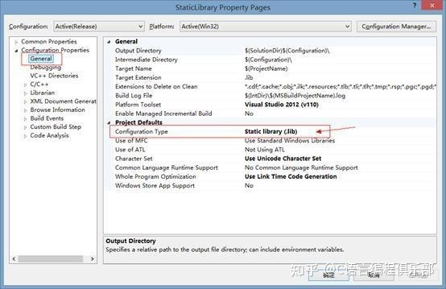

# ==c++程序的一般组织形式==

到现在为止,已经学习了很多完整的C++源程序实例,分析它们的结构,基本上都是由3部分来构成:**类的定义**、**类的成员的实现**和**主函数**。因为所举的例子都比较小,所有这3部分都写在同一个文件中。在规模较大的项目中,往往需要多个源程序文件,每个源程序文件称为一个**编译单元**。这时C++语法要求一个类的定义必须出现在所有使用该类的编译单元中。比较好的、也是惯用的做法是将类的定义写在头文件中,使用该类的编译单元则包含这个头文件。通常一个项目至少划分为3个文件:**类定义文件( * ,h文件)、类实现文件( * .cpp文件)和类的使用文件(* .cpp,主函数文件)**。对于更为复杂的程序,每一个类都有单独的定义和实现文件。采用这样的组织结构,可以对不同的文件进行单独编写、编译,最后再连接,同时可以充分利用类的封装特性,在程序的调试,修改时只对其中某一个类的定义和实现进行修改,而其余部分不用改动。现在将例5-5的程序按照这样的方法进行划分，写成如例5-10所示的形式。

==例5-10具有静态数据、函数成员的Point类,多文件组织。==

```c++
//point.h
class point {
public:
	point(int x = 0, int y = 0) :x(x), y(y) { count++; };
	point(const point& p);
	~point() { count--; };
	int getx()const { return x; }
	int gety()const { return y; }
	static void showcount();
private:
	int x, y;
	static int count;
}; 

```

```c++
//point.cpp
class point {
public:
	point(int x = 0, int y = 0) :x(x), y(y) { count++; };
	point(const point& p);
	~point() { count--; };
	int getx()const { return x; }
	int gety()const { return y; }
	static void showcount();
private:
	int x, y;
	static int count;
}; 
```

```c++
//test.cpp
#include<iostream>
using namespace std;
#include "point.h"
#include<string>
	
int main() {
	point a(4,5);
	cout << "point a:" << a.getx() << "," << a.gety() << endl;
	point b(a);
	point::showcount();


	return 0;
}

```

分析整个源程序的结构,由3个单独的源文件构成,它们的相互关系和编译、连接过程可以用图5-8表示(这里是 Windows操作系统的情形,UNIX操作系统中生成文件的后缀会有所不同)。


在多文件结构中,看到在两个`.cpp`文件中都增加了一个新的`include`语句。在使用输入输出操作时,需要使用`#include <iostream>`,将系统提供的标准头文件` iostream`包含到源程序中。这里,同样需要使用语句`#include " point.h"`将自定义的头文件包含进来。C+中的`#include`指令的作用是将指定的文件嵌入到当前源文件中`#include`指令所在位置,这个被嵌入的文件可以是`.h`文件,也同样可以是`.cpp`文件。

指令`include`可以有两种书写方式。`#include≤文件名>`表示按照标准方式搜索要嵌入的文件,该文件位于编译环境的include子目录下,一般要嵌入系统提供的标准文件时采用这样的方式,如对标准头文件`iostream `的包含。另一种书写为`#include `文件名""，表示首先在当前目录下搜索要嵌入的文件,如果没有,再按照标准方式搜索,对用户自己编写的文件一般采用这种方式,如本例中类的定义文件` point.h`。

`#include`属于编译预处理命令,稍后将对编译预处理命令做详细介绍。

从图5-8可以看到,两个.cpp 的文件被分别编译生成各自的目标文件.obj,然后再与系统的运行库共同连接生成可执行文件.exe。如果只修改了类的成员函数的实现部分,则只重新编译point.cpp并连接即可,其余的文件几乎可以连看都不用看。想一想,如果是一个语句很多、规模特大的程序,效率就会得到显著的提高。
这种多文件组织技术,在不同的环境下由不同的方式来完成。在 Windows 系列操作系统下的C++一般使用工程来进行多文件管理,在UNIX系列操作系统下一般可以用`make`工具完成。在开发程序时,还需要学习编程环境的使用。

> #### 决定一个声明放在源文件中还是头文件中的一般原则是,将需要分配空间的定义放在源文件中,例如函数的定义(需要为函数代码分配空间)、文件作用域中变量的定义(需要为变量分配空间)等;而将不需要分配空间的声明放在头文件中,例如类声明,外部函数的原型声明、外部变量的声明(外部函数和外部变量将在5.6.2小节中详细讨论)、基本数据类型常量的声明等。
>
> 


内联函数比较特殊,由于它的内容需要嵌入到每个调用它的函数之中,所以对于需要被多个编译单元调用的内联函数﹐它们的代码应该被各个编译单元可见,这些内联函数的定义应当出现在头文件中。

> ## 如果误将分配了空间的定义写入头文件中,在多个源文件包含该头文件时,会导致空间在不同的编译单元中被分配多次,从而在连接时引发错误。

# 外部变量和外部函数

## 外部变量

如果一个变量除了在定义它的源文件中可以使用外,还能被其他文件使用,那么就称这个变量是外部变量。

文件作用域中定义的变量,默认情况下都是外部变量,但在其他文件中如果需要使用这一变量,需要用`extern`关键字加以声明。请看下面的例子。


上述程序中,虽然`i`定义在**源文件1**中,但由于在**源文件2**中用`extern`关键字声明了，因此同样可以使用它。

外部变量是可以为多个源文件所共享的全局变量。

对外部变量的声明可以是定义性声明,即在声明的同时定义(分配内存,初始化),也可以是引用性声明(引用在别处定义的变量)。

在文件作用域中,不用extern关键字声明的变量,都是定义性声明;用extern关键字声明的变量,如果同时指定了初值,则是定义性声明，否则是引用性声明。例如上述源文件1中声明变量`i`的同时也是对`i`的定义,源文件2中对`i`的声明只是引用性声明。

外部变量可以有多处声明,但是对变量的定义性声明只能是唯一的。

## 外部函数

在所有类之外声明的函数(也就是非成员函数),都是具有文件作用域的,如果没有特殊说明,这样的函数都可以在不同的编译单元中被调用,只要在调用之前进行引用性声明(即声明函数原型)即可。当然,也可以在声明函数原型或定义函数时用extern修饰,其效果与不加修饰的默认状态是一样的。

> #### 通常情况下,变量和函数的定义都放在源文件中,而对外部变量和外部函数的引用性声明则放在头文件中。

### 将变量和函数限制在编译单元内

文件作用域中声明的变量和函数,在默认情况下都可以被其他的编译单元访问,但有时并不希望一个源文件中定义的文件作用域的变量和函数被其他源文件引用,这种需求主要是出于两个原因,一是出于安全性考虑,不希望将一个只会在文件内使用的内部变量或函数暴露给其他编译单元,就像不希望暴露一个类的私有成员一样;二是对于大工程来说,不同文件中的、只在文件内使用的变量名很容易重名,如果将它们都暴露出来,在连接时很容易发生名字冲突。

对这一问题﹐曾经的解决的办法是,在定义这些变量和函数时使用static关键字。static关键字用来修饰文件作用域的变量或函数时,和 extern关键字起相反的作用,它会使得被static修饰的变量和函数无法被其他编译单元引用。

目前已经介绍了static关键字的3种用法,当它用在局部作用域、类作用域和文件作用域时,具有不尽相同的作用。一个共同点是﹐凡是被static修饰的变量,都具有静态生存期(不管不使用static关键字时它们的生存期如何)。
**然而**,2003年发布的ISO C++ 2.0标准中,已经宣布不再鼓励使用这种方式,取而代之的方式是使用匿名的命名空间。在匿名命名空间中定义的变量和函数,都不会暴露给其他的编译单元。请看下面的例子。

```c++
namespace {
	int n;
	void f() {
		n++;
	}
```

# ==概述==

[C/C++语言编译链接过程 - 知乎 (zhihu.com)](https://zhuanlan.zhihu.com/p/88255667)

# ==编译预处理==

在编译器对源程序进行编译之前,首先要由预处理器对程序文本进行预处理。预处理器提供了一组编译预处理指令和预处理操作符。预处理指令实际上不是C+语言的一部分,它只是用来扩充C+程序设计的环境。所有的预处理指令在程序中都是以`#`来引导,每一条预处理指令单独占用一行,不要用分号结束。预处理指令可以根据需要出现在程序中的任何位置。

##  include指令

`#include`指令也称文件包含指令,其作用是将另一个源文件嵌入到当前源文件中该点处。通常我们用`#include `指令来嵌入头文件。文件包含指令有两种格式:

(1)`#include<文件名>`
按标准方式搜索,文件位于系统目录的include子目录下。

(2)`#include"文件名"`
首先在当前目录中搜索,若没有﹐再按标准方式搜索。

> #### #include 指令可以嵌套使用。假设有一个头文件myhead.h,该头文件中又可以有如下的文件包含指令:
>
> #include "file1.h"#include "file2.h"

## `# define`和`# undef `指令

预处理器最初是为C语言设计的,#define曾经在C程序中被广泛使用,但#define能完成的一些功能﹐能够被C++引入的一些语言特性很好地替代。
在C语言中,用`#define`来定义符号常量,例如下列预编译指令定义了一个符号常量PI的值为3.14:

```c++
#define PI 3.14
```

在C++语言中虽然仍可以这样定义符号常量,但是更好的方法是在类型说明语句中用const 进行修饰。

在C语言中,还可以用#define来定义带参数宏,以实现简单的函数计算,提高程序的运行效率,但是在C+中这一功能已被内联函数取代。因此我们在这里不作过多的介绍。

用井 define还可以定义空符号,例如:

```
define MYHEAD_H
```

定义它的目的,仅仅是表示“MYHEAD_H已经定义过”这样一种状态。将该符号配合条件编译指令一起使用,可以起到一些特殊作用,这是C++程序中`#define`的最常用之处。

`#undef `的作用是删由`#define`定义的宏﹐使之不再起作用。

## 条件编译指令

使用条件编译指令,可以限定程序中的某些内容要在满足一定条件的情况下才参与编译。因此,利用条件编译可以使同一个源程序在不同的编译条件下产生不同的目标代码。例如,可以在调试程序时增加一些调试语句,以达到跟踪的目的,并利用条件编译指令,限定当程序调试好后,重新编译时,使调试语句不参与编译。常用的条件编译语句有下列几种形式。


##  program once

在写小demo的时候，注意到vs中会自动生成#program once；看别人写的代码的时候见到比较多的反而是#ifndef---#define---#endif；从字面上看两种方式会产生相同的效果：避免同一个文件重复包含多次，但知道两种方式的本质还是有必要的。

　　`#program once`：“同一个文件”指存储在相同位置的文件，即物理位置下相同；当编译器意识到文件存储位置向同事便会跳过“副本文件”，仅仅编译一次该物理位置的文件；但如果发生拷贝情况，便会出现重复包含的情况。

　　`#ifndef`--`#define`---`#endif`：#ifndef和#define后面是宏定义，这里的宏定义的作用仅仅是为了判断文件是否是同一个文件，即宏名便是我们判断是否是同一个文件的标注，因此，可以按照自己的习惯或者喜好来命名，和头文件名字没有必然联系；但如果有多个头文件，出现同名的几率会大大增加，误判的几率也会提高很多；

　　#program once较#ifndef出现的晚，部分编译器并不支持这种写法，因此兼容性会较#ifndef差一些，但性能会好一些；

　　（目前，上文提到的文件，我认为应该仅仅只是头文件）

# ==编译==

## 编译后的文件

总体介绍：

c++程序在编译后,在目标路径下会生成多个文件：

Debug文件夹(`*.exe`,`*.ilk`,`*.obj`,`*.pch`,`*.pdb`,`*.idb`,`*,pdb`),`*.cpp`,`*.dsp`,`*.ncb`,`*.plg`

* *.exe:是生成的可执行文件
* .ilk:当选定渐增型编译连接时，连接器自动生成ILK文件，记录连接信息
* *.obj:是目标文件,源程序编译后的产物
* .pch:全称是PreCompiled Header，就是预先编译好的头文件
* *.idb:文件保存的信息,使编译器在重新编译的时候只重编译最新改动过的函数和只对最新类定义改动过的源文件进行重编译，以提高编译速度
* .pdb:全称是Program DataBase，即程序数据库文件，用来记录调试信息
* *.dsp:(全称是Developer Studio Project)也是一个配置文件
* .ncb:(全称No Compile Browser)的缩写，其中存放了供ClassView、WizardBar和Component Gallery使用的信息，由VC开发环境自动生成
* *.plg:实际上是一个超文本文件，可以用Internet Explorer打开，记录了Build的过程*
* .cpp:就是C++源代码文件.

具体介绍：

lib是和dll对应的。  
 lib是静态的库文件，dll是动态的库文件。  
 所谓静态就是link的时候把里面需要的东西抽取出来安排到你的exe文件中，以后运行  
 你的exe的时候不再需要lib。  
 所谓动态就是exe运行的时候依赖于dll里面提供的功能，没有这个dll，你的exe无法运  
 行。  

 lib,  dll,  exe都算是最终的目标文件，是最终产物。而c/c++属于源代码。源代码和最终  
 目标文件中过渡的就是中间代码obj，实际上之所以需要中间代码，是你不可能一次得到目  
 标文件。比如说一个exe需要很多的cpp文件生成。而编译器一次只能编译一个cpp文件。这  
 样编译器编译好一个cpp以后会将其编译成obj，当所有必须要的cpp都编译成obj以后，再统  
 一link成所需要的exe，应该说缺少任意一个obj都会导致exe的链接失败。

1.obj里存的是编译后的代码跟数据，并且有名称，所以在连接时会出现未解决的外部符号一说。当连成exe后便不存在名称的概念了，只有地址。lib就是一堆obj的组合。  
 2.理论上可以，但实际中通常用lib。  
 3.编译器会默认链接一些常用的库，其它的需要你自己指定。

附上lib和DLL的区别

(1)lib是编译时需要的，dll是运行时需要的。 
如果要完成源代码的编译，有lib就够了。 
如果也使动态连接的程序运行起来，有dll就够了。 
在开发和调试阶段，当然最好都有。 
(2)一般的动态库程序有lib文件和dll文件。lib文件是必须在编译期就连接到应用程序中的，而dll文件是运行期才会被调用的。如果有dll文件，那么对应的lib文件一般是一些索引信息，具体的实现在dll文件中。如果只有lib文件，那么这个lib文件是静态编译出来的，索引和实现都在其中。静态编译的lib文件有好处：给用户安装时就不需要再挂动态库了。但也有缺点，就是导致应用程序比较大，而且失去了动态库的灵活性，在版本升级时，同时要发布新的应用程序才行。 
(3)在动态库的情况下，有两个文件，一个是引入库（.LIB）文件，一个是DLL文件，引入库文件包含被DLL导出的函数的名称和位置，DLL包含实际的函数和数据，应用程序使用LIB文件链接到所需要使用的DLL文件，库中的函数和数据并不复制到可执行文件中，因此在应用程序的可执行文件中，存放的不是被调用的函数代码，而是DLL中所要调用的函数的内存地址，这样当一个或多个应用程序运行是再把程序代码和被调用的函数代码链接起来，从而节省了内存资源。从上面的说明可以看出，DLL和.LIB文件必须随应用程序一起发行，否则应用程序将会产生错误。

http://blog.csdn.net/kunkun628/article/details/8621592

# ==链接过程==

[C/C++语言编译链接过程 - 知乎 (zhihu.com)](https://zhuanlan.zhihu.com/p/88255667)


# ==c++静态库和动态库==

作者：C语言编程俱乐部
链接：https://zhuanlan.zhihu.com/p/351856003
来源：知乎
著作权归作者所有。商业转载请联系作者获得授权，非商业转载请注明出处。

## 什么是库

库是写好的现有的，成熟的，可以复用的代码。现实中每个程序都要依赖很多基础的底层库，不可能每个人的代码都从零开始，因此库的存在意义非同寻常。

本质上来说库是一种可执行代码的二进制形式，可以被操作系统载入内存执行。库有两种：**静态库（.a、.lib）**和**动态库（.so、.dll）**。

所谓静态、动态是指链接。回顾一下，将一个程序编译成可执行程序的步骤：


## 静态库

之所以成为【静态库】，是因为在链接阶段，会将汇编生成的目标文件.o与引用到的库一起链接打包到[可执行文件](https://www.zhihu.com/search?q=可执行文件&search_source=Entity&hybrid_search_source=Entity&hybrid_search_extra={"sourceType"%3A"article"%2C"sourceId"%3A"351856003"})中。因此对应的链接方式称为[静态链接](https://www.zhihu.com/search?q=静态链接&search_source=Entity&hybrid_search_source=Entity&hybrid_search_extra={"sourceType"%3A"article"%2C"sourceId"%3A"351856003"})。

**静态链接库**（.lib），就是一堆 .obj 文件的组合（简单组合），最后里面所有的 .obj 都“链接”到一个 exe 文件中，这样 exe 会比较大，但是因为依赖关系简单（一个 exe 文件就能运行了），可移植性会更好，同时因为在一个文件中，所以执行也会更快。

> 试想一下，静态库与汇编生成的目标文件一起链接为可执行文件，那么静态库必定跟.o文件格式相似。

其实一个静态库可以简单看成是一组[目标文件](https://www.zhihu.com/search?q=目标文件&search_source=Entity&hybrid_search_source=Entity&hybrid_search_extra={"sourceType"%3A"article"%2C"sourceId"%3A"351856003"})（.o/.obj文件）的集合，即很多目标文件经过压缩打包后形成的一个文件。静态库特点总结：

​    ✪ 静态库对函数库的链接是放在编译时期完成的。

​    ✪ 程序在运行时与函数库再无瓜葛，移植方便。

​    ✪ 浪费空间和资源，因为所有相关的目标文件与牵涉到的函数库被链接合成一个可执行文件。

### Linux下创建与使用静态库

**Linux静态库命名规则**

> Linux静态库命名规范，必须是”lib[your_library_name].a”：lib为前缀，中间是静态库名，扩展名为.a。

#### 创建静态库（.a）

通过上面的流程可以知道，Linux创建静态库过程如下：

首先，将代码文件编译成目标文件·`o（StaticMath.o）`

```c++
g++ -c StaticMath.cpp
```

注意带参数-c，否则直接编译为可执行文件

然后，通过ar工具将目标文件打包成.a静态库文件

```c
ar -crv libstaticmath.a StaticMath.o
```

**2、生成静态库 \*libstaticmath.a\*。**


大一点的项目会编写makefile文件（CMake等等工程管理工具）来生成静态库，输入多个命令太麻烦了。


#### **使用静态库**

编写使用上面创建的静态库的测试代码：

```c
#include "StaticMath.h"
#include <iostream>
using namespace std;
int main(int argc, char* argv[])
{
    double a = 10;
    double b = 2;
    cout << "a + b = " << StaticMath::add(a, b) << endl;
    cout << "a - b = " << StaticMath::sub(a, b) << endl;
    cout << "a * b = " << StaticMath::mul(a, b) << endl;
    cout << "a / b = " << StaticMath::div(a, b) << endl;
    StaticMath sm;
    sm.print();
    system("pause");
    return 0;
}
```

————————

Linux下使用静态库，只需要在编译的时候，指定静态库的搜索路径（-L选项）、指定静态库名（不需要lib前缀和.a后缀，-l选项）。

> \# g++ TestStaticLibrary.cpp -L../[StaticLibrary -lstaticmath](https://www.zhihu.com/search?q=StaticLibrary+-lstaticmath&search_source=Entity&hybrid_search_source=Entity&hybrid_search_extra={"sourceType"%3A"article"%2C"sourceId"%3A"351856003"})


​    ✪ -L：表示要连接的库所在目录

​    ✪ -l：指定链接时需要的动态库，编译器查找[动态连接库](https://www.zhihu.com/search?q=动态连接库&search_source=Entity&hybrid_search_source=Entity&hybrid_search_extra={"sourceType"%3A"article"%2C"sourceId"%3A"351856003"})时有隐含的命名规则，即在给出的名字前面加上lib，后面加上.a或.so来确定库的名称。


### Windows下创建与使用静态库

#### **创建静态库（.lib**）

如果是使用VS命令行生成静态库，也是分两个步骤来生成程序：

​    ✪ 首先，通过使用带编译器选项 /c 的 Cl.exe 编译代码 (cl /c StaticMath.cpp)，创建名为“StaticMath.obj”的目标文件。

​    ✪ 然后，使用库管理器 Lib.exe 链接代码 (lib StaticMath.obj)，创建静态库StaticMath.lib。

当然，我们一般不这么用，使用VS工程设置更方便。创建win32控制台程序时，**勾选静态库类型**；打开工程“属性面板”→”配置属性”→”常规”，配置类型选择静态库。



Build项目即可生成静态库。


**2、使用静态库**

测试代码Linux下面的一样。有3种使用方法：

**▶ 方法一：**

在VS中使用静态库方法：

**①** 工程“属性面板”→“通用属性”→“框架和引用”→”添加引用”，将显示“添加引用”对话框。 

“项目”选项卡列出了当前解决方案中的各个项目以及可以引用的所有库。

 在“项目”选项卡中，选择 StaticLibrary。 

单击“确定”。


**②** 添加StaticMath.h 头文件目录，必须修改包含目录路径。

打开工程“属性面板”→”配置属性”→“C/C++”→” 常规”，在“附加包含目录”属性值中，键入StaticMath.h [头文件](https://www.zhihu.com/search?q=头文件&search_source=Entity&hybrid_search_source=Entity&hybrid_search_extra={"sourceType"%3A"article"%2C"sourceId"%3A"351856003"})所在目录的路径或浏览至该目录。


编译运行OK。


如果引用的静态库不是在同一解决方案下的子工程，而是使用第三方提供的静态库lib和头文件，上面的方法设置不了。还有2中方法设置都可行。


**▶ 方法二：**

打开工程“属性面板”→”配置属性”→ “链接器”→ ”命令行”，输入静态库的完整路径即可。


**▶ 方法三：**

**①** “[属性面板](https://www.zhihu.com/search?q=属性面板&search_source=Entity&hybrid_search_source=Entity&hybrid_search_extra={"sourceType"%3A"article"%2C"sourceId"%3A"351856003"})”→”配置属性”→“链接器”→”常规”，附加依赖库目录中输入，静态库所在目录；

**②** “属性面板”→”配置属性”→“链接器”→”输入”，附加依赖库中输入静态库名StaticLibrary.lib。


最后，不管你是转行也好，初学也罢，进阶也可，如果你想学编程~

# 汇编

[从C语言到汇编 - 知乎 (zhihu.com)](https://www.zhihu.com/column/c_1019949122807296000)

## 汇编指令


## 变量


本文在32位Ubuntu操作系统上运行，并使用gcc编译器编译。编译命令为gcc -S xxx.c 命令结束后会在当前文件夹下生成一个xxx.s文件。这就是汇编文件。可以查看其中汇编代码。

**正式开始了**

c语言中可以定义各种类型的变量。可以对变量做任何算数操作，位操作。变量就是一块内存区域，机器指令可以操作该内存区域。加减乘除取余指令与或非异或左移右移指令。

**定义变量**

c语言可以定义基本数据类型，数组，异构体变量。在这里我们只讲基本数据类型，数组和异构体会在后文中体现。

基本数据类型变量有字符型`char` `unsigned char`一字节，短整形`short` `unsigend short`二字节，整形`int` `unsigned int` 4字节，长整形`long` `unsigned long`4字节。

**定义**

```text
int fun()
{
    char ch;
    unsigned char uch;
    short s;
    unsigned short us;
    int i; 
    unsigned int ui;
    long l;
    unsigned long ul;
}
```

汇编代码

```text
        pushl   %ebp
        movl    %esp, %ebp
        subl    $32, %esp
        leave
        ret
```

pushl %ebp；movl %esp, %ebp；leave；ret。


指令是用于构建函数使用的指令。我们可以暂时不看，以后会讲解。

subl $32, %esp向栈中申请了32字节。可以看出用户只申请了22个字节。但是C语言规定申请的用户空间为16字节的倍数，这是为了提高程序的运行效率。所以申请了32字节。32个字节中，-4(%ebp)为ul的内存地址，-8(%ebp)为l的地址，-12(%ebp)为ui的内存地址，-16(%ebp)为i的内存地址。-18(%ebp)为us的内存地址，-20(%ebp)为s的内存地址。-21(%ebp)为uch的内存地址，-22(%ebp)为ch的内存地址

**赋值**

```text
int fun()
{
    char ch;
    unsigned char uch;
    short s;
    unsigned short us;
    int i;
    unsigned int ui;
    long l;
    unsigned long ul;

    ch=1;
    uch=2;
    s=3;
    us=4;
    i=5;
    ui=6;
    l=7;
    ul=8;
}
```

汇编代码

```text
        pushl   %ebp
        movl    %esp, %ebp
        subl    $32, %esp
        //ch=1
        movb    $1, -22(%ebp)
        //uch=2
        movb    $2, -21(%ebp)
        //s=3
        movw    $3, -20(%ebp)
        //us=4
        movw    $4, -18(%ebp)
        //i=5
        movl    $5, -16(%ebp)
        //ui=6
        movl    $6, -12(%ebp)
        //l=7
        movl    $7, -8(%ebp)
        //ul=8
        movl    $8, -4(%ebp)
        nop
        leave
        ret
```

其中使用指令movb，movw，movl。

movb S,D S->D 传送字节

movw S,D S->D 传送字

movl S,D S->D 传送双字

S可以是立即数，寄存器，内存地址。D可以是寄存器，内存地址。S与D不能同时为内存地址。也就是说一个内存地址（变量）赋值给另一个内存地址（变量）需要2步操作。从内存赋值到寄存器，将寄存器赋值给内存。

**数据扩展**

```text
int fun()
{
    char ch;
    unsigned char uch;
    short s;
    unsigned short us;
    int i;
    unsigned int ui;
    long l;
    unsigned long ul;
    
    i=ch;
    i=uch;
}
```

汇编代码

```text
        pushl   %ebp
        movl    %esp, %ebp
        subl    $32, %esp
        movsbl  -22(%ebp), %eax
        movl    %eax, -16(%ebp)
        movzbl  -21(%ebp), %eax
        movl    %eax, -16(%ebp) 
        nop
        leave
        ret
```


```text
int fun()
{
    char ch;
    unsigned char uch;
    short s;
    unsigned short us;
    int i;
    unsigned int ui;
    long l;
    unsigned long ul;
    
    i=s;
    i=us;
}
```

汇编代码

```text
        pushl   %ebp
        movl    %esp, %ebp
        subl    $32, %esp
        movswl  -20(%ebp), %eax
        movl    %eax, -16(%ebp)
        movzwl  -18(%ebp), %eax
        movl    %eax, -16(%ebp) 
        nop
        leave
        ret
```


其中movsbl指令做了符号扩展的字节传送到双字。movsbl S->D S可以是寄存器，内存地址。D可以是寄存器，内存地址。不能同时为内存地址。movswl指令做了符号扩展的字传送到双字。指令用法同movsbl。

movzbl 指令做了零扩展的字节传送到双字。

movzwl 指令做了零扩展的字传送到双字。

指令用法同于movsbl。

从上面代码我们可以看到汇编代码按照C语言的语法规则老老实实的进行了转化。

语法规则为

```text
如果其中一个操作数的类型为long double，另一个操作数就会装换为long double类型。
否则，如果其中一个操作数的类型位double，另一个操作数就会转换为double类型。
否则，如果其中一个操作数的类型为float，另一个操作数就会装换为float类型。
否则，在两个操作数上所执行的是整型提升，其规则如下：
如果其中一个操作数的类型位unsigned long，另一个操作数就会转换为unsigned long类型。
否则，如果其中一个操作数的类型为long，并且另一个操作数的类型为unsigned，有两种可能性：
1.如果long可以表示unsignd类型的所有值，那么这个unsigned类型的操作数被转换为long类型。
2.如果long无法表示unsigned类型的所有值，那么这两个操作数都被转换为unsigned long类型。
否则，如果其中一个操作数的类型是long，另一个操作数就会转换为long类型。
否则，如果其中一个操作数是unsigned ，另一个操作数就会转换为unsigned类型。
否则，两个操作数都转换位int类型。
符号变量整形提升时做符号转换过，无符号变量整形提升时做无符号装换
```

**数据截断**

```text
int fun()
{
    char ch;
    unsigned char uch;
    short s;
    unsigned short us;
    int i;
    unsigned int ui;
    long l;
    unsigned long ul;

    ch=i;
    uch=i;
}
```

汇编代码

```text
        pushl   %ebp
        movl    %esp, %ebp
        subl    $32, %esp
        movl    -16(%ebp), %eax
        movb    %al, -22(%ebp)
        movl    -16(%ebp), %eax
        movb    %al, -21(%ebp)
        nop
        leave
        ret
```


```text
int fun()
{
    char ch;
    unsigned char uch;
    short s;
    unsigned short us;
    int i;
    unsigned int ui;
    long l;
    unsigned long ul;

    s=i;
    us=i;
}
```


```text
        pushl   %ebp
        movl    %esp, %ebp
        subl    $32, %esp        
        movl    -16(%ebp), %eax
        movw    %ax, -20(%ebp)
        movl    -16(%ebp), %eax
        movw    %ax, -18(%ebp)
        nop
        leave
        ret
```


编辑于 2019-04-11 17:48

# 文件树


# svn目录结构

[SVN的标准目录结构：trunk、branches、tags - 简书 (jianshu.com)](https://www.jianshu.com/p/909b6aaa1f9a)

[(41条消息) SVN trunk(主线) branch(分支) tag(标记) 用法详解和详细操作步骤_MYBOYER的博客-CSDN博客](https://blog.csdn.net/MYBOYER/article/details/106348789)

我们在一些著名开源项目的版本库中，通常可以看到trunk, branches, tags等三个目录。由于SVN固有的特点，目录在SVN中并没有特别的意义，但是这三个目录却在大多数开源项目中存在，这是因为这三个目录反映了软件开发的通常模式。

> `tag`是标记标签的意思

==`trunk`是主分支，是日常开发进行的地方。==

==`branches`是分支。一些阶段性的release版本，这些版本是可以继续进行开发和维护的，则放在branches目录中。又比如为不同用户客制化的版本，也可以放在分支中进行开发。==

==`tags`目录一般是只读的，这里存储阶段性的发布版本，只是作为一个里程碑的版本进行存档==。

比如一个项目有`main.cpp`, `common.h`两个文件，假设目前在开发的是最新的`3.0`版本，而且`1.0`/`2.0`版本也在进行维护，那么项目树将类似如下样子：

project

|

==+-- trunk==

\+   |

\+   +----- `main.cpp` (3.0版本的最新文件）

\+   +----- `common.h`

+

==+-- branches==

\+   |

\+   +-- ==r1.0==

\+   +   |

\+   +   +---- `main.cpp`（1.x版本的最新文件）

\+   +   +---- `common.h`

\+   +

\+   +-- ==r2.0==

\+      |

\+      +---- `main.cpp`（2.x版本的最新文件）

\+      +---- `common.h`

+

==+-- tags  (此目录只读)==

|

+-- ==r1.0==

\+   |

\+   +---- `main.cpp`（1.0版本的发布文件）

\+   +---- `common.h`

+

+-- ==r1.1==

\+   |

\+   +---- main.cpp（1.1版本的发布文件）

\+   +---- common.h

+

+-- ==r1.2==

\+   |

\+   +---- main.cpp（1.2版本的发布文件）

\+   +---- common.h

+

+-- ==r1.3==

\+   |

\+   +---- main.cpp（1.3版本的发布文件）

\+   +---- common.h

+

+-- ==r2.0==

\+   |

\+   +---- main.cpp（2.0版本的发布文件）

\+   +---- common.h

+

+-- ==r2.1==

|

+---- main.cpp（2.1版本的发布文件）

+---- common.h

要使用这样的文件夹结构，在建立项目版本库时，可首先建好项目文件夹，并在其中建立trunk, branches, tags三个空的子目录，再将项目文件夹连同这三个子目录一起导入版本库。

这样在trunk中开始进行开发，当需要建立branch或tag时，使用SVN的copy操作进行。

其中tags目录需要只读，可以使用SVN中的authz文件控制该目录的访问权限为只读。

本节主要讲解一下SVN中tag branch trunk的用法，在SVN中Branch/tag在一个功能选项中，在使用中也往往产生混淆。这里就向大家简单介绍一下，欢迎大家能和我一起学习SVN中tag branch trunk的用法。

在实现上，branch和tag，对于svn都是使用copy实现的，所以他们在默认的权限上和一般的目录没有区别。至于何时用tag，何时用branch，完全由人主观的根据规范和需要来选择，而不是强制的（比如cvs）。一般情况下，tag，是用来做一个milestone的，不管是不是release，都是一个可用的版本。这里，应该是只读的。更多的是一个显示用的，给人一个可读（readable）的标记。branch，是用来做并行开发的，这里的并行是指和trunk进行比较。比如，3.0开发完成，这个时候要做一个tag，tag_release_3_0，然后基于这个tag做release，比如安装程序等。trunk进入3.1的开发，但是3.0发现了bug，那么就需要基于tag_release_3_0做一个branch，branch_bugfix_3_0，基于这个branch进行bugfix，等到bugfix结束，做一个tag，tag_release_3_0_1，然后，根据需要决定branch_bugfix_3_0是否并入trunk。对于svn还要注意的一点，就是它是全局版本号，其实这个就是一个tag的标记，所以我们经常可以看到，什么什么release，基于xxx项目的2xxxx版本。就是这个意思了。但是，它还明确的给出一个tag的概念，就是因为这个更加的可读，毕竟记住tag_release_1_0要比记住一个很大的版本号容易的多。

branches：分枝

SVN中tag branch trunk的用法，首先看一下branches的介绍。当多个人合作，可能有这样的情况出现：John突然有个想法，跟原先的设计不太一致，可能是功能的添加或者日志格式的改进等等，总而言之，这个想法可能需要花一段时间来完成，而这个过程中，John的一些操作可能会影响Sally的工作，John从现有的状态单独出一个project的话，又不能及时得到Sally对已有代码做的修正，而且独立出来的话，John的尝试成功时，跟原来的合并也存在困难。这时最好的实践方法是使用branches。John建立一个自己的branch，然后在里面实验，必要的时候从Sally的trunk里取得更新，或者将自己的阶段成果汇集到trunk中。

（svncopySourceURL/trunkDestinationURL/branchName-m"Creatingaprivatebranchofxxxx/trunk."）

trunk：主干

主干，一般来说就是开发的主要呆的地方，

tag:图标

在经过了一段时间的开发后，项目到达了一个里程碑阶段，你可能想记录这一阶段的代码的状态，那么你就需要给代码打上标签。

(svncpfile:///svnroot/mojavescripts/trunkfile:///svnroot/mojavescripts/tags/mirrorutils_rel_0_0_1-m"tagedmirrorutils_rel_0_0_1")另有一说，无所谓谁对谁错。

trunk：表示开发时版本存放的目录，即在开发阶段的代码都提交到该目录上。

branches：表示发布的版本存放的目录，即项目上线时发布的稳定版本存放在该目录中。

tags：表示标签存放的目录。

在这需要说明下分三个目录的原因，如果项目分为一期、二期、三期等，那么一期上线时的稳定版本就应该在一期完成时将代码copy到branches上，这样二期开发的代码就对一期的代码没有影响，如新增的模块就不会部署到生产环境上。而branches上的稳定的版本就是发布到生产环境上的代码，如果用户使用的过程中发现有bug，则只要在branches上修改该bug，修改完bug后再编译branches上最新的代码发布到生产环境即可。tags的作用是将在branches上修改的bug的代码合并到trunk上时创建个版本标识，以后branches上修改的bug代码再合并到trunk上时就从tags的version到branches最新的version合并到trunk，以保证前期修改的bug代码不会再合并。

\-------------------------------------------------------------------------------------------

介绍SVN中tag branch trunk用法时，一直以来用svn只是当作cvs，也从来没有仔细看过文档，直到今天用到，才去翻看svnbook文档，惭愧

需求一：

有一个客户想对产品做定制，但是我们并不想修改原有的svn中trunk的代码。

方法：

用svn建立一个新的branches，从这个branche做为一个新的起点来开发

svncopysvn://server/trunksvn://server/branches/ep-m"initep"

Tip:

如果你的svn中以前没有branches这个的目录，只有trunk这个，你可以用

svnmkdirbranches新建个目录

需求二：

产品开发已经基本完成，并且通过很严格的测试，这时候我们就想发布给客户使用，发布我们的1.0版本

svncopysvn://server/trunksvn://server/tags/release-1.0-m"1.0released"咦，这个和branches有什么区别，好像啥区别也没有？

是的，branches和tags是一样的，都是目录，只是我们不会对这个release-1.0的tag做修改了，不再提交了，如果提交那么就是branches

需求三：

有一天，突然在trunk下的core中发现一个致命的bug,那么所有的branches一定也一样了，该怎么办？

svn-r148:149mergesvn://server/trunkbranches/ep其中148和149是两次修改的版本号。SVN中tag branch trunk用法介绍完毕。

本文主要讲解一下SVN组成trunk,branches and tags，主要包括其概念的讲解、用法的比较，相信看完本文你肯定有不少收获，希望本文能教会你更多东西。

在本篇文章中,我将会详细说明我是如何应用SVNtrunk(树干)、branches(分支)和tags(标记)。这种方法同样被称为“branchalways”，两者非常接近。可能我所介绍的并不是最好的方法，但是它会给新手一些解释说明，告诉他们trunk、branches和tags是什么，并且该如何去应用它们。

当然，如果本文有些要点需要澄清/确认，亦或者有一些错误的观点，还请你评论，自由发表自己的观点。

——简单的对比

SVN的工作机制在某种程度上就像一颗正在生长的树：

一颗有树干和许多分支的树

分支从树干生长出来，并且细的分支从相对较粗的树干中长出

一棵树可以只有树干没有分支（但是这种情况不会持续很久，随着树的成长，肯定会有分支啦，^^）

一颗没有树干但是有很多分支的树看起来更像是地板上的一捆树枝

如果树干患病了，最终分支也会受到影响，然后整棵树就会死亡

如果分支患病了，你可以剪掉它，然后其他分支还会生长出来的哦！

如果分支生长太快了，对于树干它可能会非常沉重，最后整棵树会垮塌掉

当你感觉你的树、树干或者是分支看起来很漂亮的时候，你可以给它照张相，这样就就可以记得它在那时是多么的赞。

——Trunka

SVN组成Trunka，Trunk是放置稳定代码的主要环境，就好像一个汽车工厂，负责将成品的汽车零件组装在一起。

以下内容将告诉你如何使用SVNtrunk：

除非你必须处理一些容易且能迅速解决的BUG，或者你必须添加一些无关逻辑的文件（比如媒体文件：图像，视频，CSS等等），否则永远不要在trunk直接做开发

不要因为特殊的需求而去对先前的版本做太大的改变，如何相关的情况都意味着需要建立一个branch（如下所述）

不要提交一些可能破坏trunk的内容，例如从branch合并

如果你在某些时候偶然间破坏了trunk，bringsomecakethenextday(”withgreatresponsibilitiescome…hugecakes”)

——Branches

SVN组成branches，一个branch就是从一个SVN仓库中的子树所作的一份普通拷贝。通常情况它的工作类似与UNIX系统上的符号链接，但是你一旦在一个SVNbranch里修改了一些文件，并且这些被修改的文件从拷贝过来的源文件独立发展，就不能这么认为了。当一个branch完成了，并且认为它足够稳定的时候，它必须合并回它原来的拷贝的地方，也就是说：如果原来是从trunk中拷贝的，就应该回到trunk去，或者合并回它原来拷贝的父级branch。

以下内容将告诉你如何使用SVNbranches：

如果你需要修改你的应用程序，或者为它开发一个新的特性，请从trunk中创建一个新的branch，然后基于这个新的分支进行开发

除非是因为必须从一个branch中创建一个新的子branch，否则新的branch必须从trunk创建

当你创建了一个新branch，你应当立即切换过去。如果你没有这么做，那你为什么要在最初的地方创建这个分支呢？

——Tags

SVN组成Tags。从表面上看，SVNbranches和SVNtags没有什么差别，但是从概念上来说，它们有许多差别。其实一个SVNtags就是上文所述的“为这棵树照张相”：一个trunk或者一个branch修订版的命名快照。

以下内容将告诉你如何使用SVNtags：

作为一个开发者，永远不要切换至、取出，或者向一个SVNtag提交任何内容：一个tag好比某种“照片”，并不是实实在在的东西，tags只可读，不可写。

在特殊或者需要特别注意的环境中，如：生产环境（production）、？（staging）、测试环境（testing）等等，只能从一个修复过的（fixed）tag中checkout和update，永远不要commit至一个tag。

对于上述提及到的环境，可以创建如下的tags：“production”，“staging”，“testing”等等。你也可以根据软件版本、项目的成熟程度来命名tag：“1.0.3”，“stable”，“latest”等等。

当trunk已经稳定，并且可以对外发布，也要相应地重新创建tags，然后再更新相关的环境（production,staging,etc）

——工作流样例

假设你必须添加了一个特性至一个项目，且这个项目是受版本控制的，你差不多需要完成如下几个步骤：

使用SVNcheckout或者SVNswitch从这个项目的trunk获得一个新的工作拷贝（branch）

使用SVN切换至新的branch

完成新特性的开发（当然，要做足够的测试，包括在开始编码前）

一旦这个特性完成并且稳定（已提交），并经过你的同事们确认，切换至trunk

合并你的分支至你的工作拷贝（trunk），并且解决一系列的冲突

重新检查合并后的代码

如果可能的话，麻烦你的同事对你所编写、更改的代码进行一次复查（review）

提交合并后的工作拷贝至trunk

如果某些部署需要特殊的环境（生成环境等等），请更新相关的tag至你刚刚提交到trunk的修订版本,使用SVNupdate部署至相关环境


0人点赞


[日记本]()


作者：lgvae
链接：https://www.jianshu.com/p/909b6aaa1f9a
来源：简书
著作权归作者所有。商业转载请联系作者获得授权，非商业转载请注明出处。

# 其他

## `extern "C"`

**extern "C"的主要作用就是为了能够正确实现C++代码调用其他C语言代码。加上extern "C"后，会指示编译器这部分代码按C语言（而不是C++）的方式进行编译。由于C++支持函数重载，因此编译器编译函数的过程中会将函数的参数类型也加到编译后的代码中，而不仅仅是函数名；而C语言并不支持函数重载，因此编译C语言代码的函数时不会带上函数的参数类型，一般只包括函数名。**

   这个功能十分有用处，因为在C++出现以前，很多代码都是C语言写的，而且很底层的库也是C语言写的，**为了更好的支持原来的C代码和已经写好的C语言库，需要在C++中尽可能的支持C，而extern "C"就是其中的一个策略。**

**这个功能主要用在下面的情况：**

1. **C++代码调用C语言代码**
2. **在C++的头文件中使用**
3. **在多个人协同开发时，可能有的人比较擅长C语言，而有的人擅长C++，这样的情况下也会有用到**

看一个简单的例子：

有`moduleA`、`moduleB`两个模块，B调用A中的代码，其中A是用C语言实现的，而B是利用C++实现的，下面给出一种实现方法：

```c++
//moduleA头文件
#ifndef __MODULE_A_H //对于模块A来说，这个宏是为了防止头文件的重复引用
#define __MODULE_A_H
int fun(int, int);
#endif
 
//moduleA实现文件moduleA.C //模块A的实现部分并没有改变
#include"moduleA"
int fun(int a, int b)
{
return a+b;
}
 
//moduleB头文件
#idndef __MODULE_B_H //很明显这一部分也是为了防止重复引用
#define __MODULE_B_H
#ifdef __cplusplus //而这一部分就是告诉编译器，如果定义了__cplusplus(即如果是cpp文件，
extern "C"{ //因为cpp文件默认定义了该宏),则采用C语言方式进行编译
#include"moduleA.h"
#endif
… //其他代码
 
#ifdef __cplusplus
}
#endif
#endif
 
//moduleB实现文件 moduleB.cpp //B模块的实现也没有改变，只是头文件的设计变化了
#include"moduleB.h"
int main()
{
　　cout<<fun(2,3)<<endl;
}
```

充介绍：

由于C、C++编译器对函数的编译处理是不完全相同的，尤其对于C++来说，支持函数的重载，编译后的函数一般是以函数名和形参类型来命名的。

例如函数`void fun(int, int)`，编译后的可能是`_fun_int_int`(不同编译器可能不同，但都采用了类似的机制，用函数名和参数类型来命名编译后的函数名)；而C语言没有类似的重载机制，一般是利用函数名来指明编译后的函数名的，对应上面的函数可能会是`_fun`这样的名字。

看下面的一个面试题：为什么标准头文件都有类似的结构？

```c++
#ifndef __INCvxWorksh /*防止该头文件被重复引用*/
#define __INCvxWorksh
#ifdef __cplusplus             //告诉编译器，这部分代码按C语言的格式进行编译，而不是C++的
extern "C"{
#endif

/*…*/

#ifdef __cplusplus
}

#endif
#endif /*end of __INCvxWorksh*/
```

**xtern "C"包含双重含义**，从字面上可以知道，首先，被它修饰的目标是"extern"的；其次，被它修饰的目标代码是"C"的。

- 被extern "C"限定的函数或变量是extern类型的

extern是C/C++语言中表明函数和全局变量的作用范围的关键字，该关键字告诉编译器，其申明的函数和变量可以在本模块或其他模块中使用。

> #### 记住，语句：extern int a; 仅仅是一个变量的声明，其并不是在定义变量a，也并未为a分配空间。变量a在所有模块中作为一种全局变量只能被定义一次，否则会出错。

通常来说**，==在模块的头文件中==对本模块提供给其他模块引用的函数和全局变量以关键字extern生命。**例如，如果模块B要引用模块A中定义的全局变量和函数时只需包含模块A的头文件即可。这样模块B中调用模块A中的函数时，在编译阶段，模块B虽然找不到该函数，但并不会报错；它会在链接阶段从模块A编译生成的目标代码中找到该函数。

**extern对应的关键字是static，static表明变量或者函数只能在本模块中使用，因此，被static修饰的变量或者函数不可能被extern C修饰。**

- **被extern "C"修饰的变量和函数是按照C语言方式进行编译和链接的：这点很重要！！！！**

上面也提到过，由于C++支持函数重载，而C语言不支持，因此函数被C++编译后在**符号库**中的名字是与C语言不同的；C++编译后的函数需要加上参数的类型才能唯一标定重载后的函数，而加上extern "C"后，是为了向编译器指明这段代码按照C语言的方式进行编译

未加extern "C"声明时的链接方式：

```
//模块A头文件 moduleA.h
#idndef _MODULE_A_H
#define _MODULE_A_H
 
int foo(int x, int y);
#endif　
```

在模块B中调用该函数

```
//模块B实现文件 moduleB.cpp
#include"moduleA.h"
foo(2,3);　
```

实际上，在链接阶段，链接器会从模块A生成的目标文件`moduleA.obj`中找`_foo_int_int`这样的符号，显然这是不可能找到的，因为`foo()`函数被编译成了`_foo`的符号，因此会出现链接错误。

**extern "C"的使用要点总结**

1，可以是如下的单一语句：

```
extern "C" double sqrt(double);
```

2，可以是复合语句, 相当于复合语句中的声明都加了extern "C"

```
extern "C"
{
      double sqrt(double);
      int min(int, int);
}
```

3，可以包含头文件，相当于头文件中的声明都加了extern "C"

```
extern "C"
{
    ＃include <cmath>
}　
```

- 不可以将extern "C" 添加在函数内部
- 如果函数有多个声明，可以都加extern "C", 也可以只出现在第一次声明中，后面的声明会接受第一个链接指示符的规则。
- 除extern "C", 还有extern "FORTRAN" 等。