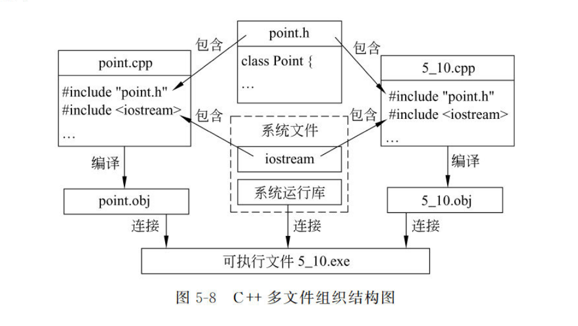
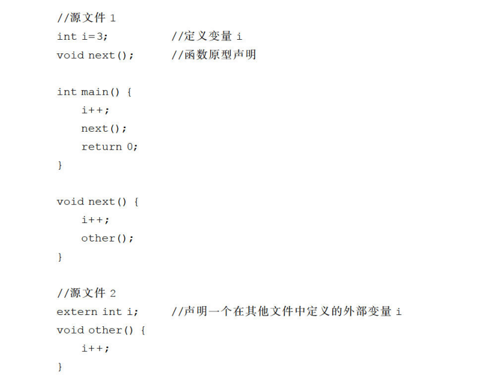
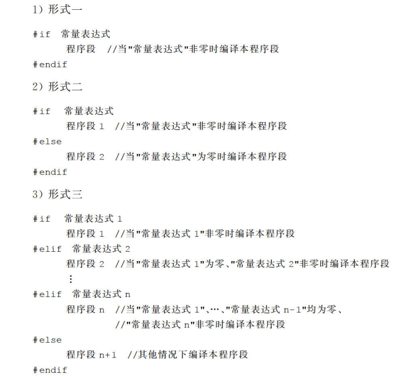
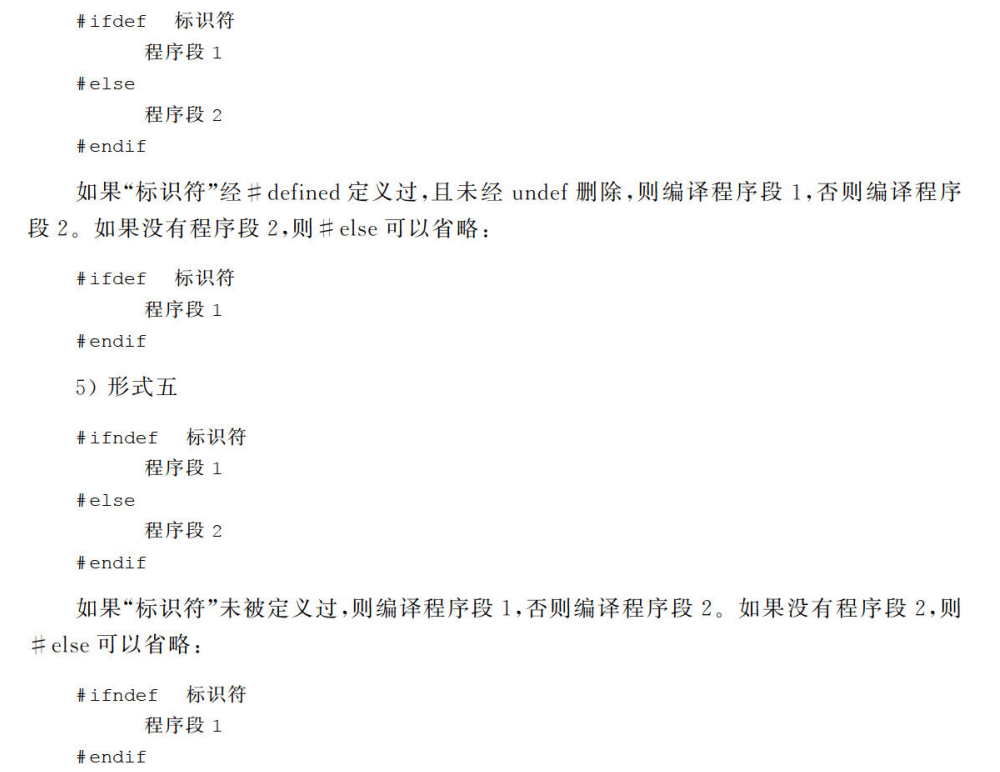
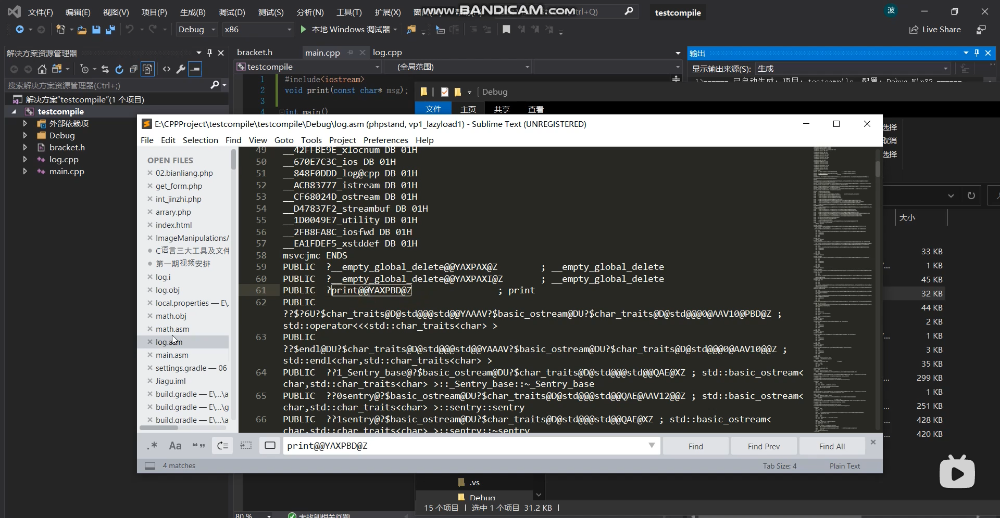

# ==面向对象编程==

# ==封装==

## 类的静态成员

在结构化程序设计中程序模块的基本单位是函数,因此模块间对内存中数据的共享是通过函数与函数之间的数据共享来实现的,其中包括两个途径-参数传递和全局变量。

面向对象的程序设计方法兼顾数据的共享与保护,将数据与操作数据的函数封装在一起,构成集成度更高的模块。类中的数据成员可以被同一类中的任何一个函数访问。这样一方面在类内部的函数之间实现了数据的共享,另一方面这种共享是受限制的,可以设置适当的访问控制属性,把共享只限制在类的范围之内,对类外来说,类的数据成员仍是隐藏的，达到了共享与隐藏两全。

然而这些还不是数据共享的全部。对象与对象之间也需要共享数据。

> 静态成员是解决同一个类的不同对象之间数据和函数共享问题的。

例如,我们可以抽象出某公司全体雇员的共性,设计如下雇员类:

```c++
	class Employee {
	private:
		int empNo;
		int id;
		string name;
		//其他数据和函数成员
};
```

如果需要统计**雇员总数**﹐这个数据存放在什么地方呢?若以类外的变量来存储总数,不能实现数据的隐藏。若在类中增加一个数据成员用以存放总数﹐必然在每个对象中都存储一副本,不仅冗余,而且每个对象分别维护一个“总数”,容易造成数据的不一致性。由于这个数据应该是为Employee类的所有对象所共享的,比较理想的方案是类的所有对象共同拥有一个用于存放总数的数据成员,这就是下面要介绍的静态数据成员。

### 静态数据成员

我们说“一个类的所有对象具有相同的属性”,是指属性的个数、名称、数据类型相同,各个对象的属性值则可以各不相同,这样的属性在面向对象方法中称为“实例属性”,在C+十程序中以类的非静态数据成员表示。例如上述`Employce`类中的`empNo`、 `id` , `name`都是以非静态数据成员表示的实例属性,它们在类的每个对象中都有,这样的实例属性正是每个对象区别于其他对象的特征。

面向对象方法中还有“类属性”的概念。如果某个属性为整个类所共有,不属于任何一个具体对象,则采用`static`关键字来声明为静态成员。静态成员在每个类只有一份,由该类的所有对象共同维护和使用,从而实现了同一类的不同对象之间的数据共享。类属性是描述类的所有对象共同特征的一个数据项,对于任何对象实例,它的属性值是相同的。简单地说,如果将“类”比作一个工厂,对象是工厂生产出的产品,那么静态成员是存放在工厂中,属于工厂的,而不是属于每个产品的。

静态数据成员具有静态生存期。由于静态数据成员不属于任何一个对象,因此可以通过类名对它进行访问,一般的用法是`类名::标识符`。

> #### 在类的定义中仅仅对静态数据成员进行引用性声明,必须在文件作用域的某个地方使用类名限定进行定义性声明,这时也可以进行初始化。

C++11标准支持常量表达式类型修饰(constexpr或const)的静态常量在类内初始化,此时仍可在类外定义该静态成员,但不能做再次初始化操作。在UML中,静态数据成员是通过在数据成员下方添加下画线来表示。从下面的例子中可以看到静态数据成员的作用。


> #### 之所以类的静态数据成员需要在类定义之外再加以定义,是因为需要以这种方式专门为它们分配空间。非静态数据成员无须以此方式定义,是因为它们的空间是与它们所属对象的空间同时分配的。


==例子：具有静态数据成员的Point类。==

```c++
#include<iostream>
using namespace std;
#include<string>
class point {
public:
	point(int x = 0, int y = 0) :x(x), y(y)
	{
		count++;
	}//在构造函数中对count累加，所有对象共同维护同一个count

	point(point& p) {//复制构造函数
		x = p.x;
		y = p.y;
		count++;
	}
	~point() { count--; }
	int get_x() { return x; };
	int get_y() { return y; };
	void show_count() {
		cout << "object count=" << count << endl;
	}
private:
	int x, y;
	static int count;//常量静态成员的初始化
	constexpr static int origin = 0;//常量静态成员的初始化，不可二次初始化
};
int point::count = 0;
constexpr int point::origin;
	
int main() {
	point a(4, 5);
	a.show_count();
	point b(a);
	b.show_count();


	return 0;
}
```

这个程序是由第4章的Point类修改而来,引入静态数据成员count用于统计Point类的对象个数。包含静态数据成员count的Point类的UML图形表示如**图5-2**所示。


上面的例子中,类`Point` 的数据成员`count`被声明为静态,用来给`Point`类的对象计数，每定义一个新对象,`count`的值就相应加1。静态数据成员`count`的定义和初始化在类外进行,初始化时引用的方式也很值得注意,首先应该注意的是要利用类名来引用,其次,虽然这个静态数据成员是私有类型,在这里却可以直接初始化。除了这种特殊场合,在其他地方，例如主函数中就不允许直接访问了。`count`的值是在类的构造函数中计算的,a对象生成时,调用有缺省参数的构造函数,b对象生成时,调用复制构造函数,两次调用构造函数访问的均是同一个静态成员`count`。通过对象a和对象b分别调用`showCount`函数输出的也是同一个count在不同时刻的数值。这样,就实现了a, b两个直接的数据共享。
提示﹑在对类的静态私有数据成员初始化的同时,还可以引用类的其他私有成员。例如,如果一个类T存在类型为T的静态私有对象﹐那么可以引用该类的私有构造函数将其初始化。

### 静态成员函数

在==例5-4==中,函数`showCount`是专门用来输出静态成员`count`的。要输出`count`只能通过`Point`类的某个对象来调用函数`showCount`。在所有对象声明之前`count`的值是初始值`0`。如何输出这个初始值呢?显然由于尚未声明任何对象,无法通过对象来调用`showCount`。由于`count`是为整个类所共有的,不属于任何对象,因此我们自然会希望对`count`的访问也不要通过对象。现在尝试将例5-4中的主函数改写如下:

```c++
int main() {
	point::show_count();//直接调用类名来访问
	point a(4, 5);
	a.show_count();
	point b(a);
	b.show_count();


	return 0;
}
```


但是不幸得很,编译时出错了,对普通函数成员的调用必须通过对象名。

尽管如此，C++中还是可以有办法实现我们上述期望的,这就是使用静态成员函数。所谓静态成员函数就是使用`static`关键字声明的函数成员,同静态数据成员一样静态成员函数也属于整个类,由同一个类的所有对象共同拥有,为这些对象所共享。

静态成员函数可以通过类名或对象名来调用,而非静态成员函数只能通过对象名来调用

习惯虽然静态成员函数可以通过类名和对象名两种方式调用,但一般习惯于通过类名调用。因为即使通过对象名调用,起作用的也只是对象的类型信息,与所使用的具体对象毫无关系。

> #### 静态成员函数可以直接访问该类的静态数据和函数成员。而访问非静态成员,必须通过对象名。

请看下面的程序段:

```c++
class A {
public:
	static void f(A a);
private:
	int x;
};
void A::f(A a) {
	cout << x;//错误
	cout << a.x;//正确
}
```

可以看到,通过静态函数成员访问非静态成员是相当麻烦的,一般情况下,它主要用来访问同一个类中的静态数据成员,维护对象之间共享的数据。

提示:之所以在静态成员函数中访问类的非静态成员需要指明对象,是因为对静态成员函数的调用是没有目的对象的,因此不能像非静态成员函数那样,隐含地通过目的对象访问类的非静态成员。

在UML中,静态函数成员是通过在函数成员添加<<static>>构造型来表征。

==例5-5具有静态数据、函数成员的Point类。==

在例5-4中,利用静态的私有数据成员count对 Point类的对象个数进行统计,本例中使用静态函数成员来访问count。添加静态函数成员的Point类的UML图形表示如图5-3所示。


```c++
#include<iostream>
using namespace std;
#include<string>
class point {
public:
	point(int x = 0, int y = 0) :x(x), y(y)
	{
		count++;
	}//在构造函数中对count累加，所有对象共同维护同一个count

	point(point& p) {//复制构造函数
		x = p.x;
		y = p.y;
		count++;
	}
	~point() { count--; }
	int get_x() { return x; };
	int get_y() { return y; };
	static void show_count() {//静态成员函数
		cout << "object count=" << count << endl;
	}
private:
	int x, y;
	static int count;
	constexpr static int origin = 0;//常量静态成员的初始化
};
int point::count = 0;//还需要在类外定义
constexpr int point::origin;
	

int main() {
	point::show_count();
	point a(4, 5);
	a.show_count();
	point b(a);
	point::show_count();


	return 0;
}
```

与==例5-4==相比,这里只是在类的定义中,将`showCount`改写为静态成员函数。于是在主函数中既可以使用类名也可以使用对象名来调用`showCount`。

这个程序的运行输出结果与例5-4的结果完全相同。相比而言,采用静态函数成员好处是可以不依赖于任何对象,直接访问静态数据。

## 类的友元

将数据与处理数据的函数封装在一起,构成类,既实现了数据的共享又实现了隐藏﹐无疑是面向对象程序设计的一大优点。但是封装并不总是绝对的。

**问题一：**现在考虑一个简单的例子,就是我们熟悉的`Point`类,每个`Point`类的对象代表一个“点”。如果需要一个函数来计算任意两点间的距离,这个函数该如何设计呢?

如果将计算距离的函数设计为类外的普通函数﹐就不能体现这个函数与“点”之间的联系,而且类外的函数也不能直接引用“点”的坐标(私有成员),这样计算时就很不方便。

那么设计为Point类的成员函数又如何呢?从语法的角度这不难实现,但是理解起来却有问题。因为距离是点与点之间的一种关系,它既不属于每个单独的点,也不属于整个Point类。也就是说无论设计为非静态成员还是静态成员,都会影响程序的可读性。

在第4章,曾经使用类的组合﹐由Point类的两个对象组合成Line(线段)类,具有计算线段长度的功能。但是Line类的实质是对线段的抽象。如果面临的问题是有许多点,并且经常需要计算任意两点间的距离,那么每次计算两点间距离都需要构造一个线段。这既麻烦又影响程序的可读性。这种情况下,很需要一个在 Point类外,但与Point类有特殊关系的函数。

**问题二：**再看看另一段程序:

```c++
class A {
	public:
		void display() { cout << x << endl; }
		int getx() { return x; }
		//其他成员略
	private:
		int x;
};
class B {
	public:
		void set(int i);
		void display();
	private:
		A a;
};
```

这是类组合的情况,类B中内嵌了类A的对象,但是B的成员函数却无法直接访问A的私有成员x。从数据的安全性角度来说,这无疑是最安全的,内嵌的部件相当于一个黑盒。但是使用起来多少有些不便,例如,按如下形式实现B的成员函数set,会引起编译错误:

```c++
void B::set (int i){
	a.x=i};
```

由于A的对象内嵌于B中,能否让B的函数直接访问A的私有数据呢?

C++为上述这些需求提供了语法支持,这就是友元关系。

友元关系提供了==不同类==或==对象==的成员函数之间、类的成员函数与一般函数之间进行数据共享的机制。通俗地说,友元关系就是一个类主动声明哪些其他==类或函数==是它的朋友,进而给它们提供对本类的访问特许。也就是说,通过友元关系，一个普通函数或者类的成员函数可以访问封装于另外一个类中数据。从一定程度上讲,友元是对数据隐蔽和封装的破坏。但是为了数据共享,提高程序的效率和可读性,很多情况下这种小的破坏也是必要的,关键是一个度的问题,要在共享和封装之间找到一个恰当的平衡。

在一个类中,可以利用关键字`friend`将其他函数或类声明为友元。

如果友元是一般函数或类的成员函数,称为友元函数;如果友元是一个类,则称为友元类,友元类的所有成员函数都自动成为友元函数。

### 友元函数

友元函数是在类中用关键字`friend`修饰的非成员函数。友元函数可以是一个普通的函数,也可以是其他类的成员函数。虽然它不是本类的成员函数,但是在它的函数体中可以通过对象名访问类的私有和保护成员。在UML中,友元函数是通过在成员函数前方添加`<friend>>`构造型来表征。请看下面这个例子。

==例5-6:使用友元函数计算两点间的距离。==

在介绍类的组合时,使用了由Point类组合构成的Line类计算线段的长度。本例中，将采用友元函数来实现更一般的功能:计算任意两点间的距离。屏幕上的点仍然用Point类描述,两点的距离用普通函数dist来计算。计算过程中,这个函数需要访问Point类的私有数据成员x和y,为此将dist声明为Point类的友元函数。本实例Point类的UML图形表示如图5-4所示。


```c++
using namespace std;
#include<string>
class point {
public:
	point(int x = 0, int y = 0) :x(x), y(y)
	{
		count++;
	}//在构造函数中对count累加，所有对象共同维护同一个count

	point(point& p) {//复制构造函数
		x = p.x;
		y = p.y;
		count++;
	}
	~point() { count--; }
	int get_x() { return x; };
	int get_y() { return y; };
	static void show_count() {
		cout << "object count=" << count << endl;
	}
	friend float dist(point& p1, point& p2);//友元函数
private:
	int x, y;
	static int count;
	constexpr static int origin = 0;//常量静态成员的初始化
};
int point::count = 0;//还需要在类外定义
constexpr int point::origin;
float dist(point& p1, point& p2) {
	double x = p1.x - p2.x;
	double y = p1.y - p2.y;
	return static_cast<float>(sqrt(x * x + y * y));
}
	
int main() {
	point::show_count();
	point myp1(4, 5),myp2(1,1);
	cout << dist(myp1, myp2)<<endl;


	return 0;
}

```

### 友元类

同友元函数一样，一个类可以将另一个类声明为友元类。若A类为B类的友元类,则A类的所有成员函数都是B类的友元函数,都可以访问B类的私有和保护成员。声明友元类的语法形式为:

```c++
class B
{
	…//B类的成员声明
	friend class A;//声明A为B的友元类	
	…
};
```

声明友元类,是建立类与类之间的联系,实现类之间数据共享的一种途径。在UML中,两个类之间的友元关系是通过<<friend>>构造型依赖来表征。现在,将本节开头部分的程序段修改成如下形式,其中B类是A类的友元类,则B的成员函数便可以直接访问A的私有成员x。类A和类B之间的友元关系通过UML图形表示如图5-5所示。


关于友元,还有几点需要注意:

* 友元关系是==不能传递==的,B类是A类的友元,C类是B类的友元,C类和A类之间,如果没有声明,就没有任何友元关系,不能进行数据共享。
* 友元关系是==单向==的,如果声明B类是A类的友元,B类的成员函数就可以访问A类的私有和保护数据,但A类的成员函数却不能访问B类的私有、保护数据。
*  友元关系是==不被继承==的,如果类B是类A的友元,类B的派生类并不会自动成为类A的友元。打个比方说,就好像别人信任你,但是不见得信任你的孩子。

## 共享数据的保护

虽然数据隐藏保证了数据的安全性,但各种形式的数据共享却又不同程度地破坏了数据的安全。因此,对于既需要共享、又需要防止改变的数据应该声明为常量。因为常量在程序运行期间是不可改变的,所以可以有效地保护数据。在第2章介绍过简单数据类型常量。

声明对象时也可以用`const`进行修饰,称之为常对象。本节介绍常对象、对象的常成员和常引用。常数组和常指针将在第6章介绍。

### 常对象

常对象是这样的对象﹐它的数据成员值在对象的整个生存期间内不能被改变。也就是说﹐常对象必须进行初始化,而且不能被更新。声明常对象的语法形式为:

```c++
const 类型说明符 对象名;
```

==细节==︰在声明常对象时,把const关键字放在类型名后面也是允许的,不过人们更习惯写在前面


与基本数据类型的常量相似,常对象的值也是不能被改变的。在C++的语法中,对基本数据类型的常量提供了可靠的保护。如果程序中出现了类似下面这样的语句,编译时是会出错的。也就是说,语法检查时确保了常量不能被赋值。

```c++
const int n=10;
//正确,用10对常量n进行初始化
n= 20;
//错误，不能对常量赋值
```


注意﹑在定义一个变量或常量时为它指定初值叫作初始化,而在定义一个变量或常量以后使用赋值运算符修改它的值叫作==赋值==,请勿将初始化与赋值混淆。

语法如何保障类类型的常对象的值不被改变呢?改变对象的数据成员值有两个途径:

1. 通过对象名访问其成员对象,由于常对象的数据成员都被视同为常量,这时语法会限制不能赋值。
2. 在类的成员函数中改变数据成员的值,然而几乎无法预料和统计哪些成员函数会改变数据成员的值,对此语法只好规定不能通过常对象调用普通的成员函数

可是这样一来,常对象还有什么用呢?它没有任何可用的对外接口。别担心,办法是有的,在5.5.2小节中将介绍专门为常对象定义的常成员函数。
提示基本数据类型的常量也可看作一种特殊的常对象。因此,后面将不再对基本数据类型的常量和类类型的常对象加以区分。

### 常成员函数

使用const关键字修饰的函数为常成员函数,常成员函数声明的格式如下:

`类型说明符﹐函数名(参数表) const;`

==注意：==

1. const是函数类型的一个组成部分,因此在函数的定义部分也要带const关键字。

2. 如果将一个对象说明为常对象,则通过该常对象只能调用它的常成员函数,而不能调用其他成员函数(这就是C++从语法机制上对常对象的保护,也是常对象唯一的对外接口方式)。

3. 无论是否通过常对象调用常成员函数,在常成员函数调用期间,目的对象都被视同为常对象,因此常成员函数不能更新目的对象的数据成员﹐也不能针对目的对象调用该类中没有用const修饰的成员函数(这就保证了在常成员函数中不会更改目的对象的数据成员的值)。

4.  const关键字可以用于对重载函数的区分,例如,如果在类中这样声明:

   ```c++
   void print();
   void print () const;这是对print的有效重载。
   ```

   

==提示:==如果仅以const 关键字为区分对成员函数重载,那么通过非const的对象调用该函数,两个重载的函数都可以与之匹配,这时编译器将选择最近的函数--不带const关键字的函数。

在UML中,常成员函数是通过在成员函数前添加<<const>>构造型来表征。


### 常数据成员

类的成员数据也可以时常量，使用const说明的数据成员成为常数据成员。

> 如果在一个类中说明了常数据成员,那么任何函数中都不能对该成员赋值。构造函数对该数据成员进行初始化,就只能通过初始化列表。

在UML中,常数据成员是通过在数据成员类型前添加const类型来表征。请看例5-8。


**例5-8**:常数据成员举例。
在本实例中,类A中声明了常数据成员,其UML图形表示如图5-7所示。

```cpp
class A {
public:
	A(int i);
	void print();
private:
	const int a;
	static const int b;

};
const int A::b = 10;
A::A(int i):a(i){}
void A::print() { cout << a << ":" << b << endl; }
int main() {
	A a1(100), a2(0);
    /*建立对象a和 b,并以100和О作为初值,分别调用构造函数,通过构造函数的初
始化列表给对象的常数据成员赋初值*/

	a1.print();
	a2.print();
	return 0;
}
```

**细节**：类成员中的静态变量和常量都应当在类体之外加以定义,但C++标准规定了一个例外:类的静态常量如果具有整数类型或枚举类型,那么可以直接在类定义中为它指定常量值,例如,例5-8中可以直接在类定义中写:

```
static const int b=10;
```

这时,不必在类定义外定义`A:b`,因为编译器会将程序中对`A:b`的所有引用都替换成数值10,一般无须再为`A:b`分配空间,

但也有例外,例如如果程序中出现了对`b`取地址的情况(关于取地址,将在第6章介绍指针时详细介绍),则必须通过专门的定义为A:b分配空间,由于已经在类定义中为它指定了初值,不能再在类定义外为它指定初值,即使两处给出的初值相同也不行。

### 常引用


## mutable修饰

在C++中mutable关键字是为了突破const关键字的限制，被mutable关键字修饰的成员变量永远处于可变的状态，即使是在被const修饰的成员函数中。

在C++中被const修饰的成员函数无法修改类的成员变量，成员变量在该函数中处于只读状态。然而，在某些场合我们还是需要在const成员函数中修改成员变量的值，被修改的成员变量与类本身并无多大关系，也许你会说，去掉函数的const关键字就行了。可问题是，我只想修改某个变量的值，其他变量希望仍然被const关键字保护。

现在有个场景，我们想获取函数被调用的次数，代码如下：

```cpp
class Widget{
public:
    Widget();
    ~Widget() = default;

    int getValue() const;
    int getCount() const;

private:
    int value;
    int count;
};
```

这里我们想要获取getValue函数被调用次数，普遍的做法是在getValue函数里对成员变量count进行加1处理，可是getValue被关键字const修饰啊，无法修改count的值。这个时候mutable派上用场了！我们用mutable关键字修饰count，完整代码如下：

```cpp
#include <iostream>

class Widget{
public:
    Widget();
    ~Widget() = default;

    int getValue() const;
    int getCount() const;

private:
    int value;
    mutable int count;
};

Widget::Widget() : value(1), count(0) { }

int Widget::getValue() const{
    count++;
    return value;
}

int Widget::getCount() const{
    return count;
}

int main()
{
    Widget w1;

    for(int i = 0; i < 5; i++){
        w1.getValue();
    }
    std::cout << w1.getCount() << std::endl;
    return 0;
}
```

被mutable修饰的成员变量count在getValue函数里进行加1计数，编译运行输出如下：

```cpp
5
```

既保护了其他成员变量，又能达到我们单独修改成员变量count值的目的。

[C++里std::enable_shared_from_this是干什么用的？](https://link.zhihu.com/?target=http%3A//mp.weixin.qq.com/s%3F__biz%3DMzk0NTE2OTQyOA%3D%3D%26mid%3D2247485941%26idx%3D1%26sn%3Dda12f3703fe75ba39e769fd89bd08c9f%26chksm%3Dc3183c8ef46fb59820c242d90eeba5ba97662f99a21b87d5ca56dec8c75e052de4a0bcb9fa26%26scene%3D21%23wechat_redirect)


# ==类的继承==

面向对象的程序设计中提供了类的继承机制,允许程序员在保持原有类特性的基础上，进行更具体、更详细的类的定义。以原有的类为基础产生新的类,我们就说新类继承了原有类的特征,也可以说是从原有类派生出新类。类的派生机制有什么好处呢?好处在于代码的重用性和可扩充性。通过继承可以充分利用别人做过一些类似的研究,和已有的一些分析、解决方案。重用这些的代码,便使自己的开发工作能够站在巨人的肩膀上。软件开发完成后,当问题有了新的发展或对问题有了新的认识时,也能高效地改造和扩充已有的软件。

> #### 派生新类的过程一般包括吸收已有类的成员、调整已有类成员和添加新的成员3个步骤。

本章围绕派生过程,着重讨论不同继承方式下的基类成员的访问控制问题,添加构造函数和析构函数;接着还将讨论在较为复杂的继承关系中,类成员的唯一标识和访问问题;最后给出类的继承实例--全选主元高斯消去法求解线性方程组和一个小型公司的人员信息管理系统。

## 基类和派生类

所谓继承就是从先辈处得到==属性==和==行为特征==。类的继承﹐是新的类从已有类那里得到已有的特性。从另一个角度来看这个问题,从已有类产生新类的过程就是类的派生。类的继承与派生机制允许程序员在保持原有类特性的基础上,进行更具体、更详细的修改和扩充。由原有的类产生新类时,新类便包含了原有类特征,同时也可以加入自己所特有的新特性。

原有的类称为==基类==或==父类==,产生的新类称为==派生类或子类==。派生类同样也可以作为基类派生新的类,这样就形成了类的层次结构。类的派生实际是一种演化,发展过程,即通过扩展、更改和特殊化,从一个已知类出发建立一个新类。通过类的派生可以建立具有共同关键特征的对象家族﹐从而实现代码的重用,这种继承和派生的机制对于已有程序的发展和改进,是极为有利的。

在C++中,派生类的一般定义语法为:

```c++
class派生类名:继承方式,基类名1 继承方式,基类名2…,继承方式,基类名n
{
派生类成员声明;
};
```


例如,假设基类Basel, Base2是已经定义的类，下面的语句定义了一个名为Derived 的派生类,该类从基类 Basel, Base2派生而来:

```c++
class derived :public base1,private base2 {
public:
	derived();
	~derived():

};
```


定义中的“基类名”(如 Basel, Base2)是已有的类的名称，“派生类名”是继承原有类的特性而生成的新类的名称(如Derived)。一个派生类,可以同时有多个基类,这种情况称为==多继承==,这时的派生类同时得到了多个已有类的特征。上述例子就是一个多继承实例。一个派生类只有一个直接基类的情况,称为==单继承==。两种继承的UML表示如图7-2所示。单继承可以看作是多继承的一个最简单的特例,多继承可以看作多个单继承的组合,它们之间的很多特性是相同的,我们的学习首先从简单的单继承开始。


在派生过程中,派生出来的新类也同样可以作为基类再继续派生新的类,此外，一个基类可以同时派生出多个派生类。也就是说，一个类从父类继承来的特征也可以被其他新的类所继承，一个父类的特征,可以同时被多个子类继承。这样,就形成了一个相互关联的类的家族,有时也称作==类族==。在类族中,直接参与派生出某类的基类称为==直接基类==,基类的基类甚至更高层的基类称为==间接基类==。比如由“交通工具”类派生出“汽车”类，“汽车”类又派生出“卡车”类,则“汽车”类是“卡车”类的直接基类,“交通工具”类是“汽车”类的直接基类，而“交通工具”类可以称为“卡车”类的间接基类。

在派生类的定义中,除了要指定基类外,还需要指定继承方式。继承方式规定了如何访问从基类继承的成员。在派生类的定义语句中,每个“继承方式”,只限定紧随其后的基类。继承方式关键字为:`public` , `protected`和 `private`,分别表示公有继承﹑保护继承和私有继承。如果不显式地给出继承方式关键字,系统的默认值就认为是私有继承(private)。类的继承方式指定了派生类成员以及类外对象对于从基类继承来的成员的访问权限﹐这将在7.2节详细介绍。

前面的例子中对Basel是公有继承,对 Base2是私有继承,同时声明了派生类自己新的构造函数和析构函数。

派生类成员是指除了从基类继承来的所有成员外,新增加的数据和函数成员。这些新增的成员,正是派生类不同于基类的关键所在,是派生类对基类的发展。当重用和扩充已有的代码时,就是通过在派生类中新增成员来添加新的属性和功能。可以说,这就是类在继承基础上的进化和发展。

## 派生类生成过程

在C++程序设计中,进行了派生类的定义之后,给出该类的成员函数的实现,整个类就算完成了,可以由它来生成对象进行实际问题的处理。仔细分析派生新类这个过程,实际是经历了3个步骤:吸收基类成员、改造基类成员、添加新的成员。面向对象的继承和派生机制,其最主要目的是实现代码的重用和扩充。因此,吸收基类成员就是一个重用的过程,而对基类成员进行调整、改造以及添加新成员就是原有代码的扩充过程,二者是相辅相成的。

下面以7.1.1小节中提出的个人银行账户管理系统为例分别对这几个步骤进行解释。基类`Account`和派生类`CreditAccount`定义如下,类的实现部分暂时略去,在7.7节中将列出解决这个问题的完整程序。

```

```


### 吸收基类成员

在C++的类继承中,第一步是将基类的成员全盘接收,这样,派生类实际上就包含了它的全部基类中除构造和析构函数之外的所有成员。在派生过程中构造函数和析构函数都不被继承,这一点将在7.3节中详细介绍。在这里,派生类`CreditAccount`继承了基类`Account`中除构造和析构函数之外的所有非静态成员:id , balance , record函数, error函数、getld函数、getBalance函数,show函数。经过派生过程这些成员便存在于派生类中。

### 改造基类成员

对基类成员的改造包括两个方面

1. 一个是基类成员的访问控制问题,主要依靠派生类定义时的继承方式来控制,在将在7.2节中详细介绍。

2. 另一个是对基类数据或函数成员的==覆盖==或==隐藏==,覆盖的概念将在第8章介绍,而隐藏就是在派生类中声明一个和基类数据或函数同名的成员,例如这个例子中的show()。如果派生类声明了一个和某基类成员同名的新成员,派生的新成员就隐藏了外层同名成员。这时在派生类中或者通过派生类的对象,直接使用成员名就只能访问到派生类中声明的同名成员,这称作同名隐藏。在这里派生类CreditAccount中的 show()函数就隐藏了基类Account中的同名函数。

   

### 添加新的成员

派生类新成员的加入是继承与派生机制的核心,是保证派生类在功能上有所发展的关键。可以根据实际情况的需要,给派生类添加适当的数据和函数成员,来实现必要的新增功能。在这里派生类CreditAccount中就添加了数据成员acc,credit ,rate和 fee。

由于在派生过程中,基类的构造函数和析构函数是不能被继承的,因此要实现一些特别的初始化和扫尾清理工作,就需要在派生类中加入新的构造和析构函数。例如派生类CreditAccount 的构造函数CreditAccount()。

本章的内容基本上是按照派生的这3个步骤组织的。第一步实际在定义派生类之后自动完成了,程序员无法干预,我们也不再做深入讨论。第二个步骤中我们着重学习不同继承方式下的基类成员的访问控制问题。在第三步中,重点放在了构造函数和析构函数上,其他一般成员的添加,方法和规则与定义一个类时完全相同,可以参看第4章的内容。接着学习在较为复杂的继承关系中,类成员的唯一标识和访问问题。最后通过类的继承实例作为本章的回顾与总结。

## 继承方式

派生类继承了基类的全部数据成员和除了构造,析构函数之外的全部函数成员,但是这些成员的访问属性在派生的过程中是可以调整的。从基类继承的成员,其访问属性由继承方式控制。

基类的成员可以有public(公有)、protected(保护)和 private(私有)三种访问属性,基类的自身成员可以对基类中任何一个其他成员进行访问,但是通过基类的对象,就只能访问该类的公有成员。

类的继承方式有public(公有继承),protected(保护继承)和 private(私有继承)三种,不同的继承方式,导致原来具有不同访问属性的基类成员在派生类中的访问属性也有所不同。

这里说的访问来自两个方面:一是派生类中的新增成员访问从基类继承的成员;二是在派生类外部(非类族内的成员),通过派生类的对象访问从基类继承的成员。下面分别进行讨论。

### 公有继承

当类的继承方式为公有继承时,基类的公有和保护成员的访问属性在派生类中不变,而基类的私有成员不可直接访问。

也就是说基类的公有成员和保护成员被继承到派生类中访问属性不变,仍作为派生类的公有成员和保护成员,派生类的其他成员可以直接访问它们。在类族之外只能通过派生类的对象访问从基类继承的公有成员,而无论是派生类的成员还是派生类的对象都无法直接访问基类的私有成员。

==例7-1 Point类公有继承。==
Point类是在前面的章节中多次使用的类。在这个例子中,我们从Point类派生出新的Rectangle(矩形)类。矩形是由一个点加上长、宽构成。矩形的点具备了Point类的全部特征,同时,矩形自身也有一些特点,这就需要在继承Point类的同时添加新的成员。这两个类的继承关系可以用UML图形描述,如图7-3所示。


```cpp
//Point.h
#ifndef _POINT_H
#define _POINT_H
class point {
public:
	void initpoint(float x = 0, float y = 0) { this->x = x; this->y = y; }
	void move(float offx, float offy) { x += offx; y += offy; }
	float getx() { return x; }
	float gety() { return y; }
private:
	float x, y;
};
#endif
```


```cpp
#pragma once
#ifndef _RECTANGE_H
#define _RECTANGE_H
#include "Point.h"
class rectange :public point{
public:
	void initRectange(float x, float y, float w, float h) {
		initpoint(x, y);
		this->w = w;
		this->h = h;

	}
	void re() { this->x += 1; }//基类私有成员不可访问
	void re1() { this->z += 1; }//基类保护成员可以访问
	float geth()const { return h; }
	float getw()const { return w; }
private:
	float w, h;
};
#endif

```

这里首先定义了基类Point。派生类Rectangle继承了Point类的全部成员(隐含的默认构造和析构函数除外)**,因此在派生类中,实际所拥有的成员就是从基类继承过来的成员与派生类新定义成员的总和。**

继承方式为公有继承,这时,基类中的公有成员在派生类中访问属性保持原样**,派生类的成员函数及对象可以访问到基类的公有成员(例如在派生类函数成员initRectangle中直接调用基类的函数initPoint),但是无法访问基类的私有成员(例如基类的x、y)。**基类原有的外部接口(例如基类的`getX`(和`getY()`函数)变成了派生类外部接口的一部分。当然,派生类自己新增的成员之间都是可以互相访问的。

Rectangle类继承了Point类的成员,也就实现了代码的重用,同时,通过新增成员,加入了自身的独有特征,达到了程序的扩充。
程序的主函数部分如下:


### 私有继承

当类的继承方式为私有继承时,基类中的公有成员和保护成员都以私有成员身份出现在派生类中,==而基类的私有成员在派生类中不可直接访问。==

也就是说基类的公有和保护成员被继承后作为派生类的私有成员,派生类的其他成员可以直接访问它们,但是在类族外部通过派生类的对象无法直接访问它们。无论是派生类的成员还是通过派生类的对象,都无法==直接==访问从基类继承的私有成员。

经过私有继承之后,所有基类的成员都成为派生类的私有成员或不可直接访问的成员，如果进一步派生,基类的全部成员就无法在新的派生类中被直接访问。因此,私有继承之后,基类的成员再也无法在以后的派生类中直接发挥作用,实际是相当于终止了基类功能的继续派生,出于这种原因,一般情况下私有继承的使用比较少。

### 保护继承

# ==类指针==

## 指向对象的指针

## 指向类成员的指针

### 指向类的非静态成员的指针

#### 指向数据成员

==声明语法==：

```c++
类型说明符  类名::*指针名;   
//声明指向数据成员的指针，注意这个指针和this指针一样，是每个实例化后的对象共有的
eg：int point::*num_ptr;
```

==对指针赋值的语法：==

```
指针名=&类名::数据成员名 
ed：num_ptr=&point::m_a; 
//num_ptr是上面我们定义的指针的名字，point是我们自定义的类，m_a是point类中的一个数据成员
```


==访问方式：==

1.具体实例化的对象名.*类成员指针名

2.具体实例化的对象指针名->*类成员指针名   //看似复杂，其实仔细看看就能和我们之前学过的原理结合上

**具体程序实例：**

```c++
#include <iostream>
using namespace std;
class point {
public:
	int m_a;
	int m_b;
	point(int m_a, int m_b) {
		this->m_a = m_a;
		this->m_b = m_b;
	}
	int get_a() {
		return m_a;
	}
	int get_b() {
		return m_b;
	}
};
int main(){
  point p(1,2);
  point *p1=&p;//定义一个指针去指向p这个整体的大对象
  int  point::*num_ptr; //定义一个指向类的成员的指针
  num_ptr=&point::m_a; //指向m_a这个元素
  
  //调用方法1
  cout<<p.*num_ptr<<endl;
  //调用方法2
  cout<<p1->*num_ptr<<endl;
 
}
```

#### 指向函数成员

==声明语法：==

```
类型说明符  （类名::*指针名）（参数表，没有参数就为空);

eg:  int(point:: * funptr)();
```

==赋值语法：==

```
funptr = &point::get_a;
```

 

==调用语法：== 

```
1.（对象名.*类成员指针名)(参数表)

2.（对象指针名->*类成员指针名)(参数表)
```

```c++
#include <iostream>
using namespace std;
class point {
public:
	int m_a;
	int m_b;
	point(int m_a, int m_b) {
		this->m_a = m_a;
		this->m_b = m_b;
	}
	int get_a() {
		return m_a;
	}
	int get_b() {
		return m_b;
	}
};
int main() {
	point p(1, 2);
	point* p1 = &p;
	int(point:: * funptr)();  //相比于指向数据成员，指向函数的情况也不过就是多了几层括号而已，便于我们简记用法。
	funptr = &point::get_a;  //注意这里的函数名后面不加()
    //调用方法1
	cout << (p.*funptr)() << endl;
    //调用方法2
	cout << (p1->*funptr)() << endl;
 
   //顺便提一下我们之前的两个访问方式,横向对比记忆
   cout<<p.get_a()<<endl;
   cout<<p1->get_a()<<endl;
 
}
```

### 指向类静态成员

#### 静态数据成员

```c++
#include <iostream>
using namespace std;
class person {
public:
	static int count;
	person() {
		++count;
	}
	static void print() {
		cout << count << endl;
	}
};
int person::count = 0;
int main() {
	person p;
    //与非静态数据成员不同，前半部分定义指针的时候省略了类名
	int* p1 = &person::count;
    //因为静态成员是类对象共有的，所以不依赖于每个对象，直接解引用就可以
	cout << *p1 << endl;
}
```

#### 静态函数

```c++
#include <iostream>
using namespace std;
class person {
public:
	static int count;
	person() {
		++count;
	}
	static void print() {
		cout << count << endl;
	}
};
int person::count = 0;
int main() {
    //相比于非静态函数的写法，类的静态函数也是前半部分不用写类名
	void (*p2)() = &person::print;
 
	p2();//调用的时候写成p2()或者*p2;
}
```


# ==多态==

# ==枚举类==

[C++](http://c.biancheng.net/cplus/) 允许程序员创建自己的数据类型，比如本节要将的枚举类型。枚举数据类型是一种由程序员定义的数据类型，其合法值是与它们关联的一组命名整数常量。

之所以被称为枚举类型，就是因为命名常量是作为数据类型定义的一部分而枚举或列出的，以下是枚举类型声明的示例：

`enum Roster {Tom, Sharon, Bill, Teresa, John};`

该语句将创建一个名为 `Roster` 的数据类型。因为单词 `enum` 是 C++ 关键字，所以它必须小写，值得注意的是，数据类型本身的名字是以大写字母开头的。虽然这并非必须，但是绝大多数程序员都会釆用首字母大写的形式。

和 Roster 数据类型关联的命名整数常量被称为枚举量，Roster 数据类型的变量可能只是关联到这些枚举量的值之一，但它们的值是什么呢？

默认情况下，编译器设置第一个枚举量为 0，下一个为 1，以此类推。在上述示例中，`Tom `的值将是 `0`，`Sharon` 的值为 1，等等。最后一个枚举量` John` 的值为 4。

重要的是要意识到，`enum` 语句示例实际上并没有创建任何变量，只是定义数据类型。当以后创建这个数据类型的变量时，它们看起来就是整数，并且这些整数的值被限制在与枚举集合中的符号名称相关联的整数上。以下语句显示了如何定义 Roster 数据类型的变量：

`Roster student;`

此语句的形式与其他任何变量定义一样，首先是数据类型名称，然后是变量名称。请注意，数据类型名称是 `Roster`，而不是 `enum Roster`。

现在已经创建了 student 变量，它可以被赋予一个值，如下所示：

`student = Sharon;`

变量的值可以这样测试：

`if (student == Sharon)`

请注意，在这两个例子中，Sharon 周围没有引号。因为它是一个命名常量，而不是字符串常数。

即使枚举数据类型中的值实际存储为整数，也不能总是将整数值替换为符号名称。例如，不能使用下面的语句将 Sharon 赋值给 student：

```
student = 1; //错误
```

但是，可以使用整数值而不是符号名称来测试枚举变量。例如，以下两个 if 语句是等效的：

```
if (student == Bill)
if (student == 2)
```

还可以使用关系运算符来比较两个枚举变量。例如，以下 if 语句确定存储在 student1 中的值是否小于存储在 student2 中的值：

```
if (student1 <student2)
```

如果 student1 等于 Bill，student2 等于 John，则该语句为 true。但是，如果 student1 等于 Bill，而 student2 等于 Sharon，则该语句将为 false。

如前所述，默认情况下，枚举列表中的符号将被赋给整数值 0、1、2 等等。如果这不合适，则可以指定要赋给的值，如以下示例所示：

```
enum Department { factory = 1, sales = 2, warehouse = 4 };
```

请记住，如果为枚举符号赋值，则它们必须是整数。以下赋值语句将产生错误：

```
enum Department { factory = 1.1, sales = 2.2, warehouse = 4,4 }; //错误
```

虽然没有要求按升序排列赋给的整数值，但一般默认是这样。

如果在赋值时省略了一个或多个符号，则它们将被赋给一个默认值，来看以下 2 个示例：

【示例 1】

```
enum Colors { red, orange, yellow = 9, green, blue };
```

在该示例中，命名常量 red 将被赋值为 0，orange 将为 1，yellow 将为 9，green 将为 10，blue 将为 11。

【示例 2】

```
enum Rooms { livingroom = 1, den, bedroom, kitchen };
```

在该示例中，livingroom 被赋值为 1，den 将为 2，bedroom 将为 3，kitchen 将为 4。

枚举数据类型的目的之一是符号名称有助于使程序自我解释。但是，由于这些名称不 是字符串，它们仅在程序中使用。在使用 Roster 数据类型的示例中，以下两个语句将输出 一个 2，而不是名称 `Sharon：`

```
Roster student1 = Sharon;
cout << student1;
```

因为枚举数据类型的符号名称与整数值相关联，所以它们可以在 switch 语句中使用，如下面的程序所示，该程序还演示了可以使用枚举的数据类型，而不实际创建该类型的任何变量。

```c++
#include <iostream>
using namespace std;

// Declare the enumerated type
enum Roster { Tom = 1, Sharon, Bill, Teresa, John };
// Sharon - John will be assigned default values 2-5.

int main()
{
    int who;
    cin >> who;
    switch (who)
    {
        case Tom :
            cout << "Tom's birthday is January 3.\n";
            break;
        case Sharon :
            cout << "Sharon's birthday is April 22.\n";
            break;
        case Bill :
            cout << "Bill's birthday is December 19.\n";
            break;
        case Teresa :
            cout << "Teresa's birthday is February 2.\n";
            break;
        case John :
            cout << "John's birthday is June 17.\n";
            break;
        default :
            cout << "Invalid selection\n";
    }
    return 0;
}
```


# ==多文件结构==

## c++程序的一般组织形式

到现在为止,已经学习了很多完整的C++源程序实例,分析它们的结构,基本上都是由3部分来构成:**类的定义**、**类的成员的实现**和**主函数**。因为所举的例子都比较小,所有这3部分都写在同一个文件中。在规模较大的项目中,往往需要多个源程序文件,每个源程序文件称为一个**编译单元**。这时C++语法要求一个类的定义必须出现在所有使用该类的编译单元中。比较好的、也是惯用的做法是将类的定义写在头文件中,使用该类的编译单元则包含这个头文件。通常一个项目至少划分为3个文件:**类定义文件( * ,h文件)、类实现文件( * .cpp文件)和类的使用文件(* .cpp,主函数文件)**。对于更为复杂的程序,每一个类都有单独的定义和实现文件。采用这样的组织结构,可以对不同的文件进行单独编写、编译,最后再连接,同时可以充分利用类的封装特性,在程序的调试,修改时只对其中某一个类的定义和实现进行修改,而其余部分不用改动。现在将例5-5的程序按照这样的方法进行划分，写成如例5-10所示的形式。

==例5-10具有静态数据、函数成员的Point类,多文件组织。==

```c++
//point.h
class point {
public:
	point(int x = 0, int y = 0) :x(x), y(y) { count++; };
	point(const point& p);
	~point() { count--; };
	int getx()const { return x; }
	int gety()const { return y; }
	static void showcount();
private:
	int x, y;
	static int count;
}; 

```

```c++
//point.cpp
class point {
public:
	point(int x = 0, int y = 0) :x(x), y(y) { count++; };
	point(const point& p);
	~point() { count--; };
	int getx()const { return x; }
	int gety()const { return y; }
	static void showcount();
private:
	int x, y;
	static int count;
}; 
```

```c++
//test.cpp
#include<iostream>
using namespace std;
#include "point.h"
#include<string>
	
int main() {
	point a(4,5);
	cout << "point a:" << a.getx() << "," << a.gety() << endl;
	point b(a);
	point::showcount();


	return 0;
}

```

分析整个源程序的结构,由3个单独的源文件构成,它们的相互关系和编译、连接过程可以用图5-8表示(这里是 Windows操作系统的情形,UNIX操作系统中生成文件的后缀会有所不同)。



在多文件结构中,看到在两个`.cpp`文件中都增加了一个新的`include`语句。在使用输入输出操作时,需要使用`#include <iostream>`,将系统提供的标准头文件` iostream`包含到源程序中。这里,同样需要使用语句`#include " point.h"`将自定义的头文件包含进来。C+中的`#include`指令的作用是将指定的文件嵌入到当前源文件中`#include`指令所在位置,这个被嵌入的文件可以是`.h`文件,也同样可以是`.cpp`文件。

指令`include`可以有两种书写方式。`#include≤文件名>`表示按照标准方式搜索要嵌入的文件,该文件位于编译环境的include子目录下,一般要嵌入系统提供的标准文件时采用这样的方式,如对标准头文件`iostream `的包含。另一种书写为`#include `文件名""，表示首先在当前目录下搜索要嵌入的文件,如果没有,再按照标准方式搜索,对用户自己编写的文件一般采用这种方式,如本例中类的定义文件` point.h`。

`#include`属于编译预处理命令,稍后将对编译预处理命令做详细介绍。

从图5-8可以看到,两个.cpp 的文件被分别编译生成各自的目标文件.obj,然后再与系统的运行库共同连接生成可执行文件.exe。如果只修改了类的成员函数的实现部分,则只重新编译point.cpp并连接即可,其余的文件几乎可以连看都不用看。想一想,如果是一个语句很多、规模特大的程序,效率就会得到显著的提高。
这种多文件组织技术,在不同的环境下由不同的方式来完成。在 Windows 系列操作系统下的C++一般使用工程来进行多文件管理,在UNIX系列操作系统下一般可以用`make`工具完成。在开发程序时,还需要学习编程环境的使用。

> #### 决定一个声明放在源文件中还是头文件中的一般原则是,将需要分配空间的定义放在源文件中,例如函数的定义(需要为函数代码分配空间)、文件作用域中变量的定义(需要为变量分配空间)等;而将不需要分配空间的声明放在头文件中,例如类声明,外部函数的原型声明、外部变量的声明(外部函数和外部变量将在5.6.2小节中详细讨论)、基本数据类型常量的声明等。
>
> 


内联函数比较特殊,由于它的内容需要嵌入到每个调用它的函数之中,所以对于需要被多个编译单元调用的内联函数﹐它们的代码应该被各个编译单元可见,这些内联函数的定义应当出现在头文件中。

> ## 如果误将分配了空间的定义写入头文件中,在多个源文件包含该头文件时,会导致空间在不同的编译单元中被分配多次,从而在连接时引发错误。

## 外部变量和外部函数

### 外部变量

如果一个变量除了在定义它的源文件中可以使用外,还能被其他文件使用,那么就称这个变量是外部变量。

文件作用域中定义的变量,默认情况下都是外部变量,但在其他文件中如果需要使用这一变量,需要用`extern`关键字加以声明。请看下面的例子。



上述程序中,虽然`i`定义在**源文件1**中,但由于在**源文件2**中用`extern`关键字声明了，因此同样可以使用它。

外部变量是可以为多个源文件所共享的全局变量。

对外部变量的声明可以是定义性声明,即在声明的同时定义(分配内存,初始化),也可以是引用性声明(引用在别处定义的变量)。

在文件作用域中,不用extern关键字声明的变量,都是定义性声明;用extern关键字声明的变量,如果同时指定了初值,则是定义性声明，否则是引用性声明。例如上述源文件1中声明变量`i`的同时也是对`i`的定义,源文件2中对`i`的声明只是引用性声明。

外部变量可以有多处声明,但是对变量的定义性声明只能是唯一的。

### 外部函数

在所有类之外声明的函数(也就是非成员函数),都是具有文件作用域的,如果没有特殊说明,这样的函数都可以在不同的编译单元中被调用,只要在调用之前进行引用性声明(即声明函数原型)即可。当然,也可以在声明函数原型或定义函数时用extern修饰,其效果与不加修饰的默认状态是一样的。

> #### 通常情况下,变量和函数的定义都放在源文件中,而对外部变量和外部函数的引用性声明则放在头文件中。

### 将变量和函数限制在编译单元内

文件作用域中声明的变量和函数,在默认情况下都可以被其他的编译单元访问,但有时并不希望一个源文件中定义的文件作用域的变量和函数被其他源文件引用,这种需求主要是出于两个原因,一是出于安全性考虑,不希望将一个只会在文件内使用的内部变量或函数暴露给其他编译单元,就像不希望暴露一个类的私有成员一样;二是对于大工程来说,不同文件中的、只在文件内使用的变量名很容易重名,如果将它们都暴露出来,在连接时很容易发生名字冲突。

对这一问题﹐曾经的解决的办法是,在定义这些变量和函数时使用static关键字。static关键字用来修饰文件作用域的变量或函数时,和 extern关键字起相反的作用,它会使得被static修饰的变量和函数无法被其他编译单元引用。

目前已经介绍了static关键字的3种用法,当它用在局部作用域、类作用域和文件作用域时,具有不尽相同的作用。一个共同点是﹐凡是被static修饰的变量,都具有静态生存期(不管不使用static关键字时它们的生存期如何)。
**然而**,2003年发布的ISO C++ 2.0标准中,已经宣布不再鼓励使用这种方式,取而代之的方式是使用匿名的命名空间。在匿名命名空间中定义的变量和函数,都不会暴露给其他的编译单元。请看下面的例子。

```c++
namespace {
	int n;
	void f() {
		n++;
	}
```

## 编译预处理

在编译器对源程序进行编译之前,首先要由预处理器对程序文本进行预处理。预处理器提供了一组编译预处理指令和预处理操作符。预处理指令实际上不是C+语言的一部分,它只是用来扩充C+程序设计的环境。所有的预处理指令在程序中都是以`#`来引导,每一条预处理指令单独占用一行,不要用分号结束。预处理指令可以根据需要出现在程序中的任何位置。

###  include指令

`#include`指令也称文件包含指令,其作用是将另一个源文件嵌入到当前源文件中该点处。通常我们用`#include `指令来嵌入头文件。文件包含指令有两种格式:

(1)`#include<文件名>`
按标准方式搜索,文件位于系统目录的include子目录下。

(2)`#include"文件名"`
首先在当前目录中搜索,若没有﹐再按标准方式搜索。

> #### #include 指令可以嵌套使用。假设有一个头文件myhead.h,该头文件中又可以有如下的文件包含指令:
>
> #include "file1.h"#include "file2.h"

### # define和# undef 指令

预处理器最初是为C语言设计的,#define曾经在C程序中被广泛使用,但#define能完成的一些功能﹐能够被C++引入的一些语言特性很好地替代。
在C语言中,用`#define`来定义符号常量,例如下列预编译指令定义了一个符号常量PI的值为3.14:

```c++
#define PI 3.14
```

在C++语言中虽然仍可以这样定义符号常量,但是更好的方法是在类型说明语句中用const 进行修饰。

在C语言中,还可以用#define来定义带参数宏,以实现简单的函数计算,提高程序的运行效率,但是在C+中这一功能已被内联函数取代。因此我们在这里不作过多的介绍。

用井 define还可以定义空符号,例如:

```
define MYHEAD_H
```

定义它的目的,仅仅是表示“MYHEAD_H已经定义过”这样一种状态。将该符号配合条件编译指令一起使用,可以起到一些特殊作用,这是C++程序中#define的最常用之处。

`#undef `的作用是删除由#define定义的宏﹐使之不再起作用。

## 条件编译指令

使用条件编译指令,可以限定程序中的某些内容要在满足一定条件的情况下才参与编译。因此,利用条件编译可以使同一个源程序在不同的编译条件下产生不同的目标代码。例如,可以在调试程序时增加一些调试语句,以达到跟踪的目的,并利用条件编译指令,限定当程序调试好后,重新编译时,使调试语句不参与编译。常用的条件编译语句有下列几种形式。





## 链接过程

[C/C++语言编译链接过程 - 知乎 (zhihu.com)](https://zhuanlan.zhihu.com/p/88255667)



# UML绘制类图

我们学习了C++面向对象程序设计中的类和对象的概念,那么如何通过一种更加直观的图形表示方法来表示这些概念将是本节介绍的内容。通过图形的方式把面向对象程序设计对问题的描述直观的表示出来,可以帮助人们进行方便的交流。

[(42条消息) Visual Studio 基础 之 VS 代码结构自动生成类图，类设计器的简单安装和使用_仙魁XAN的博客-CSDN博客_vscode根据代码自动生成类图](https://blog.csdn.net/u014361280/article/details/116428050)

## UML图形标识简介

==UML==是由OMG(Object Management Group，对象管理组织)于1997年确认并开始推行的,是最具代表性、被广泛采用的标准化语言,包含了我们所需要的所有图形标识。

UML是一个复杂和庞大的系统建模语言,其目标是希望能够解决整个面向对象软件开发过程中的可视化建模,详细完整地介绍其内容远超出本书的范围,为此本节仅就与本书关系最直接的UMI相应内容作介绍,使读者有的放矢地了解UML的特点,并且能够应用简单的UML图形标识来描述本书中涉及C++语言中类、对象等核心概念及其关系等相关内容,同时为以后的学习和软件开发打下良好的基础。

UML是一种典型的==面向对象建模语言==,但不是一种编程语言,在UML中用符号描述概念,概念间的关系描述为连接符号的线。

面向对象建模语言应该追溯于20世纪70年代中期。20世纪80年代中期,大批面向对象的编程语言问世,标志着面向对象方法走向成熟。到了20世纪90年代中期,在面向对象方法研究领域出现了一大批面向对象的分析与设计方法,并引入各种独立于语言的标识符。其中,Coad/Yourdon方法也是最早的面向对象的分析和设计方法之一,这类方法简单易学,适合于面向对象技术的初学者使用。Booch是面向对象方法最早的倡导者之一,他提出了面向对象软件工程的概念,该方法比较适合于系统的设计和构造。Rumbaugh等人提出了面向对象的建模技术(OMT)方法,采用面向对象的概念Jacobson提出的OOSE方法比较适合支持商业工程和需求分析。

在众多的建模语言中,用户很难明确区别不同语言之间的特征,因此很难找到一种比较适合自己应用特点的语言。另外,众多的建模语言各有千秋,尽管大多雷同,但仍存在表述上的差异,极大地妨碍了用户之间的交流。因此在客观上,极有必要寻求一种统一的建模语言。1994年10月,Grady Booch 和Jim Rumbaugh开始致力于这方面工作。他们首先将Booch方法和OMT方法统一起来,并于1995年10月发布了这一建模语言的公开版本,并称之为统一方法 UM 0.8(Unified Method)。1995年底,OOSE的创始人Ivar Jacobson加盟到这一工作。于是,经过Booch、Rumbaugh和Jacobson三人的共同努力,于1996年6月发布了新的版本,即 UML0.9,并将UM重新命名为统一建模语言UML(Unified ModelingLanguage)。1997年11月17日,OMG采纳UML1.1作为基于面向对象技术的统一建模语言。到2003年6月,OMG通过UML的2.0版本。

## UML类图基本结构

一个类图是由类和与之相关的各种静态关系共同组成的图形。类图展示的是软件模型的静态结构、类的内部结构以及和其他类的关系。UML中也定义了对象图( objectdiagram),静态对象图是特定对象图的一个实例,它展示的是在某一特定实际软件系统具体状态的一个特例。类图可以包含对象，一个包含了对象而没有包含类的类图就是对象图,可以认为对象图是类图的一种特例。对象图的使用是相当有限的,因此在UML1.5 以后的版本中明确指出工具软件可以不实现这种图。

UML类图中最基本的是要图形化描述类,要表示类的名称、数据成员和函数成员,以及各成员的访问控制属性。

在UML中,用一个由上到下分为3段的矩形来表示一个类。

1. 类名写在顶部区域2.
2. 数据成员(数据,UML中称为属性)在中间区域
3. 函数成员(行为,UML中称为操作)出现在底部区域。

当然,也可以看作是用3个矩形上下相叠,分别表示类的名称、属性和操作,而且﹐**除了名称这个部分外,其他两个部分是可选的,即类的属性和操作可以不表示出来,也就是说，一个写了类名的矩形就可以代表一个类。**

==例如：clock类图==


## 图像标识之间的关系

UML中使用带有特定符号的直线段或虚线段表示关系，下面介绍如何用这些图形来表示本书使用到的调用、类的组合、继承等各种关系。

### 依赖关系

类或对象之间的依赖描述了一个事物的变化可能会影响到使用它的另一个事物,反之不成立。当要表明一个类使用另一个类作为它的函数成员参数时,就使用依赖关系。通常类之间的调用关系、友元(第5章将介绍)、类的实例化都属于这类关系

对于大多数依赖关系而言,简单的、不加修饰的依赖关系就足够了。然而,为了详述其含义的细微差别,UML定义了一些可以用于依赖关系的构造型。最常用的构造型是使用<<use>>。当需要显示表示两个类之间的使用关系时,要使用<<use>>构造型。对其他构造型不在这里作详细介绍，有些构造型将在后面章节的UML图形表示中用到,届时再作解释。

图4-6说明了如何表示类间的依赖关系,**UML图形把依赖绘成一条指向被依赖的事物的虚线**。图中的“类A”是源，“类B”是目标,表示“类A”使用了“类B",或称“类A"依赖“类B”。


### 作用关系——关联

关联用于表述一个类的对象和另一个类的对象之间相互作用的连接。在UML中,用实线来表示的两个类(或同一个类)之间的关联,在线段两端通常包含多重性(或称重数)。多重性可说是关联最重要的特性,关联一端的多重性表明:在关联另一端的类的每个对象要求与在本端的类的多少个对象发生作用。图4-7说明了在UML中对关联的表示。


图4-7中的“==重数A==”决定了类B的每个对象与类A的多少个对象发生作用,同样“重数B"决定了类A的每个对象与类B的多少个对象发生作用。重数标记的形式和含义均列于表4-1中。


### 包含关系——聚集和组合

类或对象之间的包含关系在UML中由聚集和组合两个概念描述,它们是一种特殊关联。UML中的聚集表示类之间的关系是整体与部分的关系，“包含”“组成”“分为……部分”等都是聚集关系。一条直线段有两个端点,这是聚集的一个例子。聚集可以进一步划分成共享聚集和组成聚集(简称组合)。例如,课题组包含许多成员,但是每个成员又可以是另一个课题组的成员,即部分可以参加多个整体,称之为共享聚集。另一种情况是整体拥有各部分,部分与整体共存,如整体不存在了,部分也会随之消失,这称为组合。组合是一种简单聚集形式，但是它具有更强的拥有关系。例如,打开一个视窗口,它就由标题、外框和显示区所组成。

在UML中,聚集表示为空心菱形,组合表示为实心菱形。


图4-8说明了怎样表示类的聚合和组合。

例4-5：采用UML方法来描述例4-4 中Line类和 Point类的关系。


Line类的数据成员包括了Point类的两个对象`p1`和` p2`,因此重数为`2`,而Point类的对象是Line类对象的一部分,因此需要应用聚集关系来描述。另外,Line类的构造函数使用了Point类对象`p1`和 `p2`的公有函数,可以简洁直观地将这种使用关系通过简单的依赖关系来描述。下面采用UMI方法来描述Line类和 Point类的这些关系,如图4-9所示。


### 继承关系——泛化

类之间的继承关系(将在第7章详细介绍)在UML中称为泛化,使用带有三角形标识的直线段表示这种继承关系,三角的一个尖指向的父类,对边上的线指向子类。图4-10说明了泛化关系。子类1说明单继承,子类⒉2说明多继承。


